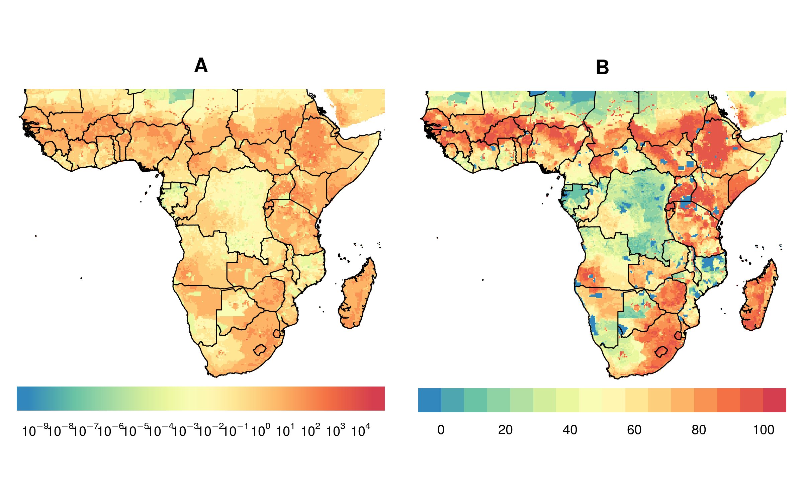
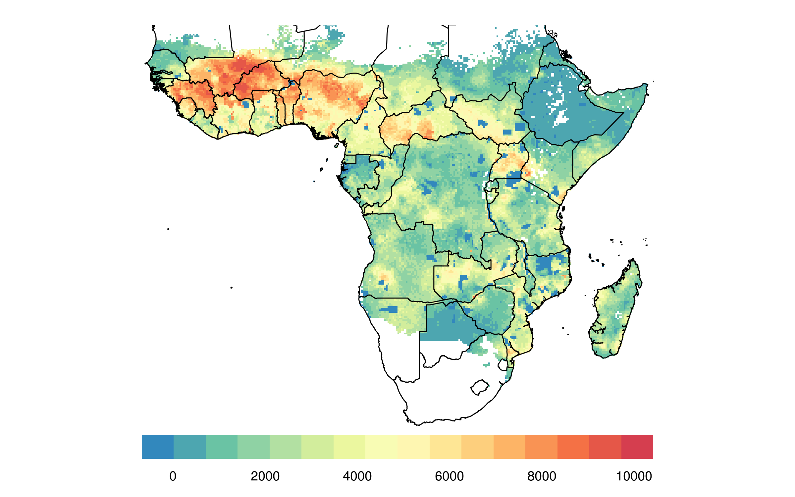

<!-- README.md is generated from README.Rmd. Please edit that file -->
    OGR data source with driver: ESRI Shapefile 
    Source: "/home/joebrew/Documents/cowsquitoes/data/VECTORS/13071_2010_245_MOESM1_ESM/Additional file 1 - African, Euro-ME EO shapefiles", layer: "arabiensis"
    with 1 features
    It has 1 fields
    Integer64 fields read as strings:  ID 

cowsquito: Identifying geographical areas of greatest potential impact for livestock ivermectin implants
========================================================================================================

Methods
=======

-   We use raw raster data on where cattle are from the International Livestock Research Institute (ILRI) and the Food and Agriculture Organization of the United Nations (FAO) and the Université Libre de Bruxelles (ULB-LUBIES).
-   We use raw raster data on the Plasmodium falciparum parasite rate in 2-10 year olds in Africa in 2015, made available through the Malaria Atlas Project.
-   We use R to process the data, standardize their geographic attributes (extents, projections) and quality attributes (granularity, etc.).
-   We use simple percentilization to scale prevalence (0-1) and cattle per square kilometer (0-Inf) into a 0-100 metric.
-   We combine our two metrics by simple product So, in the combined score, 0 means no Pf or cattle, and 100 means the maximum amount of Pf and cattle. 0 can also much of one metric, but not of the other (for example, a very malarious region with no cattle gets a 0). Anything between the two represents some combination. This method assumes an equilinear value of both percentilized Pf and cattle (ie, a place with 60th percentile cattle density and 40th percentile Pf is equally as promising as a place with 40th percentile cattle density and 60th percentile Pf).
-   Full code in this repo (`code.R`).

Results
=======

Arabiensis
----------

The below shows the distribution of arabiensis in Africa.

Malaria prevalence on the Plasmodium falciparum parasite rate in 2-10 year-olds.
--------------------------------------------------------------------------------

The below shows the raw data on the Plasmodium falciparum parasite rate in 2-10 year-olds.

The below is identical to the above, but with country borders.

The below is identical to the above, but with administrative borders.

The below shows our (scaled) data on the Plasmodium falciparum parasite rate in 2-10 year-olds.

The below is identical to the above, but with country borders.

The below is identical to the above, but with administrative borders.

Cattle density
--------------

The below is identical to the above, but with country borders.

The below is identical to the above, but with administrative level 1 borders.

The below shows our (scaled) data on cattle density rate.

The below is identical to the above, but with country borders.

The below is identical to the above, but with administrative level 1 borders.

Combined score
--------------

### Multidimensional score

We can visualize both the quantity of malaria and cattle through a 2-dimensional color-scale. In the below chart, we use a 10,000 value color palette, mixing green (neither cattle nor malaria) with blue (lots of cattle, little malaria) with orange (lots of malaria, little cattle) with purple (lots of both). Below the map is key for interpretation.

The below is identical to the above, but with country borders.

The below is identical to the above, but with the distribution of arabiensis overlapped.

### Single score

The below shows our combined score, using the product of the cattle and malaria metrics. Unlike the above multi-dimensional score, this visual does not contain as much information (ie, with a value of "40", it's not clear whether this is due to a cattle percentile of 40 and a malaria percentile of 1, or a cattle percentile of 5 and a malaria percentile of 8). That said, a one-dimensional color legend is much easier to interpret visually.

The below is identical to the above, but with country borders.

The below is identical to the above, but with the distribution of arabiensis as well.

The below is identical to the above, but showing a point for each "grid" of the raster surface, and removing the geogrpaphic coordination (ie, scatterplot).

### Alternative visualizations

### Country aggregation

We aggregate at the polygonal national level so as to rank countries by suitability for intervention. The below maps show the mean, median, maximum, and % of area greater than continental median "single score" (product of Pf and cattle percentile) for each country in Africa.

The below shows a plot of country level values (excluding countries with 0 values throughout).

The below is a table country-level values.

<table>
<thead>
<tr>
<th style="text-align:left;">
country
</th>
<th style="text-align:right;">
Average score
</th>
<th style="text-align:right;">
Max score
</th>
<th style="text-align:right;">
Median score
</th>
<th style="text-align:right;">
% of area &gt; African median
</th>
</tr>
</thead>
<tbody>
<tr>
<td style="text-align:left;">
Algeria
</td>
<td style="text-align:right;">
NaN
</td>
<td style="text-align:right;">
-Inf
</td>
<td style="text-align:right;">
NA
</td>
<td style="text-align:right;">
0.00000
</td>
</tr>
<tr>
<td style="text-align:left;">
Angola
</td>
<td style="text-align:right;">
22.892625
</td>
<td style="text-align:right;">
74.08988
</td>
<td style="text-align:right;">
22.008223
</td>
<td style="text-align:right;">
100.00000
</td>
</tr>
<tr>
<td style="text-align:left;">
Benin
</td>
<td style="text-align:right;">
63.249237
</td>
<td style="text-align:right;">
94.23502
</td>
<td style="text-align:right;">
68.685650
</td>
<td style="text-align:right;">
100.00000
</td>
</tr>
<tr>
<td style="text-align:left;">
Botswana
</td>
<td style="text-align:right;">
4.068642
</td>
<td style="text-align:right;">
22.29976
</td>
<td style="text-align:right;">
3.258271
</td>
<td style="text-align:right;">
0.00000
</td>
</tr>
<tr>
<td style="text-align:left;">
Burkina Faso
</td>
<td style="text-align:right;">
79.200221
</td>
<td style="text-align:right;">
97.17127
</td>
<td style="text-align:right;">
81.558307
</td>
<td style="text-align:right;">
100.00000
</td>
</tr>
<tr>
<td style="text-align:left;">
Burundi
</td>
<td style="text-align:right;">
28.607608
</td>
<td style="text-align:right;">
61.10834
</td>
<td style="text-align:right;">
28.587134
</td>
<td style="text-align:right;">
100.00000
</td>
</tr>
<tr>
<td style="text-align:left;">
Cameroon
</td>
<td style="text-align:right;">
41.346272
</td>
<td style="text-align:right;">
83.62073
</td>
<td style="text-align:right;">
41.151561
</td>
<td style="text-align:right;">
100.00000
</td>
</tr>
<tr>
<td style="text-align:left;">
Canarias
</td>
<td style="text-align:right;">
NaN
</td>
<td style="text-align:right;">
-Inf
</td>
<td style="text-align:right;">
NA
</td>
<td style="text-align:right;">
0.00000
</td>
</tr>
<tr>
<td style="text-align:left;">
Cape Verde
</td>
<td style="text-align:right;">
NaN
</td>
<td style="text-align:right;">
-Inf
</td>
<td style="text-align:right;">
0.000000
</td>
<td style="text-align:right;">
0.00000
</td>
</tr>
<tr>
<td style="text-align:left;">
Central African Republic
</td>
<td style="text-align:right;">
45.215421
</td>
<td style="text-align:right;">
87.52642
</td>
<td style="text-align:right;">
43.536925
</td>
<td style="text-align:right;">
100.00000
</td>
</tr>
<tr>
<td style="text-align:left;">
Chad
</td>
<td style="text-align:right;">
27.978645
</td>
<td style="text-align:right;">
69.49327
</td>
<td style="text-align:right;">
28.390881
</td>
<td style="text-align:right;">
100.00000
</td>
</tr>
<tr>
<td style="text-align:left;">
Comoros
</td>
<td style="text-align:right;">
0.000000
</td>
<td style="text-align:right;">
0.00000
</td>
<td style="text-align:right;">
0.000000
</td>
<td style="text-align:right;">
0.00000
</td>
</tr>
<tr>
<td style="text-align:left;">
Congo
</td>
<td style="text-align:right;">
23.978346
</td>
<td style="text-align:right;">
52.22886
</td>
<td style="text-align:right;">
24.910121
</td>
<td style="text-align:right;">
99.56140
</td>
</tr>
<tr>
<td style="text-align:left;">
Congo DRC
</td>
<td style="text-align:right;">
20.834164
</td>
<td style="text-align:right;">
94.59887
</td>
<td style="text-align:right;">
18.186842
</td>
<td style="text-align:right;">
100.00000
</td>
</tr>
<tr>
<td style="text-align:left;">
Côte d'Ivoire
</td>
<td style="text-align:right;">
50.503862
</td>
<td style="text-align:right;">
95.38481
</td>
<td style="text-align:right;">
51.119440
</td>
<td style="text-align:right;">
100.00000
</td>
</tr>
<tr>
<td style="text-align:left;">
Djibouti
</td>
<td style="text-align:right;">
11.742705
</td>
<td style="text-align:right;">
28.57086
</td>
<td style="text-align:right;">
11.527823
</td>
<td style="text-align:right;">
0.00000
</td>
</tr>
<tr>
<td style="text-align:left;">
Egypt
</td>
<td style="text-align:right;">
9.483431
</td>
<td style="text-align:right;">
10.43539
</td>
<td style="text-align:right;">
9.649700
</td>
<td style="text-align:right;">
0.00000
</td>
</tr>
<tr>
<td style="text-align:left;">
Equatorial Guinea
</td>
<td style="text-align:right;">
20.820994
</td>
<td style="text-align:right;">
49.63785
</td>
<td style="text-align:right;">
22.075190
</td>
<td style="text-align:right;">
100.00000
</td>
</tr>
<tr>
<td style="text-align:left;">
Eritrea
</td>
<td style="text-align:right;">
9.188198
</td>
<td style="text-align:right;">
29.11583
</td>
<td style="text-align:right;">
7.108851
</td>
<td style="text-align:right;">
0.00000
</td>
</tr>
<tr>
<td style="text-align:left;">
Ethiopia
</td>
<td style="text-align:right;">
2.697723
</td>
<td style="text-align:right;">
51.38206
</td>
<td style="text-align:right;">
2.115152
</td>
<td style="text-align:right;">
0.00000
</td>
</tr>
<tr>
<td style="text-align:left;">
French Southern Territories
</td>
<td style="text-align:right;">
NaN
</td>
<td style="text-align:right;">
-Inf
</td>
<td style="text-align:right;">
NA
</td>
<td style="text-align:right;">
0.00000
</td>
</tr>
<tr>
<td style="text-align:left;">
Gabon
</td>
<td style="text-align:right;">
12.773748
</td>
<td style="text-align:right;">
53.11015
</td>
<td style="text-align:right;">
9.129321
</td>
<td style="text-align:right;">
0.00000
</td>
</tr>
<tr>
<td style="text-align:left;">
Gambia
</td>
<td style="text-align:right;">
7.070079
</td>
<td style="text-align:right;">
31.60281
</td>
<td style="text-align:right;">
5.873101
</td>
<td style="text-align:right;">
0.00000
</td>
</tr>
<tr>
<td style="text-align:left;">
Ghana
</td>
<td style="text-align:right;">
43.427290
</td>
<td style="text-align:right;">
86.58593
</td>
<td style="text-align:right;">
44.845827
</td>
<td style="text-align:right;">
100.00000
</td>
</tr>
<tr>
<td style="text-align:left;">
Guinea
</td>
<td style="text-align:right;">
70.898538
</td>
<td style="text-align:right;">
94.83462
</td>
<td style="text-align:right;">
76.377424
</td>
<td style="text-align:right;">
100.00000
</td>
</tr>
<tr>
<td style="text-align:left;">
Guinea-Bissau
</td>
<td style="text-align:right;">
20.197636
</td>
<td style="text-align:right;">
75.70227
</td>
<td style="text-align:right;">
29.363225
</td>
<td style="text-align:right;">
60.70301
</td>
</tr>
<tr>
<td style="text-align:left;">
Kenya
</td>
<td style="text-align:right;">
20.804461
</td>
<td style="text-align:right;">
92.06325
</td>
<td style="text-align:right;">
18.009124
</td>
<td style="text-align:right;">
90.39707
</td>
</tr>
<tr>
<td style="text-align:left;">
Lesotho
</td>
<td style="text-align:right;">
NaN
</td>
<td style="text-align:right;">
-Inf
</td>
<td style="text-align:right;">
NA
</td>
<td style="text-align:right;">
0.00000
</td>
</tr>
<tr>
<td style="text-align:left;">
Liberia
</td>
<td style="text-align:right;">
31.110787
</td>
<td style="text-align:right;">
68.39190
</td>
<td style="text-align:right;">
30.847390
</td>
<td style="text-align:right;">
100.00000
</td>
</tr>
<tr>
<td style="text-align:left;">
Libya
</td>
<td style="text-align:right;">
NaN
</td>
<td style="text-align:right;">
-Inf
</td>
<td style="text-align:right;">
NA
</td>
<td style="text-align:right;">
0.00000
</td>
</tr>
<tr>
<td style="text-align:left;">
Madagascar
</td>
<td style="text-align:right;">
21.104235
</td>
<td style="text-align:right;">
71.07312
</td>
<td style="text-align:right;">
21.305198
</td>
<td style="text-align:right;">
88.49912
</td>
</tr>
<tr>
<td style="text-align:left;">
Madeira
</td>
<td style="text-align:right;">
NaN
</td>
<td style="text-align:right;">
-Inf
</td>
<td style="text-align:right;">
NA
</td>
<td style="text-align:right;">
0.00000
</td>
</tr>
<tr>
<td style="text-align:left;">
Malawi
</td>
<td style="text-align:right;">
19.506304
</td>
<td style="text-align:right;">
63.40763
</td>
<td style="text-align:right;">
18.708252
</td>
<td style="text-align:right;">
100.00000
</td>
</tr>
<tr>
<td style="text-align:left;">
Mali
</td>
<td style="text-align:right;">
61.564252
</td>
<td style="text-align:right;">
97.99863
</td>
<td style="text-align:right;">
69.731159
</td>
<td style="text-align:right;">
100.00000
</td>
</tr>
<tr>
<td style="text-align:left;">
Mauritania
</td>
<td style="text-align:right;">
15.588360
</td>
<td style="text-align:right;">
60.53024
</td>
<td style="text-align:right;">
14.379966
</td>
<td style="text-align:right;">
0.00000
</td>
</tr>
<tr>
<td style="text-align:left;">
Mauritius
</td>
<td style="text-align:right;">
NaN
</td>
<td style="text-align:right;">
-Inf
</td>
<td style="text-align:right;">
0.000000
</td>
<td style="text-align:right;">
0.00000
</td>
</tr>
<tr>
<td style="text-align:left;">
Mayotte
</td>
<td style="text-align:right;">
0.000000
</td>
<td style="text-align:right;">
0.00000
</td>
<td style="text-align:right;">
0.000000
</td>
<td style="text-align:right;">
0.00000
</td>
</tr>
<tr>
<td style="text-align:left;">
Morocco
</td>
<td style="text-align:right;">
NaN
</td>
<td style="text-align:right;">
-Inf
</td>
<td style="text-align:right;">
NA
</td>
<td style="text-align:right;">
0.00000
</td>
</tr>
<tr>
<td style="text-align:left;">
Mozambique
</td>
<td style="text-align:right;">
24.610679
</td>
<td style="text-align:right;">
76.28976
</td>
<td style="text-align:right;">
29.239727
</td>
<td style="text-align:right;">
87.99698
</td>
</tr>
<tr>
<td style="text-align:left;">
Namibia
</td>
<td style="text-align:right;">
23.620166
</td>
<td style="text-align:right;">
43.91596
</td>
<td style="text-align:right;">
26.584822
</td>
<td style="text-align:right;">
95.48703
</td>
</tr>
<tr>
<td style="text-align:left;">
Niger
</td>
<td style="text-align:right;">
33.511003
</td>
<td style="text-align:right;">
93.90925
</td>
<td style="text-align:right;">
30.122166
</td>
<td style="text-align:right;">
100.00000
</td>
</tr>
<tr>
<td style="text-align:left;">
Nigeria
</td>
<td style="text-align:right;">
56.825417
</td>
<td style="text-align:right;">
92.83070
</td>
<td style="text-align:right;">
60.536639
</td>
<td style="text-align:right;">
100.00000
</td>
</tr>
<tr>
<td style="text-align:left;">
Réunion
</td>
<td style="text-align:right;">
NaN
</td>
<td style="text-align:right;">
-Inf
</td>
<td style="text-align:right;">
0.000000
</td>
<td style="text-align:right;">
0.00000
</td>
</tr>
<tr>
<td style="text-align:left;">
Rwanda
</td>
<td style="text-align:right;">
15.884888
</td>
<td style="text-align:right;">
47.49927
</td>
<td style="text-align:right;">
14.956773
</td>
<td style="text-align:right;">
0.00000
</td>
</tr>
<tr>
<td style="text-align:left;">
Saint Helena
</td>
<td style="text-align:right;">
NaN
</td>
<td style="text-align:right;">
-Inf
</td>
<td style="text-align:right;">
0.000000
</td>
<td style="text-align:right;">
0.00000
</td>
</tr>
<tr>
<td style="text-align:left;">
Sao Tome and Principe
</td>
<td style="text-align:right;">
0.000000
</td>
<td style="text-align:right;">
0.00000
</td>
<td style="text-align:right;">
0.000000
</td>
<td style="text-align:right;">
0.00000
</td>
</tr>
<tr>
<td style="text-align:left;">
Senegal
</td>
<td style="text-align:right;">
17.857505
</td>
<td style="text-align:right;">
64.19023
</td>
<td style="text-align:right;">
14.413229
</td>
<td style="text-align:right;">
81.22454
</td>
</tr>
<tr>
<td style="text-align:left;">
Seychelles
</td>
<td style="text-align:right;">
NaN
</td>
<td style="text-align:right;">
-Inf
</td>
<td style="text-align:right;">
0.000000
</td>
<td style="text-align:right;">
0.00000
</td>
</tr>
<tr>
<td style="text-align:left;">
Sierra Leone
</td>
<td style="text-align:right;">
52.553836
</td>
<td style="text-align:right;">
88.10132
</td>
<td style="text-align:right;">
56.791165
</td>
<td style="text-align:right;">
100.00000
</td>
</tr>
<tr>
<td style="text-align:left;">
Somalia
</td>
<td style="text-align:right;">
15.569213
</td>
<td style="text-align:right;">
43.29440
</td>
<td style="text-align:right;">
11.974589
</td>
<td style="text-align:right;">
0.00000
</td>
</tr>
<tr>
<td style="text-align:left;">
South Africa
</td>
<td style="text-align:right;">
17.701272
</td>
<td style="text-align:right;">
58.48560
</td>
<td style="text-align:right;">
14.354586
</td>
<td style="text-align:right;">
0.00000
</td>
</tr>
<tr>
<td style="text-align:left;">
South Sudan
</td>
<td style="text-align:right;">
35.144804
</td>
<td style="text-align:right;">
71.90635
</td>
<td style="text-align:right;">
36.842994
</td>
<td style="text-align:right;">
100.00000
</td>
</tr>
<tr>
<td style="text-align:left;">
Spain
</td>
<td style="text-align:right;">
NaN
</td>
<td style="text-align:right;">
-Inf
</td>
<td style="text-align:right;">
NA
</td>
<td style="text-align:right;">
0.00000
</td>
</tr>
<tr>
<td style="text-align:left;">
Sudan
</td>
<td style="text-align:right;">
11.646300
</td>
<td style="text-align:right;">
55.80105
</td>
<td style="text-align:right;">
9.282781
</td>
<td style="text-align:right;">
0.00000
</td>
</tr>
<tr>
<td style="text-align:left;">
Swaziland
</td>
<td style="text-align:right;">
6.011874
</td>
<td style="text-align:right;">
11.39467
</td>
<td style="text-align:right;">
5.278528
</td>
<td style="text-align:right;">
0.00000
</td>
</tr>
<tr>
<td style="text-align:left;">
Tanzania
</td>
<td style="text-align:right;">
25.890330
</td>
<td style="text-align:right;">
64.95233
</td>
<td style="text-align:right;">
21.832169
</td>
<td style="text-align:right;">
95.32778
</td>
</tr>
<tr>
<td style="text-align:left;">
Togo
</td>
<td style="text-align:right;">
63.043940
</td>
<td style="text-align:right;">
90.14775
</td>
<td style="text-align:right;">
64.232276
</td>
<td style="text-align:right;">
100.00000
</td>
</tr>
<tr>
<td style="text-align:left;">
Tunisia
</td>
<td style="text-align:right;">
NaN
</td>
<td style="text-align:right;">
-Inf
</td>
<td style="text-align:right;">
NA
</td>
<td style="text-align:right;">
0.00000
</td>
</tr>
<tr>
<td style="text-align:left;">
Uganda
</td>
<td style="text-align:right;">
37.531324
</td>
<td style="text-align:right;">
80.02840
</td>
<td style="text-align:right;">
44.315822
</td>
<td style="text-align:right;">
100.00000
</td>
</tr>
<tr>
<td style="text-align:left;">
Yemen
</td>
<td style="text-align:right;">
NaN
</td>
<td style="text-align:right;">
-Inf
</td>
<td style="text-align:right;">
0.000000
</td>
<td style="text-align:right;">
0.00000
</td>
</tr>
<tr>
<td style="text-align:left;">
Zambia
</td>
<td style="text-align:right;">
29.045152
</td>
<td style="text-align:right;">
92.15276
</td>
<td style="text-align:right;">
28.530223
</td>
<td style="text-align:right;">
100.00000
</td>
</tr>
<tr>
<td style="text-align:left;">
Zimbabwe
</td>
<td style="text-align:right;">
13.070125
</td>
<td style="text-align:right;">
72.99633
</td>
<td style="text-align:right;">
11.453757
</td>
<td style="text-align:right;">
0.00000
</td>
</tr>
</tbody>
</table>
### Administrative level 1 aggregation

We aggregate at the polygonal sub-national level so as to rank administrative areas (districts, etc.) by suitability for intervention. The below maps show the mean, median, maximum, and % of area greater than continental median "single score" (product of Pf and cattle percentile) for each administrative unit in Africa.

All values for all sub-national administrative units.

<table>
<thead>
<tr>
<th style="text-align:left;">
country
</th>
<th style="text-align:right;">
Average score
</th>
<th style="text-align:right;">
Max score
</th>
<th style="text-align:right;">
Median score
</th>
<th style="text-align:right;">
% of area &gt; African median
</th>
</tr>
</thead>
<tbody>
<tr>
<td style="text-align:left;">
Abia, Nigeria
</td>
<td style="text-align:right;">
62.3231623
</td>
<td style="text-align:right;">
74.1557223
</td>
<td style="text-align:right;">
63.1247419
</td>
<td style="text-align:right;">
100
</td>
</tr>
<tr>
<td style="text-align:left;">
Abidjan, Côte d'Ivoire
</td>
<td style="text-align:right;">
29.9712857
</td>
<td style="text-align:right;">
67.3036617
</td>
<td style="text-align:right;">
32.6014602
</td>
<td style="text-align:right;">
100
</td>
</tr>
<tr>
<td style="text-align:left;">
Acoua, Mayotte
</td>
<td style="text-align:right;">
0.0000000
</td>
<td style="text-align:right;">
0.0000000
</td>
<td style="text-align:right;">
0.0000000
</td>
<td style="text-align:right;">
0
</td>
</tr>
<tr>
<td style="text-align:left;">
Adamaoua, Cameroon
</td>
<td style="text-align:right;">
48.0351720
</td>
<td style="text-align:right;">
83.6207252
</td>
<td style="text-align:right;">
48.7097444
</td>
<td style="text-align:right;">
100
</td>
</tr>
<tr>
<td style="text-align:left;">
Adamawa, Nigeria
</td>
<td style="text-align:right;">
73.3602260
</td>
<td style="text-align:right;">
91.5025723
</td>
<td style="text-align:right;">
76.2034768
</td>
<td style="text-align:right;">
100
</td>
</tr>
<tr>
<td style="text-align:left;">
Ad Daqahliyah, Egypt
</td>
<td style="text-align:right;">
NaN
</td>
<td style="text-align:right;">
-Inf
</td>
<td style="text-align:right;">
NA
</td>
<td style="text-align:right;">
0
</td>
</tr>
<tr>
<td style="text-align:left;">
Addis Abeba, Ethiopia
</td>
<td style="text-align:right;">
1.1054445
</td>
<td style="text-align:right;">
2.0774018
</td>
<td style="text-align:right;">
1.0175497
</td>
<td style="text-align:right;">
0
</td>
</tr>
<tr>
<td style="text-align:left;">
Adjumani, Uganda
</td>
<td style="text-align:right;">
44.9089245
</td>
<td style="text-align:right;">
60.0900717
</td>
<td style="text-align:right;">
45.9838299
</td>
<td style="text-align:right;">
100
</td>
</tr>
<tr>
<td style="text-align:left;">
Adrar, Algeria
</td>
<td style="text-align:right;">
NaN
</td>
<td style="text-align:right;">
-Inf
</td>
<td style="text-align:right;">
NA
</td>
<td style="text-align:right;">
0
</td>
</tr>
<tr>
<td style="text-align:left;">
Adrar, Mauritania
</td>
<td style="text-align:right;">
NaN
</td>
<td style="text-align:right;">
-Inf
</td>
<td style="text-align:right;">
NA
</td>
<td style="text-align:right;">
0
</td>
</tr>
<tr>
<td style="text-align:left;">
Afar, Ethiopia
</td>
<td style="text-align:right;">
2.3456906
</td>
<td style="text-align:right;">
11.2949953
</td>
<td style="text-align:right;">
1.9154666
</td>
<td style="text-align:right;">
0
</td>
</tr>
<tr>
<td style="text-align:left;">
Agadez, Niger
</td>
<td style="text-align:right;">
12.3823711
</td>
<td style="text-align:right;">
45.8888004
</td>
<td style="text-align:right;">
11.8758912
</td>
<td style="text-align:right;">
0
</td>
</tr>
<tr>
<td style="text-align:left;">
Agalega Islands, Mauritius
</td>
<td style="text-align:right;">
NaN
</td>
<td style="text-align:right;">
-Inf
</td>
<td style="text-align:right;">
0.0000000
</td>
<td style="text-align:right;">
0
</td>
</tr>
<tr>
<td style="text-align:left;">
Aïn Defla, Algeria
</td>
<td style="text-align:right;">
NaN
</td>
<td style="text-align:right;">
-Inf
</td>
<td style="text-align:right;">
NA
</td>
<td style="text-align:right;">
0
</td>
</tr>
<tr>
<td style="text-align:left;">
Aïn Témouchent, Algeria
</td>
<td style="text-align:right;">
NaN
</td>
<td style="text-align:right;">
-Inf
</td>
<td style="text-align:right;">
NA
</td>
<td style="text-align:right;">
0
</td>
</tr>
<tr>
<td style="text-align:left;">
Akwa Ibom, Nigeria
</td>
<td style="text-align:right;">
70.9620746
</td>
<td style="text-align:right;">
84.4592853
</td>
<td style="text-align:right;">
71.6610126
</td>
<td style="text-align:right;">
100
</td>
</tr>
<tr>
<td style="text-align:left;">
Al Bahr al Ahmar, Egypt
</td>
<td style="text-align:right;">
9.4834310
</td>
<td style="text-align:right;">
10.4353875
</td>
<td style="text-align:right;">
9.6497000
</td>
<td style="text-align:right;">
0
</td>
</tr>
<tr>
<td style="text-align:left;">
Al Buhayrah, Egypt
</td>
<td style="text-align:right;">
NaN
</td>
<td style="text-align:right;">
-Inf
</td>
<td style="text-align:right;">
NA
</td>
<td style="text-align:right;">
0
</td>
</tr>
<tr>
<td style="text-align:left;">
Al Butnan, Libya
</td>
<td style="text-align:right;">
NaN
</td>
<td style="text-align:right;">
-Inf
</td>
<td style="text-align:right;">
NA
</td>
<td style="text-align:right;">
0
</td>
</tr>
<tr>
<td style="text-align:left;">
Al Fayyum, Egypt
</td>
<td style="text-align:right;">
NaN
</td>
<td style="text-align:right;">
-Inf
</td>
<td style="text-align:right;">
NA
</td>
<td style="text-align:right;">
0
</td>
</tr>
<tr>
<td style="text-align:left;">
Alger, Algeria
</td>
<td style="text-align:right;">
NaN
</td>
<td style="text-align:right;">
-Inf
</td>
<td style="text-align:right;">
NA
</td>
<td style="text-align:right;">
0
</td>
</tr>
<tr>
<td style="text-align:left;">
Al Gharbiyah, Egypt
</td>
<td style="text-align:right;">
NaN
</td>
<td style="text-align:right;">
-Inf
</td>
<td style="text-align:right;">
NA
</td>
<td style="text-align:right;">
0
</td>
</tr>
<tr>
<td style="text-align:left;">
Alibori, Benin
</td>
<td style="text-align:right;">
65.1524935
</td>
<td style="text-align:right;">
94.2350234
</td>
<td style="text-align:right;">
76.4388498
</td>
<td style="text-align:right;">
100
</td>
</tr>
<tr>
<td style="text-align:left;">
Ali Sabieh, Djibouti
</td>
<td style="text-align:right;">
22.7298748
</td>
<td style="text-align:right;">
28.5708637
</td>
<td style="text-align:right;">
22.3732656
</td>
<td style="text-align:right;">
0
</td>
</tr>
<tr>
<td style="text-align:left;">
Al Iskandariyah, Egypt
</td>
<td style="text-align:right;">
NaN
</td>
<td style="text-align:right;">
-Inf
</td>
<td style="text-align:right;">
NA
</td>
<td style="text-align:right;">
0
</td>
</tr>
<tr>
<td style="text-align:left;">
Al Isma`iliyah, Egypt </td>    <td style="text-align:right;"> NaN </td>    <td style="text-align:right;"> -Inf </td>    <td style="text-align:right;"> NA </td>    <td style="text-align:right;"> 0 </td>   </tr>   <tr>    <td style="text-align:left;"> Al Jabal al Akhdar, Libya </td>    <td style="text-align:right;"> NaN </td>    <td style="text-align:right;"> -Inf </td>    <td style="text-align:right;"> NA </td>    <td style="text-align:right;"> 0 </td>   </tr>   <tr>    <td style="text-align:left;"> Al Jabal al Gharbi, Libya </td>    <td style="text-align:right;"> NaN </td>    <td style="text-align:right;"> -Inf </td>    <td style="text-align:right;"> NA </td>    <td style="text-align:right;"> 0 </td>   </tr>   <tr>    <td style="text-align:left;"> Al Jazirah, Sudan </td>    <td style="text-align:right;"> 6.7297190 </td>    <td style="text-align:right;"> 13.2734068 </td>    <td style="text-align:right;"> 6.6327965 </td>    <td style="text-align:right;"> 0 </td>   </tr>   <tr>    <td style="text-align:left;"> Al Jifarah, Libya </td>    <td style="text-align:right;"> NaN </td>    <td style="text-align:right;"> -Inf </td>    <td style="text-align:right;"> NA </td>    <td style="text-align:right;"> 0 </td>   </tr>   <tr>    <td style="text-align:left;"> Al Jizah, Egypt </td>    <td style="text-align:right;"> NaN </td>    <td style="text-align:right;"> -Inf </td>    <td style="text-align:right;"> NA </td>    <td style="text-align:right;"> 0 </td>   </tr>   <tr>    <td style="text-align:left;"> Al Jufrah, Libya </td>    <td style="text-align:right;"> NaN </td>    <td style="text-align:right;"> -Inf </td>    <td style="text-align:right;"> NA </td>    <td style="text-align:right;"> 0 </td>   </tr>   <tr>    <td style="text-align:left;"> Al Kufrah, Libya </td>    <td style="text-align:right;"> NaN </td>    <td style="text-align:right;"> -Inf </td>    <td style="text-align:right;"> NA </td>    <td style="text-align:right;"> 0 </td>   </tr>   <tr>    <td style="text-align:left;"> Al Marj, Libya </td>    <td style="text-align:right;"> NaN </td>    <td style="text-align:right;"> -Inf </td>    <td style="text-align:right;"> NA </td>    <td style="text-align:right;"> 0 </td>   </tr>   <tr>    <td style="text-align:left;"> Al Marqab, Libya </td>    <td style="text-align:right;"> NaN </td>    <td style="text-align:right;"> -Inf </td>    <td style="text-align:right;"> NA </td>    <td style="text-align:right;"> 0 </td>   </tr>   <tr>    <td style="text-align:left;"> Al Minufiyah, Egypt </td>    <td style="text-align:right;"> NaN </td>    <td style="text-align:right;"> -Inf </td>    <td style="text-align:right;"> NA </td>    <td style="text-align:right;"> 0 </td>   </tr>   <tr>    <td style="text-align:left;"> Al Minya, Egypt </td>    <td style="text-align:right;"> NaN </td>    <td style="text-align:right;"> -Inf </td>    <td style="text-align:right;"> NA </td>    <td style="text-align:right;"> 0 </td>   </tr>   <tr>    <td style="text-align:left;"> Al Qadarif, Sudan </td>    <td style="text-align:right;"> 14.6169050 </td>    <td style="text-align:right;"> 52.4298297 </td>    <td style="text-align:right;"> 11.4461275 </td>    <td style="text-align:right;"> 0 </td>   </tr>   <tr>    <td style="text-align:left;"> Al Qahirah, Egypt </td>    <td style="text-align:right;"> NaN </td>    <td style="text-align:right;"> -Inf </td>    <td style="text-align:right;"> NA </td>    <td style="text-align:right;"> 0 </td>   </tr>   <tr>    <td style="text-align:left;"> Al Qalyubiyah, Egypt </td>    <td style="text-align:right;"> NaN </td>    <td style="text-align:right;"> -Inf </td>    <td style="text-align:right;"> NA </td>    <td style="text-align:right;"> 0 </td>   </tr>   <tr>    <td style="text-align:left;"> Al Uqsur, Egypt </td>    <td style="text-align:right;"> NaN </td>    <td style="text-align:right;"> -Inf </td>    <td style="text-align:right;"> NA </td>    <td style="text-align:right;"> 0 </td>   </tr>   <tr>    <td style="text-align:left;"> Al Wadi al Jadid, Egypt </td>    <td style="text-align:right;"> NaN </td>    <td style="text-align:right;"> -Inf </td>    <td style="text-align:right;"> NA </td>    <td style="text-align:right;"> 0 </td>   </tr>   <tr>    <td style="text-align:left;"> Al Wahat, Libya </td>    <td style="text-align:right;"> NaN </td>    <td style="text-align:right;"> -Inf </td>    <td style="text-align:right;"> NA </td>    <td style="text-align:right;"> 0 </td>   </tr>   <tr>    <td style="text-align:left;"> Amajyaruguru, Rwanda </td>    <td style="text-align:right;"> 13.7530959 </td>    <td style="text-align:right;"> 18.3423698 </td>    <td style="text-align:right;"> 13.6721080 </td>    <td style="text-align:right;"> 0 </td>   </tr>   <tr>    <td style="text-align:left;"> Amajyepfo, Rwanda </td>    <td style="text-align:right;"> 17.8705020 </td>    <td style="text-align:right;"> 35.2335885 </td>    <td style="text-align:right;"> 16.3554304 </td>    <td style="text-align:right;"> 0 </td>   </tr>   <tr>    <td style="text-align:left;"> Amhara, Ethiopia </td>    <td style="text-align:right;"> 3.1937615 </td>    <td style="text-align:right;"> 51.3820613 </td>    <td style="text-align:right;"> 1.3893682 </td>    <td style="text-align:right;"> 0 </td>   </tr>   <tr>    <td style="text-align:left;"> Anambra, Nigeria </td>    <td style="text-align:right;"> 36.9323846 </td>    <td style="text-align:right;"> 50.5158320 </td>    <td style="text-align:right;"> 37.0029572 </td>    <td style="text-align:right;"> 100 </td>   </tr>   <tr>    <td style="text-align:left;"> Annaba, Algeria </td>    <td style="text-align:right;"> NaN </td>    <td style="text-align:right;"> -Inf </td>    <td style="text-align:right;"> NA </td>    <td style="text-align:right;"> 0 </td>   </tr>   <tr>    <td style="text-align:left;"> Annobón, Equatorial Guinea </td>    <td style="text-align:right;"> 0.0000000 </td>    <td style="text-align:right;"> 0.0000000 </td>    <td style="text-align:right;"> 0.0000000 </td>    <td style="text-align:right;"> 0 </td>   </tr>   <tr>    <td style="text-align:left;"> An Nuqat al Khams, Libya </td>    <td style="text-align:right;"> NaN </td>    <td style="text-align:right;"> -Inf </td>    <td style="text-align:right;"> NA </td>    <td style="text-align:right;"> 0 </td>   </tr>   <tr>    <td style="text-align:left;"> Anse aux Pins, Seychelles </td>    <td style="text-align:right;"> NaN </td>    <td style="text-align:right;"> -Inf </td>    <td style="text-align:right;"> 0.0000000 </td>    <td style="text-align:right;"> 0 </td>   </tr>   <tr>    <td style="text-align:left;"> Anseba, Eritrea </td>    <td style="text-align:right;"> 6.0574961 </td>    <td style="text-align:right;"> 8.5890012 </td>    <td style="text-align:right;"> 5.8173509 </td>    <td style="text-align:right;"> 0 </td>   </tr>   <tr>    <td style="text-align:left;"> Anse Boileau, Seychelles </td>    <td style="text-align:right;"> NaN </td>    <td style="text-align:right;"> -Inf </td>    <td style="text-align:right;"> 0.0000000 </td>    <td style="text-align:right;"> 0 </td>   </tr>   <tr>    <td style="text-align:left;"> Anse Étoile, Seychelles </td>    <td style="text-align:right;"> NaN </td>    <td style="text-align:right;"> -Inf </td>    <td style="text-align:right;"> 0.0000000 </td>    <td style="text-align:right;"> 0 </td>   </tr>   <tr>    <td style="text-align:left;"> Anse Royale, Seychelles </td>    <td style="text-align:right;"> NaN </td>    <td style="text-align:right;"> -Inf </td>    <td style="text-align:right;"> 0.0000000 </td>    <td style="text-align:right;"> 0 </td>   </tr>   <tr>    <td style="text-align:left;"> Antananarivo, Madagascar </td>    <td style="text-align:right;"> 16.4230449 </td>    <td style="text-align:right;"> 31.4829553 </td>    <td style="text-align:right;"> 15.9755068 </td>    <td style="text-align:right;"> 0 </td>   </tr>   <tr>    <td style="text-align:left;"> Antsiranana, Madagascar </td>    <td style="text-align:right;"> 20.8293151 </td>    <td style="text-align:right;"> 40.2441319 </td>    <td style="text-align:right;"> 21.6280071 </td>    <td style="text-align:right;"> 100 </td>   </tr>   <tr>    <td style="text-align:left;"> Apac, Uganda </td>    <td style="text-align:right;"> 63.6342468 </td>    <td style="text-align:right;"> 74.1493889 </td>    <td style="text-align:right;"> 65.2510836 </td>    <td style="text-align:right;"> 100 </td>   </tr>   <tr>    <td style="text-align:left;"> Ariana, Tunisia </td>    <td style="text-align:right;"> NaN </td>    <td style="text-align:right;"> -Inf </td>    <td style="text-align:right;"> NA </td>    <td style="text-align:right;"> 0 </td>   </tr>   <tr>    <td style="text-align:left;"> Arua, Uganda </td>    <td style="text-align:right;"> 48.6581592 </td>    <td style="text-align:right;"> 64.2103230 </td>    <td style="text-align:right;"> 49.2224362 </td>    <td style="text-align:right;"> 100 </td>   </tr>   <tr>    <td style="text-align:left;"> Arusha, Tanzania </td>    <td style="text-align:right;"> 13.0222690 </td>    <td style="text-align:right;"> 39.6146486 </td>    <td style="text-align:right;"> 12.4861299 </td>    <td style="text-align:right;"> 0 </td>   </tr>   <tr>    <td style="text-align:left;"> Ascension, Saint Helena </td>    <td style="text-align:right;"> NaN </td>    <td style="text-align:right;"> -Inf </td>    <td style="text-align:right;"> NA </td>    <td style="text-align:right;"> 0 </td>   </tr>   <tr>    <td style="text-align:left;"> Ashanti, Ghana </td>    <td style="text-align:right;"> 46.0964106 </td>    <td style="text-align:right;"> 59.0404967 </td>    <td style="text-align:right;"> 46.0760447 </td>    <td style="text-align:right;"> 100 </td>   </tr>   <tr>    <td style="text-align:left;"> Ash Sharqiyah, Egypt </td>    <td style="text-align:right;"> NaN </td>    <td style="text-align:right;"> -Inf </td>    <td style="text-align:right;"> NA </td>    <td style="text-align:right;"> 0 </td>   </tr>   <tr>    <td style="text-align:left;"> Assaba, Mauritania </td>    <td style="text-align:right;"> 15.9582228 </td>    <td style="text-align:right;"> 49.0907447 </td>    <td style="text-align:right;"> 16.0192849 </td>    <td style="text-align:right;"> 0 </td>   </tr>   <tr>    <td style="text-align:left;"> As Suways, Egypt </td>    <td style="text-align:right;"> NaN </td>    <td style="text-align:right;"> -Inf </td>    <td style="text-align:right;"> NA </td>    <td style="text-align:right;"> 0 </td>   </tr>   <tr>    <td style="text-align:left;"> Aswan, Egypt </td>    <td style="text-align:right;"> NaN </td>    <td style="text-align:right;"> -Inf </td>    <td style="text-align:right;"> NA </td>    <td style="text-align:right;"> 0 </td>   </tr>   <tr>    <td style="text-align:left;"> Asyut, Egypt </td>    <td style="text-align:right;"> NaN </td>    <td style="text-align:right;"> -Inf </td>    <td style="text-align:right;"> NA </td>    <td style="text-align:right;"> 0 </td>   </tr>   <tr>    <td style="text-align:left;"> Atakora, Benin </td>    <td style="text-align:right;"> 63.8652023 </td>    <td style="text-align:right;"> 88.6103851 </td>    <td style="text-align:right;"> 71.3527317 </td>    <td style="text-align:right;"> 100 </td>   </tr>   <tr>    <td style="text-align:left;"> Atlantique, Benin </td>    <td style="text-align:right;"> 54.2772067 </td>    <td style="text-align:right;"> 68.7773076 </td>    <td style="text-align:right;"> 56.7971241 </td>    <td style="text-align:right;"> 100 </td>   </tr>   <tr>    <td style="text-align:left;"> Au Cap, Seychelles </td>    <td style="text-align:right;"> NaN </td>    <td style="text-align:right;"> -Inf </td>    <td style="text-align:right;"> 0.0000000 </td>    <td style="text-align:right;"> 0 </td>   </tr>   <tr>    <td style="text-align:left;"> Awdal, Somalia </td>    <td style="text-align:right;"> 17.8416619 </td>    <td style="text-align:right;"> 30.2034947 </td>    <td style="text-align:right;"> 17.7112874 </td>    <td style="text-align:right;"> 0 </td>   </tr>   <tr>    <td style="text-align:left;"> Az Zawiyah, Libya </td>    <td style="text-align:right;"> NaN </td>    <td style="text-align:right;"> -Inf </td>    <td style="text-align:right;"> NA </td>    <td style="text-align:right;"> 0 </td>   </tr>   <tr>    <td style="text-align:left;"> Bafatá, Guinea-Bissau </td>    <td style="text-align:right;"> 38.6904309 </td>    <td style="text-align:right;"> 50.8293888 </td>    <td style="text-align:right;"> 38.2358918 </td>    <td style="text-align:right;"> 100 </td>   </tr>   <tr>    <td style="text-align:left;"> Baie Lazare, Seychelles </td>    <td style="text-align:right;"> NaN </td>    <td style="text-align:right;"> -Inf </td>    <td style="text-align:right;"> 0.0000000 </td>    <td style="text-align:right;"> 0 </td>   </tr>   <tr>    <td style="text-align:left;"> Baie Sainte Anne, Seychelles </td>    <td style="text-align:right;"> NaN </td>    <td style="text-align:right;"> -Inf </td>    <td style="text-align:right;"> 0.0000000 </td>    <td style="text-align:right;"> 0 </td>   </tr>   <tr>    <td style="text-align:left;"> Bakool, Somalia </td>    <td style="text-align:right;"> 19.2094199 </td>    <td style="text-align:right;"> 33.6127263 </td>    <td style="text-align:right;"> 18.5192767 </td>    <td style="text-align:right;"> 100 </td>   </tr>   <tr>    <td style="text-align:left;"> Balaka, Malawi </td>    <td style="text-align:right;"> 17.0361768 </td>    <td style="text-align:right;"> 21.2362319 </td>    <td style="text-align:right;"> 17.3585886 </td>    <td style="text-align:right;"> 0 </td>   </tr>   <tr>    <td style="text-align:left;"> Bamako, Mali </td>    <td style="text-align:right;"> 47.0818867 </td>    <td style="text-align:right;"> 63.8883579 </td>    <td style="text-align:right;"> 45.8585684 </td>    <td style="text-align:right;"> 100 </td>   </tr>   <tr>    <td style="text-align:left;"> Bamingui-Bangoran, Central African Republic </td>    <td style="text-align:right;"> 17.7857140 </td>    <td style="text-align:right;"> 60.2663297 </td>    <td style="text-align:right;"> 20.4513768 </td>    <td style="text-align:right;"> 100 </td>   </tr>   <tr>    <td style="text-align:left;"> Banaadir, Somalia </td>    <td style="text-align:right;"> 13.4904431 </td>    <td style="text-align:right;"> 20.6690599 </td>    <td style="text-align:right;"> 14.6358345 </td>    <td style="text-align:right;"> 0 </td>   </tr>   <tr>    <td style="text-align:left;"> Bandraboua, Mayotte </td>    <td style="text-align:right;"> 0.0000000 </td>    <td style="text-align:right;"> 0.0000000 </td>    <td style="text-align:right;"> 0.0000000 </td>    <td style="text-align:right;"> 0 </td>   </tr>   <tr>    <td style="text-align:left;"> Bandrele, Mayotte </td>    <td style="text-align:right;"> 0.0000000 </td>    <td style="text-align:right;"> 0.0000000 </td>    <td style="text-align:right;"> 0.0000000 </td>    <td style="text-align:right;"> 0 </td>   </tr>   <tr>    <td style="text-align:left;"> Bandundu, Democratic Republic of the Congo </td>    <td style="text-align:right;"> 27.8534488 </td>    <td style="text-align:right;"> 62.0267153 </td>    <td style="text-align:right;"> 27.7687035 </td>    <td style="text-align:right;"> 100 </td>   </tr>   <tr>    <td style="text-align:left;"> Bangui, Central African Republic </td>    <td style="text-align:right;"> 61.3530049 </td>    <td style="text-align:right;"> 65.2740456 </td>    <td style="text-align:right;"> 61.0216928 </td>    <td style="text-align:right;"> 100 </td>   </tr>   <tr>    <td style="text-align:left;"> Bani Suwayf, Egypt </td>    <td style="text-align:right;"> NaN </td>    <td style="text-align:right;"> -Inf </td>    <td style="text-align:right;"> NA </td>    <td style="text-align:right;"> 0 </td>   </tr>   <tr>    <td style="text-align:left;"> Banjul, Gambia </td>    <td style="text-align:right;"> 4.2280967 </td>    <td style="text-align:right;"> 4.5812653 </td>    <td style="text-align:right;"> 4.2280967 </td>    <td style="text-align:right;"> 0 </td>   </tr>   <tr>    <td style="text-align:left;"> Barh el Ghazel, Chad </td>    <td style="text-align:right;"> 16.6792783 </td>    <td style="text-align:right;"> 38.8999819 </td>    <td style="text-align:right;"> 14.3653695 </td>    <td style="text-align:right;"> 0 </td>   </tr>   <tr>    <td style="text-align:left;"> Baringo, Kenya </td>    <td style="text-align:right;"> 43.7247462 </td>    <td style="text-align:right;"> 55.8106989 </td>    <td style="text-align:right;"> 44.7504191 </td>    <td style="text-align:right;"> 100 </td>   </tr>   <tr>    <td style="text-align:left;"> Bari, Somalia </td>    <td style="text-align:right;"> 8.2007010 </td>    <td style="text-align:right;"> 15.2567671 </td>    <td style="text-align:right;"> 8.2378602 </td>    <td style="text-align:right;"> 0 </td>   </tr>   <tr>    <td style="text-align:left;"> Bas-Congo, Democratic Republic of the Congo </td>    <td style="text-align:right;"> 36.3520857 </td>    <td style="text-align:right;"> 55.3945375 </td>    <td style="text-align:right;"> 37.0071982 </td>    <td style="text-align:right;"> 100 </td>   </tr>   <tr>    <td style="text-align:left;"> Bas-Sassandra, Côte d'Ivoire </td>    <td style="text-align:right;"> 49.4445282 </td>    <td style="text-align:right;"> 79.4500576 </td>    <td style="text-align:right;"> 53.5926255 </td>    <td style="text-align:right;"> 100 </td>   </tr>   <tr>    <td style="text-align:left;"> Basse-Kotto, Central African Republic </td>    <td style="text-align:right;"> 76.7580260 </td>    <td style="text-align:right;"> 87.5264236 </td>    <td style="text-align:right;"> 78.0471642 </td>    <td style="text-align:right;"> 100 </td>   </tr>   <tr>    <td style="text-align:left;"> Batha, Chad </td>    <td style="text-align:right;"> 21.7191789 </td>    <td style="text-align:right;"> 40.1953734 </td>    <td style="text-align:right;"> 21.6367095 </td>    <td style="text-align:right;"> 100 </td>   </tr>   <tr>    <td style="text-align:left;"> Batna, Algeria </td>    <td style="text-align:right;"> NaN </td>    <td style="text-align:right;"> -Inf </td>    <td style="text-align:right;"> NA </td>    <td style="text-align:right;"> 0 </td>   </tr>   <tr>    <td style="text-align:left;"> Bauchi, Nigeria </td>    <td style="text-align:right;"> 70.6875829 </td>    <td style="text-align:right;"> 87.9705785 </td>    <td style="text-align:right;"> 73.4140574 </td>    <td style="text-align:right;"> 100 </td>   </tr>   <tr>    <td style="text-align:left;"> Bayelsa, Nigeria </td>    <td style="text-align:right;"> 45.4488582 </td>    <td style="text-align:right;"> 66.3941090 </td>    <td style="text-align:right;"> 45.5886267 </td>    <td style="text-align:right;"> 100 </td>   </tr>   <tr>    <td style="text-align:left;"> Bay, Somalia </td>    <td style="text-align:right;"> 26.1494781 </td>    <td style="text-align:right;"> 38.4210201 </td>    <td style="text-align:right;"> 26.7744299 </td>    <td style="text-align:right;"> 100 </td>   </tr>   <tr>    <td style="text-align:left;"> Beau Vallon, Seychelles </td>    <td style="text-align:right;"> NaN </td>    <td style="text-align:right;"> -Inf </td>    <td style="text-align:right;"> 0.0000000 </td>    <td style="text-align:right;"> 0 </td>   </tr>   <tr>    <td style="text-align:left;"> Béchar, Algeria </td>    <td style="text-align:right;"> NaN </td>    <td style="text-align:right;"> -Inf </td>    <td style="text-align:right;"> NA </td>    <td style="text-align:right;"> 0 </td>   </tr>   <tr>    <td style="text-align:left;"> Béjaïa, Algeria </td>    <td style="text-align:right;"> NaN </td>    <td style="text-align:right;"> -Inf </td>    <td style="text-align:right;"> NA </td>    <td style="text-align:right;"> 0 </td>   </tr>   <tr>    <td style="text-align:left;"> Béja, Tunisia </td>    <td style="text-align:right;"> NaN </td>    <td style="text-align:right;"> -Inf </td>    <td style="text-align:right;"> NA </td>    <td style="text-align:right;"> 0 </td>   </tr>   <tr>    <td style="text-align:left;"> Bel Air, Seychelles </td>    <td style="text-align:right;"> NaN </td>    <td style="text-align:right;"> -Inf </td>    <td style="text-align:right;"> 0.0000000 </td>    <td style="text-align:right;"> 0 </td>   </tr>   <tr>    <td style="text-align:left;"> Belombre, Seychelles </td>    <td style="text-align:right;"> NaN </td>    <td style="text-align:right;"> -Inf </td>    <td style="text-align:right;"> 0.0000000 </td>    <td style="text-align:right;"> 0 </td>   </tr>   <tr>    <td style="text-align:left;"> Ben Arous (Tunis Sud), Tunisia </td>    <td style="text-align:right;"> NaN </td>    <td style="text-align:right;"> -Inf </td>    <td style="text-align:right;"> NA </td>    <td style="text-align:right;"> 0 </td>   </tr>   <tr>    <td style="text-align:left;"> Benghazi, Libya </td>    <td style="text-align:right;"> NaN </td>    <td style="text-align:right;"> -Inf </td>    <td style="text-align:right;"> NA </td>    <td style="text-align:right;"> 0 </td>   </tr>   <tr>    <td style="text-align:left;"> Bengo, Angola </td>    <td style="text-align:right;"> 16.6012307 </td>    <td style="text-align:right;"> 34.7316792 </td>    <td style="text-align:right;"> 19.0546199 </td>    <td style="text-align:right;"> 100 </td>   </tr>   <tr>    <td style="text-align:left;"> Benguela, Angola </td>    <td style="text-align:right;"> 29.6145318 </td>    <td style="text-align:right;"> 51.3045569 </td>    <td style="text-align:right;"> 29.4589670 </td>    <td style="text-align:right;"> 100 </td>   </tr>   <tr>    <td style="text-align:left;"> Benshangul-Gumaz, Ethiopia </td>    <td style="text-align:right;"> 2.2153460 </td>    <td style="text-align:right;"> 12.6190165 </td>    <td style="text-align:right;"> 2.1624910 </td>    <td style="text-align:right;"> 0 </td>   </tr>   <tr>    <td style="text-align:left;"> Benue, Nigeria </td>    <td style="text-align:right;"> 48.4374893 </td>    <td style="text-align:right;"> 60.5743360 </td>    <td style="text-align:right;"> 48.7909701 </td>    <td style="text-align:right;"> 100 </td>   </tr>   <tr>    <td style="text-align:left;"> Berea, Lesotho </td>    <td style="text-align:right;"> NaN </td>    <td style="text-align:right;"> -Inf </td>    <td style="text-align:right;"> NA </td>    <td style="text-align:right;"> 0 </td>   </tr>   <tr>    <td style="text-align:left;"> Bié, Angola </td>    <td style="text-align:right;"> 24.1024513 </td>    <td style="text-align:right;"> 34.4700425 </td>    <td style="text-align:right;"> 24.0885906 </td>    <td style="text-align:right;"> 100 </td>   </tr>   <tr>    <td style="text-align:left;"> Bioko Norte, Equatorial Guinea </td>    <td style="text-align:right;"> 27.9265441 </td>    <td style="text-align:right;"> 48.9430592 </td>    <td style="text-align:right;"> 30.5965529 </td>    <td style="text-align:right;"> 100 </td>   </tr>   <tr>    <td style="text-align:left;"> Bioko Sur, Equatorial Guinea </td>    <td style="text-align:right;"> 22.8677403 </td>    <td style="text-align:right;"> 43.8854771 </td>    <td style="text-align:right;"> 27.0476251 </td>    <td style="text-align:right;"> 100 </td>   </tr>   <tr>    <td style="text-align:left;"> Biombo, Guinea-Bissau </td>    <td style="text-align:right;"> 18.7965973 </td>    <td style="text-align:right;"> 24.7665646 </td>    <td style="text-align:right;"> 19.1302068 </td>    <td style="text-align:right;"> 0 </td>   </tr>   <tr>    <td style="text-align:left;"> Biskra, Algeria </td>    <td style="text-align:right;"> NaN </td>    <td style="text-align:right;"> -Inf </td>    <td style="text-align:right;"> NA </td>    <td style="text-align:right;"> 0 </td>   </tr>   <tr>    <td style="text-align:left;"> Bissau, Guinea-Bissau </td>    <td style="text-align:right;"> 16.9903216 </td>    <td style="text-align:right;"> 18.7213315 </td>    <td style="text-align:right;"> 18.3155125 </td>    <td style="text-align:right;"> 0 </td>   </tr>   <tr>    <td style="text-align:left;"> Bizerte, Tunisia </td>    <td style="text-align:right;"> NaN </td>    <td style="text-align:right;"> -Inf </td>    <td style="text-align:right;"> NA </td>    <td style="text-align:right;"> 0 </td>   </tr>   <tr>    <td style="text-align:left;"> Black River, Mauritius </td>    <td style="text-align:right;"> NaN </td>    <td style="text-align:right;"> -Inf </td>    <td style="text-align:right;"> 0.0000000 </td>    <td style="text-align:right;"> 0 </td>   </tr>   <tr>    <td style="text-align:left;"> Blantyre, Malawi </td>    <td style="text-align:right;"> 15.3621664 </td>    <td style="text-align:right;"> 19.6273996 </td>    <td style="text-align:right;"> 15.7920526 </td>    <td style="text-align:right;"> 0 </td>   </tr>   <tr>    <td style="text-align:left;"> Blida, Algeria </td>    <td style="text-align:right;"> NaN </td>    <td style="text-align:right;"> -Inf </td>    <td style="text-align:right;"> NA </td>    <td style="text-align:right;"> 0 </td>   </tr>   <tr>    <td style="text-align:left;"> Blue Nile, Sudan </td>    <td style="text-align:right;"> 12.8321803 </td>    <td style="text-align:right;"> 23.7441036 </td>    <td style="text-align:right;"> 12.7632163 </td>    <td style="text-align:right;"> 0 </td>   </tr>   <tr>    <td style="text-align:left;"> Boa Vista, Cape Verde </td>    <td style="text-align:right;"> NaN </td>    <td style="text-align:right;"> -Inf </td>    <td style="text-align:right;"> 0.0000000 </td>    <td style="text-align:right;"> 0 </td>   </tr>   <tr>    <td style="text-align:left;"> Boké, Guinea </td>    <td style="text-align:right;"> 61.1778938 </td>    <td style="text-align:right;"> 93.2155452 </td>    <td style="text-align:right;"> 62.2078955 </td>    <td style="text-align:right;"> 100 </td>   </tr>   <tr>    <td style="text-align:left;"> Bolama, Guinea-Bissau </td>    <td style="text-align:right;"> 2.3434222 </td>    <td style="text-align:right;"> 21.8818909 </td>    <td style="text-align:right;"> 0.0000000 </td>    <td style="text-align:right;"> 0 </td>   </tr>   <tr>    <td style="text-align:left;"> Bomet, Kenya </td>    <td style="text-align:right;"> 50.7294180 </td>    <td style="text-align:right;"> 68.5014701 </td>    <td style="text-align:right;"> 51.2949339 </td>    <td style="text-align:right;"> 100 </td>   </tr>   <tr>    <td style="text-align:left;"> Bomi, Liberia </td>    <td style="text-align:right;"> 34.2441441 </td>    <td style="text-align:right;"> 53.6861162 </td>    <td style="text-align:right;"> 33.2215131 </td>    <td style="text-align:right;"> 100 </td>   </tr>   <tr>    <td style="text-align:left;"> Bong, Liberia </td>    <td style="text-align:right;"> 29.3357178 </td>    <td style="text-align:right;"> 51.6823543 </td>    <td style="text-align:right;"> 28.9356263 </td>    <td style="text-align:right;"> 100 </td>   </tr>   <tr>    <td style="text-align:left;"> Bordj Bou Arréridj, Algeria </td>    <td style="text-align:right;"> NaN </td>    <td style="text-align:right;"> -Inf </td>    <td style="text-align:right;"> NA </td>    <td style="text-align:right;"> 0 </td>   </tr>   <tr>    <td style="text-align:left;"> Borgou, Benin </td>    <td style="text-align:right;"> 73.1188758 </td>    <td style="text-align:right;"> 91.1180953 </td>    <td style="text-align:right;"> 74.2912251 </td>    <td style="text-align:right;"> 100 </td>   </tr>   <tr>    <td style="text-align:left;"> Borkou, Chad </td>    <td style="text-align:right;"> 12.2513159 </td>    <td style="text-align:right;"> 30.3830233 </td>    <td style="text-align:right;"> 9.8077859 </td>    <td style="text-align:right;"> 0 </td>   </tr>   <tr>    <td style="text-align:left;"> Borno, Nigeria </td>    <td style="text-align:right;"> 41.5119419 </td>    <td style="text-align:right;"> 83.7492629 </td>    <td style="text-align:right;"> 41.4638377 </td>    <td style="text-align:right;"> 100 </td>   </tr>   <tr>    <td style="text-align:left;"> Boucle du Mouhoun, Burkina Faso </td>    <td style="text-align:right;"> 83.7397094 </td>    <td style="text-align:right;"> 95.9197872 </td>    <td style="text-align:right;"> 84.5820573 </td>    <td style="text-align:right;"> 100 </td>   </tr>   <tr>    <td style="text-align:left;"> Boueni, Mayotte </td>    <td style="text-align:right;"> 0.0000000 </td>    <td style="text-align:right;"> 0.0000000 </td>    <td style="text-align:right;"> 0.0000000 </td>    <td style="text-align:right;"> 0 </td>   </tr>   <tr>    <td style="text-align:left;"> Bouenza, Republic of Congo </td>    <td style="text-align:right;"> 34.0057395 </td>    <td style="text-align:right;"> 52.1613841 </td>    <td style="text-align:right;"> 32.0978046 </td>    <td style="text-align:right;"> 100 </td>   </tr>   <tr>    <td style="text-align:left;"> Bouira, Algeria </td>    <td style="text-align:right;"> NaN </td>    <td style="text-align:right;"> -Inf </td>    <td style="text-align:right;"> NA </td>    <td style="text-align:right;"> 0 </td>   </tr>   <tr>    <td style="text-align:left;"> Boujdour, Western Sahara </td>    <td style="text-align:right;"> NaN </td>    <td style="text-align:right;"> -Inf </td>    <td style="text-align:right;"> NA </td>    <td style="text-align:right;"> 0 </td>   </tr>   <tr>    <td style="text-align:left;"> Boumerdès, Algeria </td>    <td style="text-align:right;"> NaN </td>    <td style="text-align:right;"> -Inf </td>    <td style="text-align:right;"> NA </td>    <td style="text-align:right;"> 0 </td>   </tr>   <tr>    <td style="text-align:left;"> Brakna, Mauritania </td>    <td style="text-align:right;"> 11.2194502 </td>    <td style="text-align:right;"> 16.6815482 </td>    <td style="text-align:right;"> 11.5653322 </td>    <td style="text-align:right;"> 0 </td>   </tr>   <tr>    <td style="text-align:left;"> Brava, Cape Verde </td>    <td style="text-align:right;"> NaN </td>    <td style="text-align:right;"> -Inf </td>    <td style="text-align:right;"> 0.0000000 </td>    <td style="text-align:right;"> 0 </td>   </tr>   <tr>    <td style="text-align:left;"> Brazzaville, Republic of Congo </td>    <td style="text-align:right;"> 13.3434492 </td>    <td style="text-align:right;"> 23.2232279 </td>    <td style="text-align:right;"> 13.3123970 </td>    <td style="text-align:right;"> 0 </td>   </tr>   <tr>    <td style="text-align:left;"> Brong Ahafo, Ghana </td>    <td style="text-align:right;"> 29.9461287 </td>    <td style="text-align:right;"> 67.4856978 </td>    <td style="text-align:right;"> 29.1534435 </td>    <td style="text-align:right;"> 100 </td>   </tr>   <tr>    <td style="text-align:left;"> Bubanza, Burundi </td>    <td style="text-align:right;"> 27.6651720 </td>    <td style="text-align:right;"> 42.1191580 </td>    <td style="text-align:right;"> 28.4251895 </td>    <td style="text-align:right;"> 100 </td>   </tr>   <tr>    <td style="text-align:left;"> Bugiri, Uganda </td>    <td style="text-align:right;"> 57.3183575 </td>    <td style="text-align:right;"> 74.3449704 </td>    <td style="text-align:right;"> 64.3416498 </td>    <td style="text-align:right;"> 100 </td>   </tr>   <tr>    <td style="text-align:left;"> Bujumbura Mairie, Burundi </td>    <td style="text-align:right;"> 17.0317196 </td>    <td style="text-align:right;"> 27.0459947 </td>    <td style="text-align:right;"> 16.3118067 </td>    <td style="text-align:right;"> 0 </td>   </tr>   <tr>    <td style="text-align:left;"> Bujumbura Rural, Burundi </td>    <td style="text-align:right;"> 14.3233947 </td>    <td style="text-align:right;"> 37.0976442 </td>    <td style="text-align:right;"> 17.2524255 </td>    <td style="text-align:right;"> 0 </td>   </tr>   <tr>    <td style="text-align:left;"> Bulawayo, Zimbabwe </td>    <td style="text-align:right;"> 5.8811110 </td>    <td style="text-align:right;"> 9.2526616 </td>    <td style="text-align:right;"> 6.5191935 </td>    <td style="text-align:right;"> 0 </td>   </tr>   <tr>    <td style="text-align:left;"> Bundibugyo, Uganda </td>    <td style="text-align:right;"> 35.2257243 </td>    <td style="text-align:right;"> 62.3960112 </td>    <td style="text-align:right;"> 40.1825118 </td>    <td style="text-align:right;"> 100 </td>   </tr>   <tr>    <td style="text-align:left;"> Bungoma, Kenya </td>    <td style="text-align:right;"> 60.4674307 </td>    <td style="text-align:right;"> 72.0611995 </td>    <td style="text-align:right;"> 62.3412434 </td>    <td style="text-align:right;"> 100 </td>   </tr>   <tr>    <td style="text-align:left;"> Bur Sa`id, Egypt
</td>
<td style="text-align:right;">
NaN
</td>
<td style="text-align:right;">
-Inf
</td>
<td style="text-align:right;">
NA
</td>
<td style="text-align:right;">
0
</td>
</tr>
<tr>
<td style="text-align:left;">
Bururi, Burundi
</td>
<td style="text-align:right;">
14.7691039
</td>
<td style="text-align:right;">
25.7513645
</td>
<td style="text-align:right;">
19.8554669
</td>
<td style="text-align:right;">
0
</td>
</tr>
<tr>
<td style="text-align:left;">
Bushenyi, Uganda
</td>
<td style="text-align:right;">
26.6137157
</td>
<td style="text-align:right;">
44.9814466
</td>
<td style="text-align:right;">
32.0547216
</td>
<td style="text-align:right;">
100
</td>
</tr>
<tr>
<td style="text-align:left;">
Busia, Kenya
</td>
<td style="text-align:right;">
66.2598766
</td>
<td style="text-align:right;">
76.5261725
</td>
<td style="text-align:right;">
69.6086880
</td>
<td style="text-align:right;">
100
</td>
</tr>
<tr>
<td style="text-align:left;">
Busia, Uganda
</td>
<td style="text-align:right;">
63.5929910
</td>
<td style="text-align:right;">
73.3169056
</td>
<td style="text-align:right;">
64.4011830
</td>
<td style="text-align:right;">
100
</td>
</tr>
<tr>
<td style="text-align:left;">
Butha-Buthe, Lesotho
</td>
<td style="text-align:right;">
NaN
</td>
<td style="text-align:right;">
-Inf
</td>
<td style="text-align:right;">
NA
</td>
<td style="text-align:right;">
0
</td>
</tr>
<tr>
<td style="text-align:left;">
Cabinda, Angola
</td>
<td style="text-align:right;">
28.3823880
</td>
<td style="text-align:right;">
37.9902739
</td>
<td style="text-align:right;">
28.3729857
</td>
<td style="text-align:right;">
100
</td>
</tr>
<tr>
<td style="text-align:left;">
Cabo Delgado, Mozambique
</td>
<td style="text-align:right;">
21.0470392
</td>
<td style="text-align:right;">
66.3326066
</td>
<td style="text-align:right;">
23.7767894
</td>
<td style="text-align:right;">
100
</td>
</tr>
<tr>
<td style="text-align:left;">
Cacheu, Guinea-Bissau
</td>
<td style="text-align:right;">
12.3954671
</td>
<td style="text-align:right;">
22.0044473
</td>
<td style="text-align:right;">
12.2677863
</td>
<td style="text-align:right;">
0
</td>
</tr>
<tr>
<td style="text-align:left;">
Cankuzo, Burundi
</td>
<td style="text-align:right;">
38.3203823
</td>
<td style="text-align:right;">
52.5177263
</td>
<td style="text-align:right;">
38.4911738
</td>
<td style="text-align:right;">
100
</td>
</tr>
<tr>
<td style="text-align:left;">
Cascades, Burkina Faso
</td>
<td style="text-align:right;">
81.2870313
</td>
<td style="text-align:right;">
92.0780521
</td>
<td style="text-align:right;">
83.4606610
</td>
<td style="text-align:right;">
100
</td>
</tr>
<tr>
<td style="text-align:left;">
Cascade, Seychelles
</td>
<td style="text-align:right;">
NaN
</td>
<td style="text-align:right;">
-Inf
</td>
<td style="text-align:right;">
0.0000000
</td>
<td style="text-align:right;">
0
</td>
</tr>
<tr>
<td style="text-align:left;">
Central, Botswana
</td>
<td style="text-align:right;">
3.8471462
</td>
<td style="text-align:right;">
15.5067385
</td>
<td style="text-align:right;">
3.7303921
</td>
<td style="text-align:right;">
0
</td>
</tr>
<tr>
<td style="text-align:left;">
Central Darfur, Sudan
</td>
<td style="text-align:right;">
20.3219573
</td>
<td style="text-align:right;">
40.5607667
</td>
<td style="text-align:right;">
19.3501314
</td>
<td style="text-align:right;">
100
</td>
</tr>
<tr>
<td style="text-align:left;">
Central Equatoria, South Sudan
</td>
<td style="text-align:right;">
46.4888241
</td>
<td style="text-align:right;">
69.7618725
</td>
<td style="text-align:right;">
54.4654192
</td>
<td style="text-align:right;">
100
</td>
</tr>
<tr>
<td style="text-align:left;">
Central, Ghana
</td>
<td style="text-align:right;">
48.1490304
</td>
<td style="text-align:right;">
59.8687297
</td>
<td style="text-align:right;">
47.7291700
</td>
<td style="text-align:right;">
100
</td>
</tr>
<tr>
<td style="text-align:left;">
Central, Zambia
</td>
<td style="text-align:right;">
33.0695272
</td>
<td style="text-align:right;">
63.3386138
</td>
<td style="text-align:right;">
33.3526849
</td>
<td style="text-align:right;">
100
</td>
</tr>
<tr>
<td style="text-align:left;">
Centre, Burkina Faso
</td>
<td style="text-align:right;">
65.2444383
</td>
<td style="text-align:right;">
76.9890566
</td>
<td style="text-align:right;">
66.2054746
</td>
<td style="text-align:right;">
100
</td>
</tr>
<tr>
<td style="text-align:left;">
Centre, Cameroon
</td>
<td style="text-align:right;">
41.2642612
</td>
<td style="text-align:right;">
56.2021504
</td>
<td style="text-align:right;">
42.3230468
</td>
<td style="text-align:right;">
100
</td>
</tr>
<tr>
<td style="text-align:left;">
Centre-Est, Burkina Faso
</td>
<td style="text-align:right;">
70.8986800
</td>
<td style="text-align:right;">
85.5579411
</td>
<td style="text-align:right;">
70.8855545
</td>
<td style="text-align:right;">
100
</td>
</tr>
<tr>
<td style="text-align:left;">
Centre-Nord, Burkina Faso
</td>
<td style="text-align:right;">
83.8127349
</td>
<td style="text-align:right;">
93.9601269
</td>
<td style="text-align:right;">
86.0457732
</td>
<td style="text-align:right;">
100
</td>
</tr>
<tr>
<td style="text-align:left;">
Centre-Ouest, Burkina Faso
</td>
<td style="text-align:right;">
79.9243773
</td>
<td style="text-align:right;">
92.7098017
</td>
<td style="text-align:right;">
80.1565951
</td>
<td style="text-align:right;">
100
</td>
</tr>
<tr>
<td style="text-align:left;">
Centre-Sud, Burkina Faso
</td>
<td style="text-align:right;">
66.2319350
</td>
<td style="text-align:right;">
85.8034353
</td>
<td style="text-align:right;">
70.9865247
</td>
<td style="text-align:right;">
100
</td>
</tr>
<tr>
<td style="text-align:left;">
Centre, Togo
</td>
<td style="text-align:right;">
56.9261398
</td>
<td style="text-align:right;">
69.5991875
</td>
<td style="text-align:right;">
63.2879496
</td>
<td style="text-align:right;">
100
</td>
</tr>
<tr>
<td style="text-align:left;">
Centro Sur, Equatorial Guinea
</td>
<td style="text-align:right;">
19.0639753
</td>
<td style="text-align:right;">
30.1181965
</td>
<td style="text-align:right;">
21.0693129
</td>
<td style="text-align:right;">
100
</td>
</tr>
<tr>
<td style="text-align:left;">
Chaouia - Ouardigha, Morocco
</td>
<td style="text-align:right;">
NaN
</td>
<td style="text-align:right;">
-Inf
</td>
<td style="text-align:right;">
NA
</td>
<td style="text-align:right;">
0
</td>
</tr>
<tr>
<td style="text-align:left;">
Chari-Baguirmi, Chad
</td>
<td style="text-align:right;">
27.3194372
</td>
<td style="text-align:right;">
45.5245538
</td>
<td style="text-align:right;">
27.6188200
</td>
<td style="text-align:right;">
100
</td>
</tr>
<tr>
<td style="text-align:left;">
Chiconi, Mayotte
</td>
<td style="text-align:right;">
0.0000000
</td>
<td style="text-align:right;">
0.0000000
</td>
<td style="text-align:right;">
0.0000000
</td>
<td style="text-align:right;">
0
</td>
</tr>
<tr>
<td style="text-align:left;">
Chikwawa, Malawi
</td>
<td style="text-align:right;">
17.7099331
</td>
<td style="text-align:right;">
31.3023484
</td>
<td style="text-align:right;">
16.8207366
</td>
<td style="text-align:right;">
0
</td>
</tr>
<tr>
<td style="text-align:left;">
Chiradzulu, Malawi
</td>
<td style="text-align:right;">
14.7103614
</td>
<td style="text-align:right;">
20.7281018
</td>
<td style="text-align:right;">
13.5558395
</td>
<td style="text-align:right;">
0
</td>
</tr>
<tr>
<td style="text-align:left;">
Chirongui, Mayotte
</td>
<td style="text-align:right;">
0.0000000
</td>
<td style="text-align:right;">
0.0000000
</td>
<td style="text-align:right;">
0.0000000
</td>
<td style="text-align:right;">
0
</td>
</tr>
<tr>
<td style="text-align:left;">
Chitipa, Malawi
</td>
<td style="text-align:right;">
22.5279557
</td>
<td style="text-align:right;">
33.8534638
</td>
<td style="text-align:right;">
23.6577279
</td>
<td style="text-align:right;">
100
</td>
</tr>
<tr>
<td style="text-align:left;">
Chlef, Algeria
</td>
<td style="text-align:right;">
NaN
</td>
<td style="text-align:right;">
-Inf
</td>
<td style="text-align:right;">
NA
</td>
<td style="text-align:right;">
0
</td>
</tr>
<tr>
<td style="text-align:left;">
Chobe, Botswana
</td>
<td style="text-align:right;">
5.2578958
</td>
<td style="text-align:right;">
20.9337932
</td>
<td style="text-align:right;">
2.1907490
</td>
<td style="text-align:right;">
0
</td>
</tr>
<tr>
<td style="text-align:left;">
Cibitoke, Burundi
</td>
<td style="text-align:right;">
33.1811150
</td>
<td style="text-align:right;">
48.4782771
</td>
<td style="text-align:right;">
31.7954792
</td>
<td style="text-align:right;">
100
</td>
</tr>
<tr>
<td style="text-align:left;">
Collines, Benin
</td>
<td style="text-align:right;">
58.4612793
</td>
<td style="text-align:right;">
75.4144952
</td>
<td style="text-align:right;">
58.9119471
</td>
<td style="text-align:right;">
100
</td>
</tr>
<tr>
<td style="text-align:left;">
Comoé, Côte d'Ivoire
</td>
<td style="text-align:right;">
44.1432552
</td>
<td style="text-align:right;">
91.1316045
</td>
<td style="text-align:right;">
48.7566163
</td>
<td style="text-align:right;">
100
</td>
</tr>
<tr>
<td style="text-align:left;">
Conakry, Guinea
</td>
<td style="text-align:right;">
27.9921832
</td>
<td style="text-align:right;">
46.0734053
</td>
<td style="text-align:right;">
28.6934767
</td>
<td style="text-align:right;">
100
</td>
</tr>
<tr>
<td style="text-align:left;">
Constantine, Algeria
</td>
<td style="text-align:right;">
NaN
</td>
<td style="text-align:right;">
-Inf
</td>
<td style="text-align:right;">
NA
</td>
<td style="text-align:right;">
0
</td>
</tr>
<tr>
<td style="text-align:left;">
Copperbelt, Zambia
</td>
<td style="text-align:right;">
34.8646353
</td>
<td style="text-align:right;">
53.9402052
</td>
<td style="text-align:right;">
35.7452490
</td>
<td style="text-align:right;">
100
</td>
</tr>
<tr>
<td style="text-align:left;">
Cross River, Nigeria
</td>
<td style="text-align:right;">
46.1420998
</td>
<td style="text-align:right;">
79.7571624
</td>
<td style="text-align:right;">
51.7959361
</td>
<td style="text-align:right;">
100
</td>
</tr>
<tr>
<td style="text-align:left;">
Cuando Cubango, Angola
</td>
<td style="text-align:right;">
22.8999472
</td>
<td style="text-align:right;">
40.9295308
</td>
<td style="text-align:right;">
22.2957289
</td>
<td style="text-align:right;">
100
</td>
</tr>
<tr>
<td style="text-align:left;">
Cuanza Norte, Angola
</td>
<td style="text-align:right;">
30.6871458
</td>
<td style="text-align:right;">
54.2774901
</td>
<td style="text-align:right;">
30.8731779
</td>
<td style="text-align:right;">
100
</td>
</tr>
<tr>
<td style="text-align:left;">
Cuanza Sul, Angola
</td>
<td style="text-align:right;">
25.0544180
</td>
<td style="text-align:right;">
38.7512929
</td>
<td style="text-align:right;">
25.4642891
</td>
<td style="text-align:right;">
100
</td>
</tr>
<tr>
<td style="text-align:left;">
Cunene, Angola
</td>
<td style="text-align:right;">
23.5777748
</td>
<td style="text-align:right;">
47.3180708
</td>
<td style="text-align:right;">
23.7635346
</td>
<td style="text-align:right;">
100
</td>
</tr>
<tr>
<td style="text-align:left;">
Cuvette-Ouest, Republic of Congo
</td>
<td style="text-align:right;">
23.2613047
</td>
<td style="text-align:right;">
42.1907765
</td>
<td style="text-align:right;">
28.7453796
</td>
<td style="text-align:right;">
100
</td>
</tr>
<tr>
<td style="text-align:left;">
Cuvette, Republic of Congo
</td>
<td style="text-align:right;">
30.1193346
</td>
<td style="text-align:right;">
42.1279370
</td>
<td style="text-align:right;">
30.6987243
</td>
<td style="text-align:right;">
100
</td>
</tr>
<tr>
<td style="text-align:left;">
Dakar, Senegal
</td>
<td style="text-align:right;">
14.1885280
</td>
<td style="text-align:right;">
19.3717689
</td>
<td style="text-align:right;">
15.4860783
</td>
<td style="text-align:right;">
0
</td>
</tr>
<tr>
<td style="text-align:left;">
Dakhlet Nouadhibou, Mauritania
</td>
<td style="text-align:right;">
NaN
</td>
<td style="text-align:right;">
-Inf
</td>
<td style="text-align:right;">
NA
</td>
<td style="text-align:right;">
0
</td>
</tr>
<tr>
<td style="text-align:left;">
Dar es Salaam, Tanzania
</td>
<td style="text-align:right;">
31.2086239
</td>
<td style="text-align:right;">
49.6174884
</td>
<td style="text-align:right;">
31.3226795
</td>
<td style="text-align:right;">
100
</td>
</tr>
<tr>
<td style="text-align:left;">
Darnah, Libya
</td>
<td style="text-align:right;">
NaN
</td>
<td style="text-align:right;">
-Inf
</td>
<td style="text-align:right;">
NA
</td>
<td style="text-align:right;">
0
</td>
</tr>
<tr>
<td style="text-align:left;">
Debubawi Keyih Bahri, Eritrea
</td>
<td style="text-align:right;">
9.0107309
</td>
<td style="text-align:right;">
29.1158344
</td>
<td style="text-align:right;">
8.1983925
</td>
<td style="text-align:right;">
0
</td>
</tr>
<tr>
<td style="text-align:left;">
Debub, Eritrea
</td>
<td style="text-align:right;">
6.3384198
</td>
<td style="text-align:right;">
19.9798270
</td>
<td style="text-align:right;">
5.0262691
</td>
<td style="text-align:right;">
0
</td>
</tr>
<tr>
<td style="text-align:left;">
Dedza, Malawi
</td>
<td style="text-align:right;">
16.1472794
</td>
<td style="text-align:right;">
40.4378445
</td>
<td style="text-align:right;">
18.4221932
</td>
<td style="text-align:right;">
0
</td>
</tr>
<tr>
<td style="text-align:left;">
Delta, Nigeria
</td>
<td style="text-align:right;">
41.7477519
</td>
<td style="text-align:right;">
64.0819391
</td>
<td style="text-align:right;">
41.3214950
</td>
<td style="text-align:right;">
100
</td>
</tr>
<tr>
<td style="text-align:left;">
Dembeni, Mayotte
</td>
<td style="text-align:right;">
0.0000000
</td>
<td style="text-align:right;">
0.0000000
</td>
<td style="text-align:right;">
0.0000000
</td>
<td style="text-align:right;">
0
</td>
</tr>
<tr>
<td style="text-align:left;">
Denguélé, Côte d'Ivoire
</td>
<td style="text-align:right;">
64.8246359
</td>
<td style="text-align:right;">
80.5670632
</td>
<td style="text-align:right;">
65.0524781
</td>
<td style="text-align:right;">
100
</td>
</tr>
<tr>
<td style="text-align:left;">
Diffa, Niger
</td>
<td style="text-align:right;">
27.9335415
</td>
<td style="text-align:right;">
62.5660586
</td>
<td style="text-align:right;">
28.1837990
</td>
<td style="text-align:right;">
0
</td>
</tr>
<tr>
<td style="text-align:left;">
Dikhil, Djibouti
</td>
<td style="text-align:right;">
4.1354220
</td>
<td style="text-align:right;">
9.1039054
</td>
<td style="text-align:right;">
3.9145544
</td>
<td style="text-align:right;">
0
</td>
</tr>
<tr>
<td style="text-align:left;">
Diourbel, Senegal
</td>
<td style="text-align:right;">
13.5317895
</td>
<td style="text-align:right;">
18.4959005
</td>
<td style="text-align:right;">
13.4521654
</td>
<td style="text-align:right;">
0
</td>
</tr>
<tr>
<td style="text-align:left;">
Dire Dawa, Ethiopia
</td>
<td style="text-align:right;">
1.8863996
</td>
<td style="text-align:right;">
2.7938094
</td>
<td style="text-align:right;">
1.9960756
</td>
<td style="text-align:right;">
0
</td>
</tr>
<tr>
<td style="text-align:left;">
Djelfa, Algeria
</td>
<td style="text-align:right;">
NaN
</td>
<td style="text-align:right;">
-Inf
</td>
<td style="text-align:right;">
NA
</td>
<td style="text-align:right;">
0
</td>
</tr>
<tr>
<td style="text-align:left;">
Djibouti, Djibouti
</td>
<td style="text-align:right;">
23.6622153
</td>
<td style="text-align:right;">
24.3849572
</td>
<td style="text-align:right;">
23.6622153
</td>
<td style="text-align:right;">
0
</td>
</tr>
<tr>
<td style="text-align:left;">
Dodoma, Tanzania
</td>
<td style="text-align:right;">
19.4944735
</td>
<td style="text-align:right;">
38.3980857
</td>
<td style="text-align:right;">
19.5682799
</td>
<td style="text-align:right;">
100
</td>
</tr>
<tr>
<td style="text-align:left;">
Donga, Benin
</td>
<td style="text-align:right;">
67.7102752
</td>
<td style="text-align:right;">
83.2522509
</td>
<td style="text-align:right;">
69.4794314
</td>
<td style="text-align:right;">
100
</td>
</tr>
<tr>
<td style="text-align:left;">
Dosso, Niger
</td>
<td style="text-align:right;">
61.2600378
</td>
<td style="text-align:right;">
93.9092534
</td>
<td style="text-align:right;">
63.5052370
</td>
<td style="text-align:right;">
100
</td>
</tr>
<tr>
<td style="text-align:left;">
Doukkala - Abda, Morocco
</td>
<td style="text-align:right;">
NaN
</td>
<td style="text-align:right;">
-Inf
</td>
<td style="text-align:right;">
NA
</td>
<td style="text-align:right;">
0
</td>
</tr>
<tr>
<td style="text-align:left;">
Dowa, Malawi
</td>
<td style="text-align:right;">
31.2076487
</td>
<td style="text-align:right;">
37.6123994
</td>
<td style="text-align:right;">
34.2829411
</td>
<td style="text-align:right;">
100
</td>
</tr>
<tr>
<td style="text-align:left;">
Dumyat, Egypt
</td>
<td style="text-align:right;">
NaN
</td>
<td style="text-align:right;">
-Inf
</td>
<td style="text-align:right;">
NA
</td>
<td style="text-align:right;">
0
</td>
</tr>
<tr>
<td style="text-align:left;">
Dzaoudzi, Mayotte
</td>
<td style="text-align:right;">
0.0000000
</td>
<td style="text-align:right;">
0.0000000
</td>
<td style="text-align:right;">
0.0000000
</td>
<td style="text-align:right;">
0
</td>
</tr>
<tr>
<td style="text-align:left;">
East Darfur, Sudan
</td>
<td style="text-align:right;">
13.9714456
</td>
<td style="text-align:right;">
33.7069210
</td>
<td style="text-align:right;">
11.3218934
</td>
<td style="text-align:right;">
0
</td>
</tr>
<tr>
<td style="text-align:left;">
Eastern Cape, South Africa
</td>
<td style="text-align:right;">
NaN
</td>
<td style="text-align:right;">
-Inf
</td>
<td style="text-align:right;">
NA
</td>
<td style="text-align:right;">
0
</td>
</tr>
<tr>
<td style="text-align:left;">
Eastern Equatoria, South Sudan
</td>
<td style="text-align:right;">
30.9609554
</td>
<td style="text-align:right;">
65.7835594
</td>
<td style="text-align:right;">
35.4675431
</td>
<td style="text-align:right;">
100
</td>
</tr>
<tr>
<td style="text-align:left;">
Eastern, Ghana
</td>
<td style="text-align:right;">
28.6782831
</td>
<td style="text-align:right;">
71.6678602
</td>
<td style="text-align:right;">
24.8441072
</td>
<td style="text-align:right;">
100
</td>
</tr>
<tr>
<td style="text-align:left;">
Eastern, Sierra Leone
</td>
<td style="text-align:right;">
62.4253763
</td>
<td style="text-align:right;">
83.4456225
</td>
<td style="text-align:right;">
63.5659408
</td>
<td style="text-align:right;">
100
</td>
</tr>
<tr>
<td style="text-align:left;">
Eastern, Zambia
</td>
<td style="text-align:right;">
45.8144410
</td>
<td style="text-align:right;">
61.8773538
</td>
<td style="text-align:right;">
49.0987695
</td>
<td style="text-align:right;">
100
</td>
</tr>
<tr>
<td style="text-align:left;">
Ebonyi, Nigeria
</td>
<td style="text-align:right;">
68.6990891
</td>
<td style="text-align:right;">
82.8394008
</td>
<td style="text-align:right;">
69.3788493
</td>
<td style="text-align:right;">
100
</td>
</tr>
<tr>
<td style="text-align:left;">
Edo, Nigeria
</td>
<td style="text-align:right;">
50.0728334
</td>
<td style="text-align:right;">
67.7147730
</td>
<td style="text-align:right;">
52.4213328
</td>
<td style="text-align:right;">
100
</td>
</tr>
<tr>
<td style="text-align:left;">
Ekiti, Nigeria
</td>
<td style="text-align:right;">
60.3267159
</td>
<td style="text-align:right;">
69.5545127
</td>
<td style="text-align:right;">
60.4850642
</td>
<td style="text-align:right;">
100
</td>
</tr>
<tr>
<td style="text-align:left;">
El Bayadh, Algeria
</td>
<td style="text-align:right;">
NaN
</td>
<td style="text-align:right;">
-Inf
</td>
<td style="text-align:right;">
NA
</td>
<td style="text-align:right;">
0
</td>
</tr>
<tr>
<td style="text-align:left;">
Elgeyo-Marakwet, Kenya
</td>
<td style="text-align:right;">
41.4214913
</td>
<td style="text-align:right;">
53.4576641
</td>
<td style="text-align:right;">
41.6493194
</td>
<td style="text-align:right;">
100
</td>
</tr>
<tr>
<td style="text-align:left;">
El Oued, Algeria
</td>
<td style="text-align:right;">
NaN
</td>
<td style="text-align:right;">
-Inf
</td>
<td style="text-align:right;">
NA
</td>
<td style="text-align:right;">
0
</td>
</tr>
<tr>
<td style="text-align:left;">
El Tarf, Algeria
</td>
<td style="text-align:right;">
NaN
</td>
<td style="text-align:right;">
-Inf
</td>
<td style="text-align:right;">
NA
</td>
<td style="text-align:right;">
0
</td>
</tr>
<tr>
<td style="text-align:left;">
Embu, Kenya
</td>
<td style="text-align:right;">
29.0366900
</td>
<td style="text-align:right;">
36.1056683
</td>
<td style="text-align:right;">
29.0235345
</td>
<td style="text-align:right;">
100
</td>
</tr>
<tr>
<td style="text-align:left;">
English River, Seychelles
</td>
<td style="text-align:right;">
NaN
</td>
<td style="text-align:right;">
-Inf
</td>
<td style="text-align:right;">
0.0000000
</td>
<td style="text-align:right;">
0
</td>
</tr>
<tr>
<td style="text-align:left;">
Ennedi Est, Chad
</td>
<td style="text-align:right;">
9.8103488
</td>
<td style="text-align:right;">
26.8996777
</td>
<td style="text-align:right;">
9.5362797
</td>
<td style="text-align:right;">
0
</td>
</tr>
<tr>
<td style="text-align:left;">
Ennedi Ouest, Chad
</td>
<td style="text-align:right;">
9.3685121
</td>
<td style="text-align:right;">
27.5509287
</td>
<td style="text-align:right;">
8.9830808
</td>
<td style="text-align:right;">
0
</td>
</tr>
<tr>
<td style="text-align:left;">
Enugu, Nigeria
</td>
<td style="text-align:right;">
42.4546100
</td>
<td style="text-align:right;">
75.0661824
</td>
<td style="text-align:right;">
41.2859216
</td>
<td style="text-align:right;">
100
</td>
</tr>
<tr>
<td style="text-align:left;">
Équateur, Democratic Republic of the Congo
</td>
<td style="text-align:right;">
17.2046861
</td>
<td style="text-align:right;">
63.8507421
</td>
<td style="text-align:right;">
16.3758082
</td>
<td style="text-align:right;">
0
</td>
</tr>
<tr>
<td style="text-align:left;">
Erongo, Namibia
</td>
<td style="text-align:right;">
27.4710343
</td>
<td style="text-align:right;">
31.9386586
</td>
<td style="text-align:right;">
27.7418837
</td>
<td style="text-align:right;">
0
</td>
</tr>
<tr>
<td style="text-align:left;">
Es Semara, Western Sahara
</td>
<td style="text-align:right;">
NaN
</td>
<td style="text-align:right;">
-Inf
</td>
<td style="text-align:right;">
NA
</td>
<td style="text-align:right;">
0
</td>
</tr>
<tr>
<td style="text-align:left;">
Est, Burkina Faso
</td>
<td style="text-align:right;">
68.6416473
</td>
<td style="text-align:right;">
91.4043987
</td>
<td style="text-align:right;">
72.0131232
</td>
<td style="text-align:right;">
100
</td>
</tr>
<tr>
<td style="text-align:left;">
Est, Cameroon
</td>
<td style="text-align:right;">
35.6097945
</td>
<td style="text-align:right;">
72.2932965
</td>
<td style="text-align:right;">
37.8378751
</td>
<td style="text-align:right;">
100
</td>
</tr>
<tr>
<td style="text-align:left;">
Estuaire, Gabon
</td>
<td style="text-align:right;">
1.4618669
</td>
<td style="text-align:right;">
17.6093833
</td>
<td style="text-align:right;">
0.0006816
</td>
<td style="text-align:right;">
0
</td>
</tr>
<tr>
<td style="text-align:left;">
Extrême-Nord, Cameroon
</td>
<td style="text-align:right;">
48.2073284
</td>
<td style="text-align:right;">
80.5936618
</td>
<td style="text-align:right;">
49.2513290
</td>
<td style="text-align:right;">
100
</td>
</tr>
<tr>
<td style="text-align:left;">
Faranah, Guinea
</td>
<td style="text-align:right;">
73.4986528
</td>
<td style="text-align:right;">
87.6100642
</td>
<td style="text-align:right;">
73.6079778
</td>
<td style="text-align:right;">
100
</td>
</tr>
<tr>
<td style="text-align:left;">
Fatick, Senegal
</td>
<td style="text-align:right;">
11.1625799
</td>
<td style="text-align:right;">
19.1300467
</td>
<td style="text-align:right;">
11.2226981
</td>
<td style="text-align:right;">
0
</td>
</tr>
<tr>
<td style="text-align:left;">
Federal Capital Territory, Nigeria
</td>
<td style="text-align:right;">
55.4617606
</td>
<td style="text-align:right;">
71.6027237
</td>
<td style="text-align:right;">
55.2241102
</td>
<td style="text-align:right;">
100
</td>
</tr>
<tr>
<td style="text-align:left;">
Fès - Boulemane, Morocco
</td>
<td style="text-align:right;">
NaN
</td>
<td style="text-align:right;">
-Inf
</td>
<td style="text-align:right;">
NA
</td>
<td style="text-align:right;">
0
</td>
</tr>
<tr>
<td style="text-align:left;">
Fianarantsoa, Madagascar
</td>
<td style="text-align:right;">
21.2984185
</td>
<td style="text-align:right;">
61.4654504
</td>
<td style="text-align:right;">
17.2923393
</td>
<td style="text-align:right;">
100
</td>
</tr>
<tr>
<td style="text-align:left;">
Flacq, Mauritius
</td>
<td style="text-align:right;">
NaN
</td>
<td style="text-align:right;">
-Inf
</td>
<td style="text-align:right;">
0.0000000
</td>
<td style="text-align:right;">
0
</td>
</tr>
<tr>
<td style="text-align:left;">
Francistown, Botswana
</td>
<td style="text-align:right;">
1.8877449
</td>
<td style="text-align:right;">
2.2208699
</td>
<td style="text-align:right;">
1.8996411
</td>
<td style="text-align:right;">
0
</td>
</tr>
<tr>
<td style="text-align:left;">
Free State, South Africa
</td>
<td style="text-align:right;">
14.0579897
</td>
<td style="text-align:right;">
14.0579897
</td>
<td style="text-align:right;">
14.0579897
</td>
<td style="text-align:right;">
0
</td>
</tr>
<tr>
<td style="text-align:left;">
Gabès, Tunisia
</td>
<td style="text-align:right;">
NaN
</td>
<td style="text-align:right;">
-Inf
</td>
<td style="text-align:right;">
NA
</td>
<td style="text-align:right;">
0
</td>
</tr>
<tr>
<td style="text-align:left;">
Gaborone, Botswana
</td>
<td style="text-align:right;">
NaN
</td>
<td style="text-align:right;">
-Inf
</td>
<td style="text-align:right;">
NA
</td>
<td style="text-align:right;">
0
</td>
</tr>
<tr>
<td style="text-align:left;">
Gabú, Guinea-Bissau
</td>
<td style="text-align:right;">
37.6854341
</td>
<td style="text-align:right;">
68.1526794
</td>
<td style="text-align:right;">
38.0676428
</td>
<td style="text-align:right;">
100
</td>
</tr>
<tr>
<td style="text-align:left;">
Gafsa, Tunisia
</td>
<td style="text-align:right;">
NaN
</td>
<td style="text-align:right;">
-Inf
</td>
<td style="text-align:right;">
NA
</td>
<td style="text-align:right;">
0
</td>
</tr>
<tr>
<td style="text-align:left;">
Galguduud, Somalia
</td>
<td style="text-align:right;">
5.4986055
</td>
<td style="text-align:right;">
12.4577270
</td>
<td style="text-align:right;">
5.1387673
</td>
<td style="text-align:right;">
0
</td>
</tr>
<tr>
<td style="text-align:left;">
Gambela Peoples, Ethiopia
</td>
<td style="text-align:right;">
4.8297194
</td>
<td style="text-align:right;">
34.5228300
</td>
<td style="text-align:right;">
2.6811150
</td>
<td style="text-align:right;">
0
</td>
</tr>
<tr>
<td style="text-align:left;">
Gao, Mali
</td>
<td style="text-align:right;">
27.6138397
</td>
<td style="text-align:right;">
74.8198298
</td>
<td style="text-align:right;">
21.2262330
</td>
<td style="text-align:right;">
100
</td>
</tr>
<tr>
<td style="text-align:left;">
Garissa, Kenya
</td>
<td style="text-align:right;">
20.0068960
</td>
<td style="text-align:right;">
38.5186115
</td>
<td style="text-align:right;">
19.1444945
</td>
<td style="text-align:right;">
100
</td>
</tr>
<tr>
<td style="text-align:left;">
Gash Barka, Eritrea
</td>
<td style="text-align:right;">
10.8838102
</td>
<td style="text-align:right;">
20.5189538
</td>
<td style="text-align:right;">
10.8571137
</td>
<td style="text-align:right;">
0
</td>
</tr>
<tr>
<td style="text-align:left;">
Gauteng, South Africa
</td>
<td style="text-align:right;">
17.0539821
</td>
<td style="text-align:right;">
22.3588453
</td>
<td style="text-align:right;">
17.6869431
</td>
<td style="text-align:right;">
0
</td>
</tr>
<tr>
<td style="text-align:left;">
Gaza, Mozambique
</td>
<td style="text-align:right;">
31.7119249
</td>
<td style="text-align:right;">
73.6657840
</td>
<td style="text-align:right;">
34.4162811
</td>
<td style="text-align:right;">
100
</td>
</tr>
<tr>
<td style="text-align:left;">
Gbapolu, Liberia
</td>
<td style="text-align:right;">
37.3317009
</td>
<td style="text-align:right;">
45.8361788
</td>
<td style="text-align:right;">
37.2237335
</td>
<td style="text-align:right;">
100
</td>
</tr>
<tr>
<td style="text-align:left;">
Gedo, Somalia
</td>
<td style="text-align:right;">
18.3074984
</td>
<td style="text-align:right;">
41.1274531
</td>
<td style="text-align:right;">
18.4641636
</td>
<td style="text-align:right;">
100
</td>
</tr>
<tr>
<td style="text-align:left;">
Geita, Tanzania
</td>
<td style="text-align:right;">
40.8166872
</td>
<td style="text-align:right;">
64.9523270
</td>
<td style="text-align:right;">
40.1390620
</td>
<td style="text-align:right;">
100
</td>
</tr>
<tr>
<td style="text-align:left;">
Ghanzi, Botswana
</td>
<td style="text-align:right;">
2.4993293
</td>
<td style="text-align:right;">
11.5292567
</td>
<td style="text-align:right;">
1.9986479
</td>
<td style="text-align:right;">
0
</td>
</tr>
<tr>
<td style="text-align:left;">
Gharb - Chrarda - Béni Hssen, Morocco
</td>
<td style="text-align:right;">
NaN
</td>
<td style="text-align:right;">
-Inf
</td>
<td style="text-align:right;">
NA
</td>
<td style="text-align:right;">
0
</td>
</tr>
<tr>
<td style="text-align:left;">
Ghardaïa, Algeria
</td>
<td style="text-align:right;">
NaN
</td>
<td style="text-align:right;">
-Inf
</td>
<td style="text-align:right;">
NA
</td>
<td style="text-align:right;">
0
</td>
</tr>
<tr>
<td style="text-align:left;">
Ghat, Libya
</td>
<td style="text-align:right;">
NaN
</td>
<td style="text-align:right;">
-Inf
</td>
<td style="text-align:right;">
NA
</td>
<td style="text-align:right;">
0
</td>
</tr>
<tr>
<td style="text-align:left;">
Gitega, Burundi
</td>
<td style="text-align:right;">
23.9018118
</td>
<td style="text-align:right;">
30.3347971
</td>
<td style="text-align:right;">
23.7212342
</td>
<td style="text-align:right;">
100
</td>
</tr>
<tr>
<td style="text-align:left;">
Glacis, Seychelles
</td>
<td style="text-align:right;">
NaN
</td>
<td style="text-align:right;">
-Inf
</td>
<td style="text-align:right;">
0.0000000
</td>
<td style="text-align:right;">
0
</td>
</tr>
<tr>
<td style="text-align:left;">
Gôh-Djiboua, Côte d'Ivoire
</td>
<td style="text-align:right;">
41.5014997
</td>
<td style="text-align:right;">
63.3900492
</td>
<td style="text-align:right;">
41.6798187
</td>
<td style="text-align:right;">
100
</td>
</tr>
<tr>
<td style="text-align:left;">
Gombe, Nigeria
</td>
<td style="text-align:right;">
77.2840835
</td>
<td style="text-align:right;">
90.1210197
</td>
<td style="text-align:right;">
78.8192114
</td>
<td style="text-align:right;">
100
</td>
</tr>
<tr>
<td style="text-align:left;">
Gorgol, Mauritania
</td>
<td style="text-align:right;">
6.9854721
</td>
<td style="text-align:right;">
11.6169409
</td>
<td style="text-align:right;">
6.7954934
</td>
<td style="text-align:right;">
0
</td>
</tr>
<tr>
<td style="text-align:left;">
Grand'Anse Praslin, Seychelles
</td>
<td style="text-align:right;">
NaN
</td>
<td style="text-align:right;">
-Inf
</td>
<td style="text-align:right;">
0.0000000
</td>
<td style="text-align:right;">
0
</td>
</tr>
<tr>
<td style="text-align:left;">
Grand' Anse, Seychelles
</td>
<td style="text-align:right;">
NaN
</td>
<td style="text-align:right;">
-Inf
</td>
<td style="text-align:right;">
0.0000000
</td>
<td style="text-align:right;">
0
</td>
</tr>
<tr>
<td style="text-align:left;">
GrandBassa, Liberia
</td>
<td style="text-align:right;">
24.8329516
</td>
<td style="text-align:right;">
49.6784201
</td>
<td style="text-align:right;">
24.1396488
</td>
<td style="text-align:right;">
100
</td>
</tr>
<tr>
<td style="text-align:left;">
Grand Cape Mount, Liberia
</td>
<td style="text-align:right;">
14.7127483
</td>
<td style="text-align:right;">
50.9960915
</td>
<td style="text-align:right;">
8.9065436
</td>
<td style="text-align:right;">
100
</td>
</tr>
<tr>
<td style="text-align:left;">
Grand Casablanca, Morocco
</td>
<td style="text-align:right;">
NaN
</td>
<td style="text-align:right;">
-Inf
</td>
<td style="text-align:right;">
NA
</td>
<td style="text-align:right;">
0
</td>
</tr>
<tr>
<td style="text-align:left;">
GrandGedeh, Liberia
</td>
<td style="text-align:right;">
30.0347015
</td>
<td style="text-align:right;">
41.2306201
</td>
<td style="text-align:right;">
29.9563255
</td>
<td style="text-align:right;">
100
</td>
</tr>
<tr>
<td style="text-align:left;">
GrandKru, Liberia
</td>
<td style="text-align:right;">
50.0396749
</td>
<td style="text-align:right;">
68.3919033
</td>
<td style="text-align:right;">
49.7083655
</td>
<td style="text-align:right;">
100
</td>
</tr>
<tr>
<td style="text-align:left;">
Grand Port, Mauritius
</td>
<td style="text-align:right;">
NaN
</td>
<td style="text-align:right;">
-Inf
</td>
<td style="text-align:right;">
0.0000000
</td>
<td style="text-align:right;">
0
</td>
</tr>
<tr>
<td style="text-align:left;">
Greater Accra, Ghana
</td>
<td style="text-align:right;">
38.1244312
</td>
<td style="text-align:right;">
55.6656069
</td>
<td style="text-align:right;">
41.2705059
</td>
<td style="text-align:right;">
100
</td>
</tr>
<tr>
<td style="text-align:left;">
Guelma, Algeria
</td>
<td style="text-align:right;">
NaN
</td>
<td style="text-align:right;">
-Inf
</td>
<td style="text-align:right;">
NA
</td>
<td style="text-align:right;">
0
</td>
</tr>
<tr>
<td style="text-align:left;">
Guelmim - Es-Semara, Morocco
</td>
<td style="text-align:right;">
NaN
</td>
<td style="text-align:right;">
-Inf
</td>
<td style="text-align:right;">
NA
</td>
<td style="text-align:right;">
0
</td>
</tr>
<tr>
<td style="text-align:left;">
Guéra, Chad
</td>
<td style="text-align:right;">
37.4457607
</td>
<td style="text-align:right;">
47.2205766
</td>
<td style="text-align:right;">
38.4607125
</td>
<td style="text-align:right;">
100
</td>
</tr>
<tr>
<td style="text-align:left;">
Guidimaka, Mauritania
</td>
<td style="text-align:right;">
11.9187382
</td>
<td style="text-align:right;">
37.7983951
</td>
<td style="text-align:right;">
11.6099680
</td>
<td style="text-align:right;">
0
</td>
</tr>
<tr>
<td style="text-align:left;">
Gulu, Uganda
</td>
<td style="text-align:right;">
36.1843660
</td>
<td style="text-align:right;">
68.5642507
</td>
<td style="text-align:right;">
42.7500410
</td>
<td style="text-align:right;">
100
</td>
</tr>
<tr>
<td style="text-align:left;">
Hadjer-Lamis, Chad
</td>
<td style="text-align:right;">
27.6411989
</td>
<td style="text-align:right;">
58.0462673
</td>
<td style="text-align:right;">
27.1054965
</td>
<td style="text-align:right;">
100
</td>
</tr>
<tr>
<td style="text-align:left;">
Harare, Zimbabwe
</td>
<td style="text-align:right;">
5.1021463
</td>
<td style="text-align:right;">
9.8307531
</td>
<td style="text-align:right;">
5.6111186
</td>
<td style="text-align:right;">
0
</td>
</tr>
<tr>
<td style="text-align:left;">
Harari People, Ethiopia
</td>
<td style="text-align:right;">
0.0000102
</td>
<td style="text-align:right;">
0.0000185
</td>
<td style="text-align:right;">
0.0000097
</td>
<td style="text-align:right;">
0
</td>
</tr>
<tr>
<td style="text-align:left;">
Hardap, Namibia
</td>
<td style="text-align:right;">
NaN
</td>
<td style="text-align:right;">
-Inf
</td>
<td style="text-align:right;">
NA
</td>
<td style="text-align:right;">
0
</td>
</tr>
<tr>
<td style="text-align:left;">
Haut-Bassins, Burkina Faso
</td>
<td style="text-align:right;">
91.6000800
</td>
<td style="text-align:right;">
97.1712740
</td>
<td style="text-align:right;">
92.7714889
</td>
<td style="text-align:right;">
100
</td>
</tr>
<tr>
<td style="text-align:left;">
Haute-Kotto, Central African Republic
</td>
<td style="text-align:right;">
40.1886833
</td>
<td style="text-align:right;">
70.8716185
</td>
<td style="text-align:right;">
40.2892548
</td>
<td style="text-align:right;">
100
</td>
</tr>
<tr>
<td style="text-align:left;">
Haut-Mbomou, Central African Republic
</td>
<td style="text-align:right;">
26.8028182
</td>
<td style="text-align:right;">
62.1271964
</td>
<td style="text-align:right;">
25.6380352
</td>
<td style="text-align:right;">
100
</td>
</tr>
<tr>
<td style="text-align:left;">
Haut-Ogooué, Gabon
</td>
<td style="text-align:right;">
24.8277996
</td>
<td style="text-align:right;">
38.3452577
</td>
<td style="text-align:right;">
26.1302660
</td>
<td style="text-align:right;">
100
</td>
</tr>
<tr>
<td style="text-align:left;">
Hhohho, Swaziland
</td>
<td style="text-align:right;">
4.5300298
</td>
<td style="text-align:right;">
5.7319491
</td>
<td style="text-align:right;">
4.5139877
</td>
<td style="text-align:right;">
0
</td>
</tr>
<tr>
<td style="text-align:left;">
Hiiraan, Somalia
</td>
<td style="text-align:right;">
12.8270722
</td>
<td style="text-align:right;">
25.4218198
</td>
<td style="text-align:right;">
13.0180991
</td>
<td style="text-align:right;">
0
</td>
</tr>
<tr>
<td style="text-align:left;">
Hodh ech Chargui, Mauritania
</td>
<td style="text-align:right;">
28.0178662
</td>
<td style="text-align:right;">
60.5302433
</td>
<td style="text-align:right;">
27.4769775
</td>
<td style="text-align:right;">
0
</td>
</tr>
<tr>
<td style="text-align:left;">
Hodh el Gharbi, Mauritania
</td>
<td style="text-align:right;">
17.1141283
</td>
<td style="text-align:right;">
43.1706507
</td>
<td style="text-align:right;">
16.7891572
</td>
<td style="text-align:right;">
0
</td>
</tr>
<tr>
<td style="text-align:left;">
Hoima, Uganda
</td>
<td style="text-align:right;">
48.1964146
</td>
<td style="text-align:right;">
68.3337252
</td>
<td style="text-align:right;">
53.1362757
</td>
<td style="text-align:right;">
100
</td>
</tr>
<tr>
<td style="text-align:left;">
Homa Bay, Kenya
</td>
<td style="text-align:right;">
47.3085537
</td>
<td style="text-align:right;">
92.0632546
</td>
<td style="text-align:right;">
55.3849565
</td>
<td style="text-align:right;">
100
</td>
</tr>
<tr>
<td style="text-align:left;">
Huambo, Angola
</td>
<td style="text-align:right;">
25.8815325
</td>
<td style="text-align:right;">
40.2820218
</td>
<td style="text-align:right;">
25.1513252
</td>
<td style="text-align:right;">
100
</td>
</tr>
<tr>
<td style="text-align:left;">
Huíla, Angola
</td>
<td style="text-align:right;">
39.0476860
</td>
<td style="text-align:right;">
74.0898766
</td>
<td style="text-align:right;">
41.7174612
</td>
<td style="text-align:right;">
100
</td>
</tr>
<tr>
<td style="text-align:left;">
Iburasirazuba, Rwanda
</td>
<td style="text-align:right;">
16.8536285
</td>
<td style="text-align:right;">
47.4992692
</td>
<td style="text-align:right;">
14.9314961
</td>
<td style="text-align:right;">
0
</td>
</tr>
<tr>
<td style="text-align:left;">
Iburengerazuba, Rwanda
</td>
<td style="text-align:right;">
12.1670236
</td>
<td style="text-align:right;">
21.6062147
</td>
<td style="text-align:right;">
13.7949894
</td>
<td style="text-align:right;">
0
</td>
</tr>
<tr>
<td style="text-align:left;">
Iganga, Uganda
</td>
<td style="text-align:right;">
65.2801877
</td>
<td style="text-align:right;">
75.1336467
</td>
<td style="text-align:right;">
66.0557106
</td>
<td style="text-align:right;">
100
</td>
</tr>
<tr>
<td style="text-align:left;">
Illizi, Algeria
</td>
<td style="text-align:right;">
NaN
</td>
<td style="text-align:right;">
-Inf
</td>
<td style="text-align:right;">
NA
</td>
<td style="text-align:right;">
0
</td>
</tr>
<tr>
<td style="text-align:left;">
Imo, Nigeria
</td>
<td style="text-align:right;">
55.8849928
</td>
<td style="text-align:right;">
70.2790093
</td>
<td style="text-align:right;">
57.2643381
</td>
<td style="text-align:right;">
100
</td>
</tr>
<tr>
<td style="text-align:left;">
Inchiri, Mauritania
</td>
<td style="text-align:right;">
NaN
</td>
<td style="text-align:right;">
-Inf
</td>
<td style="text-align:right;">
NA
</td>
<td style="text-align:right;">
0
</td>
</tr>
<tr>
<td style="text-align:left;">
Inhambane, Mozambique
</td>
<td style="text-align:right;">
35.4816568
</td>
<td style="text-align:right;">
67.5724388
</td>
<td style="text-align:right;">
34.3261705
</td>
<td style="text-align:right;">
100
</td>
</tr>
<tr>
<td style="text-align:left;">
Iringa, Tanzania
</td>
<td style="text-align:right;">
15.9630411
</td>
<td style="text-align:right;">
47.3780010
</td>
<td style="text-align:right;">
18.0472878
</td>
<td style="text-align:right;">
0
</td>
</tr>
<tr>
<td style="text-align:left;">
Isiolo, Kenya
</td>
<td style="text-align:right;">
16.3131514
</td>
<td style="text-align:right;">
37.0222324
</td>
<td style="text-align:right;">
15.6879500
</td>
<td style="text-align:right;">
0
</td>
</tr>
<tr>
<td style="text-align:left;">
Janub Sina', Egypt
</td>
<td style="text-align:right;">
NaN
</td>
<td style="text-align:right;">
-Inf
</td>
<td style="text-align:right;">
NA
</td>
<td style="text-align:right;">
0
</td>
</tr>
<tr>
<td style="text-align:left;">
Jendouba, Tunisia
</td>
<td style="text-align:right;">
NaN
</td>
<td style="text-align:right;">
-Inf
</td>
<td style="text-align:right;">
NA
</td>
<td style="text-align:right;">
0
</td>
</tr>
<tr>
<td style="text-align:left;">
Jigawa, Nigeria
</td>
<td style="text-align:right;">
57.1938965
</td>
<td style="text-align:right;">
86.1036779
</td>
<td style="text-align:right;">
56.4441451
</td>
<td style="text-align:right;">
100
</td>
</tr>
<tr>
<td style="text-align:left;">
Jijel, Algeria
</td>
<td style="text-align:right;">
NaN
</td>
<td style="text-align:right;">
-Inf
</td>
<td style="text-align:right;">
NA
</td>
<td style="text-align:right;">
0
</td>
</tr>
<tr>
<td style="text-align:left;">
Jinja, Uganda
</td>
<td style="text-align:right;">
43.9545594
</td>
<td style="text-align:right;">
52.6586178
</td>
<td style="text-align:right;">
45.7262628
</td>
<td style="text-align:right;">
100
</td>
</tr>
<tr>
<td style="text-align:left;">
Jubbada Dhexe, Somalia
</td>
<td style="text-align:right;">
30.2036951
</td>
<td style="text-align:right;">
38.6112471
</td>
<td style="text-align:right;">
30.3760692
</td>
<td style="text-align:right;">
100
</td>
</tr>
<tr>
<td style="text-align:left;">
Jubbada Hoose, Somalia
</td>
<td style="text-align:right;">
23.9695230
</td>
<td style="text-align:right;">
38.7505187
</td>
<td style="text-align:right;">
23.7328741
</td>
<td style="text-align:right;">
100
</td>
</tr>
<tr>
<td style="text-align:left;">
Jungoli, South Sudan
</td>
<td style="text-align:right;">
22.8866726
</td>
<td style="text-align:right;">
48.8256533
</td>
<td style="text-align:right;">
26.8832440
</td>
<td style="text-align:right;">
100
</td>
</tr>
<tr>
<td style="text-align:left;">
Jwaneng, Botswana
</td>
<td style="text-align:right;">
NaN
</td>
<td style="text-align:right;">
-Inf
</td>
<td style="text-align:right;">
NA
</td>
<td style="text-align:right;">
0
</td>
</tr>
<tr>
<td style="text-align:left;">
Kabale, Uganda
</td>
<td style="text-align:right;">
15.3742949
</td>
<td style="text-align:right;">
20.4921500
</td>
<td style="text-align:right;">
14.4027234
</td>
<td style="text-align:right;">
0
</td>
</tr>
<tr>
<td style="text-align:left;">
Kabarole, Uganda
</td>
<td style="text-align:right;">
46.6407365
</td>
<td style="text-align:right;">
60.7986473
</td>
<td style="text-align:right;">
49.9265918
</td>
<td style="text-align:right;">
100
</td>
</tr>
<tr>
<td style="text-align:left;">
Kaberamaido, Uganda
</td>
<td style="text-align:right;">
52.5163474
</td>
<td style="text-align:right;">
65.3716181
</td>
<td style="text-align:right;">
58.8462167
</td>
<td style="text-align:right;">
100
</td>
</tr>
<tr>
<td style="text-align:left;">
Kaduna, Nigeria
</td>
<td style="text-align:right;">
77.2492445
</td>
<td style="text-align:right;">
88.7889907
</td>
<td style="text-align:right;">
78.5010058
</td>
<td style="text-align:right;">
100
</td>
</tr>
<tr>
<td style="text-align:left;">
Kaffrine, Senegal
</td>
<td style="text-align:right;">
10.4789179
</td>
<td style="text-align:right;">
20.0996346
</td>
<td style="text-align:right;">
9.8443502
</td>
<td style="text-align:right;">
0
</td>
</tr>
<tr>
<td style="text-align:left;">
Kafr ash Shaykh, Egypt
</td>
<td style="text-align:right;">
NaN
</td>
<td style="text-align:right;">
-Inf
</td>
<td style="text-align:right;">
NA
</td>
<td style="text-align:right;">
0
</td>
</tr>
<tr>
<td style="text-align:left;">
Kagera, Tanzania
</td>
<td style="text-align:right;">
18.1048088
</td>
<td style="text-align:right;">
54.8883550
</td>
<td style="text-align:right;">
19.7357130
</td>
<td style="text-align:right;">
100
</td>
</tr>
<tr>
<td style="text-align:left;">
Kairouan, Tunisia
</td>
<td style="text-align:right;">
NaN
</td>
<td style="text-align:right;">
-Inf
</td>
<td style="text-align:right;">
NA
</td>
<td style="text-align:right;">
0
</td>
</tr>
<tr>
<td style="text-align:left;">
Kajiado, Kenya
</td>
<td style="text-align:right;">
26.4183825
</td>
<td style="text-align:right;">
42.0911456
</td>
<td style="text-align:right;">
27.7436429
</td>
<td style="text-align:right;">
100
</td>
</tr>
<tr>
<td style="text-align:left;">
Kakamega, Kenya
</td>
<td style="text-align:right;">
61.8420739
</td>
<td style="text-align:right;">
73.5762971
</td>
<td style="text-align:right;">
62.0612243
</td>
<td style="text-align:right;">
100
</td>
</tr>
<tr>
<td style="text-align:left;">
Kalangala, Uganda
</td>
<td style="text-align:right;">
22.8813807
</td>
<td style="text-align:right;">
50.3895130
</td>
<td style="text-align:right;">
28.5021044
</td>
<td style="text-align:right;">
100
</td>
</tr>
<tr>
<td style="text-align:left;">
Kampala, Uganda
</td>
<td style="text-align:right;">
30.8946892
</td>
<td style="text-align:right;">
43.6472239
</td>
<td style="text-align:right;">
29.8540958
</td>
<td style="text-align:right;">
100
</td>
</tr>
<tr>
<td style="text-align:left;">
Kamuli, Uganda
</td>
<td style="text-align:right;">
56.2997204
</td>
<td style="text-align:right;">
71.4783848
</td>
<td style="text-align:right;">
59.5721697
</td>
<td style="text-align:right;">
100
</td>
</tr>
<tr>
<td style="text-align:left;">
Kamwenge, Uganda
</td>
<td style="text-align:right;">
50.2882212
</td>
<td style="text-align:right;">
63.3879779
</td>
<td style="text-align:right;">
52.9571425
</td>
<td style="text-align:right;">
100
</td>
</tr>
<tr>
<td style="text-align:left;">
Kanem, Chad
</td>
<td style="text-align:right;">
11.9283055
</td>
<td style="text-align:right;">
21.5241033
</td>
<td style="text-align:right;">
11.4344798
</td>
<td style="text-align:right;">
0
</td>
</tr>
<tr>
<td style="text-align:left;">
Kani-Keli, Mayotte
</td>
<td style="text-align:right;">
0.0000000
</td>
<td style="text-align:right;">
0.0000000
</td>
<td style="text-align:right;">
0.0000000
</td>
<td style="text-align:right;">
0
</td>
</tr>
<tr>
<td style="text-align:left;">
Kankan, Guinea
</td>
<td style="text-align:right;">
83.5434922
</td>
<td style="text-align:right;">
94.3156428
</td>
<td style="text-align:right;">
84.6233540
</td>
<td style="text-align:right;">
100
</td>
</tr>
<tr>
<td style="text-align:left;">
Kano, Nigeria
</td>
<td style="text-align:right;">
76.5260998
</td>
<td style="text-align:right;">
91.0078493
</td>
<td style="text-align:right;">
77.8148963
</td>
<td style="text-align:right;">
100
</td>
</tr>
<tr>
<td style="text-align:left;">
Kanungu, Uganda
</td>
<td style="text-align:right;">
21.3517153
</td>
<td style="text-align:right;">
32.0961371
</td>
<td style="text-align:right;">
23.8573588
</td>
<td style="text-align:right;">
100
</td>
</tr>
<tr>
<td style="text-align:left;">
Kaolack, Senegal
</td>
<td style="text-align:right;">
12.6938237
</td>
<td style="text-align:right;">
23.1681937
</td>
<td style="text-align:right;">
11.8973851
</td>
<td style="text-align:right;">
0
</td>
</tr>
<tr>
<td style="text-align:left;">
Kapchorwa, Uganda
</td>
<td style="text-align:right;">
43.7432590
</td>
<td style="text-align:right;">
60.8768795
</td>
<td style="text-align:right;">
45.5777839
</td>
<td style="text-align:right;">
100
</td>
</tr>
<tr>
<td style="text-align:left;">
!Karas, Namibia
</td>
<td style="text-align:right;">
NaN
</td>
<td style="text-align:right;">
-Inf
</td>
<td style="text-align:right;">
NA
</td>
<td style="text-align:right;">
0
</td>
</tr>
<tr>
<td style="text-align:left;">
Kara, Togo
</td>
<td style="text-align:right;">
73.5581983
</td>
<td style="text-align:right;">
90.1477455
</td>
<td style="text-align:right;">
75.1582824
</td>
<td style="text-align:right;">
100
</td>
</tr>
<tr>
<td style="text-align:left;">
Karonga, Malawi
</td>
<td style="text-align:right;">
21.3766550
</td>
<td style="text-align:right;">
62.1660889
</td>
<td style="text-align:right;">
22.4828362
</td>
<td style="text-align:right;">
100
</td>
</tr>
<tr>
<td style="text-align:left;">
Karuzi, Burundi
</td>
<td style="text-align:right;">
35.1967118
</td>
<td style="text-align:right;">
44.3354244
</td>
<td style="text-align:right;">
36.1498774
</td>
<td style="text-align:right;">
100
</td>
</tr>
<tr>
<td style="text-align:left;">
Kasaï-Occidental, Democratic Republic of the Congo
</td>
<td style="text-align:right;">
30.4126753
</td>
<td style="text-align:right;">
52.9302165
</td>
<td style="text-align:right;">
30.8791490
</td>
<td style="text-align:right;">
100
</td>
</tr>
<tr>
<td style="text-align:left;">
Kasaï-Oriental, Democratic Republic of the Congo
</td>
<td style="text-align:right;">
22.4742518
</td>
<td style="text-align:right;">
45.3399197
</td>
<td style="text-align:right;">
22.8967361
</td>
<td style="text-align:right;">
100
</td>
</tr>
<tr>
<td style="text-align:left;">
Kasese, Uganda
</td>
<td style="text-align:right;">
20.4318298
</td>
<td style="text-align:right;">
54.2105268
</td>
<td style="text-align:right;">
21.7638366
</td>
<td style="text-align:right;">
100
</td>
</tr>
<tr>
<td style="text-align:left;">
Kassala, Sudan
</td>
<td style="text-align:right;">
11.3323785
</td>
<td style="text-align:right;">
21.4624817
</td>
<td style="text-align:right;">
11.0396909
</td>
<td style="text-align:right;">
0
</td>
</tr>
<tr>
<td style="text-align:left;">
Kassérine, Tunisia
</td>
<td style="text-align:right;">
NaN
</td>
<td style="text-align:right;">
-Inf
</td>
<td style="text-align:right;">
NA
</td>
<td style="text-align:right;">
0
</td>
</tr>
<tr>
<td style="text-align:left;">
Kasungu, Malawi
</td>
<td style="text-align:right;">
28.7650950
</td>
<td style="text-align:right;">
51.6326838
</td>
<td style="text-align:right;">
34.8630213
</td>
<td style="text-align:right;">
100
</td>
</tr>
<tr>
<td style="text-align:left;">
Katakwi, Uganda
</td>
<td style="text-align:right;">
50.6298766
</td>
<td style="text-align:right;">
61.9265179
</td>
<td style="text-align:right;">
51.6082989
</td>
<td style="text-align:right;">
100
</td>
</tr>
<tr>
<td style="text-align:left;">
Katanga, Democratic Republic of the Congo
</td>
<td style="text-align:right;">
16.5682155
</td>
<td style="text-align:right;">
85.0783226
</td>
<td style="text-align:right;">
16.2615000
</td>
<td style="text-align:right;">
0
</td>
</tr>
<tr>
<td style="text-align:left;">
Katavi, Tanzania
</td>
<td style="text-align:right;">
28.1786076
</td>
<td style="text-align:right;">
49.8490588
</td>
<td style="text-align:right;">
30.8021450
</td>
<td style="text-align:right;">
100
</td>
</tr>
<tr>
<td style="text-align:left;">
Katsina, Nigeria
</td>
<td style="text-align:right;">
76.4203254
</td>
<td style="text-align:right;">
90.6581545
</td>
<td style="text-align:right;">
76.3544414
</td>
<td style="text-align:right;">
100
</td>
</tr>
<tr>
<td style="text-align:left;">
Kavango, Namibia
</td>
<td style="text-align:right;">
26.0961133
</td>
<td style="text-align:right;">
43.9159649
</td>
<td style="text-align:right;">
28.1072987
</td>
<td style="text-align:right;">
100
</td>
</tr>
<tr>
<td style="text-align:left;">
Kayanza, Burundi
</td>
<td style="text-align:right;">
20.8488563
</td>
<td style="text-align:right;">
32.9052227
</td>
<td style="text-align:right;">
20.8224594
</td>
<td style="text-align:right;">
0
</td>
</tr>
<tr>
<td style="text-align:left;">
Kayes, Mali
</td>
<td style="text-align:right;">
60.9158167
</td>
<td style="text-align:right;">
89.4023781
</td>
<td style="text-align:right;">
66.9153412
</td>
<td style="text-align:right;">
100
</td>
</tr>
<tr>
<td style="text-align:left;">
Kayunga, Uganda
</td>
<td style="text-align:right;">
53.2939992
</td>
<td style="text-align:right;">
63.9474363
</td>
<td style="text-align:right;">
54.8076571
</td>
<td style="text-align:right;">
100
</td>
</tr>
<tr>
<td style="text-align:left;">
Kebbi, Nigeria
</td>
<td style="text-align:right;">
68.2137060
</td>
<td style="text-align:right;">
92.8307029
</td>
<td style="text-align:right;">
68.6567696
</td>
<td style="text-align:right;">
100
</td>
</tr>
<tr>
<td style="text-align:left;">
Kebili, Tunisia
</td>
<td style="text-align:right;">
NaN
</td>
<td style="text-align:right;">
-Inf
</td>
<td style="text-align:right;">
NA
</td>
<td style="text-align:right;">
0
</td>
</tr>
<tr>
<td style="text-align:left;">
Kédougou, Senegal
</td>
<td style="text-align:right;">
34.9226165
</td>
<td style="text-align:right;">
68.2664985
</td>
<td style="text-align:right;">
40.8147743
</td>
<td style="text-align:right;">
100
</td>
</tr>
<tr>
<td style="text-align:left;">
Kémo, Central African Republic
</td>
<td style="text-align:right;">
47.1510592
</td>
<td style="text-align:right;">
67.1012004
</td>
<td style="text-align:right;">
46.5158226
</td>
<td style="text-align:right;">
100
</td>
</tr>
<tr>
<td style="text-align:left;">
Kericho, Kenya
</td>
<td style="text-align:right;">
65.3235124
</td>
<td style="text-align:right;">
84.8915807
</td>
<td style="text-align:right;">
66.8734192
</td>
<td style="text-align:right;">
100
</td>
</tr>
<tr>
<td style="text-align:left;">
Kgalagadi, Botswana
</td>
<td style="text-align:right;">
11.0891043
</td>
<td style="text-align:right;">
13.5904586
</td>
<td style="text-align:right;">
11.4794494
</td>
<td style="text-align:right;">
0
</td>
</tr>
<tr>
<td style="text-align:left;">
Kgatleng, Botswana
</td>
<td style="text-align:right;">
3.5918705
</td>
<td style="text-align:right;">
4.9287670
</td>
<td style="text-align:right;">
3.5434196
</td>
<td style="text-align:right;">
0
</td>
</tr>
<tr>
<td style="text-align:left;">
Khartoum, Sudan
</td>
<td style="text-align:right;">
5.6296342
</td>
<td style="text-align:right;">
11.9859704
</td>
<td style="text-align:right;">
5.3390379
</td>
<td style="text-align:right;">
0
</td>
</tr>
<tr>
<td style="text-align:left;">
Khenchela, Algeria
</td>
<td style="text-align:right;">
NaN
</td>
<td style="text-align:right;">
-Inf
</td>
<td style="text-align:right;">
NA
</td>
<td style="text-align:right;">
0
</td>
</tr>
<tr>
<td style="text-align:left;">
Khomas, Namibia
</td>
<td style="text-align:right;">
30.6117319
</td>
<td style="text-align:right;">
39.0900105
</td>
<td style="text-align:right;">
30.5842826
</td>
<td style="text-align:right;">
0
</td>
</tr>
<tr>
<td style="text-align:left;">
Kiambu, Kenya
</td>
<td style="text-align:right;">
36.8163231
</td>
<td style="text-align:right;">
48.7352965
</td>
<td style="text-align:right;">
36.7251748
</td>
<td style="text-align:right;">
100
</td>
</tr>
<tr>
<td style="text-align:left;">
Kibale, Uganda
</td>
<td style="text-align:right;">
54.3032985
</td>
<td style="text-align:right;">
70.6826480
</td>
<td style="text-align:right;">
54.2455107
</td>
<td style="text-align:right;">
100
</td>
</tr>
<tr>
<td style="text-align:left;">
Kiboga, Uganda
</td>
<td style="text-align:right;">
62.4144525
</td>
<td style="text-align:right;">
69.9503828
</td>
<td style="text-align:right;">
64.0273851
</td>
<td style="text-align:right;">
100
</td>
</tr>
<tr>
<td style="text-align:left;">
Kidal, Mali
</td>
<td style="text-align:right;">
21.4079819
</td>
<td style="text-align:right;">
40.5557424
</td>
<td style="text-align:right;">
21.7838278
</td>
<td style="text-align:right;">
0
</td>
</tr>
<tr>
<td style="text-align:left;">
Kié-Ntem, Equatorial Guinea
</td>
<td style="text-align:right;">
23.9017355
</td>
<td style="text-align:right;">
32.7837429
</td>
<td style="text-align:right;">
24.2368417
</td>
<td style="text-align:right;">
100
</td>
</tr>
<tr>
<td style="text-align:left;">
Kigoma, Tanzania
</td>
<td style="text-align:right;">
28.0281275
</td>
<td style="text-align:right;">
52.7976611
</td>
<td style="text-align:right;">
33.5624048
</td>
<td style="text-align:right;">
100
</td>
</tr>
<tr>
<td style="text-align:left;">
Kilifi, Kenya
</td>
<td style="text-align:right;">
58.7370458
</td>
<td style="text-align:right;">
74.1947599
</td>
<td style="text-align:right;">
59.2618476
</td>
<td style="text-align:right;">
100
</td>
</tr>
<tr>
<td style="text-align:left;">
Kilimanjaro, Tanzania
</td>
<td style="text-align:right;">
24.6509537
</td>
<td style="text-align:right;">
51.1026575
</td>
<td style="text-align:right;">
22.9226553
</td>
<td style="text-align:right;">
100
</td>
</tr>
<tr>
<td style="text-align:left;">
Kindia, Guinea
</td>
<td style="text-align:right;">
79.6347362
</td>
<td style="text-align:right;">
94.8346225
</td>
<td style="text-align:right;">
83.4642018
</td>
<td style="text-align:right;">
100
</td>
</tr>
<tr>
<td style="text-align:left;">
Kinshasa City, Democratic Republic of the Congo
</td>
<td style="text-align:right;">
32.3305956
</td>
<td style="text-align:right;">
46.7595881
</td>
<td style="text-align:right;">
32.8439771
</td>
<td style="text-align:right;">
100
</td>
</tr>
<tr>
<td style="text-align:left;">
Kirinyaga, Kenya
</td>
<td style="text-align:right;">
30.3882780
</td>
<td style="text-align:right;">
38.7585659
</td>
<td style="text-align:right;">
30.1445761
</td>
<td style="text-align:right;">
100
</td>
</tr>
<tr>
<td style="text-align:left;">
Kirundo, Burundi
</td>
<td style="text-align:right;">
48.4714704
</td>
<td style="text-align:right;">
61.1083367
</td>
<td style="text-align:right;">
47.4280962
</td>
<td style="text-align:right;">
100
</td>
</tr>
<tr>
<td style="text-align:left;">
Kisii, Kenya
</td>
<td style="text-align:right;">
63.5169868
</td>
<td style="text-align:right;">
86.4029103
</td>
<td style="text-align:right;">
62.3920226
</td>
<td style="text-align:right;">
100
</td>
</tr>
<tr>
<td style="text-align:left;">
Kisoro, Uganda
</td>
<td style="text-align:right;">
13.9993798
</td>
<td style="text-align:right;">
16.6116557
</td>
<td style="text-align:right;">
14.8113436
</td>
<td style="text-align:right;">
0
</td>
</tr>
<tr>
<td style="text-align:left;">
Kisumu, Kenya
</td>
<td style="text-align:right;">
64.0712114
</td>
<td style="text-align:right;">
89.2386842
</td>
<td style="text-align:right;">
72.7268890
</td>
<td style="text-align:right;">
100
</td>
</tr>
<tr>
<td style="text-align:left;">
Kitgum, Uganda
</td>
<td style="text-align:right;">
27.3039799
</td>
<td style="text-align:right;">
55.4156301
</td>
<td style="text-align:right;">
30.8055376
</td>
<td style="text-align:right;">
100
</td>
</tr>
<tr>
<td style="text-align:left;">
Kitui, Kenya
</td>
<td style="text-align:right;">
20.6535456
</td>
<td style="text-align:right;">
36.8042096
</td>
<td style="text-align:right;">
24.1695089
</td>
<td style="text-align:right;">
100
</td>
</tr>
<tr>
<td style="text-align:left;">
Kivu, Democratic Republic of the Congo
</td>
<td style="text-align:right;">
12.4202943
</td>
<td style="text-align:right;">
53.9058068
</td>
<td style="text-align:right;">
12.8600278
</td>
<td style="text-align:right;">
0
</td>
</tr>
<tr>
<td style="text-align:left;">
Kogi, Nigeria
</td>
<td style="text-align:right;">
63.3230357
</td>
<td style="text-align:right;">
80.4269704
</td>
<td style="text-align:right;">
63.2798408
</td>
<td style="text-align:right;">
100
</td>
</tr>
<tr>
<td style="text-align:left;">
Kolda, Senegal
</td>
<td style="text-align:right;">
34.5037598
</td>
<td style="text-align:right;">
51.7282828
</td>
<td style="text-align:right;">
36.3470250
</td>
<td style="text-align:right;">
100
</td>
</tr>
<tr>
<td style="text-align:left;">
Kotido, Uganda
</td>
<td style="text-align:right;">
2.5670670
</td>
<td style="text-align:right;">
40.5125947
</td>
<td style="text-align:right;">
0.0004248
</td>
<td style="text-align:right;">
0
</td>
</tr>
<tr>
<td style="text-align:left;">
Kouffo, Benin
</td>
<td style="text-align:right;">
56.0011400
</td>
<td style="text-align:right;">
66.3449753
</td>
<td style="text-align:right;">
57.0272712
</td>
<td style="text-align:right;">
100
</td>
</tr>
<tr>
<td style="text-align:left;">
Kouilou, Republic of Congo
</td>
<td style="text-align:right;">
11.0288404
</td>
<td style="text-align:right;">
37.9446058
</td>
<td style="text-align:right;">
12.6238330
</td>
<td style="text-align:right;">
0
</td>
</tr>
<tr>
<td style="text-align:left;">
Koulikoro, Mali
</td>
<td style="text-align:right;">
75.9532828
</td>
<td style="text-align:right;">
93.5249746
</td>
<td style="text-align:right;">
77.2517552
</td>
<td style="text-align:right;">
100
</td>
</tr>
<tr>
<td style="text-align:left;">
Koungou, Mayotte
</td>
<td style="text-align:right;">
0.0000000
</td>
<td style="text-align:right;">
0.0000000
</td>
<td style="text-align:right;">
0.0000000
</td>
<td style="text-align:right;">
0
</td>
</tr>
<tr>
<td style="text-align:left;">
Kumi, Uganda
</td>
<td style="text-align:right;">
61.6276706
</td>
<td style="text-align:right;">
74.9260138
</td>
<td style="text-align:right;">
63.4671496
</td>
<td style="text-align:right;">
100
</td>
</tr>
<tr>
<td style="text-align:left;">
Kunene, Namibia
</td>
<td style="text-align:right;">
18.2891149
</td>
<td style="text-align:right;">
38.7573882
</td>
<td style="text-align:right;">
18.4806464
</td>
<td style="text-align:right;">
0
</td>
</tr>
<tr>
<td style="text-align:left;">
Kwale, Kenya
</td>
<td style="text-align:right;">
45.5367023
</td>
<td style="text-align:right;">
67.8727537
</td>
<td style="text-align:right;">
47.9087399
</td>
<td style="text-align:right;">
100
</td>
</tr>
<tr>
<td style="text-align:left;">
Kwara, Nigeria
</td>
<td style="text-align:right;">
55.2002777
</td>
<td style="text-align:right;">
82.2447108
</td>
<td style="text-align:right;">
57.7215287
</td>
<td style="text-align:right;">
100
</td>
</tr>
<tr>
<td style="text-align:left;">
KwaZulu-Natal, South Africa
</td>
<td style="text-align:right;">
10.8120168
</td>
<td style="text-align:right;">
27.7576731
</td>
<td style="text-align:right;">
10.7831526
</td>
<td style="text-align:right;">
0
</td>
</tr>
<tr>
<td style="text-align:left;">
Kweneng, Botswana
</td>
<td style="text-align:right;">
5.8716646
</td>
<td style="text-align:right;">
9.5414985
</td>
<td style="text-align:right;">
5.3749497
</td>
<td style="text-align:right;">
0
</td>
</tr>
<tr>
<td style="text-align:left;">
Kyenjojo, Uganda
</td>
<td style="text-align:right;">
57.0397810
</td>
<td style="text-align:right;">
67.7658877
</td>
<td style="text-align:right;">
57.2916904
</td>
<td style="text-align:right;">
100
</td>
</tr>
<tr>
<td style="text-align:left;">
Laâyoune - Boujdour - Sakia El Hamra, Morocco
</td>
<td style="text-align:right;">
NaN
</td>
<td style="text-align:right;">
-Inf
</td>
<td style="text-align:right;">
NA
</td>
<td style="text-align:right;">
0
</td>
</tr>
<tr>
<td style="text-align:left;">
Laayoune, Western Sahara
</td>
<td style="text-align:right;">
NaN
</td>
<td style="text-align:right;">
-Inf
</td>
<td style="text-align:right;">
NA
</td>
<td style="text-align:right;">
0
</td>
</tr>
<tr>
<td style="text-align:left;">
Labé, Guinea
</td>
<td style="text-align:right;">
79.0353917
</td>
<td style="text-align:right;">
92.6367078
</td>
<td style="text-align:right;">
79.4891173
</td>
<td style="text-align:right;">
100
</td>
</tr>
<tr>
<td style="text-align:left;">
Lac, Chad
</td>
<td style="text-align:right;">
29.4754305
</td>
<td style="text-align:right;">
69.4932735
</td>
<td style="text-align:right;">
26.0715796
</td>
<td style="text-align:right;">
100
</td>
</tr>
<tr>
<td style="text-align:left;">
Lacs, Côte d'Ivoire
</td>
<td style="text-align:right;">
48.8588056
</td>
<td style="text-align:right;">
86.6379355
</td>
<td style="text-align:right;">
51.7325595
</td>
<td style="text-align:right;">
100
</td>
</tr>
<tr>
<td style="text-align:left;">
La Digue and Inner Islands, Seychelles
</td>
<td style="text-align:right;">
NaN
</td>
<td style="text-align:right;">
-Inf
</td>
<td style="text-align:right;">
0.0000000
</td>
<td style="text-align:right;">
0
</td>
</tr>
<tr>
<td style="text-align:left;">
Laghouat, Algeria
</td>
<td style="text-align:right;">
NaN
</td>
<td style="text-align:right;">
-Inf
</td>
<td style="text-align:right;">
NA
</td>
<td style="text-align:right;">
0
</td>
</tr>
<tr>
<td style="text-align:left;">
Lagos, Nigeria
</td>
<td style="text-align:right;">
37.6823106
</td>
<td style="text-align:right;">
76.8648342
</td>
<td style="text-align:right;">
39.4703191
</td>
<td style="text-align:right;">
100
</td>
</tr>
<tr>
<td style="text-align:left;">
Lagunes, Côte d'Ivoire
</td>
<td style="text-align:right;">
45.7045101
</td>
<td style="text-align:right;">
86.6806422
</td>
<td style="text-align:right;">
50.3702494
</td>
<td style="text-align:right;">
100
</td>
</tr>
<tr>
<td style="text-align:left;">
Laikipia, Kenya
</td>
<td style="text-align:right;">
29.9833434
</td>
<td style="text-align:right;">
47.6020024
</td>
<td style="text-align:right;">
29.6280998
</td>
<td style="text-align:right;">
100
</td>
</tr>
<tr>
<td style="text-align:left;">
Lake Albert, Uganda
</td>
<td style="text-align:right;">
11.5801722
</td>
<td style="text-align:right;">
60.2697586
</td>
<td style="text-align:right;">
3.2520376
</td>
<td style="text-align:right;">
100
</td>
</tr>
<tr>
<td style="text-align:left;">
Lakes, South Sudan
</td>
<td style="text-align:right;">
39.8381574
</td>
<td style="text-align:right;">
55.9682545
</td>
<td style="text-align:right;">
46.4991244
</td>
<td style="text-align:right;">
100
</td>
</tr>
<tr>
<td style="text-align:left;">
Lake Victoria, Uganda
</td>
<td style="text-align:right;">
3.5975540
</td>
<td style="text-align:right;">
57.7189990
</td>
<td style="text-align:right;">
0.0004442
</td>
<td style="text-align:right;">
0
</td>
</tr>
<tr>
<td style="text-align:left;">
Lamu, Kenya
</td>
<td style="text-align:right;">
26.5961122
</td>
<td style="text-align:right;">
48.1387253
</td>
<td style="text-align:right;">
24.0417903
</td>
<td style="text-align:right;">
100
</td>
</tr>
<tr>
<td style="text-align:left;">
Le Kef, Tunisia
</td>
<td style="text-align:right;">
NaN
</td>
<td style="text-align:right;">
-Inf
</td>
<td style="text-align:right;">
NA
</td>
<td style="text-align:right;">
0
</td>
</tr>
<tr>
<td style="text-align:left;">
Lékoumou, Republic of Congo
</td>
<td style="text-align:right;">
25.3055659
</td>
<td style="text-align:right;">
39.9491885
</td>
<td style="text-align:right;">
25.2095180
</td>
<td style="text-align:right;">
100
</td>
</tr>
<tr>
<td style="text-align:left;">
Leribe, Lesotho
</td>
<td style="text-align:right;">
NaN
</td>
<td style="text-align:right;">
-Inf
</td>
<td style="text-align:right;">
NA
</td>
<td style="text-align:right;">
0
</td>
</tr>
<tr>
<td style="text-align:left;">
Les Mamelles, Seychelles
</td>
<td style="text-align:right;">
NaN
</td>
<td style="text-align:right;">
-Inf
</td>
<td style="text-align:right;">
0.0000000
</td>
<td style="text-align:right;">
0
</td>
</tr>
<tr>
<td style="text-align:left;">
Likoma, Malawi
</td>
<td style="text-align:right;">
0.0003783
</td>
<td style="text-align:right;">
0.0003783
</td>
<td style="text-align:right;">
0.0003783
</td>
<td style="text-align:right;">
0
</td>
</tr>
<tr>
<td style="text-align:left;">
Likouala, Republic of Congo
</td>
<td style="text-align:right;">
16.6051857
</td>
<td style="text-align:right;">
53.6374414
</td>
<td style="text-align:right;">
17.3550618
</td>
<td style="text-align:right;">
100
</td>
</tr>
<tr>
<td style="text-align:left;">
Lilongwe, Malawi
</td>
<td style="text-align:right;">
24.1626962
</td>
<td style="text-align:right;">
36.5829496
</td>
<td style="text-align:right;">
22.8296675
</td>
<td style="text-align:right;">
100
</td>
</tr>
<tr>
<td style="text-align:left;">
Limpopo, South Africa
</td>
<td style="text-align:right;">
15.9064467
</td>
<td style="text-align:right;">
43.4406841
</td>
<td style="text-align:right;">
13.7775355
</td>
<td style="text-align:right;">
0
</td>
</tr>
<tr>
<td style="text-align:left;">
Lindi, Tanzania
</td>
<td style="text-align:right;">
26.2030776
</td>
<td style="text-align:right;">
52.9553222
</td>
<td style="text-align:right;">
25.5676510
</td>
<td style="text-align:right;">
100
</td>
</tr>
<tr>
<td style="text-align:left;">
Lira, Uganda
</td>
<td style="text-align:right;">
53.4730254
</td>
<td style="text-align:right;">
72.8242751
</td>
<td style="text-align:right;">
56.6415563
</td>
<td style="text-align:right;">
100
</td>
</tr>
<tr>
<td style="text-align:left;">
Litoral, Equatorial Guinea
</td>
<td style="text-align:right;">
23.7846792
</td>
<td style="text-align:right;">
48.4579923
</td>
<td style="text-align:right;">
24.5533629
</td>
<td style="text-align:right;">
100
</td>
</tr>
<tr>
<td style="text-align:left;">
Littoral, Benin
</td>
<td style="text-align:right;">
2.5254516
</td>
<td style="text-align:right;">
2.8362122
</td>
<td style="text-align:right;">
2.5254516
</td>
<td style="text-align:right;">
0
</td>
</tr>
<tr>
<td style="text-align:left;">
Littoral, Cameroon
</td>
<td style="text-align:right;">
34.4369727
</td>
<td style="text-align:right;">
52.5299403
</td>
<td style="text-align:right;">
34.9616068
</td>
<td style="text-align:right;">
100
</td>
</tr>
<tr>
<td style="text-align:left;">
Lobatse, Botswana
</td>
<td style="text-align:right;">
NaN
</td>
<td style="text-align:right;">
-Inf
</td>
<td style="text-align:right;">
NA
</td>
<td style="text-align:right;">
0
</td>
</tr>
<tr>
<td style="text-align:left;">
Lobaye, Central African Republic
</td>
<td style="text-align:right;">
62.2768486
</td>
<td style="text-align:right;">
77.7755772
</td>
<td style="text-align:right;">
63.0252030
</td>
<td style="text-align:right;">
100
</td>
</tr>
<tr>
<td style="text-align:left;">
Lofa, Liberia
</td>
<td style="text-align:right;">
26.8765499
</td>
<td style="text-align:right;">
57.0303734
</td>
<td style="text-align:right;">
25.9298264
</td>
<td style="text-align:right;">
100
</td>
</tr>
<tr>
<td style="text-align:left;">
Logone Occidental, Chad
</td>
<td style="text-align:right;">
30.7083844
</td>
<td style="text-align:right;">
46.3530973
</td>
<td style="text-align:right;">
30.3522938
</td>
<td style="text-align:right;">
100
</td>
</tr>
<tr>
<td style="text-align:left;">
Logone Oriental, Chad
</td>
<td style="text-align:right;">
39.4281042
</td>
<td style="text-align:right;">
56.3877521
</td>
<td style="text-align:right;">
39.8185911
</td>
<td style="text-align:right;">
100
</td>
</tr>
<tr>
<td style="text-align:left;">
Louga, Senegal
</td>
<td style="text-align:right;">
12.4946875
</td>
<td style="text-align:right;">
16.8227533
</td>
<td style="text-align:right;">
12.7162570
</td>
<td style="text-align:right;">
0
</td>
</tr>
<tr>
<td style="text-align:left;">
Lower River, Gambia
</td>
<td style="text-align:right;">
6.3837048
</td>
<td style="text-align:right;">
22.0513617
</td>
<td style="text-align:right;">
5.4110727
</td>
<td style="text-align:right;">
0
</td>
</tr>
<tr>
<td style="text-align:left;">
Luanda, Angola
</td>
<td style="text-align:right;">
15.9771061
</td>
<td style="text-align:right;">
28.7640502
</td>
<td style="text-align:right;">
16.8533172
</td>
<td style="text-align:right;">
0
</td>
</tr>
<tr>
<td style="text-align:left;">
Luapula, Zambia
</td>
<td style="text-align:right;">
17.1717792
</td>
<td style="text-align:right;">
82.3846828
</td>
<td style="text-align:right;">
17.5269357
</td>
<td style="text-align:right;">
0
</td>
</tr>
<tr>
<td style="text-align:left;">
Lubombo, Swaziland
</td>
<td style="text-align:right;">
7.4977363
</td>
<td style="text-align:right;">
18.7442128
</td>
<td style="text-align:right;">
6.7809155
</td>
<td style="text-align:right;">
0
</td>
</tr>
<tr>
<td style="text-align:left;">
Lunda Norte, Angola
</td>
<td style="text-align:right;">
15.4904782
</td>
<td style="text-align:right;">
31.5126773
</td>
<td style="text-align:right;">
15.2790816
</td>
<td style="text-align:right;">
0
</td>
</tr>
<tr>
<td style="text-align:left;">
Lunda Sul, Angola
</td>
<td style="text-align:right;">
14.4383567
</td>
<td style="text-align:right;">
27.0490150
</td>
<td style="text-align:right;">
13.9794990
</td>
<td style="text-align:right;">
0
</td>
</tr>
<tr>
<td style="text-align:left;">
Lusaka, Zambia
</td>
<td style="text-align:right;">
27.5431415
</td>
<td style="text-align:right;">
58.3776794
</td>
<td style="text-align:right;">
27.7802852
</td>
<td style="text-align:right;">
100
</td>
</tr>
<tr>
<td style="text-align:left;">
Luwero, Uganda
</td>
<td style="text-align:right;">
54.9779389
</td>
<td style="text-align:right;">
69.0754708
</td>
<td style="text-align:right;">
55.3070428
</td>
<td style="text-align:right;">
100
</td>
</tr>
<tr>
<td style="text-align:left;">
Maccarthy Island, Gambia
</td>
<td style="text-align:right;">
7.4894247
</td>
<td style="text-align:right;">
27.6046924
</td>
<td style="text-align:right;">
6.4636519
</td>
<td style="text-align:right;">
0
</td>
</tr>
<tr>
<td style="text-align:left;">
Machakos, Kenya
</td>
<td style="text-align:right;">
34.9486140
</td>
<td style="text-align:right;">
46.2302761
</td>
<td style="text-align:right;">
35.5617888
</td>
<td style="text-align:right;">
100
</td>
</tr>
<tr>
<td style="text-align:left;">
Machinga, Malawi
</td>
<td style="text-align:right;">
16.5699037
</td>
<td style="text-align:right;">
29.2562625
</td>
<td style="text-align:right;">
16.9668750
</td>
<td style="text-align:right;">
0
</td>
</tr>
<tr>
<td style="text-align:left;">
Maekel, Eritrea
</td>
<td style="text-align:right;">
7.2467849
</td>
<td style="text-align:right;">
12.2616750
</td>
<td style="text-align:right;">
7.1285635
</td>
<td style="text-align:right;">
0
</td>
</tr>
<tr>
<td style="text-align:left;">
Mafeteng, Lesotho
</td>
<td style="text-align:right;">
NaN
</td>
<td style="text-align:right;">
-Inf
</td>
<td style="text-align:right;">
NA
</td>
<td style="text-align:right;">
0
</td>
</tr>
<tr>
<td style="text-align:left;">
Mahajanga, Madagascar
</td>
<td style="text-align:right;">
27.6344180
</td>
<td style="text-align:right;">
53.9027452
</td>
<td style="text-align:right;">
26.1901442
</td>
<td style="text-align:right;">
100
</td>
</tr>
<tr>
<td style="text-align:left;">
Mahdia, Tunisia
</td>
<td style="text-align:right;">
NaN
</td>
<td style="text-align:right;">
-Inf
</td>
<td style="text-align:right;">
NA
</td>
<td style="text-align:right;">
0
</td>
</tr>
<tr>
<td style="text-align:left;">
Maio, Cape Verde
</td>
<td style="text-align:right;">
NaN
</td>
<td style="text-align:right;">
-Inf
</td>
<td style="text-align:right;">
0.0000000
</td>
<td style="text-align:right;">
0
</td>
</tr>
<tr>
<td style="text-align:left;">
Makamba, Burundi
</td>
<td style="text-align:right;">
18.6141280
</td>
<td style="text-align:right;">
33.5689532
</td>
<td style="text-align:right;">
22.9270857
</td>
<td style="text-align:right;">
100
</td>
</tr>
<tr>
<td style="text-align:left;">
Makueni, Kenya
</td>
<td style="text-align:right;">
34.0386402
</td>
<td style="text-align:right;">
50.6328514
</td>
<td style="text-align:right;">
35.1296532
</td>
<td style="text-align:right;">
100
</td>
</tr>
<tr>
<td style="text-align:left;">
Malanje, Angola
</td>
<td style="text-align:right;">
22.7284861
</td>
<td style="text-align:right;">
46.1432385
</td>
<td style="text-align:right;">
23.0063502
</td>
<td style="text-align:right;">
100
</td>
</tr>
<tr>
<td style="text-align:left;">
Mambéré-Kadéï, Central African Republic
</td>
<td style="text-align:right;">
57.7139834
</td>
<td style="text-align:right;">
68.8019311
</td>
<td style="text-align:right;">
57.8864434
</td>
<td style="text-align:right;">
100
</td>
</tr>
<tr>
<td style="text-align:left;">
Mamoudzou, Mayotte
</td>
<td style="text-align:right;">
0.0000000
</td>
<td style="text-align:right;">
0.0000000
</td>
<td style="text-align:right;">
0.0000000
</td>
<td style="text-align:right;">
0
</td>
</tr>
<tr>
<td style="text-align:left;">
Mamou, Guinea
</td>
<td style="text-align:right;">
66.8677096
</td>
<td style="text-align:right;">
88.7361783
</td>
<td style="text-align:right;">
67.0287000
</td>
<td style="text-align:right;">
100
</td>
</tr>
<tr>
<td style="text-align:left;">
Mandera, Kenya
</td>
<td style="text-align:right;">
10.2602746
</td>
<td style="text-align:right;">
15.3419963
</td>
<td style="text-align:right;">
10.8901818
</td>
<td style="text-align:right;">
0
</td>
</tr>
<tr>
<td style="text-align:left;">
Mandoul, Chad
</td>
<td style="text-align:right;">
36.2827122
</td>
<td style="text-align:right;">
50.9490907
</td>
<td style="text-align:right;">
36.8920577
</td>
<td style="text-align:right;">
100
</td>
</tr>
<tr>
<td style="text-align:left;">
Mangochi, Malawi
</td>
<td style="text-align:right;">
11.4340739
</td>
<td style="text-align:right;">
49.9974751
</td>
<td style="text-align:right;">
7.4984737
</td>
<td style="text-align:right;">
0
</td>
</tr>
<tr>
<td style="text-align:left;">
Manicaland, Zimbabwe
</td>
<td style="text-align:right;">
16.0991206
</td>
<td style="text-align:right;">
35.5613784
</td>
<td style="text-align:right;">
15.5060872
</td>
<td style="text-align:right;">
0
</td>
</tr>
<tr>
<td style="text-align:left;">
Manica, Mozambique
</td>
<td style="text-align:right;">
31.5143125
</td>
<td style="text-align:right;">
63.6932784
</td>
<td style="text-align:right;">
31.1197624
</td>
<td style="text-align:right;">
100
</td>
</tr>
<tr>
<td style="text-align:left;">
Manubah, Tunisia
</td>
<td style="text-align:right;">
NaN
</td>
<td style="text-align:right;">
-Inf
</td>
<td style="text-align:right;">
NA
</td>
<td style="text-align:right;">
0
</td>
</tr>
<tr>
<td style="text-align:left;">
Manyara, Tanzania
</td>
<td style="text-align:right;">
17.3866650
</td>
<td style="text-align:right;">
36.3674559
</td>
<td style="text-align:right;">
17.3668520
</td>
<td style="text-align:right;">
0
</td>
</tr>
<tr>
<td style="text-align:left;">
Manzini, Swaziland
</td>
<td style="text-align:right;">
NaN
</td>
<td style="text-align:right;">
-Inf
</td>
<td style="text-align:right;">
NA
</td>
<td style="text-align:right;">
0
</td>
</tr>
<tr>
<td style="text-align:left;">
Maputo City, Mozambique
</td>
<td style="text-align:right;">
35.3656169
</td>
<td style="text-align:right;">
56.7417801
</td>
<td style="text-align:right;">
34.4454195
</td>
<td style="text-align:right;">
100
</td>
</tr>
<tr>
<td style="text-align:left;">
Maputo, Mozambique
</td>
<td style="text-align:right;">
43.2202448
</td>
<td style="text-align:right;">
71.7190105
</td>
<td style="text-align:right;">
42.8912109
</td>
<td style="text-align:right;">
100
</td>
</tr>
<tr>
<td style="text-align:left;">
Maradi, Niger
</td>
<td style="text-align:right;">
50.3436785
</td>
<td style="text-align:right;">
74.2901251
</td>
<td style="text-align:right;">
48.7786081
</td>
<td style="text-align:right;">
100
</td>
</tr>
<tr>
<td style="text-align:left;">
Mara, Tanzania
</td>
<td style="text-align:right;">
15.9819285
</td>
<td style="text-align:right;">
61.2413292
</td>
<td style="text-align:right;">
7.8989253
</td>
<td style="text-align:right;">
100
</td>
</tr>
<tr>
<td style="text-align:left;">
Margibi, Liberia
</td>
<td style="text-align:right;">
35.2235151
</td>
<td style="text-align:right;">
50.8954236
</td>
<td style="text-align:right;">
34.4536555
</td>
<td style="text-align:right;">
100
</td>
</tr>
<tr>
<td style="text-align:left;">
Maritime, Togo
</td>
<td style="text-align:right;">
57.5648225
</td>
<td style="text-align:right;">
69.9553340
</td>
<td style="text-align:right;">
62.1588392
</td>
<td style="text-align:right;">
100
</td>
</tr>
<tr>
<td style="text-align:left;">
Marrakech - Tensift - Al Haouz, Morocco
</td>
<td style="text-align:right;">
NaN
</td>
<td style="text-align:right;">
-Inf
</td>
<td style="text-align:right;">
NA
</td>
<td style="text-align:right;">
0
</td>
</tr>
<tr>
<td style="text-align:left;">
Marsabit, Kenya
</td>
<td style="text-align:right;">
10.2955673
</td>
<td style="text-align:right;">
27.4494503
</td>
<td style="text-align:right;">
10.4768329
</td>
<td style="text-align:right;">
0
</td>
</tr>
<tr>
<td style="text-align:left;">
Maryland, Liberia
</td>
<td style="text-align:right;">
42.1575494
</td>
<td style="text-align:right;">
51.8656743
</td>
<td style="text-align:right;">
42.0849862
</td>
<td style="text-align:right;">
100
</td>
</tr>
<tr>
<td style="text-align:left;">
Masaka, Uganda
</td>
<td style="text-align:right;">
48.2901506
</td>
<td style="text-align:right;">
65.5241618
</td>
<td style="text-align:right;">
49.8798629
</td>
<td style="text-align:right;">
100
</td>
</tr>
<tr>
<td style="text-align:left;">
Mascara, Algeria
</td>
<td style="text-align:right;">
NaN
</td>
<td style="text-align:right;">
-Inf
</td>
<td style="text-align:right;">
NA
</td>
<td style="text-align:right;">
0
</td>
</tr>
<tr>
<td style="text-align:left;">
Maseru, Lesotho
</td>
<td style="text-align:right;">
NaN
</td>
<td style="text-align:right;">
-Inf
</td>
<td style="text-align:right;">
NA
</td>
<td style="text-align:right;">
0
</td>
</tr>
<tr>
<td style="text-align:left;">
Mashonaland Central, Zimbabwe
</td>
<td style="text-align:right;">
16.0424937
</td>
<td style="text-align:right;">
34.3575000
</td>
<td style="text-align:right;">
14.8082125
</td>
<td style="text-align:right;">
0
</td>
</tr>
<tr>
<td style="text-align:left;">
Mashonaland East, Zimbabwe
</td>
<td style="text-align:right;">
12.9199164
</td>
<td style="text-align:right;">
37.7386996
</td>
<td style="text-align:right;">
11.0538393
</td>
<td style="text-align:right;">
0
</td>
</tr>
<tr>
<td style="text-align:left;">
Mashonaland West, Zimbabwe
</td>
<td style="text-align:right;">
13.5089097
</td>
<td style="text-align:right;">
57.2343869
</td>
<td style="text-align:right;">
12.7583387
</td>
<td style="text-align:right;">
0
</td>
</tr>
<tr>
<td style="text-align:left;">
Masindi, Uganda
</td>
<td style="text-align:right;">
34.9949897
</td>
<td style="text-align:right;">
69.4191565
</td>
<td style="text-align:right;">
47.6004523
</td>
<td style="text-align:right;">
100
</td>
</tr>
<tr>
<td style="text-align:left;">
Masvingo, Zimbabwe
</td>
<td style="text-align:right;">
10.8298955
</td>
<td style="text-align:right;">
39.7927932
</td>
<td style="text-align:right;">
10.6277858
</td>
<td style="text-align:right;">
0
</td>
</tr>
<tr>
<td style="text-align:left;">
Matabeleland North, Zimbabwe
</td>
<td style="text-align:right;">
15.4736181
</td>
<td style="text-align:right;">
72.9938360
</td>
<td style="text-align:right;">
13.3441331
</td>
<td style="text-align:right;">
100
</td>
</tr>
<tr>
<td style="text-align:left;">
Matabeleland South, Zimbabwe
</td>
<td style="text-align:right;">
6.3643891
</td>
<td style="text-align:right;">
16.2284594
</td>
<td style="text-align:right;">
6.0665542
</td>
<td style="text-align:right;">
0
</td>
</tr>
<tr>
<td style="text-align:left;">
Matam, Senegal
</td>
<td style="text-align:right;">
13.9947669
</td>
<td style="text-align:right;">
33.6918349
</td>
<td style="text-align:right;">
12.9142014
</td>
<td style="text-align:right;">
0
</td>
</tr>
<tr>
<td style="text-align:left;">
Matrouh, Egypt
</td>
<td style="text-align:right;">
NaN
</td>
<td style="text-align:right;">
-Inf
</td>
<td style="text-align:right;">
NA
</td>
<td style="text-align:right;">
0
</td>
</tr>
<tr>
<td style="text-align:left;">
Mayo-Kebbi Est, Chad
</td>
<td style="text-align:right;">
43.4090048
</td>
<td style="text-align:right;">
65.9052764
</td>
<td style="text-align:right;">
45.0493541
</td>
<td style="text-align:right;">
100
</td>
</tr>
<tr>
<td style="text-align:left;">
Mayo-Kebbi Ouest, Chad
</td>
<td style="text-align:right;">
51.7631213
</td>
<td style="text-align:right;">
63.3101173
</td>
<td style="text-align:right;">
51.9901958
</td>
<td style="text-align:right;">
100
</td>
</tr>
<tr>
<td style="text-align:left;">
Mayuge, Uganda
</td>
<td style="text-align:right;">
47.7776485
</td>
<td style="text-align:right;">
65.0979748
</td>
<td style="text-align:right;">
51.5890060
</td>
<td style="text-align:right;">
100
</td>
</tr>
<tr>
<td style="text-align:left;">
Mbale, Uganda
</td>
<td style="text-align:right;">
68.2443952
</td>
<td style="text-align:right;">
77.0378434
</td>
<td style="text-align:right;">
69.6017188
</td>
<td style="text-align:right;">
100
</td>
</tr>
<tr>
<td style="text-align:left;">
Mbarara, Uganda
</td>
<td style="text-align:right;">
38.5027353
</td>
<td style="text-align:right;">
61.8289285
</td>
<td style="text-align:right;">
39.3602491
</td>
<td style="text-align:right;">
100
</td>
</tr>
<tr>
<td style="text-align:left;">
Mbeya, Tanzania
</td>
<td style="text-align:right;">
25.1679878
</td>
<td style="text-align:right;">
47.2167336
</td>
<td style="text-align:right;">
26.8320803
</td>
<td style="text-align:right;">
100
</td>
</tr>
<tr>
<td style="text-align:left;">
Mbomou, Central African Republic
</td>
<td style="text-align:right;">
39.6486867
</td>
<td style="text-align:right;">
66.0751943
</td>
<td style="text-align:right;">
40.0902315
</td>
<td style="text-align:right;">
100
</td>
</tr>
<tr>
<td style="text-align:left;">
Mchinji, Malawi
</td>
<td style="text-align:right;">
40.8880672
</td>
<td style="text-align:right;">
56.7244138
</td>
<td style="text-align:right;">
40.6671806
</td>
<td style="text-align:right;">
100
</td>
</tr>
<tr>
<td style="text-align:left;">
Médéa, Algeria
</td>
<td style="text-align:right;">
NaN
</td>
<td style="text-align:right;">
-Inf
</td>
<td style="text-align:right;">
NA
</td>
<td style="text-align:right;">
0
</td>
</tr>
<tr>
<td style="text-align:left;">
Médenine, Tunisia
</td>
<td style="text-align:right;">
NaN
</td>
<td style="text-align:right;">
-Inf
</td>
<td style="text-align:right;">
NA
</td>
<td style="text-align:right;">
0
</td>
</tr>
<tr>
<td style="text-align:left;">
Meknès - Tafilalet, Morocco
</td>
<td style="text-align:right;">
NaN
</td>
<td style="text-align:right;">
-Inf
</td>
<td style="text-align:right;">
NA
</td>
<td style="text-align:right;">
0
</td>
</tr>
<tr>
<td style="text-align:left;">
Meru, Kenya
</td>
<td style="text-align:right;">
20.9028406
</td>
<td style="text-align:right;">
63.3710360
</td>
<td style="text-align:right;">
22.0737362
</td>
<td style="text-align:right;">
100
</td>
</tr>
<tr>
<td style="text-align:left;">
Midlands, Zimbabwe
</td>
<td style="text-align:right;">
15.4206585
</td>
<td style="text-align:right;">
56.4140338
</td>
<td style="text-align:right;">
10.1412721
</td>
<td style="text-align:right;">
0
</td>
</tr>
<tr>
<td style="text-align:left;">
Migori, Kenya
</td>
<td style="text-align:right;">
48.1732625
</td>
<td style="text-align:right;">
78.4795045
</td>
<td style="text-align:right;">
55.8798735
</td>
<td style="text-align:right;">
100
</td>
</tr>
<tr>
<td style="text-align:left;">
Mila, Algeria
</td>
<td style="text-align:right;">
NaN
</td>
<td style="text-align:right;">
-Inf
</td>
<td style="text-align:right;">
NA
</td>
<td style="text-align:right;">
0
</td>
</tr>
<tr>
<td style="text-align:left;">
Misratah, Libya
</td>
<td style="text-align:right;">
NaN
</td>
<td style="text-align:right;">
-Inf
</td>
<td style="text-align:right;">
NA
</td>
<td style="text-align:right;">
0
</td>
</tr>
<tr>
<td style="text-align:left;">
Mohale's Hoek, Lesotho
</td>
<td style="text-align:right;">
NaN
</td>
<td style="text-align:right;">
-Inf
</td>
<td style="text-align:right;">
NA
</td>
<td style="text-align:right;">
0
</td>
</tr>
<tr>
<td style="text-align:left;">
Moka, Mauritius
</td>
<td style="text-align:right;">
NaN
</td>
<td style="text-align:right;">
-Inf
</td>
<td style="text-align:right;">
0.0000000
</td>
<td style="text-align:right;">
0
</td>
</tr>
<tr>
<td style="text-align:left;">
Mokhotlong, Lesotho
</td>
<td style="text-align:right;">
NaN
</td>
<td style="text-align:right;">
-Inf
</td>
<td style="text-align:right;">
NA
</td>
<td style="text-align:right;">
0
</td>
</tr>
<tr>
<td style="text-align:left;">
Mombasa, Kenya
</td>
<td style="text-align:right;">
51.7240366
</td>
<td style="text-align:right;">
59.5924041
</td>
<td style="text-align:right;">
51.9796187
</td>
<td style="text-align:right;">
100
</td>
</tr>
<tr>
<td style="text-align:left;">
Monastir, Tunisia
</td>
<td style="text-align:right;">
NaN
</td>
<td style="text-align:right;">
-Inf
</td>
<td style="text-align:right;">
NA
</td>
<td style="text-align:right;">
0
</td>
</tr>
<tr>
<td style="text-align:left;">
Mono, Benin
</td>
<td style="text-align:right;">
55.0150724
</td>
<td style="text-align:right;">
65.3819376
</td>
<td style="text-align:right;">
54.6599748
</td>
<td style="text-align:right;">
100
</td>
</tr>
<tr>
<td style="text-align:left;">
Montagnes, Côte d'Ivoire
</td>
<td style="text-align:right;">
45.0520374
</td>
<td style="text-align:right;">
70.0889330
</td>
<td style="text-align:right;">
48.4830131
</td>
<td style="text-align:right;">
100
</td>
</tr>
<tr>
<td style="text-align:left;">
Mont Buxton, Seychelles
</td>
<td style="text-align:right;">
NaN
</td>
<td style="text-align:right;">
-Inf
</td>
<td style="text-align:right;">
0.0000000
</td>
<td style="text-align:right;">
0
</td>
</tr>
<tr>
<td style="text-align:left;">
Mont Fleuri, Seychelles
</td>
<td style="text-align:right;">
NaN
</td>
<td style="text-align:right;">
-Inf
</td>
<td style="text-align:right;">
0.0000000
</td>
<td style="text-align:right;">
0
</td>
</tr>
<tr>
<td style="text-align:left;">
Montserrado, Liberia
</td>
<td style="text-align:right;">
22.9329063
</td>
<td style="text-align:right;">
33.9388192
</td>
<td style="text-align:right;">
23.4819137
</td>
<td style="text-align:right;">
100
</td>
</tr>
<tr>
<td style="text-align:left;">
Mopti, Mali
</td>
<td style="text-align:right;">
88.2703499
</td>
<td style="text-align:right;">
97.9986348
</td>
<td style="text-align:right;">
91.2059136
</td>
<td style="text-align:right;">
100
</td>
</tr>
<tr>
<td style="text-align:left;">
Morogoro, Tanzania
</td>
<td style="text-align:right;">
28.5922571
</td>
<td style="text-align:right;">
55.2332562
</td>
<td style="text-align:right;">
29.1259905
</td>
<td style="text-align:right;">
100
</td>
</tr>
<tr>
<td style="text-align:left;">
Moroto, Uganda
</td>
<td style="text-align:right;">
27.9917852
</td>
<td style="text-align:right;">
52.3637409
</td>
<td style="text-align:right;">
34.2641742
</td>
<td style="text-align:right;">
100
</td>
</tr>
<tr>
<td style="text-align:left;">
Mostaganem, Algeria
</td>
<td style="text-align:right;">
NaN
</td>
<td style="text-align:right;">
-Inf
</td>
<td style="text-align:right;">
NA
</td>
<td style="text-align:right;">
0
</td>
</tr>
<tr>
<td style="text-align:left;">
Mosteiros, Cape Verde
</td>
<td style="text-align:right;">
NaN
</td>
<td style="text-align:right;">
-Inf
</td>
<td style="text-align:right;">
0.0000000
</td>
<td style="text-align:right;">
0
</td>
</tr>
<tr>
<td style="text-align:left;">
Moxico, Angola
</td>
<td style="text-align:right;">
22.4326339
</td>
<td style="text-align:right;">
48.6323604
</td>
<td style="text-align:right;">
22.7824847
</td>
<td style="text-align:right;">
100
</td>
</tr>
<tr>
<td style="text-align:left;">
Moyen-Chari, Chad
</td>
<td style="text-align:right;">
39.0711803
</td>
<td style="text-align:right;">
49.7903560
</td>
<td style="text-align:right;">
39.6412035
</td>
<td style="text-align:right;">
100
</td>
</tr>
<tr>
<td style="text-align:left;">
Moyen-Ogooué, Gabon
</td>
<td style="text-align:right;">
10.0699607
</td>
<td style="text-align:right;">
35.2206674
</td>
<td style="text-align:right;">
8.8427702
</td>
<td style="text-align:right;">
0
</td>
</tr>
<tr>
<td style="text-align:left;">
Moyo, Uganda
</td>
<td style="text-align:right;">
46.9881022
</td>
<td style="text-align:right;">
57.9299163
</td>
<td style="text-align:right;">
49.4489745
</td>
<td style="text-align:right;">
100
</td>
</tr>
<tr>
<td style="text-align:left;">
Mpigi, Uganda
</td>
<td style="text-align:right;">
55.3437900
</td>
<td style="text-align:right;">
68.7525267
</td>
<td style="text-align:right;">
57.2450678
</td>
<td style="text-align:right;">
100
</td>
</tr>
<tr>
<td style="text-align:left;">
Mpumalanga, South Africa
</td>
<td style="text-align:right;">
26.7105340
</td>
<td style="text-align:right;">
58.4856028
</td>
<td style="text-align:right;">
24.3415567
</td>
<td style="text-align:right;">
0
</td>
</tr>
<tr>
<td style="text-align:left;">
M'Sila, Algeria
</td>
<td style="text-align:right;">
NaN
</td>
<td style="text-align:right;">
-Inf
</td>
<td style="text-align:right;">
NA
</td>
<td style="text-align:right;">
0
</td>
</tr>
<tr>
<td style="text-align:left;">
Mtsamboro, Mayotte
</td>
<td style="text-align:right;">
0.0000000
</td>
<td style="text-align:right;">
0.0000000
</td>
<td style="text-align:right;">
0.0000000
</td>
<td style="text-align:right;">
0
</td>
</tr>
<tr>
<td style="text-align:left;">
M'tsangamouji, Mayotte
</td>
<td style="text-align:right;">
0.0000000
</td>
<td style="text-align:right;">
0.0000000
</td>
<td style="text-align:right;">
0.0000000
</td>
<td style="text-align:right;">
0
</td>
</tr>
<tr>
<td style="text-align:left;">
Mtwara, Tanzania
</td>
<td style="text-align:right;">
30.3059074
</td>
<td style="text-align:right;">
59.8231253
</td>
<td style="text-align:right;">
28.1193797
</td>
<td style="text-align:right;">
100
</td>
</tr>
<tr>
<td style="text-align:left;">
Mubende, Uganda
</td>
<td style="text-align:right;">
58.1985247
</td>
<td style="text-align:right;">
66.3730711
</td>
<td style="text-align:right;">
58.5750449
</td>
<td style="text-align:right;">
100
</td>
</tr>
<tr>
<td style="text-align:left;">
Muchinga, Zambia
</td>
<td style="text-align:right;">
24.5328962
</td>
<td style="text-align:right;">
53.4037467
</td>
<td style="text-align:right;">
25.7269922
</td>
<td style="text-align:right;">
100
</td>
</tr>
<tr>
<td style="text-align:left;">
Mudug, Somalia
</td>
<td style="text-align:right;">
6.0131705
</td>
<td style="text-align:right;">
20.2803722
</td>
<td style="text-align:right;">
5.7258117
</td>
<td style="text-align:right;">
0
</td>
</tr>
<tr>
<td style="text-align:left;">
Mukono, Uganda
</td>
<td style="text-align:right;">
37.1051515
</td>
<td style="text-align:right;">
49.8899906
</td>
<td style="text-align:right;">
41.0514162
</td>
<td style="text-align:right;">
100
</td>
</tr>
<tr>
<td style="text-align:left;">
Mulanje, Malawi
</td>
<td style="text-align:right;">
11.5388425
</td>
<td style="text-align:right;">
27.9186489
</td>
<td style="text-align:right;">
10.3594810
</td>
<td style="text-align:right;">
0
</td>
</tr>
<tr>
<td style="text-align:left;">
Muramvya, Burundi
</td>
<td style="text-align:right;">
16.4992337
</td>
<td style="text-align:right;">
22.0522480
</td>
<td style="text-align:right;">
15.8498315
</td>
<td style="text-align:right;">
0
</td>
</tr>
<tr>
<td style="text-align:left;">
Murang'a, Kenya
</td>
<td style="text-align:right;">
32.0381217
</td>
<td style="text-align:right;">
40.3405035
</td>
<td style="text-align:right;">
32.2384718
</td>
<td style="text-align:right;">
100
</td>
</tr>
<tr>
<td style="text-align:left;">
Murzuq, Libya
</td>
<td style="text-align:right;">
NaN
</td>
<td style="text-align:right;">
-Inf
</td>
<td style="text-align:right;">
NA
</td>
<td style="text-align:right;">
0
</td>
</tr>
<tr>
<td style="text-align:left;">
Muyinga, Burundi
</td>
<td style="text-align:right;">
41.7002228
</td>
<td style="text-align:right;">
54.0462739
</td>
<td style="text-align:right;">
41.1576393
</td>
<td style="text-align:right;">
100
</td>
</tr>
<tr>
<td style="text-align:left;">
Mwali, Comoros
</td>
<td style="text-align:right;">
0.0000000
</td>
<td style="text-align:right;">
0.0000000
</td>
<td style="text-align:right;">
0.0000000
</td>
<td style="text-align:right;">
0
</td>
</tr>
<tr>
<td style="text-align:left;">
Mwanza, Malawi
</td>
<td style="text-align:right;">
23.9406554
</td>
<td style="text-align:right;">
33.1877424
</td>
<td style="text-align:right;">
23.1252617
</td>
<td style="text-align:right;">
100
</td>
</tr>
<tr>
<td style="text-align:left;">
Mwanza, Tanzania
</td>
<td style="text-align:right;">
15.3637723
</td>
<td style="text-align:right;">
48.7490979
</td>
<td style="text-align:right;">
16.8006503
</td>
<td style="text-align:right;">
100
</td>
</tr>
<tr>
<td style="text-align:left;">
Mwaro, Burundi
</td>
<td style="text-align:right;">
20.9686516
</td>
<td style="text-align:right;">
23.7629849
</td>
<td style="text-align:right;">
20.8925310
</td>
<td style="text-align:right;">
0
</td>
</tr>
<tr>
<td style="text-align:left;">
Mzimba, Malawi
</td>
<td style="text-align:right;">
28.1290021
</td>
<td style="text-align:right;">
49.8388829
</td>
<td style="text-align:right;">
25.7969261
</td>
<td style="text-align:right;">
100
</td>
</tr>
<tr>
<td style="text-align:left;">
Naâma, Algeria
</td>
<td style="text-align:right;">
NaN
</td>
<td style="text-align:right;">
-Inf
</td>
<td style="text-align:right;">
NA
</td>
<td style="text-align:right;">
0
</td>
</tr>
<tr>
<td style="text-align:left;">
Nabeul, Tunisia
</td>
<td style="text-align:right;">
NaN
</td>
<td style="text-align:right;">
-Inf
</td>
<td style="text-align:right;">
NA
</td>
<td style="text-align:right;">
0
</td>
</tr>
<tr>
<td style="text-align:left;">
Nairobi, Kenya
</td>
<td style="text-align:right;">
33.1644949
</td>
<td style="text-align:right;">
41.3794149
</td>
<td style="text-align:right;">
34.0225223
</td>
<td style="text-align:right;">
100
</td>
</tr>
<tr>
<td style="text-align:left;">
Nakapiripirit, Uganda
</td>
<td style="text-align:right;">
40.4200703
</td>
<td style="text-align:right;">
61.5748586
</td>
<td style="text-align:right;">
48.3662963
</td>
<td style="text-align:right;">
100
</td>
</tr>
<tr>
<td style="text-align:left;">
Nakasongola, Uganda
</td>
<td style="text-align:right;">
58.5062009
</td>
<td style="text-align:right;">
67.2978136
</td>
<td style="text-align:right;">
59.5290078
</td>
<td style="text-align:right;">
100
</td>
</tr>
<tr>
<td style="text-align:left;">
Nakuru, Kenya
</td>
<td style="text-align:right;">
30.5770894
</td>
<td style="text-align:right;">
47.1367564
</td>
<td style="text-align:right;">
29.5304844
</td>
<td style="text-align:right;">
100
</td>
</tr>
<tr>
<td style="text-align:left;">
Nalut, Libya
</td>
<td style="text-align:right;">
NaN
</td>
<td style="text-align:right;">
-Inf
</td>
<td style="text-align:right;">
NA
</td>
<td style="text-align:right;">
0
</td>
</tr>
<tr>
<td style="text-align:left;">
Namibe, Angola
</td>
<td style="text-align:right;">
18.5849003
</td>
<td style="text-align:right;">
40.5356984
</td>
<td style="text-align:right;">
21.6453716
</td>
<td style="text-align:right;">
100
</td>
</tr>
<tr>
<td style="text-align:left;">
Nampula, Mozambique
</td>
<td style="text-align:right;">
31.7634069
</td>
<td style="text-align:right;">
76.2897614
</td>
<td style="text-align:right;">
31.0263466
</td>
<td style="text-align:right;">
100
</td>
</tr>
<tr>
<td style="text-align:left;">
Nana-Grébizi, Central African Republic
</td>
<td style="text-align:right;">
43.9775370
</td>
<td style="text-align:right;">
59.9222151
</td>
<td style="text-align:right;">
43.8981045
</td>
<td style="text-align:right;">
100
</td>
</tr>
<tr>
<td style="text-align:left;">
Nana-Mambéré, Central African Republic
</td>
<td style="text-align:right;">
65.7588201
</td>
<td style="text-align:right;">
76.6879347
</td>
<td style="text-align:right;">
65.7133794
</td>
<td style="text-align:right;">
100
</td>
</tr>
<tr>
<td style="text-align:left;">
Nandi, Kenya
</td>
<td style="text-align:right;">
55.7717298
</td>
<td style="text-align:right;">
71.8033022
</td>
<td style="text-align:right;">
56.1906667
</td>
<td style="text-align:right;">
100
</td>
</tr>
<tr>
<td style="text-align:left;">
Narok, Kenya
</td>
<td style="text-align:right;">
21.4842410
</td>
<td style="text-align:right;">
55.7815621
</td>
<td style="text-align:right;">
20.8575891
</td>
<td style="text-align:right;">
100
</td>
</tr>
<tr>
<td style="text-align:left;">
Nassa, Mozambique
</td>
<td style="text-align:right;">
10.9399122
</td>
<td style="text-align:right;">
39.6487230
</td>
<td style="text-align:right;">
5.7338428
</td>
<td style="text-align:right;">
100
</td>
</tr>
<tr>
<td style="text-align:left;">
Nassarawa, Nigeria
</td>
<td style="text-align:right;">
53.6506508
</td>
<td style="text-align:right;">
68.5829940
</td>
<td style="text-align:right;">
53.1195152
</td>
<td style="text-align:right;">
100
</td>
</tr>
<tr>
<td style="text-align:left;">
Nebbi, Uganda
</td>
<td style="text-align:right;">
44.7726899
</td>
<td style="text-align:right;">
58.5577955
</td>
<td style="text-align:right;">
46.5408304
</td>
<td style="text-align:right;">
100
</td>
</tr>
<tr>
<td style="text-align:left;">
Neno, Malawi
</td>
<td style="text-align:right;">
18.7128093
</td>
<td style="text-align:right;">
28.0669280
</td>
<td style="text-align:right;">
18.5971113
</td>
<td style="text-align:right;">
0
</td>
</tr>
<tr>
<td style="text-align:left;">
Ngounié, Gabon
</td>
<td style="text-align:right;">
23.9445821
</td>
<td style="text-align:right;">
37.7333278
</td>
<td style="text-align:right;">
24.4514981
</td>
<td style="text-align:right;">
100
</td>
</tr>
<tr>
<td style="text-align:left;">
Ngozi, Burundi
</td>
<td style="text-align:right;">
34.1987063
</td>
<td style="text-align:right;">
45.7971080
</td>
<td style="text-align:right;">
35.5398111
</td>
<td style="text-align:right;">
100
</td>
</tr>
<tr>
<td style="text-align:left;">
Niamey, Niger
</td>
<td style="text-align:right;">
53.5969009
</td>
<td style="text-align:right;">
59.4272198
</td>
<td style="text-align:right;">
53.6244106
</td>
<td style="text-align:right;">
100
</td>
</tr>
<tr>
<td style="text-align:left;">
Niari, Republic of Congo
</td>
<td style="text-align:right;">
26.0160633
</td>
<td style="text-align:right;">
45.0396056
</td>
<td style="text-align:right;">
26.1670769
</td>
<td style="text-align:right;">
100
</td>
</tr>
<tr>
<td style="text-align:left;">
Niger, Nigeria
</td>
<td style="text-align:right;">
55.2668647
</td>
<td style="text-align:right;">
91.2193657
</td>
<td style="text-align:right;">
56.9429557
</td>
<td style="text-align:right;">
100
</td>
</tr>
<tr>
<td style="text-align:left;">
Nimba, Liberia
</td>
<td style="text-align:right;">
24.4700165
</td>
<td style="text-align:right;">
63.4360246
</td>
<td style="text-align:right;">
22.5824757
</td>
<td style="text-align:right;">
100
</td>
</tr>
<tr>
<td style="text-align:left;">
Njazídja, Comoros
</td>
<td style="text-align:right;">
0.0000000
</td>
<td style="text-align:right;">
0.0000000
</td>
<td style="text-align:right;">
0.0000000
</td>
<td style="text-align:right;">
0
</td>
</tr>
<tr>
<td style="text-align:left;">
Njombe, Tanzania
</td>
<td style="text-align:right;">
21.4905588
</td>
<td style="text-align:right;">
39.5022739
</td>
<td style="text-align:right;">
21.3068865
</td>
<td style="text-align:right;">
100
</td>
</tr>
<tr>
<td style="text-align:left;">
Nkhata Bay, Malawi
</td>
<td style="text-align:right;">
10.4872790
</td>
<td style="text-align:right;">
62.8471762
</td>
<td style="text-align:right;">
2.5588845
</td>
<td style="text-align:right;">
0
</td>
</tr>
<tr>
<td style="text-align:left;">
Nkhotakota, Malawi
</td>
<td style="text-align:right;">
14.6879955
</td>
<td style="text-align:right;">
63.4076267
</td>
<td style="text-align:right;">
8.8947466
</td>
<td style="text-align:right;">
100
</td>
</tr>
<tr>
<td style="text-align:left;">
Nord, Burkina Faso
</td>
<td style="text-align:right;">
85.8341229
</td>
<td style="text-align:right;">
94.0605503
</td>
<td style="text-align:right;">
87.6618081
</td>
<td style="text-align:right;">
100
</td>
</tr>
<tr>
<td style="text-align:left;">
Nord, Cameroon
</td>
<td style="text-align:right;">
41.8048319
</td>
<td style="text-align:right;">
71.3256218
</td>
<td style="text-align:right;">
45.6354343
</td>
<td style="text-align:right;">
100
</td>
</tr>
<tr>
<td style="text-align:left;">
Nord-Ouest, Cameroon
</td>
<td style="text-align:right;">
32.4920410
</td>
<td style="text-align:right;">
52.8993633
</td>
<td style="text-align:right;">
32.0498334
</td>
<td style="text-align:right;">
100
</td>
</tr>
<tr>
<td style="text-align:left;">
North Bahr-al-Ghazal, South Sudan
</td>
<td style="text-align:right;">
41.4078477
</td>
<td style="text-align:right;">
58.0794572
</td>
<td style="text-align:right;">
39.7100569
</td>
<td style="text-align:right;">
100
</td>
</tr>
<tr>
<td style="text-align:left;">
North Bank, Gambia
</td>
<td style="text-align:right;">
4.8061139
</td>
<td style="text-align:right;">
8.5423605
</td>
<td style="text-align:right;">
4.5391226
</td>
<td style="text-align:right;">
0
</td>
</tr>
<tr>
<td style="text-align:left;">
North Darfur, Sudan
</td>
<td style="text-align:right;">
5.8549640
</td>
<td style="text-align:right;">
22.7160525
</td>
<td style="text-align:right;">
5.6590047
</td>
<td style="text-align:right;">
0
</td>
</tr>
<tr>
<td style="text-align:left;">
North-East, Botswana
</td>
<td style="text-align:right;">
3.3982957
</td>
<td style="text-align:right;">
5.2925548
</td>
<td style="text-align:right;">
3.3682307
</td>
<td style="text-align:right;">
0
</td>
</tr>
<tr>
<td style="text-align:left;">
Northern Cape, South Africa
</td>
<td style="text-align:right;">
NaN
</td>
<td style="text-align:right;">
-Inf
</td>
<td style="text-align:right;">
NA
</td>
<td style="text-align:right;">
0
</td>
</tr>
<tr>
<td style="text-align:left;">
Northern, Ghana
</td>
<td style="text-align:right;">
47.9650604
</td>
<td style="text-align:right;">
79.5715708
</td>
<td style="text-align:right;">
49.8899953
</td>
<td style="text-align:right;">
100
</td>
</tr>
<tr>
<td style="text-align:left;">
Northern, Sierra Leone
</td>
<td style="text-align:right;">
61.0473212
</td>
<td style="text-align:right;">
88.1013245
</td>
<td style="text-align:right;">
59.2378785
</td>
<td style="text-align:right;">
100
</td>
</tr>
<tr>
<td style="text-align:left;">
Northern, Sudan
</td>
<td style="text-align:right;">
3.1594632
</td>
<td style="text-align:right;">
9.4313773
</td>
<td style="text-align:right;">
2.7586065
</td>
<td style="text-align:right;">
0
</td>
</tr>
<tr>
<td style="text-align:left;">
Northern, Zambia
</td>
<td style="text-align:right;">
19.3448014
</td>
<td style="text-align:right;">
60.0549089
</td>
<td style="text-align:right;">
19.6073902
</td>
<td style="text-align:right;">
100
</td>
</tr>
<tr>
<td style="text-align:left;">
North Kurdufan, Sudan
</td>
<td style="text-align:right;">
9.3924925
</td>
<td style="text-align:right;">
20.3176662
</td>
<td style="text-align:right;">
8.4525402
</td>
<td style="text-align:right;">
0
</td>
</tr>
<tr>
<td style="text-align:left;">
North-West, Botswana
</td>
<td style="text-align:right;">
5.7430017
</td>
<td style="text-align:right;">
21.3692481
</td>
<td style="text-align:right;">
4.4474811
</td>
<td style="text-align:right;">
0
</td>
</tr>
<tr>
<td style="text-align:left;">
North-Western, Zambia
</td>
<td style="text-align:right;">
37.2493162
</td>
<td style="text-align:right;">
64.0987310
</td>
<td style="text-align:right;">
39.0505540
</td>
<td style="text-align:right;">
100
</td>
</tr>
<tr>
<td style="text-align:left;">
North West, South Africa
</td>
<td style="text-align:right;">
10.1621943
</td>
<td style="text-align:right;">
16.3481378
</td>
<td style="text-align:right;">
10.5181209
</td>
<td style="text-align:right;">
0
</td>
</tr>
<tr>
<td style="text-align:left;">
Nouakchott, Mauritania
</td>
<td style="text-align:right;">
10.1202827
</td>
<td style="text-align:right;">
17.1507008
</td>
<td style="text-align:right;">
9.8478958
</td>
<td style="text-align:right;">
0
</td>
</tr>
<tr>
<td style="text-align:left;">
Nsanje, Malawi
</td>
<td style="text-align:right;">
18.7680812
</td>
<td style="text-align:right;">
33.0059799
</td>
<td style="text-align:right;">
18.7386682
</td>
<td style="text-align:right;">
0
</td>
</tr>
<tr>
<td style="text-align:left;">
Ntcheu, Malawi
</td>
<td style="text-align:right;">
16.4372021
</td>
<td style="text-align:right;">
23.0896593
</td>
<td style="text-align:right;">
16.2791460
</td>
<td style="text-align:right;">
0
</td>
</tr>
<tr>
<td style="text-align:left;">
Ntchisi, Malawi
</td>
<td style="text-align:right;">
29.9457133
</td>
<td style="text-align:right;">
37.7920858
</td>
<td style="text-align:right;">
29.9654679
</td>
<td style="text-align:right;">
100
</td>
</tr>
<tr>
<td style="text-align:left;">
Ntungamo, Uganda
</td>
<td style="text-align:right;">
23.9565100
</td>
<td style="text-align:right;">
39.8283788
</td>
<td style="text-align:right;">
23.7099454
</td>
<td style="text-align:right;">
100
</td>
</tr>
<tr>
<td style="text-align:left;">
Nugaal, Somalia
</td>
<td style="text-align:right;">
6.9704588
</td>
<td style="text-align:right;">
16.3433323
</td>
<td style="text-align:right;">
6.8634929
</td>
<td style="text-align:right;">
0
</td>
</tr>
<tr>
<td style="text-align:left;">
Nyamira, Kenya
</td>
<td style="text-align:right;">
71.0600898
</td>
<td style="text-align:right;">
91.8739011
</td>
<td style="text-align:right;">
72.9408574
</td>
<td style="text-align:right;">
100
</td>
</tr>
<tr>
<td style="text-align:left;">
Nyandarua, Kenya
</td>
<td style="text-align:right;">
25.9202933
</td>
<td style="text-align:right;">
29.4530227
</td>
<td style="text-align:right;">
25.9202933
</td>
<td style="text-align:right;">
0
</td>
</tr>
<tr>
<td style="text-align:left;">
Nyanga, Gabon
</td>
<td style="text-align:right;">
19.9664742
</td>
<td style="text-align:right;">
56.3231044
</td>
<td style="text-align:right;">
19.6765637
</td>
<td style="text-align:right;">
100
</td>
</tr>
<tr>
<td style="text-align:left;">
Nyeri, Kenya
</td>
<td style="text-align:right;">
27.9020471
</td>
<td style="text-align:right;">
33.9164831
</td>
<td style="text-align:right;">
27.8370335
</td>
<td style="text-align:right;">
100
</td>
</tr>
<tr>
<td style="text-align:left;">
Nzérékoré, Guinea
</td>
<td style="text-align:right;">
71.8914161
</td>
<td style="text-align:right;">
86.9891474
</td>
<td style="text-align:right;">
71.3240413
</td>
<td style="text-align:right;">
100
</td>
</tr>
<tr>
<td style="text-align:left;">
Nzwani, Comoros
</td>
<td style="text-align:right;">
0.0000000
</td>
<td style="text-align:right;">
0.0000000
</td>
<td style="text-align:right;">
0.0000000
</td>
<td style="text-align:right;">
0
</td>
</tr>
<tr>
<td style="text-align:left;">
Obock, Djibouti
</td>
<td style="text-align:right;">
11.2374146
</td>
<td style="text-align:right;">
20.4515596
</td>
<td style="text-align:right;">
10.1448874
</td>
<td style="text-align:right;">
0
</td>
</tr>
<tr>
<td style="text-align:left;">
Ogooué-Ivindo, Gabon
</td>
<td style="text-align:right;">
8.4863838
</td>
<td style="text-align:right;">
39.2135064
</td>
<td style="text-align:right;">
8.2508283
</td>
<td style="text-align:right;">
0
</td>
</tr>
<tr>
<td style="text-align:left;">
Ogooué-Lolo, Gabon
</td>
<td style="text-align:right;">
11.5306426
</td>
<td style="text-align:right;">
34.4950503
</td>
<td style="text-align:right;">
11.2254546
</td>
<td style="text-align:right;">
0
</td>
</tr>
<tr>
<td style="text-align:left;">
Ogooué-Maritime, Gabon
</td>
<td style="text-align:right;">
8.0141138
</td>
<td style="text-align:right;">
33.6373787
</td>
<td style="text-align:right;">
6.3804617
</td>
<td style="text-align:right;">
0
</td>
</tr>
<tr>
<td style="text-align:left;">
Ogun, Nigeria
</td>
<td style="text-align:right;">
49.9672904
</td>
<td style="text-align:right;">
83.6145676
</td>
<td style="text-align:right;">
49.7028834
</td>
<td style="text-align:right;">
100
</td>
</tr>
<tr>
<td style="text-align:left;">
Ohangwena, Namibia
</td>
<td style="text-align:right;">
32.9601087
</td>
<td style="text-align:right;">
40.8700223
</td>
<td style="text-align:right;">
32.8419207
</td>
<td style="text-align:right;">
100
</td>
</tr>
<tr>
<td style="text-align:left;">
Oio, Guinea-Bissau
</td>
<td style="text-align:right;">
23.7783600
</td>
<td style="text-align:right;">
36.9299595
</td>
<td style="text-align:right;">
24.0211323
</td>
<td style="text-align:right;">
100
</td>
</tr>
<tr>
<td style="text-align:left;">
Omaheke, Namibia
</td>
<td style="text-align:right;">
25.6336299
</td>
<td style="text-align:right;">
34.0341520
</td>
<td style="text-align:right;">
26.0386035
</td>
<td style="text-align:right;">
100
</td>
</tr>
<tr>
<td style="text-align:left;">
Ombella-M'Poko, Central African Republic
</td>
<td style="text-align:right;">
67.0880361
</td>
<td style="text-align:right;">
86.5039630
</td>
<td style="text-align:right;">
66.7120921
</td>
<td style="text-align:right;">
100
</td>
</tr>
<tr>
<td style="text-align:left;">
Omusati, Namibia
</td>
<td style="text-align:right;">
18.9603958
</td>
<td style="text-align:right;">
37.0387211
</td>
<td style="text-align:right;">
22.7062209
</td>
<td style="text-align:right;">
100
</td>
</tr>
<tr>
<td style="text-align:left;">
Ondo, Nigeria
</td>
<td style="text-align:right;">
47.3497092
</td>
<td style="text-align:right;">
63.3620544
</td>
<td style="text-align:right;">
47.1966279
</td>
<td style="text-align:right;">
100
</td>
</tr>
<tr>
<td style="text-align:left;">
Oran, Algeria
</td>
<td style="text-align:right;">
NaN
</td>
<td style="text-align:right;">
-Inf
</td>
<td style="text-align:right;">
NA
</td>
<td style="text-align:right;">
0
</td>
</tr>
<tr>
<td style="text-align:left;">
Orientale, Democratic Republic of the Congo
</td>
<td style="text-align:right;">
18.2405543
</td>
<td style="text-align:right;">
94.5988676
</td>
<td style="text-align:right;">
16.6682945
</td>
<td style="text-align:right;">
0
</td>
</tr>
<tr>
<td style="text-align:left;">
Oriental, Morocco
</td>
<td style="text-align:right;">
NaN
</td>
<td style="text-align:right;">
-Inf
</td>
<td style="text-align:right;">
NA
</td>
<td style="text-align:right;">
0
</td>
</tr>
<tr>
<td style="text-align:left;">
Oromia, Ethiopia
</td>
<td style="text-align:right;">
1.5256365
</td>
<td style="text-align:right;">
12.0582470
</td>
<td style="text-align:right;">
1.3572067
</td>
<td style="text-align:right;">
0
</td>
</tr>
<tr>
<td style="text-align:left;">
Oshana, Namibia
</td>
<td style="text-align:right;">
17.5383642
</td>
<td style="text-align:right;">
37.9208226
</td>
<td style="text-align:right;">
25.4291541
</td>
<td style="text-align:right;">
100
</td>
</tr>
<tr>
<td style="text-align:left;">
Oshikoto, Namibia
</td>
<td style="text-align:right;">
22.2307754
</td>
<td style="text-align:right;">
42.0008860
</td>
<td style="text-align:right;">
29.3094878
</td>
<td style="text-align:right;">
100
</td>
</tr>
<tr>
<td style="text-align:left;">
Osun, Nigeria
</td>
<td style="text-align:right;">
55.7309071
</td>
<td style="text-align:right;">
75.6413390
</td>
<td style="text-align:right;">
55.5458390
</td>
<td style="text-align:right;">
100
</td>
</tr>
<tr>
<td style="text-align:left;">
Otjozondjupa, Namibia
</td>
<td style="text-align:right;">
29.0108510
</td>
<td style="text-align:right;">
40.0086743
</td>
<td style="text-align:right;">
29.5057731
</td>
<td style="text-align:right;">
100
</td>
</tr>
<tr>
<td style="text-align:left;">
Ouaddaï, Chad
</td>
<td style="text-align:right;">
22.1379713
</td>
<td style="text-align:right;">
32.0583519
</td>
<td style="text-align:right;">
22.3904816
</td>
<td style="text-align:right;">
100
</td>
</tr>
<tr>
<td style="text-align:left;">
Ouaka, Central African Republic
</td>
<td style="text-align:right;">
65.3895676
</td>
<td style="text-align:right;">
81.3673937
</td>
<td style="text-align:right;">
66.2202264
</td>
<td style="text-align:right;">
100
</td>
</tr>
<tr>
<td style="text-align:left;">
Ouangani, Mayotte
</td>
<td style="text-align:right;">
0.0000000
</td>
<td style="text-align:right;">
0.0000000
</td>
<td style="text-align:right;">
0.0000000
</td>
<td style="text-align:right;">
0
</td>
</tr>
<tr>
<td style="text-align:left;">
Ouargla, Algeria
</td>
<td style="text-align:right;">
NaN
</td>
<td style="text-align:right;">
-Inf
</td>
<td style="text-align:right;">
NA
</td>
<td style="text-align:right;">
0
</td>
</tr>
<tr>
<td style="text-align:left;">
Oued el Dahab, Western Sahara
</td>
<td style="text-align:right;">
NaN
</td>
<td style="text-align:right;">
-Inf
</td>
<td style="text-align:right;">
NA
</td>
<td style="text-align:right;">
0
</td>
</tr>
<tr>
<td style="text-align:left;">
Ouémé, Benin
</td>
<td style="text-align:right;">
47.6597557
</td>
<td style="text-align:right;">
63.7816772
</td>
<td style="text-align:right;">
50.6764261
</td>
<td style="text-align:right;">
100
</td>
</tr>
<tr>
<td style="text-align:left;">
Ouest, Cameroon
</td>
<td style="text-align:right;">
33.9441198
</td>
<td style="text-align:right;">
52.1572892
</td>
<td style="text-align:right;">
34.4477721
</td>
<td style="text-align:right;">
100
</td>
</tr>
<tr>
<td style="text-align:left;">
Ouham, Central African Republic
</td>
<td style="text-align:right;">
53.3222769
</td>
<td style="text-align:right;">
67.4793170
</td>
<td style="text-align:right;">
53.0169377
</td>
<td style="text-align:right;">
100
</td>
</tr>
<tr>
<td style="text-align:left;">
Ouham-Pendé, Central African Republic
</td>
<td style="text-align:right;">
63.0282061
</td>
<td style="text-align:right;">
73.6166995
</td>
<td style="text-align:right;">
63.2846503
</td>
<td style="text-align:right;">
100
</td>
</tr>
<tr>
<td style="text-align:left;">
Oum el Bouaghi, Algeria
</td>
<td style="text-align:right;">
NaN
</td>
<td style="text-align:right;">
-Inf
</td>
<td style="text-align:right;">
NA
</td>
<td style="text-align:right;">
0
</td>
</tr>
<tr>
<td style="text-align:left;">
Outer Islands, Seychelles
</td>
<td style="text-align:right;">
NaN
</td>
<td style="text-align:right;">
-Inf
</td>
<td style="text-align:right;">
NA
</td>
<td style="text-align:right;">
0
</td>
</tr>
<tr>
<td style="text-align:left;">
Oyo, Nigeria
</td>
<td style="text-align:right;">
71.8559411
</td>
<td style="text-align:right;">
89.5651121
</td>
<td style="text-align:right;">
76.5341162
</td>
<td style="text-align:right;">
100
</td>
</tr>
<tr>
<td style="text-align:left;">
Pader, Uganda
</td>
<td style="text-align:right;">
35.3722072
</td>
<td style="text-align:right;">
61.7671825
</td>
<td style="text-align:right;">
39.6757493
</td>
<td style="text-align:right;">
100
</td>
</tr>
<tr>
<td style="text-align:left;">
Pallisa, Uganda
</td>
<td style="text-align:right;">
70.3161600
</td>
<td style="text-align:right;">
78.7116168
</td>
<td style="text-align:right;">
70.8513325
</td>
<td style="text-align:right;">
100
</td>
</tr>
<tr>
<td style="text-align:left;">
Pamandzi, Mayotte
</td>
<td style="text-align:right;">
0.0000000
</td>
<td style="text-align:right;">
0.0000000
</td>
<td style="text-align:right;">
0.0000000
</td>
<td style="text-align:right;">
0
</td>
</tr>
<tr>
<td style="text-align:left;">
Pamplemousses, Mauritius
</td>
<td style="text-align:right;">
NaN
</td>
<td style="text-align:right;">
-Inf
</td>
<td style="text-align:right;">
0.0000000
</td>
<td style="text-align:right;">
0
</td>
</tr>
<tr>
<td style="text-align:left;">
Paúl, Cape Verde
</td>
<td style="text-align:right;">
NaN
</td>
<td style="text-align:right;">
-Inf
</td>
<td style="text-align:right;">
0.0000000
</td>
<td style="text-align:right;">
0
</td>
</tr>
<tr>
<td style="text-align:left;">
Pemba North, Tanzania
</td>
<td style="text-align:right;">
26.2963021
</td>
<td style="text-align:right;">
31.4588999
</td>
<td style="text-align:right;">
26.8940411
</td>
<td style="text-align:right;">
100
</td>
</tr>
<tr>
<td style="text-align:left;">
Pemba South, Tanzania
</td>
<td style="text-align:right;">
26.5002757
</td>
<td style="text-align:right;">
34.1649834
</td>
<td style="text-align:right;">
26.8512067
</td>
<td style="text-align:right;">
100
</td>
</tr>
<tr>
<td style="text-align:left;">
Phalombe, Malawi
</td>
<td style="text-align:right;">
16.0948887
</td>
<td style="text-align:right;">
30.5297676
</td>
<td style="text-align:right;">
15.0438200
</td>
<td style="text-align:right;">
0
</td>
</tr>
<tr>
<td style="text-align:left;">
Plaines Wilhems, Mauritius
</td>
<td style="text-align:right;">
NaN
</td>
<td style="text-align:right;">
-Inf
</td>
<td style="text-align:right;">
0.0000000
</td>
<td style="text-align:right;">
0
</td>
</tr>
<tr>
<td style="text-align:left;">
Plaisance, Seychelles
</td>
<td style="text-align:right;">
NaN
</td>
<td style="text-align:right;">
-Inf
</td>
<td style="text-align:right;">
0.0000000
</td>
<td style="text-align:right;">
0
</td>
</tr>
<tr>
<td style="text-align:left;">
Plateau, Benin
</td>
<td style="text-align:right;">
52.2524070
</td>
<td style="text-align:right;">
61.7858366
</td>
<td style="text-align:right;">
52.9546374
</td>
<td style="text-align:right;">
100
</td>
</tr>
<tr>
<td style="text-align:left;">
Plateau-Central, Burkina Faso
</td>
<td style="text-align:right;">
72.7097488
</td>
<td style="text-align:right;">
87.8817606
</td>
<td style="text-align:right;">
72.3394076
</td>
<td style="text-align:right;">
100
</td>
</tr>
<tr>
<td style="text-align:left;">
Plateau, Nigeria
</td>
<td style="text-align:right;">
69.7454782
</td>
<td style="text-align:right;">
82.9459940
</td>
<td style="text-align:right;">
69.9434545
</td>
<td style="text-align:right;">
100
</td>
</tr>
<tr>
<td style="text-align:left;">
Plateaux, Republic of Congo
</td>
<td style="text-align:right;">
19.7733618
</td>
<td style="text-align:right;">
34.3333568
</td>
<td style="text-align:right;">
19.6050479
</td>
<td style="text-align:right;">
0
</td>
</tr>
<tr>
<td style="text-align:left;">
Plateaux, Togo
</td>
<td style="text-align:right;">
61.2552620
</td>
<td style="text-align:right;">
70.1503868
</td>
<td style="text-align:right;">
62.6351672
</td>
<td style="text-align:right;">
100
</td>
</tr>
<tr>
<td style="text-align:left;">
Pointe La Rue, Seychelles
</td>
<td style="text-align:right;">
NaN
</td>
<td style="text-align:right;">
-Inf
</td>
<td style="text-align:right;">
0.0000000
</td>
<td style="text-align:right;">
0
</td>
</tr>
<tr>
<td style="text-align:left;">
Pointe Noire, Republic of Congo
</td>
<td style="text-align:right;">
22.6566988
</td>
<td style="text-align:right;">
26.8822652
</td>
<td style="text-align:right;">
24.7699579
</td>
<td style="text-align:right;">
100
</td>
</tr>
<tr>
<td style="text-align:left;">
Pool, Republic of Congo
</td>
<td style="text-align:right;">
30.4477482
</td>
<td style="text-align:right;">
52.2288645
</td>
<td style="text-align:right;">
28.7557567
</td>
<td style="text-align:right;">
100
</td>
</tr>
<tr>
<td style="text-align:left;">
Port Glaud, Seychelles
</td>
<td style="text-align:right;">
NaN
</td>
<td style="text-align:right;">
-Inf
</td>
<td style="text-align:right;">
0.0000000
</td>
<td style="text-align:right;">
0
</td>
</tr>
<tr>
<td style="text-align:left;">
Port Louis, Mauritius
</td>
<td style="text-align:right;">
NaN
</td>
<td style="text-align:right;">
-Inf
</td>
<td style="text-align:right;">
0.0000000
</td>
<td style="text-align:right;">
0
</td>
</tr>
<tr>
<td style="text-align:left;">
Porto Novo, Cape Verde
</td>
<td style="text-align:right;">
NaN
</td>
<td style="text-align:right;">
-Inf
</td>
<td style="text-align:right;">
0.0000000
</td>
<td style="text-align:right;">
0
</td>
</tr>
<tr>
<td style="text-align:left;">
Praia, Cape Verde
</td>
<td style="text-align:right;">
NaN
</td>
<td style="text-align:right;">
-Inf
</td>
<td style="text-align:right;">
0.0000000
</td>
<td style="text-align:right;">
0
</td>
</tr>
<tr>
<td style="text-align:left;">
Príncipe, São Tomé and Príncipe
</td>
<td style="text-align:right;">
0.0000000
</td>
<td style="text-align:right;">
0.0000000
</td>
<td style="text-align:right;">
0.0000000
</td>
<td style="text-align:right;">
0
</td>
</tr>
<tr>
<td style="text-align:left;">
Pwani, Tanzania
</td>
<td style="text-align:right;">
41.2366304
</td>
<td style="text-align:right;">
63.0033853
</td>
<td style="text-align:right;">
41.4317261
</td>
<td style="text-align:right;">
100
</td>
</tr>
<tr>
<td style="text-align:left;">
Qacha's Nek, Lesotho
</td>
<td style="text-align:right;">
NaN
</td>
<td style="text-align:right;">
-Inf
</td>
<td style="text-align:right;">
NA
</td>
<td style="text-align:right;">
0
</td>
</tr>
<tr>
<td style="text-align:left;">
Qina, Egypt
</td>
<td style="text-align:right;">
NaN
</td>
<td style="text-align:right;">
-Inf
</td>
<td style="text-align:right;">
NA
</td>
<td style="text-align:right;">
0
</td>
</tr>
<tr>
<td style="text-align:left;">
Quinara, Guinea-Bissau
</td>
<td style="text-align:right;">
23.8923013
</td>
<td style="text-align:right;">
33.4735197
</td>
<td style="text-align:right;">
24.3097605
</td>
<td style="text-align:right;">
100
</td>
</tr>
<tr>
<td style="text-align:left;">
Quthing, Lesotho
</td>
<td style="text-align:right;">
NaN
</td>
<td style="text-align:right;">
-Inf
</td>
<td style="text-align:right;">
NA
</td>
<td style="text-align:right;">
0
</td>
</tr>
<tr>
<td style="text-align:left;">
Rabat - Salé - Zemmour - Zaer, Morocco
</td>
<td style="text-align:right;">
NaN
</td>
<td style="text-align:right;">
-Inf
</td>
<td style="text-align:right;">
NA
</td>
<td style="text-align:right;">
0
</td>
</tr>
<tr>
<td style="text-align:left;">
Rakai, Uganda
</td>
<td style="text-align:right;">
40.1431139
</td>
<td style="text-align:right;">
60.7219168
</td>
<td style="text-align:right;">
39.9221721
</td>
<td style="text-align:right;">
100
</td>
</tr>
<tr>
<td style="text-align:left;">
Red Sea, Sudan
</td>
<td style="text-align:right;">
3.3728812
</td>
<td style="text-align:right;">
23.1493915
</td>
<td style="text-align:right;">
3.1375122
</td>
<td style="text-align:right;">
0
</td>
</tr>
<tr>
<td style="text-align:left;">
Relizane, Algeria
</td>
<td style="text-align:right;">
NaN
</td>
<td style="text-align:right;">
-Inf
</td>
<td style="text-align:right;">
NA
</td>
<td style="text-align:right;">
0
</td>
</tr>
<tr>
<td style="text-align:left;">
Ribeira Brava, Cape Verde
</td>
<td style="text-align:right;">
NaN
</td>
<td style="text-align:right;">
-Inf
</td>
<td style="text-align:right;">
0.0000000
</td>
<td style="text-align:right;">
0
</td>
</tr>
<tr>
<td style="text-align:left;">
Ribeira Grande, Cape Verde
</td>
<td style="text-align:right;">
NaN
</td>
<td style="text-align:right;">
-Inf
</td>
<td style="text-align:right;">
0.0000000
</td>
<td style="text-align:right;">
0
</td>
</tr>
<tr>
<td style="text-align:left;">
Ribeira Grande de Santiago, Cape Verde
</td>
<td style="text-align:right;">
NaN
</td>
<td style="text-align:right;">
-Inf
</td>
<td style="text-align:right;">
0.0000000
</td>
<td style="text-align:right;">
0
</td>
</tr>
<tr>
<td style="text-align:left;">
River Cess, Liberia
</td>
<td style="text-align:right;">
39.2364294
</td>
<td style="text-align:right;">
59.9500248
</td>
<td style="text-align:right;">
39.1630108
</td>
<td style="text-align:right;">
100
</td>
</tr>
<tr>
<td style="text-align:left;">
River Gee, Liberia
</td>
<td style="text-align:right;">
41.3501483
</td>
<td style="text-align:right;">
50.6790194
</td>
<td style="text-align:right;">
42.2791732
</td>
<td style="text-align:right;">
100
</td>
</tr>
<tr>
<td style="text-align:left;">
River Nile, Sudan
</td>
<td style="text-align:right;">
2.7372412
</td>
<td style="text-align:right;">
11.4104319
</td>
<td style="text-align:right;">
2.4455986
</td>
<td style="text-align:right;">
0
</td>
</tr>
<tr>
<td style="text-align:left;">
Rivers, Nigeria
</td>
<td style="text-align:right;">
49.6529969
</td>
<td style="text-align:right;">
66.7805224
</td>
<td style="text-align:right;">
49.2887159
</td>
<td style="text-align:right;">
100
</td>
</tr>
<tr>
<td style="text-align:left;">
Rivière du Rempart, Mauritius
</td>
<td style="text-align:right;">
NaN
</td>
<td style="text-align:right;">
-Inf
</td>
<td style="text-align:right;">
0.0000000
</td>
<td style="text-align:right;">
0
</td>
</tr>
<tr>
<td style="text-align:left;">
Roche Caïman, Seychelles
</td>
<td style="text-align:right;">
NaN
</td>
<td style="text-align:right;">
-Inf
</td>
<td style="text-align:right;">
0.0000000
</td>
<td style="text-align:right;">
0
</td>
</tr>
<tr>
<td style="text-align:left;">
Rodriguez, Mauritius
</td>
<td style="text-align:right;">
NaN
</td>
<td style="text-align:right;">
-Inf
</td>
<td style="text-align:right;">
0.0000000
</td>
<td style="text-align:right;">
0
</td>
</tr>
<tr>
<td style="text-align:left;">
Rukungiri, Uganda
</td>
<td style="text-align:right;">
19.9812268
</td>
<td style="text-align:right;">
40.2759890
</td>
<td style="text-align:right;">
24.8631608
</td>
<td style="text-align:right;">
100
</td>
</tr>
<tr>
<td style="text-align:left;">
Rukwa, Tanzania
</td>
<td style="text-align:right;">
13.5560984
</td>
<td style="text-align:right;">
30.4809954
</td>
<td style="text-align:right;">
14.7435823
</td>
<td style="text-align:right;">
0
</td>
</tr>
<tr>
<td style="text-align:left;">
Rumphi, Malawi
</td>
<td style="text-align:right;">
17.2663905
</td>
<td style="text-align:right;">
57.2887185
</td>
<td style="text-align:right;">
17.9181054
</td>
<td style="text-align:right;">
0
</td>
</tr>
<tr>
<td style="text-align:left;">
Rutana, Burundi
</td>
<td style="text-align:right;">
28.5963331
</td>
<td style="text-align:right;">
36.6524136
</td>
<td style="text-align:right;">
28.7769044
</td>
<td style="text-align:right;">
100
</td>
</tr>
<tr>
<td style="text-align:left;">
Ruvuma, Tanzania
</td>
<td style="text-align:right;">
18.1116315
</td>
<td style="text-align:right;">
35.3203167
</td>
<td style="text-align:right;">
17.1257903
</td>
<td style="text-align:right;">
100
</td>
</tr>
<tr>
<td style="text-align:left;">
Ruyigi, Burundi
</td>
<td style="text-align:right;">
29.8250589
</td>
<td style="text-align:right;">
39.2747527
</td>
<td style="text-align:right;">
29.1589534
</td>
<td style="text-align:right;">
100
</td>
</tr>
<tr>
<td style="text-align:left;">
Sabha, Libya
</td>
<td style="text-align:right;">
NaN
</td>
<td style="text-align:right;">
-Inf
</td>
<td style="text-align:right;">
NA
</td>
<td style="text-align:right;">
0
</td>
</tr>
<tr>
<td style="text-align:left;">
Sada, Mayotte
</td>
<td style="text-align:right;">
0.0000000
</td>
<td style="text-align:right;">
0.0000000
</td>
<td style="text-align:right;">
0.0000000
</td>
<td style="text-align:right;">
0
</td>
</tr>
<tr>
<td style="text-align:left;">
Sahel, Burkina Faso
</td>
<td style="text-align:right;">
81.3504723
</td>
<td style="text-align:right;">
94.8941660
</td>
<td style="text-align:right;">
82.1533989
</td>
<td style="text-align:right;">
100
</td>
</tr>
<tr>
<td style="text-align:left;">
Saïda, Algeria
</td>
<td style="text-align:right;">
NaN
</td>
<td style="text-align:right;">
-Inf
</td>
<td style="text-align:right;">
NA
</td>
<td style="text-align:right;">
0
</td>
</tr>
<tr>
<td style="text-align:left;">
Saint-Benoît, Reunion
</td>
<td style="text-align:right;">
NaN
</td>
<td style="text-align:right;">
-Inf
</td>
<td style="text-align:right;">
0.0000000
</td>
<td style="text-align:right;">
0
</td>
</tr>
<tr>
<td style="text-align:left;">
Saint Brandon, Mauritius
</td>
<td style="text-align:right;">
NaN
</td>
<td style="text-align:right;">
-Inf
</td>
<td style="text-align:right;">
0.0000000
</td>
<td style="text-align:right;">
0
</td>
</tr>
<tr>
<td style="text-align:left;">
Saint-Denis, Reunion
</td>
<td style="text-align:right;">
NaN
</td>
<td style="text-align:right;">
-Inf
</td>
<td style="text-align:right;">
0.0000000
</td>
<td style="text-align:right;">
0
</td>
</tr>
<tr>
<td style="text-align:left;">
Saint Helena, Saint Helena
</td>
<td style="text-align:right;">
NaN
</td>
<td style="text-align:right;">
-Inf
</td>
<td style="text-align:right;">
NA
</td>
<td style="text-align:right;">
0
</td>
</tr>
<tr>
<td style="text-align:left;">
Saint-Louis, Senegal
</td>
<td style="text-align:right;">
11.9160657
</td>
<td style="text-align:right;">
18.6931149
</td>
<td style="text-align:right;">
12.8816364
</td>
<td style="text-align:right;">
0
</td>
</tr>
<tr>
<td style="text-align:left;">
Saint Louis, Seychelles
</td>
<td style="text-align:right;">
NaN
</td>
<td style="text-align:right;">
-Inf
</td>
<td style="text-align:right;">
0.0000000
</td>
<td style="text-align:right;">
0
</td>
</tr>
<tr>
<td style="text-align:left;">
Saint-Paul, Reunion
</td>
<td style="text-align:right;">
NaN
</td>
<td style="text-align:right;">
-Inf
</td>
<td style="text-align:right;">
0.0000000
</td>
<td style="text-align:right;">
0
</td>
</tr>
<tr>
<td style="text-align:left;">
Saint-Pierre, Reunion
</td>
<td style="text-align:right;">
NaN
</td>
<td style="text-align:right;">
-Inf
</td>
<td style="text-align:right;">
0.0000000
</td>
<td style="text-align:right;">
0
</td>
</tr>
<tr>
<td style="text-align:left;">
Salamat, Chad
</td>
<td style="text-align:right;">
36.4907253
</td>
<td style="text-align:right;">
43.8299629
</td>
<td style="text-align:right;">
36.9748914
</td>
<td style="text-align:right;">
100
</td>
</tr>
<tr>
<td style="text-align:left;">
Sal, Cape Verde
</td>
<td style="text-align:right;">
NaN
</td>
<td style="text-align:right;">
-Inf
</td>
<td style="text-align:right;">
0.0000000
</td>
<td style="text-align:right;">
0
</td>
</tr>
<tr>
<td style="text-align:left;">
Salima, Malawi
</td>
<td style="text-align:right;">
22.4474986
</td>
<td style="text-align:right;">
54.9372628
</td>
<td style="text-align:right;">
21.5914273
</td>
<td style="text-align:right;">
100
</td>
</tr>
<tr>
<td style="text-align:left;">
Samburu, Kenya
</td>
<td style="text-align:right;">
23.4505943
</td>
<td style="text-align:right;">
41.6685484
</td>
<td style="text-align:right;">
22.5643022
</td>
<td style="text-align:right;">
100
</td>
</tr>
<tr>
<td style="text-align:left;">
Sanaag, Somalia
</td>
<td style="text-align:right;">
9.7870483
</td>
<td style="text-align:right;">
17.1544060
</td>
<td style="text-align:right;">
9.6133580
</td>
<td style="text-align:right;">
0
</td>
</tr>
<tr>
<td style="text-align:left;">
Sangha-Mbaéré, Central African Republic
</td>
<td style="text-align:right;">
40.4236694
</td>
<td style="text-align:right;">
55.7947018
</td>
<td style="text-align:right;">
43.1489389
</td>
<td style="text-align:right;">
100
</td>
</tr>
<tr>
<td style="text-align:left;">
Sangha, Republic of Congo
</td>
<td style="text-align:right;">
27.1579192
</td>
<td style="text-align:right;">
50.7397691
</td>
<td style="text-align:right;">
33.1945779
</td>
<td style="text-align:right;">
100
</td>
</tr>
<tr>
<td style="text-align:left;">
Santa Catarina, Cape Verde
</td>
<td style="text-align:right;">
NaN
</td>
<td style="text-align:right;">
-Inf
</td>
<td style="text-align:right;">
0.0000000
</td>
<td style="text-align:right;">
0
</td>
</tr>
<tr>
<td style="text-align:left;">
Santa Catarina do Fogo, Cape Verde
</td>
<td style="text-align:right;">
NaN
</td>
<td style="text-align:right;">
-Inf
</td>
<td style="text-align:right;">
0.0000000
</td>
<td style="text-align:right;">
0
</td>
</tr>
<tr>
<td style="text-align:left;">
Santa Cruz, Cape Verde
</td>
<td style="text-align:right;">
NaN
</td>
<td style="text-align:right;">
-Inf
</td>
<td style="text-align:right;">
0.0000000
</td>
<td style="text-align:right;">
0
</td>
</tr>
<tr>
<td style="text-align:left;">
São Domingos, Cape Verde
</td>
<td style="text-align:right;">
NaN
</td>
<td style="text-align:right;">
-Inf
</td>
<td style="text-align:right;">
0.0000000
</td>
<td style="text-align:right;">
0
</td>
</tr>
<tr>
<td style="text-align:left;">
São Filipe, Cape Verde
</td>
<td style="text-align:right;">
NaN
</td>
<td style="text-align:right;">
-Inf
</td>
<td style="text-align:right;">
0.0000000
</td>
<td style="text-align:right;">
0
</td>
</tr>
<tr>
<td style="text-align:left;">
São Lourenço dos Órgãos, Cape Verde
</td>
<td style="text-align:right;">
NaN
</td>
<td style="text-align:right;">
-Inf
</td>
<td style="text-align:right;">
0.0000000
</td>
<td style="text-align:right;">
0
</td>
</tr>
<tr>
<td style="text-align:left;">
São Miguel, Cape Verde
</td>
<td style="text-align:right;">
NaN
</td>
<td style="text-align:right;">
-Inf
</td>
<td style="text-align:right;">
0.0000000
</td>
<td style="text-align:right;">
0
</td>
</tr>
<tr>
<td style="text-align:left;">
São Salvador do Mundo, Cape Verde
</td>
<td style="text-align:right;">
NaN
</td>
<td style="text-align:right;">
-Inf
</td>
<td style="text-align:right;">
0.0000000
</td>
<td style="text-align:right;">
0
</td>
</tr>
<tr>
<td style="text-align:left;">
São Tomé, São Tomé and Príncipe
</td>
<td style="text-align:right;">
0.0000000
</td>
<td style="text-align:right;">
0.0000000
</td>
<td style="text-align:right;">
0.0000000
</td>
<td style="text-align:right;">
0
</td>
</tr>
<tr>
<td style="text-align:left;">
São Vicente, Cape Verde
</td>
<td style="text-align:right;">
NaN
</td>
<td style="text-align:right;">
-Inf
</td>
<td style="text-align:right;">
0.0000000
</td>
<td style="text-align:right;">
0
</td>
</tr>
<tr>
<td style="text-align:left;">
Sassandra-Marahoué, Côte d'Ivoire
</td>
<td style="text-align:right;">
42.5543974
</td>
<td style="text-align:right;">
85.6437908
</td>
<td style="text-align:right;">
50.4260012
</td>
<td style="text-align:right;">
100
</td>
</tr>
<tr>
<td style="text-align:left;">
Savanes, Côte d'Ivoire
</td>
<td style="text-align:right;">
70.1345694
</td>
<td style="text-align:right;">
95.3848071
</td>
<td style="text-align:right;">
76.9951385
</td>
<td style="text-align:right;">
100
</td>
</tr>
<tr>
<td style="text-align:left;">
Savanes, Togo
</td>
<td style="text-align:right;">
66.2916268
</td>
<td style="text-align:right;">
84.5399192
</td>
<td style="text-align:right;">
71.0011317
</td>
<td style="text-align:right;">
100
</td>
</tr>
<tr>
<td style="text-align:left;">
Savanne, Mauritius
</td>
<td style="text-align:right;">
NaN
</td>
<td style="text-align:right;">
-Inf
</td>
<td style="text-align:right;">
0.0000000
</td>
<td style="text-align:right;">
0
</td>
</tr>
<tr>
<td style="text-align:left;">
Sédhiou, Senegal
</td>
<td style="text-align:right;">
15.1304095
</td>
<td style="text-align:right;">
31.2133542
</td>
<td style="text-align:right;">
14.7440323
</td>
<td style="text-align:right;">
0
</td>
</tr>
<tr>
<td style="text-align:left;">
Ségou, Mali
</td>
<td style="text-align:right;">
81.6073763
</td>
<td style="text-align:right;">
96.1588093
</td>
<td style="text-align:right;">
80.7377517
</td>
<td style="text-align:right;">
100
</td>
</tr>
<tr>
<td style="text-align:left;">
Selibe Phikwe, Botswana
</td>
<td style="text-align:right;">
3.5008439
</td>
<td style="text-align:right;">
3.6507329
</td>
<td style="text-align:right;">
3.5008439
</td>
<td style="text-align:right;">
0
</td>
</tr>
<tr>
<td style="text-align:left;">
Sembabule, Uganda
</td>
<td style="text-align:right;">
57.8275802
</td>
<td style="text-align:right;">
67.0540413
</td>
<td style="text-align:right;">
58.6077090
</td>
<td style="text-align:right;">
100
</td>
</tr>
<tr>
<td style="text-align:left;">
Semenawi Keyih Bahri, Eritrea
</td>
<td style="text-align:right;">
4.2705965
</td>
<td style="text-align:right;">
13.8402251
</td>
<td style="text-align:right;">
4.0186585
</td>
<td style="text-align:right;">
0
</td>
</tr>
<tr>
<td style="text-align:left;">
Sennar, Sudan
</td>
<td style="text-align:right;">
11.2328793
</td>
<td style="text-align:right;">
24.7373894
</td>
<td style="text-align:right;">
11.7243818
</td>
<td style="text-align:right;">
0
</td>
</tr>
<tr>
<td style="text-align:left;">
Sétif, Algeria
</td>
<td style="text-align:right;">
NaN
</td>
<td style="text-align:right;">
-Inf
</td>
<td style="text-align:right;">
NA
</td>
<td style="text-align:right;">
0
</td>
</tr>
<tr>
<td style="text-align:left;">
Sfax, Tunisia
</td>
<td style="text-align:right;">
NaN
</td>
<td style="text-align:right;">
-Inf
</td>
<td style="text-align:right;">
NA
</td>
<td style="text-align:right;">
0
</td>
</tr>
<tr>
<td style="text-align:left;">
Shabeellaha Dhexe, Somalia
</td>
<td style="text-align:right;">
20.8544599
</td>
<td style="text-align:right;">
33.8093855
</td>
<td style="text-align:right;">
21.7583725
</td>
<td style="text-align:right;">
100
</td>
</tr>
<tr>
<td style="text-align:left;">
Shabeellaha Hoose, Somalia
</td>
<td style="text-align:right;">
29.4104932
</td>
<td style="text-align:right;">
43.2944030
</td>
<td style="text-align:right;">
30.2307501
</td>
<td style="text-align:right;">
100
</td>
</tr>
<tr>
<td style="text-align:left;">
Shamal Sina', Egypt
</td>
<td style="text-align:right;">
NaN
</td>
<td style="text-align:right;">
-Inf
</td>
<td style="text-align:right;">
NA
</td>
<td style="text-align:right;">
0
</td>
</tr>
<tr>
<td style="text-align:left;">
Shinyanga, Tanzania
</td>
<td style="text-align:right;">
25.5279607
</td>
<td style="text-align:right;">
50.6456219
</td>
<td style="text-align:right;">
25.0407982
</td>
<td style="text-align:right;">
100
</td>
</tr>
<tr>
<td style="text-align:left;">
Shiselweni, Swaziland
</td>
<td style="text-align:right;">
NaN
</td>
<td style="text-align:right;">
-Inf
</td>
<td style="text-align:right;">
NA
</td>
<td style="text-align:right;">
0
</td>
</tr>
<tr>
<td style="text-align:left;">
Siaya, Kenya
</td>
<td style="text-align:right;">
47.8556452
</td>
<td style="text-align:right;">
75.4674079
</td>
<td style="text-align:right;">
59.5548080
</td>
<td style="text-align:right;">
100
</td>
</tr>
<tr>
<td style="text-align:left;">
Sidi Bel Abbès, Algeria
</td>
<td style="text-align:right;">
NaN
</td>
<td style="text-align:right;">
-Inf
</td>
<td style="text-align:right;">
NA
</td>
<td style="text-align:right;">
0
</td>
</tr>
<tr>
<td style="text-align:left;">
Sidi Bou Zid, Tunisia
</td>
<td style="text-align:right;">
NaN
</td>
<td style="text-align:right;">
-Inf
</td>
<td style="text-align:right;">
NA
</td>
<td style="text-align:right;">
0
</td>
</tr>
<tr>
<td style="text-align:left;">
Sikasso, Mali
</td>
<td style="text-align:right;">
80.4185615
</td>
<td style="text-align:right;">
96.6389587
</td>
<td style="text-align:right;">
79.7994274
</td>
<td style="text-align:right;">
100
</td>
</tr>
<tr>
<td style="text-align:left;">
Sila, Chad
</td>
<td style="text-align:right;">
30.4571493
</td>
<td style="text-align:right;">
41.3470978
</td>
<td style="text-align:right;">
30.8584756
</td>
<td style="text-align:right;">
100
</td>
</tr>
<tr>
<td style="text-align:left;">
Siliana, Tunisia
</td>
<td style="text-align:right;">
NaN
</td>
<td style="text-align:right;">
-Inf
</td>
<td style="text-align:right;">
NA
</td>
<td style="text-align:right;">
0
</td>
</tr>
<tr>
<td style="text-align:left;">
Simiyu, Tanzania
</td>
<td style="text-align:right;">
12.4646254
</td>
<td style="text-align:right;">
28.5143564
</td>
<td style="text-align:right;">
13.1999480
</td>
<td style="text-align:right;">
0
</td>
</tr>
<tr>
<td style="text-align:left;">
Singida, Tanzania
</td>
<td style="text-align:right;">
16.8845462
</td>
<td style="text-align:right;">
35.1718322
</td>
<td style="text-align:right;">
16.8628877
</td>
<td style="text-align:right;">
0
</td>
</tr>
<tr>
<td style="text-align:left;">
Sinoe, Liberia
</td>
<td style="text-align:right;">
31.9367353
</td>
<td style="text-align:right;">
54.2957250
</td>
<td style="text-align:right;">
32.8480380
</td>
<td style="text-align:right;">
100
</td>
</tr>
<tr>
<td style="text-align:left;">
Sironko, Uganda
</td>
<td style="text-align:right;">
55.7209250
</td>
<td style="text-align:right;">
78.7156322
</td>
<td style="text-align:right;">
58.5174996
</td>
<td style="text-align:right;">
100
</td>
</tr>
<tr>
<td style="text-align:left;">
Skikda, Algeria
</td>
<td style="text-align:right;">
NaN
</td>
<td style="text-align:right;">
-Inf
</td>
<td style="text-align:right;">
NA
</td>
<td style="text-align:right;">
0
</td>
</tr>
<tr>
<td style="text-align:left;">
Sofala, Mozambique
</td>
<td style="text-align:right;">
23.2163641
</td>
<td style="text-align:right;">
58.9236484
</td>
<td style="text-align:right;">
23.7299136
</td>
<td style="text-align:right;">
100
</td>
</tr>
<tr>
<td style="text-align:left;">
Sokoto, Nigeria
</td>
<td style="text-align:right;">
73.0642017
</td>
<td style="text-align:right;">
91.0736104
</td>
<td style="text-align:right;">
72.6155858
</td>
<td style="text-align:right;">
100
</td>
</tr>
<tr>
<td style="text-align:left;">
Somali, Ethiopia
</td>
<td style="text-align:right;">
3.7571985
</td>
<td style="text-align:right;">
18.1761075
</td>
<td style="text-align:right;">
3.4688114
</td>
<td style="text-align:right;">
0
</td>
</tr>
<tr>
<td style="text-align:left;">
Sool, Somalia
</td>
<td style="text-align:right;">
12.2450195
</td>
<td style="text-align:right;">
22.7025007
</td>
<td style="text-align:right;">
11.9657847
</td>
<td style="text-align:right;">
0
</td>
</tr>
<tr>
<td style="text-align:left;">
Soroti, Uganda
</td>
<td style="text-align:right;">
56.4945862
</td>
<td style="text-align:right;">
69.5168472
</td>
<td style="text-align:right;">
60.4257581
</td>
<td style="text-align:right;">
100
</td>
</tr>
<tr>
<td style="text-align:left;">
Souk Ahras, Algeria
</td>
<td style="text-align:right;">
NaN
</td>
<td style="text-align:right;">
-Inf
</td>
<td style="text-align:right;">
NA
</td>
<td style="text-align:right;">
0
</td>
</tr>
<tr>
<td style="text-align:left;">
Sousse, Tunisia
</td>
<td style="text-align:right;">
NaN
</td>
<td style="text-align:right;">
-Inf
</td>
<td style="text-align:right;">
NA
</td>
<td style="text-align:right;">
0
</td>
</tr>
<tr>
<td style="text-align:left;">
Souss - Massa - Draâ, Morocco
</td>
<td style="text-align:right;">
NaN
</td>
<td style="text-align:right;">
-Inf
</td>
<td style="text-align:right;">
NA
</td>
<td style="text-align:right;">
0
</td>
</tr>
<tr>
<td style="text-align:left;">
South Darfur, Sudan
</td>
<td style="text-align:right;">
26.5835206
</td>
<td style="text-align:right;">
55.8010497
</td>
<td style="text-align:right;">
24.8370697
</td>
<td style="text-align:right;">
100
</td>
</tr>
<tr>
<td style="text-align:left;">
South-East, Botswana
</td>
<td style="text-align:right;">
NaN
</td>
<td style="text-align:right;">
-Inf
</td>
<td style="text-align:right;">
NA
</td>
<td style="text-align:right;">
0
</td>
</tr>
<tr>
<td style="text-align:left;">
Southern, Botswana
</td>
<td style="text-align:right;">
NaN
</td>
<td style="text-align:right;">
-Inf
</td>
<td style="text-align:right;">
NA
</td>
<td style="text-align:right;">
0
</td>
</tr>
<tr>
<td style="text-align:left;">
Southern Nations, Nationalities and Peoples, Ethiopia
</td>
<td style="text-align:right;">
2.2526567
</td>
<td style="text-align:right;">
19.3090496
</td>
<td style="text-align:right;">
2.0735895
</td>
<td style="text-align:right;">
0
</td>
</tr>
<tr>
<td style="text-align:left;">
Southern, Sierra Leone
</td>
<td style="text-align:right;">
44.2310327
</td>
<td style="text-align:right;">
69.1228633
</td>
<td style="text-align:right;">
41.1985950
</td>
<td style="text-align:right;">
100
</td>
</tr>
<tr>
<td style="text-align:left;">
Southern, Zambia
</td>
<td style="text-align:right;">
14.1702432
</td>
<td style="text-align:right;">
92.1527601
</td>
<td style="text-align:right;">
11.9115238
</td>
<td style="text-align:right;">
0
</td>
</tr>
<tr>
<td style="text-align:left;">
South Kurdufan, Sudan
</td>
<td style="text-align:right;">
12.1236420
</td>
<td style="text-align:right;">
26.1686391
</td>
<td style="text-align:right;">
11.6471253
</td>
<td style="text-align:right;">
0
</td>
</tr>
<tr>
<td style="text-align:left;">
Sowa, Botswana
</td>
<td style="text-align:right;">
2.2379935
</td>
<td style="text-align:right;">
2.2379935
</td>
<td style="text-align:right;">
2.2379935
</td>
<td style="text-align:right;">
0
</td>
</tr>
<tr>
<td style="text-align:left;">
Sud, Cameroon
</td>
<td style="text-align:right;">
35.0803043
</td>
<td style="text-align:right;">
51.2941454
</td>
<td style="text-align:right;">
37.0987356
</td>
<td style="text-align:right;">
100
</td>
</tr>
<tr>
<td style="text-align:left;">
Sud-Ouest, Burkina Faso
</td>
<td style="text-align:right;">
81.9397358
</td>
<td style="text-align:right;">
88.4040651
</td>
<td style="text-align:right;">
82.1267799
</td>
<td style="text-align:right;">
100
</td>
</tr>
<tr>
<td style="text-align:left;">
Sud-Ouest, Cameroon
</td>
<td style="text-align:right;">
34.2291827
</td>
<td style="text-align:right;">
68.0365043
</td>
<td style="text-align:right;">
34.5863208
</td>
<td style="text-align:right;">
100
</td>
</tr>
<tr>
<td style="text-align:left;">
Suhaj, Egypt
</td>
<td style="text-align:right;">
NaN
</td>
<td style="text-align:right;">
-Inf
</td>
<td style="text-align:right;">
NA
</td>
<td style="text-align:right;">
0
</td>
</tr>
<tr>
<td style="text-align:left;">
Surt, Libya
</td>
<td style="text-align:right;">
NaN
</td>
<td style="text-align:right;">
-Inf
</td>
<td style="text-align:right;">
NA
</td>
<td style="text-align:right;">
0
</td>
</tr>
<tr>
<td style="text-align:left;">
Tabora, Tanzania
</td>
<td style="text-align:right;">
21.5962904
</td>
<td style="text-align:right;">
46.6761870
</td>
<td style="text-align:right;">
20.2689326
</td>
<td style="text-align:right;">
100
</td>
</tr>
<tr>
<td style="text-align:left;">
Tadjourah, Djibouti
</td>
<td style="text-align:right;">
11.8602071
</td>
<td style="text-align:right;">
20.3052179
</td>
<td style="text-align:right;">
12.7377946
</td>
<td style="text-align:right;">
0
</td>
</tr>
<tr>
<td style="text-align:left;">
Tadla - Azilal, Morocco
</td>
<td style="text-align:right;">
NaN
</td>
<td style="text-align:right;">
-Inf
</td>
<td style="text-align:right;">
NA
</td>
<td style="text-align:right;">
0
</td>
</tr>
<tr>
<td style="text-align:left;">
Tagant, Mauritania
</td>
<td style="text-align:right;">
6.5890017
</td>
<td style="text-align:right;">
16.5586432
</td>
<td style="text-align:right;">
6.1678361
</td>
<td style="text-align:right;">
0
</td>
</tr>
<tr>
<td style="text-align:left;">
Tahoua, Niger
</td>
<td style="text-align:right;">
29.9357456
</td>
<td style="text-align:right;">
69.7686421
</td>
<td style="text-align:right;">
19.8974945
</td>
<td style="text-align:right;">
100
</td>
</tr>
<tr>
<td style="text-align:left;">
Taita Taveta, Kenya
</td>
<td style="text-align:right;">
20.5198502
</td>
<td style="text-align:right;">
63.2881920
</td>
<td style="text-align:right;">
4.5689856
</td>
<td style="text-align:right;">
100
</td>
</tr>
<tr>
<td style="text-align:left;">
Takamaka, Seychelles
</td>
<td style="text-align:right;">
NaN
</td>
<td style="text-align:right;">
-Inf
</td>
<td style="text-align:right;">
0.0000000
</td>
<td style="text-align:right;">
0
</td>
</tr>
<tr>
<td style="text-align:left;">
Tamanghasset, Algeria
</td>
<td style="text-align:right;">
NaN
</td>
<td style="text-align:right;">
-Inf
</td>
<td style="text-align:right;">
NA
</td>
<td style="text-align:right;">
0
</td>
</tr>
<tr>
<td style="text-align:left;">
Tambacounda, Senegal
</td>
<td style="text-align:right;">
27.0860428
</td>
<td style="text-align:right;">
55.0761747
</td>
<td style="text-align:right;">
28.8083359
</td>
<td style="text-align:right;">
100
</td>
</tr>
<tr>
<td style="text-align:left;">
Tana River, Kenya
</td>
<td style="text-align:right;">
25.5193372
</td>
<td style="text-align:right;">
51.4392668
</td>
<td style="text-align:right;">
24.3083914
</td>
<td style="text-align:right;">
100
</td>
</tr>
<tr>
<td style="text-align:left;">
Tandjilé, Chad
</td>
<td style="text-align:right;">
27.1263814
</td>
<td style="text-align:right;">
41.9473739
</td>
<td style="text-align:right;">
27.0128066
</td>
<td style="text-align:right;">
100
</td>
</tr>
<tr>
<td style="text-align:left;">
Tanga, Tanzania
</td>
<td style="text-align:right;">
30.6347152
</td>
<td style="text-align:right;">
51.5477141
</td>
<td style="text-align:right;">
29.8878564
</td>
<td style="text-align:right;">
100
</td>
</tr>
<tr>
<td style="text-align:left;">
Tanger - Tétouan, Morocco
</td>
<td style="text-align:right;">
NaN
</td>
<td style="text-align:right;">
-Inf
</td>
<td style="text-align:right;">
NA
</td>
<td style="text-align:right;">
0
</td>
</tr>
<tr>
<td style="text-align:left;">
Taraba, Nigeria
</td>
<td style="text-align:right;">
55.2870825
</td>
<td style="text-align:right;">
90.0750001
</td>
<td style="text-align:right;">
57.8311302
</td>
<td style="text-align:right;">
100
</td>
</tr>
<tr>
<td style="text-align:left;">
Tarrafal, Cape Verde
</td>
<td style="text-align:right;">
NaN
</td>
<td style="text-align:right;">
-Inf
</td>
<td style="text-align:right;">
0.0000000
</td>
<td style="text-align:right;">
0
</td>
</tr>
<tr>
<td style="text-align:left;">
Tarrafal de São Nicolau, Cape Verde
</td>
<td style="text-align:right;">
NaN
</td>
<td style="text-align:right;">
-Inf
</td>
<td style="text-align:right;">
0.0000000
</td>
<td style="text-align:right;">
0
</td>
</tr>
<tr>
<td style="text-align:left;">
Tataouine, Tunisia
</td>
<td style="text-align:right;">
NaN
</td>
<td style="text-align:right;">
-Inf
</td>
<td style="text-align:right;">
NA
</td>
<td style="text-align:right;">
0
</td>
</tr>
<tr>
<td style="text-align:left;">
Taza - Al Hoceima - Taounate, Morocco
</td>
<td style="text-align:right;">
NaN
</td>
<td style="text-align:right;">
-Inf
</td>
<td style="text-align:right;">
NA
</td>
<td style="text-align:right;">
0
</td>
</tr>
<tr>
<td style="text-align:left;">
Tébessa, Algeria
</td>
<td style="text-align:right;">
NaN
</td>
<td style="text-align:right;">
-Inf
</td>
<td style="text-align:right;">
NA
</td>
<td style="text-align:right;">
0
</td>
</tr>
<tr>
<td style="text-align:left;">
Tete, Mozambique
</td>
<td style="text-align:right;">
30.5154228
</td>
<td style="text-align:right;">
64.3205157
</td>
<td style="text-align:right;">
31.1149998
</td>
<td style="text-align:right;">
100
</td>
</tr>
<tr>
<td style="text-align:left;">
Thaba-Tseka, Lesotho
</td>
<td style="text-align:right;">
NaN
</td>
<td style="text-align:right;">
-Inf
</td>
<td style="text-align:right;">
NA
</td>
<td style="text-align:right;">
0
</td>
</tr>
<tr>
<td style="text-align:left;">
Tharaka-Nithi, Kenya
</td>
<td style="text-align:right;">
24.9361132
</td>
<td style="text-align:right;">
38.6049792
</td>
<td style="text-align:right;">
24.1708560
</td>
<td style="text-align:right;">
100
</td>
</tr>
<tr>
<td style="text-align:left;">
Thiès, Senegal
</td>
<td style="text-align:right;">
12.3205243
</td>
<td style="text-align:right;">
18.1444713
</td>
<td style="text-align:right;">
11.9132264
</td>
<td style="text-align:right;">
0
</td>
</tr>
<tr>
<td style="text-align:left;">
Thyolo, Malawi
</td>
<td style="text-align:right;">
9.9078742
</td>
<td style="text-align:right;">
12.3274993
</td>
<td style="text-align:right;">
10.0754327
</td>
<td style="text-align:right;">
0
</td>
</tr>
<tr>
<td style="text-align:left;">
Tiaret, Algeria
</td>
<td style="text-align:right;">
NaN
</td>
<td style="text-align:right;">
-Inf
</td>
<td style="text-align:right;">
NA
</td>
<td style="text-align:right;">
0
</td>
</tr>
<tr>
<td style="text-align:left;">
Tibesti, Chad
</td>
<td style="text-align:right;">
6.3782409
</td>
<td style="text-align:right;">
8.7724317
</td>
<td style="text-align:right;">
6.5084108
</td>
<td style="text-align:right;">
0
</td>
</tr>
<tr>
<td style="text-align:left;">
Tigray, Ethiopia
</td>
<td style="text-align:right;">
2.3987501
</td>
<td style="text-align:right;">
28.7835005
</td>
<td style="text-align:right;">
1.3870318
</td>
<td style="text-align:right;">
0
</td>
</tr>
<tr>
<td style="text-align:left;">
Tillabéry, Niger
</td>
<td style="text-align:right;">
48.1195694
</td>
<td style="text-align:right;">
86.0159602
</td>
<td style="text-align:right;">
51.2934718
</td>
<td style="text-align:right;">
100
</td>
</tr>
<tr>
<td style="text-align:left;">
Timbuktu, Mali
</td>
<td style="text-align:right;">
52.7585116
</td>
<td style="text-align:right;">
87.5351014
</td>
<td style="text-align:right;">
52.2112116
</td>
<td style="text-align:right;">
0
</td>
</tr>
<tr>
<td style="text-align:left;">
Tindouf, Algeria
</td>
<td style="text-align:right;">
NaN
</td>
<td style="text-align:right;">
-Inf
</td>
<td style="text-align:right;">
NA
</td>
<td style="text-align:right;">
0
</td>
</tr>
<tr>
<td style="text-align:left;">
Tipaza, Algeria
</td>
<td style="text-align:right;">
NaN
</td>
<td style="text-align:right;">
-Inf
</td>
<td style="text-align:right;">
NA
</td>
<td style="text-align:right;">
0
</td>
</tr>
<tr>
<td style="text-align:left;">
Tiris Zemmour, Mauritania
</td>
<td style="text-align:right;">
NaN
</td>
<td style="text-align:right;">
-Inf
</td>
<td style="text-align:right;">
NA
</td>
<td style="text-align:right;">
0
</td>
</tr>
<tr>
<td style="text-align:left;">
Tissemsilt, Algeria
</td>
<td style="text-align:right;">
NaN
</td>
<td style="text-align:right;">
-Inf
</td>
<td style="text-align:right;">
NA
</td>
<td style="text-align:right;">
0
</td>
</tr>
<tr>
<td style="text-align:left;">
Tizi Ouzou, Algeria
</td>
<td style="text-align:right;">
NaN
</td>
<td style="text-align:right;">
-Inf
</td>
<td style="text-align:right;">
NA
</td>
<td style="text-align:right;">
0
</td>
</tr>
<tr>
<td style="text-align:left;">
Tlemcen, Algeria
</td>
<td style="text-align:right;">
NaN
</td>
<td style="text-align:right;">
-Inf
</td>
<td style="text-align:right;">
NA
</td>
<td style="text-align:right;">
0
</td>
</tr>
<tr>
<td style="text-align:left;">
Toamasina, Madagascar
</td>
<td style="text-align:right;">
16.2300313
</td>
<td style="text-align:right;">
43.6939954
</td>
<td style="text-align:right;">
14.4209290
</td>
<td style="text-align:right;">
0
</td>
</tr>
<tr>
<td style="text-align:left;">
Togdheer, Somalia
</td>
<td style="text-align:right;">
15.6647459
</td>
<td style="text-align:right;">
31.0287286
</td>
<td style="text-align:right;">
14.1396723
</td>
<td style="text-align:right;">
0
</td>
</tr>
<tr>
<td style="text-align:left;">
Toliary, Madagascar
</td>
<td style="text-align:right;">
24.6664531
</td>
<td style="text-align:right;">
71.0731219
</td>
<td style="text-align:right;">
23.6911504
</td>
<td style="text-align:right;">
100
</td>
</tr>
<tr>
<td style="text-align:left;">
Tombali, Guinea-Bissau
</td>
<td style="text-align:right;">
26.2799804
</td>
<td style="text-align:right;">
40.0673083
</td>
<td style="text-align:right;">
25.2156817
</td>
<td style="text-align:right;">
100
</td>
</tr>
<tr>
<td style="text-align:left;">
Tororo, Uganda
</td>
<td style="text-align:right;">
73.2562185
</td>
<td style="text-align:right;">
80.0284012
</td>
<td style="text-align:right;">
73.1006014
</td>
<td style="text-align:right;">
100
</td>
</tr>
<tr>
<td style="text-align:left;">
Tozeur, Tunisia
</td>
<td style="text-align:right;">
NaN
</td>
<td style="text-align:right;">
-Inf
</td>
<td style="text-align:right;">
NA
</td>
<td style="text-align:right;">
0
</td>
</tr>
<tr>
<td style="text-align:left;">
Trans Nzoia, Kenya
</td>
<td style="text-align:right;">
49.7757661
</td>
<td style="text-align:right;">
63.8629031
</td>
<td style="text-align:right;">
51.1801813
</td>
<td style="text-align:right;">
100
</td>
</tr>
<tr>
<td style="text-align:left;">
Trarza, Mauritania
</td>
<td style="text-align:right;">
7.0783708
</td>
<td style="text-align:right;">
14.9317097
</td>
<td style="text-align:right;">
7.5316693
</td>
<td style="text-align:right;">
0
</td>
</tr>
<tr>
<td style="text-align:left;">
Tripoli, Libya
</td>
<td style="text-align:right;">
NaN
</td>
<td style="text-align:right;">
-Inf
</td>
<td style="text-align:right;">
NA
</td>
<td style="text-align:right;">
0
</td>
</tr>
<tr>
<td style="text-align:left;">
Tristan da Cunha, Saint Helena
</td>
<td style="text-align:right;">
NaN
</td>
<td style="text-align:right;">
-Inf
</td>
<td style="text-align:right;">
0.0000000
</td>
<td style="text-align:right;">
0
</td>
</tr>
<tr>
<td style="text-align:left;">
Tsingoni, Mayotte
</td>
<td style="text-align:right;">
0.0000000
</td>
<td style="text-align:right;">
0.0000000
</td>
<td style="text-align:right;">
0.0000000
</td>
<td style="text-align:right;">
0
</td>
</tr>
<tr>
<td style="text-align:left;">
Tunis, Tunisia
</td>
<td style="text-align:right;">
NaN
</td>
<td style="text-align:right;">
-Inf
</td>
<td style="text-align:right;">
NA
</td>
<td style="text-align:right;">
0
</td>
</tr>
<tr>
<td style="text-align:left;">
Turkana, Kenya
</td>
<td style="text-align:right;">
11.6481092
</td>
<td style="text-align:right;">
46.4423310
</td>
<td style="text-align:right;">
10.2210573
</td>
<td style="text-align:right;">
0
</td>
</tr>
<tr>
<td style="text-align:left;">
Uasin Gishu, Kenya
</td>
<td style="text-align:right;">
42.8252639
</td>
<td style="text-align:right;">
56.6318464
</td>
<td style="text-align:right;">
43.4966272
</td>
<td style="text-align:right;">
100
</td>
</tr>
<tr>
<td style="text-align:left;">
Uíge, Angola
</td>
<td style="text-align:right;">
18.5742349
</td>
<td style="text-align:right;">
36.0640293
</td>
<td style="text-align:right;">
18.6437630
</td>
<td style="text-align:right;">
0
</td>
</tr>
<tr>
<td style="text-align:left;">
Umujyi wa Kigali, Rwanda
</td>
<td style="text-align:right;">
13.5776043
</td>
<td style="text-align:right;">
18.1213328
</td>
<td style="text-align:right;">
13.5440295
</td>
<td style="text-align:right;">
0
</td>
</tr>
<tr>
<td style="text-align:left;">
Unity, South Sudan
</td>
<td style="text-align:right;">
28.1249691
</td>
<td style="text-align:right;">
45.4018008
</td>
<td style="text-align:right;">
28.3725274
</td>
<td style="text-align:right;">
100
</td>
</tr>
<tr>
<td style="text-align:left;">
Upper East, Ghana
</td>
<td style="text-align:right;">
73.5305456
</td>
<td style="text-align:right;">
86.2524227
</td>
<td style="text-align:right;">
74.3517815
</td>
<td style="text-align:right;">
100
</td>
</tr>
<tr>
<td style="text-align:left;">
Upper Nile, South Sudan
</td>
<td style="text-align:right;">
21.9806161
</td>
<td style="text-align:right;">
54.4400647
</td>
<td style="text-align:right;">
21.2852856
</td>
<td style="text-align:right;">
100
</td>
</tr>
<tr>
<td style="text-align:left;">
Upper River, Gambia
</td>
<td style="text-align:right;">
10.7256255
</td>
<td style="text-align:right;">
30.2982729
</td>
<td style="text-align:right;">
10.3635186
</td>
<td style="text-align:right;">
0
</td>
</tr>
<tr>
<td style="text-align:left;">
Upper West, Ghana
</td>
<td style="text-align:right;">
76.9881155
</td>
<td style="text-align:right;">
84.9398689
</td>
<td style="text-align:right;">
79.4182148
</td>
<td style="text-align:right;">
100
</td>
</tr>
<tr>
<td style="text-align:left;">
Vakaga, Central African Republic
</td>
<td style="text-align:right;">
24.8203610
</td>
<td style="text-align:right;">
54.2084608
</td>
<td style="text-align:right;">
24.5945106
</td>
<td style="text-align:right;">
100
</td>
</tr>
<tr>
<td style="text-align:left;">
Vallée du Bandama, Côte d'Ivoire
</td>
<td style="text-align:right;">
48.0754873
</td>
<td style="text-align:right;">
89.8497285
</td>
<td style="text-align:right;">
47.3544969
</td>
<td style="text-align:right;">
100
</td>
</tr>
<tr>
<td style="text-align:left;">
Vihiga, Kenya
</td>
<td style="text-align:right;">
71.0522657
</td>
<td style="text-align:right;">
77.4709681
</td>
<td style="text-align:right;">
72.2548090
</td>
<td style="text-align:right;">
100
</td>
</tr>
<tr>
<td style="text-align:left;">
Ville de N'Djamena, Chad
</td>
<td style="text-align:right;">
29.3994315
</td>
<td style="text-align:right;">
34.1306546
</td>
<td style="text-align:right;">
30.3466149
</td>
<td style="text-align:right;">
100
</td>
</tr>
<tr>
<td style="text-align:left;">
Volta, Ghana
</td>
<td style="text-align:right;">
36.9730191
</td>
<td style="text-align:right;">
80.9636933
</td>
<td style="text-align:right;">
34.5254401
</td>
<td style="text-align:right;">
100
</td>
</tr>
<tr>
<td style="text-align:left;">
Wadi al Hayat, Libya
</td>
<td style="text-align:right;">
NaN
</td>
<td style="text-align:right;">
-Inf
</td>
<td style="text-align:right;">
NA
</td>
<td style="text-align:right;">
0
</td>
</tr>
<tr>
<td style="text-align:left;">
Wadi ash Shati', Libya
</td>
<td style="text-align:right;">
NaN
</td>
<td style="text-align:right;">
-Inf
</td>
<td style="text-align:right;">
NA
</td>
<td style="text-align:right;">
0
</td>
</tr>
<tr>
<td style="text-align:left;">
Wadi Fira, Chad
</td>
<td style="text-align:right;">
13.1636397
</td>
<td style="text-align:right;">
29.9765897
</td>
<td style="text-align:right;">
12.2360863
</td>
<td style="text-align:right;">
0
</td>
</tr>
<tr>
<td style="text-align:left;">
Wajir, Kenya
</td>
<td style="text-align:right;">
14.5001455
</td>
<td style="text-align:right;">
21.2967871
</td>
<td style="text-align:right;">
14.1949770
</td>
<td style="text-align:right;">
0
</td>
</tr>
<tr>
<td style="text-align:left;">
Wakiso, Uganda
</td>
<td style="text-align:right;">
44.6205676
</td>
<td style="text-align:right;">
56.3034789
</td>
<td style="text-align:right;">
45.3453543
</td>
<td style="text-align:right;">
100
</td>
</tr>
<tr>
<td style="text-align:left;">
Warap, South Sudan
</td>
<td style="text-align:right;">
38.3005440
</td>
<td style="text-align:right;">
54.9777224
</td>
<td style="text-align:right;">
40.4294270
</td>
<td style="text-align:right;">
100
</td>
</tr>
<tr>
<td style="text-align:left;">
Wele-Nzas, Equatorial Guinea
</td>
<td style="text-align:right;">
19.5290015
</td>
<td style="text-align:right;">
29.6788328
</td>
<td style="text-align:right;">
21.2401495
</td>
<td style="text-align:right;">
100
</td>
</tr>
<tr>
<td style="text-align:left;">
West Bahr-al-Ghazal, South Sudan
</td>
<td style="text-align:right;">
43.8837576
</td>
<td style="text-align:right;">
58.7723389
</td>
<td style="text-align:right;">
47.6100043
</td>
<td style="text-align:right;">
100
</td>
</tr>
<tr>
<td style="text-align:left;">
West Darfur, Sudan
</td>
<td style="text-align:right;">
12.7105739
</td>
<td style="text-align:right;">
27.2160849
</td>
<td style="text-align:right;">
11.9376489
</td>
<td style="text-align:right;">
0
</td>
</tr>
<tr>
<td style="text-align:left;">
West Equatoria, South Sudan
</td>
<td style="text-align:right;">
49.8733334
</td>
<td style="text-align:right;">
63.8664304
</td>
<td style="text-align:right;">
51.1988941
</td>
<td style="text-align:right;">
100
</td>
</tr>
<tr>
<td style="text-align:left;">
Western Cape, South Africa
</td>
<td style="text-align:right;">
NaN
</td>
<td style="text-align:right;">
-Inf
</td>
<td style="text-align:right;">
NA
</td>
<td style="text-align:right;">
0
</td>
</tr>
<tr>
<td style="text-align:left;">
Western, Gambia
</td>
<td style="text-align:right;">
5.4319803
</td>
<td style="text-align:right;">
8.2472940
</td>
<td style="text-align:right;">
4.8879537
</td>
<td style="text-align:right;">
0
</td>
</tr>
<tr>
<td style="text-align:left;">
Western, Ghana
</td>
<td style="text-align:right;">
38.9207415
</td>
<td style="text-align:right;">
73.3672524
</td>
<td style="text-align:right;">
39.1944544
</td>
<td style="text-align:right;">
100
</td>
</tr>
<tr>
<td style="text-align:left;">
Western, Sierra Leone
</td>
<td style="text-align:right;">
44.8404231
</td>
<td style="text-align:right;">
57.7453955
</td>
<td style="text-align:right;">
45.8320228
</td>
<td style="text-align:right;">
100
</td>
</tr>
<tr>
<td style="text-align:left;">
Western, Zambia
</td>
<td style="text-align:right;">
33.9771253
</td>
<td style="text-align:right;">
57.9482926
</td>
<td style="text-align:right;">
35.7001601
</td>
<td style="text-align:right;">
100
</td>
</tr>
<tr>
<td style="text-align:left;">
West Kurdufan, Sudan
</td>
<td style="text-align:right;">
18.0653867
</td>
<td style="text-align:right;">
33.8336754
</td>
<td style="text-align:right;">
18.2332666
</td>
<td style="text-align:right;">
0
</td>
</tr>
<tr>
<td style="text-align:left;">
West Pokot, Kenya
</td>
<td style="text-align:right;">
43.5238931
</td>
<td style="text-align:right;">
59.6333453
</td>
<td style="text-align:right;">
44.7551807
</td>
<td style="text-align:right;">
100
</td>
</tr>
<tr>
<td style="text-align:left;">
White Nile, Sudan
</td>
<td style="text-align:right;">
7.3645888
</td>
<td style="text-align:right;">
16.0767055
</td>
<td style="text-align:right;">
7.0524360
</td>
<td style="text-align:right;">
0
</td>
</tr>
<tr>
<td style="text-align:left;">
Woqooyi Galbeed, Somalia
</td>
<td style="text-align:right;">
12.3257983
</td>
<td style="text-align:right;">
27.3906281
</td>
<td style="text-align:right;">
11.9827234
</td>
<td style="text-align:right;">
0
</td>
</tr>
<tr>
<td style="text-align:left;">
Woroba, Côte d'Ivoire
</td>
<td style="text-align:right;">
47.9946518
</td>
<td style="text-align:right;">
89.2059278
</td>
<td style="text-align:right;">
46.8601702
</td>
<td style="text-align:right;">
100
</td>
</tr>
<tr>
<td style="text-align:left;">
Wouleu-Ntem, Gabon
</td>
<td style="text-align:right;">
7.3913697
</td>
<td style="text-align:right;">
33.2968336
</td>
<td style="text-align:right;">
6.9566757
</td>
<td style="text-align:right;">
0
</td>
</tr>
<tr>
<td style="text-align:left;">
Yamoussoukro, Côte d'Ivoire
</td>
<td style="text-align:right;">
33.4039935
</td>
<td style="text-align:right;">
66.2800808
</td>
<td style="text-align:right;">
32.0872638
</td>
<td style="text-align:right;">
100
</td>
</tr>
<tr>
<td style="text-align:left;">
Yobe, Nigeria
</td>
<td style="text-align:right;">
55.1446508
</td>
<td style="text-align:right;">
75.1418565
</td>
<td style="text-align:right;">
54.7932448
</td>
<td style="text-align:right;">
100
</td>
</tr>
<tr>
<td style="text-align:left;">
Yumbe, Uganda
</td>
<td style="text-align:right;">
47.0124815
</td>
<td style="text-align:right;">
61.9098532
</td>
<td style="text-align:right;">
53.9037132
</td>
<td style="text-align:right;">
100
</td>
</tr>
<tr>
<td style="text-align:left;">
Zaghouan, Tunisia
</td>
<td style="text-align:right;">
NaN
</td>
<td style="text-align:right;">
-Inf
</td>
<td style="text-align:right;">
NA
</td>
<td style="text-align:right;">
0
</td>
</tr>
<tr>
<td style="text-align:left;">
Zaire, Angola
</td>
<td style="text-align:right;">
16.9902378
</td>
<td style="text-align:right;">
40.2465760
</td>
<td style="text-align:right;">
17.3826468
</td>
<td style="text-align:right;">
0
</td>
</tr>
<tr>
<td style="text-align:left;">
Zambezia, Mozambique
</td>
<td style="text-align:right;">
27.5668380
</td>
<td style="text-align:right;">
69.4934602
</td>
<td style="text-align:right;">
28.8699738
</td>
<td style="text-align:right;">
100
</td>
</tr>
<tr>
<td style="text-align:left;">
Zambezi, Namibia
</td>
<td style="text-align:right;">
11.0026990
</td>
<td style="text-align:right;">
25.3480375
</td>
<td style="text-align:right;">
10.0893163
</td>
<td style="text-align:right;">
0
</td>
</tr>
<tr>
<td style="text-align:left;">
Zamfara, Nigeria
</td>
<td style="text-align:right;">
72.2055912
</td>
<td style="text-align:right;">
84.8432224
</td>
<td style="text-align:right;">
72.5771745
</td>
<td style="text-align:right;">
100
</td>
</tr>
<tr>
<td style="text-align:left;">
Zanzan, Côte d'Ivoire
</td>
<td style="text-align:right;">
41.9479248
</td>
<td style="text-align:right;">
78.7151646
</td>
<td style="text-align:right;">
50.6382999
</td>
<td style="text-align:right;">
100
</td>
</tr>
<tr>
<td style="text-align:left;">
Zanzibar North, Tanzania
</td>
<td style="text-align:right;">
18.8068227
</td>
<td style="text-align:right;">
23.7828088
</td>
<td style="text-align:right;">
18.3587208
</td>
<td style="text-align:right;">
0
</td>
</tr>
<tr>
<td style="text-align:left;">
Zanzibar South and Central, Tanzania
</td>
<td style="text-align:right;">
16.7949456
</td>
<td style="text-align:right;">
22.4235358
</td>
<td style="text-align:right;">
16.5419856
</td>
<td style="text-align:right;">
0
</td>
</tr>
<tr>
<td style="text-align:left;">
Zanzibar West, Tanzania
</td>
<td style="text-align:right;">
19.7254832
</td>
<td style="text-align:right;">
23.2424419
</td>
<td style="text-align:right;">
19.6026316
</td>
<td style="text-align:right;">
0
</td>
</tr>
<tr>
<td style="text-align:left;">
Ziguinchor, Senegal
</td>
<td style="text-align:right;">
14.8916739
</td>
<td style="text-align:right;">
26.4575055
</td>
<td style="text-align:right;">
14.1657898
</td>
<td style="text-align:right;">
0
</td>
</tr>
<tr>
<td style="text-align:left;">
Zinder, Niger
</td>
<td style="text-align:right;">
34.3181836
</td>
<td style="text-align:right;">
68.2767199
</td>
<td style="text-align:right;">
30.3752777
</td>
<td style="text-align:right;">
100
</td>
</tr>
<tr>
<td style="text-align:left;">
Zomba, Malawi
</td>
<td style="text-align:right;">
12.4167242
</td>
<td style="text-align:right;">
32.5549539
</td>
<td style="text-align:right;">
12.7696829
</td>
<td style="text-align:right;">
0
</td>
</tr>
<tr>
<td style="text-align:left;">
Zou, Benin
</td>
<td style="text-align:right;">
55.9869393
</td>
<td style="text-align:right;">
69.6887556
</td>
<td style="text-align:right;">
55.9268023
</td>
<td style="text-align:right;">
100
</td>
</tr>
</tbody>
</table>
The below shows the top 20 districts in regards to average combined score.

<table>
<thead>
<tr>
<th style="text-align:left;">
country
</th>
<th style="text-align:right;">
Average score
</th>
<th style="text-align:right;">
Max score
</th>
<th style="text-align:right;">
Median score
</th>
<th style="text-align:right;">
% of area &gt; African median
</th>
</tr>
</thead>
<tbody>
<tr>
<td style="text-align:left;">
Haut-Bassins, Burkina Faso
</td>
<td style="text-align:right;">
91.60008
</td>
<td style="text-align:right;">
97.17127
</td>
<td style="text-align:right;">
92.77149
</td>
<td style="text-align:right;">
100
</td>
</tr>
<tr>
<td style="text-align:left;">
Mopti, Mali
</td>
<td style="text-align:right;">
88.27035
</td>
<td style="text-align:right;">
97.99863
</td>
<td style="text-align:right;">
91.20591
</td>
<td style="text-align:right;">
100
</td>
</tr>
<tr>
<td style="text-align:left;">
Nord, Burkina Faso
</td>
<td style="text-align:right;">
85.83412
</td>
<td style="text-align:right;">
94.06055
</td>
<td style="text-align:right;">
87.66181
</td>
<td style="text-align:right;">
100
</td>
</tr>
<tr>
<td style="text-align:left;">
Centre-Nord, Burkina Faso
</td>
<td style="text-align:right;">
83.81273
</td>
<td style="text-align:right;">
93.96013
</td>
<td style="text-align:right;">
86.04577
</td>
<td style="text-align:right;">
100
</td>
</tr>
<tr>
<td style="text-align:left;">
Boucle du Mouhoun, Burkina Faso
</td>
<td style="text-align:right;">
83.73971
</td>
<td style="text-align:right;">
95.91979
</td>
<td style="text-align:right;">
84.58206
</td>
<td style="text-align:right;">
100
</td>
</tr>
<tr>
<td style="text-align:left;">
Kankan, Guinea
</td>
<td style="text-align:right;">
83.54349
</td>
<td style="text-align:right;">
94.31564
</td>
<td style="text-align:right;">
84.62335
</td>
<td style="text-align:right;">
100
</td>
</tr>
<tr>
<td style="text-align:left;">
Sud-Ouest, Burkina Faso
</td>
<td style="text-align:right;">
81.93974
</td>
<td style="text-align:right;">
88.40407
</td>
<td style="text-align:right;">
82.12678
</td>
<td style="text-align:right;">
100
</td>
</tr>
<tr>
<td style="text-align:left;">
Ségou, Mali
</td>
<td style="text-align:right;">
81.60738
</td>
<td style="text-align:right;">
96.15881
</td>
<td style="text-align:right;">
80.73775
</td>
<td style="text-align:right;">
100
</td>
</tr>
<tr>
<td style="text-align:left;">
Sahel, Burkina Faso
</td>
<td style="text-align:right;">
81.35047
</td>
<td style="text-align:right;">
94.89417
</td>
<td style="text-align:right;">
82.15340
</td>
<td style="text-align:right;">
100
</td>
</tr>
<tr>
<td style="text-align:left;">
Cascades, Burkina Faso
</td>
<td style="text-align:right;">
81.28703
</td>
<td style="text-align:right;">
92.07805
</td>
<td style="text-align:right;">
83.46066
</td>
<td style="text-align:right;">
100
</td>
</tr>
<tr>
<td style="text-align:left;">
Sikasso, Mali
</td>
<td style="text-align:right;">
80.41856
</td>
<td style="text-align:right;">
96.63896
</td>
<td style="text-align:right;">
79.79943
</td>
<td style="text-align:right;">
100
</td>
</tr>
<tr>
<td style="text-align:left;">
Centre-Ouest, Burkina Faso
</td>
<td style="text-align:right;">
79.92438
</td>
<td style="text-align:right;">
92.70980
</td>
<td style="text-align:right;">
80.15660
</td>
<td style="text-align:right;">
100
</td>
</tr>
<tr>
<td style="text-align:left;">
Kindia, Guinea
</td>
<td style="text-align:right;">
79.63474
</td>
<td style="text-align:right;">
94.83462
</td>
<td style="text-align:right;">
83.46420
</td>
<td style="text-align:right;">
100
</td>
</tr>
<tr>
<td style="text-align:left;">
Labé, Guinea
</td>
<td style="text-align:right;">
79.03539
</td>
<td style="text-align:right;">
92.63671
</td>
<td style="text-align:right;">
79.48912
</td>
<td style="text-align:right;">
100
</td>
</tr>
<tr>
<td style="text-align:left;">
Gombe, Nigeria
</td>
<td style="text-align:right;">
77.28408
</td>
<td style="text-align:right;">
90.12102
</td>
<td style="text-align:right;">
78.81921
</td>
<td style="text-align:right;">
100
</td>
</tr>
<tr>
<td style="text-align:left;">
Kaduna, Nigeria
</td>
<td style="text-align:right;">
77.24924
</td>
<td style="text-align:right;">
88.78899
</td>
<td style="text-align:right;">
78.50101
</td>
<td style="text-align:right;">
100
</td>
</tr>
<tr>
<td style="text-align:left;">
Upper West, Ghana
</td>
<td style="text-align:right;">
76.98812
</td>
<td style="text-align:right;">
84.93987
</td>
<td style="text-align:right;">
79.41821
</td>
<td style="text-align:right;">
100
</td>
</tr>
<tr>
<td style="text-align:left;">
Basse-Kotto, Central African Republic
</td>
<td style="text-align:right;">
76.75803
</td>
<td style="text-align:right;">
87.52642
</td>
<td style="text-align:right;">
78.04716
</td>
<td style="text-align:right;">
100
</td>
</tr>
<tr>
<td style="text-align:left;">
Kano, Nigeria
</td>
<td style="text-align:right;">
76.52610
</td>
<td style="text-align:right;">
91.00785
</td>
<td style="text-align:right;">
77.81490
</td>
<td style="text-align:right;">
100
</td>
</tr>
<tr>
<td style="text-align:left;">
Katsina, Nigeria
</td>
<td style="text-align:right;">
76.42033
</td>
<td style="text-align:right;">
90.65815
</td>
<td style="text-align:right;">
76.35444
</td>
<td style="text-align:right;">
100
</td>
</tr>
</tbody>
</table>
Conclusion
==========

West Africa appears to be the region with the most promise for ivermectin-infused cows. Yummy.

Data sources
============

### Where are the cows?

<https://livestock.geo-wiki.org/Application/index.php>

### Where are the mosquitoes?

(malaria, actually)

<https://map.ox.ac.uk/explorer/#/explorer>

Contact
=======

[Databrew](http://www.databrew.cc), empowering researchers in academia and industry to explore, understand, and communicate their data through consulting and teaching. <a href="mailto:info@databrew.cc?Subject=Hello" target="_top">info@databrew.cc</a>.

