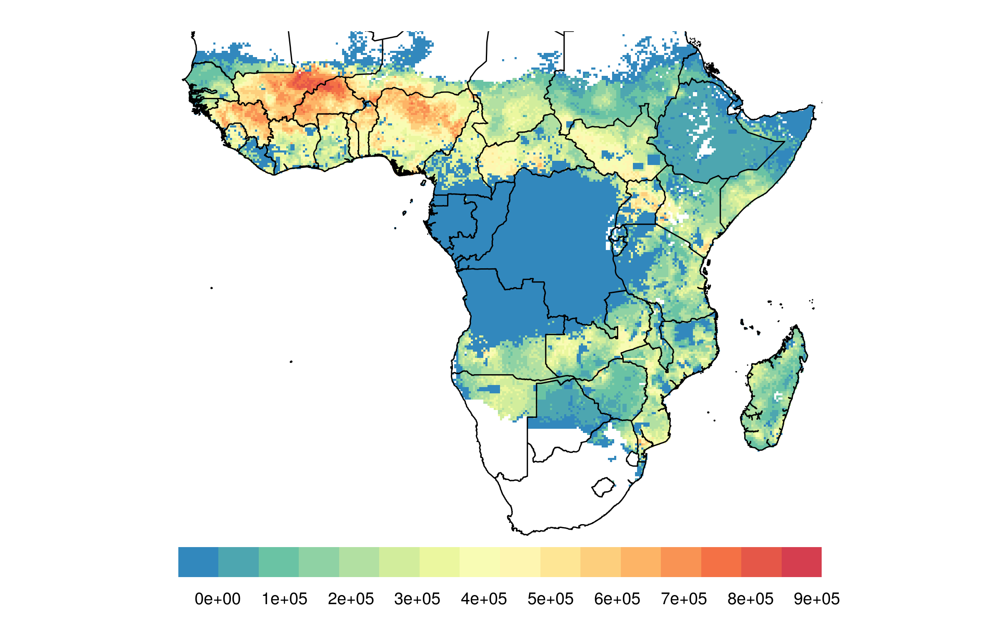
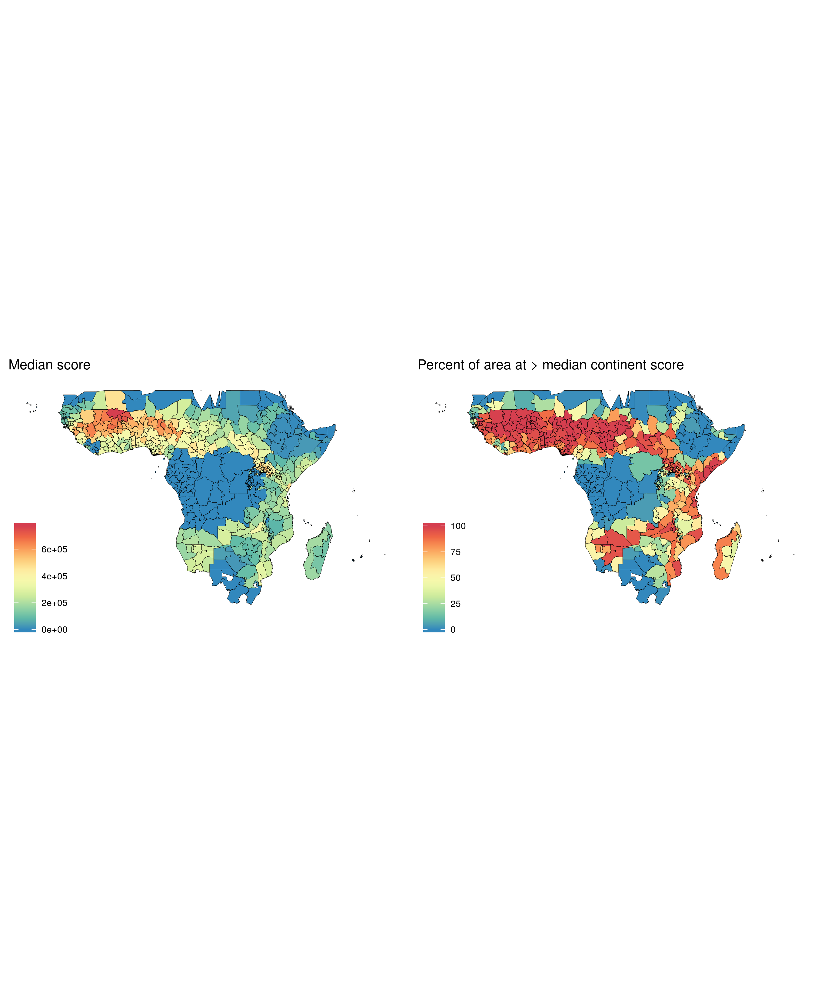
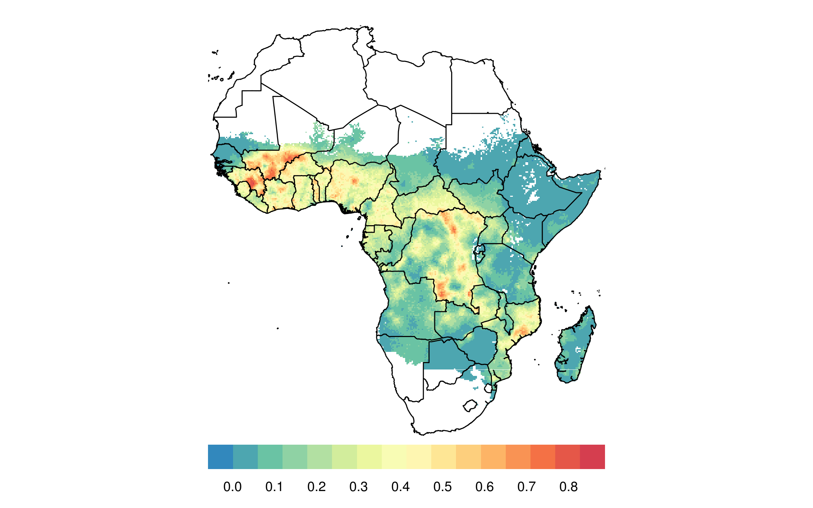
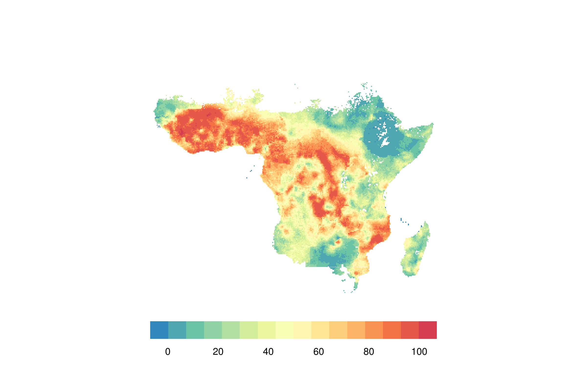
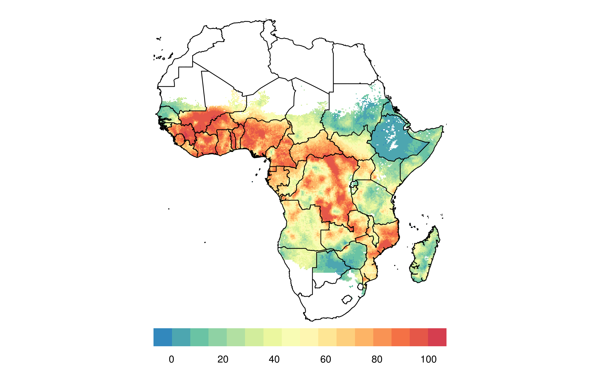
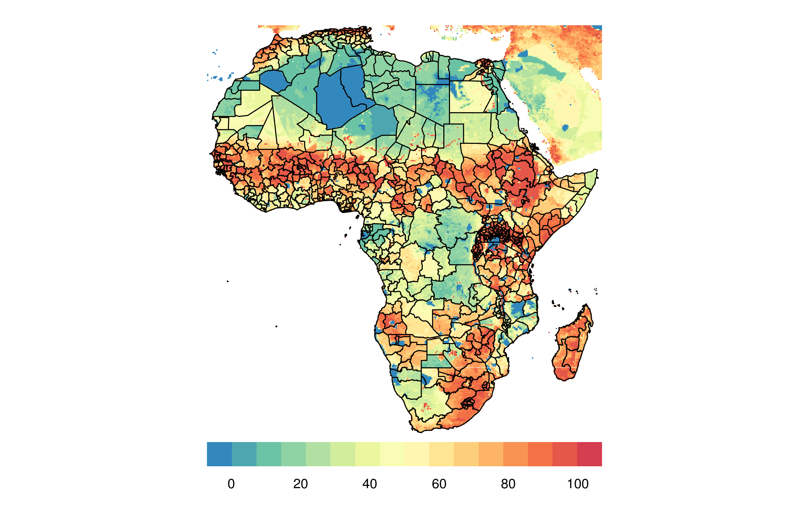
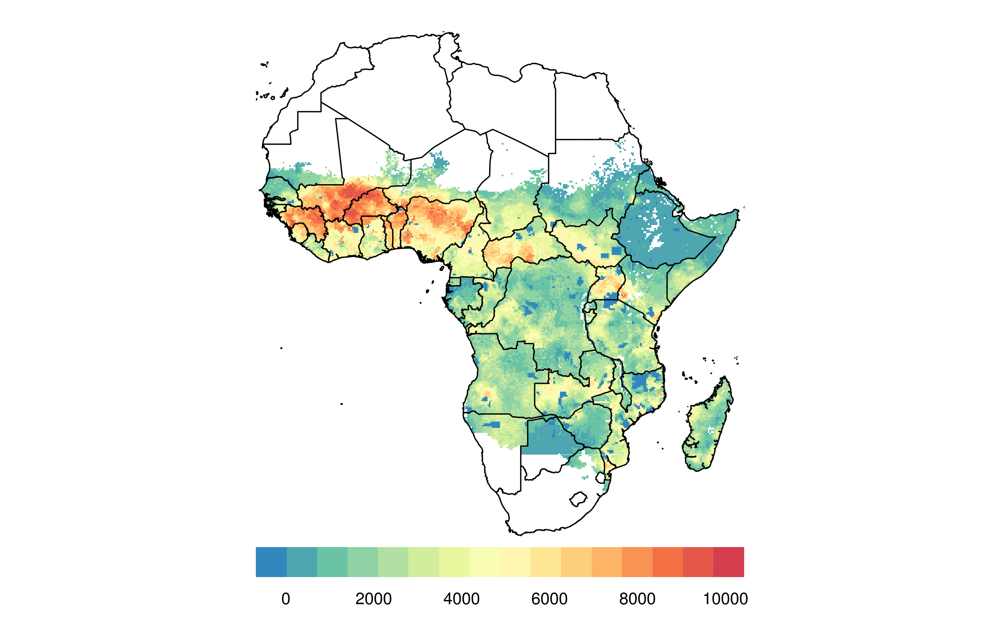
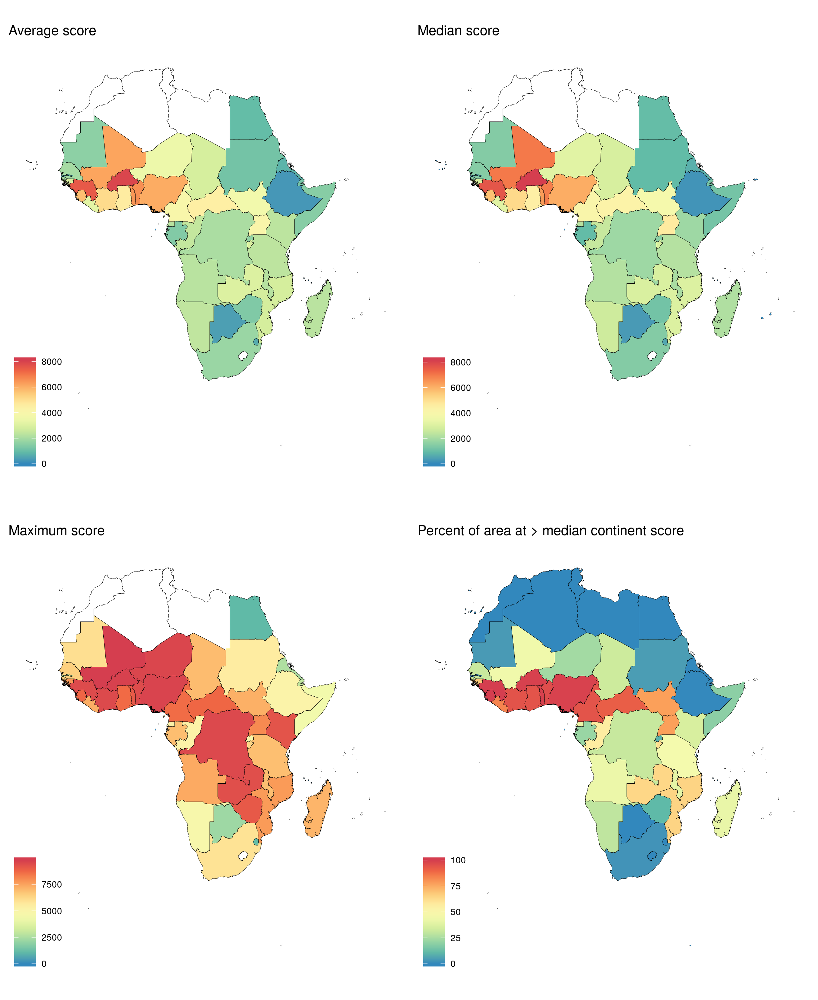
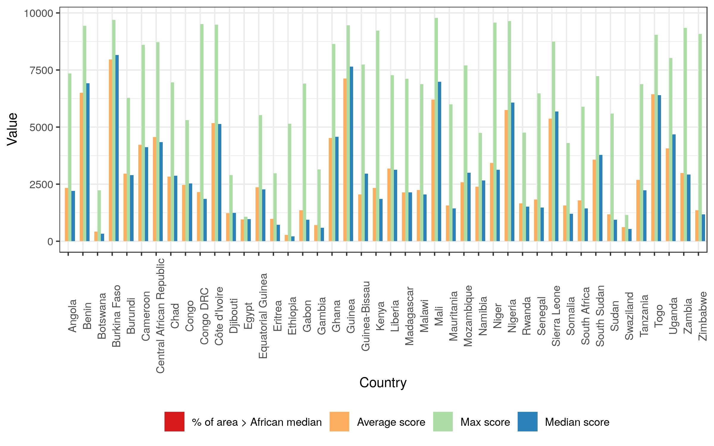

<!-- README.md is generated from README.Rmd. Please edit that file -->
    OGR data source with driver: ESRI Shapefile 
    Source: "/home/joebrew/Documents/cowsquitoes/data/VECTORS/13071_2010_245_MOESM1_ESM/Additional file 1 - African, Euro-ME EO shapefiles", layer: "arabiensis"
    with 1 features
    It has 1 fields
    Integer64 fields read as strings:  ID 

cowsquito: Identifying geographical areas of greatest potential impact for livestock ivermectin implants
========================================================================================================

Figure 1. Parasite prevalence (a) Raw and (b) percentilized
-----------------------------------------------------------

    png 
      2 

Figure 2. Cattle density (a) Raw and (b) percentilized **review scale**
-----------------------------------------------------------------------

    png 
      2 

Figure 3. Arabiensis density (a) Raw and (b) percentilized
----------------------------------------------------------

    png 
      2 

Figure 4. Combined score just parasite and cattle
-------------------------------------------------

    png 
      2 

Figure 5. Combined score, all three
-----------------------------------

    png 
      2 

Figure 6. Combined score with first administrative division (a) median score and (b) proportion of surface &gt; median continent score
--------------------------------------------------------------------------------------------------------------------------------------

    png 
      2 

OLD STUFF BELOW
===============

Methods
=======

-   We use raw raster data on where cattle are from the International Livestock Research Institute (ILRI) and the Food and Agriculture Organization of the United Nations (FAO) and the Université Libre de Bruxelles (ULB-LUBIES).
-   We use raw raster data on the Plasmodium falciparum parasite rate in 2-10 year olds in Africa in 2015, made available through the Malaria Atlas Project.
-   We use R to process the data, standardize their geographic attributes (extents, projections) and quality attributes (granularity, etc.).
-   We use simple percentilization to scale prevalence (0-1) and cattle per square kilometer (0-Inf) into a 0-100 metric.
-   We combine our two metrics by simple product So, in the combined score, 0 means no Pf or cattle, and 100 means the maximum amount of Pf and cattle. 0 can also much of one metric, but not of the other (for example, a very malarious region with no cattle gets a 0). Anything between the two represents some combination. This method assumes an equilinear value of both percentilized Pf and cattle (ie, a place with 60th percentile cattle density and 40th percentile Pf is equally as promising as a place with 40th percentile cattle density and 60th percentile Pf).
-   Full code in this repo (`code.R`).

Results
=======

Arabiensis
----------

The below shows the distribution of arabiensis in Africa.

Malaria prevalence on the Plasmodium falciparum parasite rate in 2-10 year-olds.
--------------------------------------------------------------------------------

The below shows the raw data on the Plasmodium falciparum parasite rate in 2-10 year-olds.

The below is identical to the above, but with country borders.

The below is identical to the above, but with administrative borders.

The below shows our (scaled) data on the Plasmodium falciparum parasite rate in 2-10 year-olds.

The below is identical to the above, but with country borders.

The below is identical to the above, but with administrative borders.

Cattle density
--------------

The below is identical to the above, but with country borders.

The below is identical to the above, but with administrative level 1 borders.

Combined score
--------------

### Single score

The below shows our combined score, using the product of the cattle and malaria metrics. Unlike a multi-dimensional score, this visual does not contain as much information (ie, with a value of "40", it's not clear whether this is due to a cattle percentile of 40 and a malaria percentile of 1, or a cattle percentile of 5 and a malaria percentile of 8). That said, a one-dimensional color legend is much easier to interpret visually.

The below is identical to the above, but with country borders.

The below is identical to the above, but with the distribution of arabiensis as well.

The below is identical to the above, but showing a point for each "grid" of the raster surface, and removing the geogrpaphic coordination (ie, scatterplot).

### Alternative visualizations

#### A

#### B

#### C

### Country aggregation

We aggregate at the polygonal national level so as to rank countries by suitability for intervention. The below maps show the mean, median, maximum, and % of area greater than continental median "single score" (product of Pf and cattle percentile) for each country in Africa.

The below shows a plot of country level values (excluding countries with 0 values throughout).

The below is a table country-level values.

<table>
<thead>
<tr>
<th style="text-align:left;">
country
</th>
<th style="text-align:right;">
Average score
</th>
<th style="text-align:right;">
Max score
</th>
<th style="text-align:right;">
Median score
</th>
<th style="text-align:right;">
% of area &gt; African median
</th>
</tr>
</thead>
<tbody>
<tr>
<td style="text-align:left;">
Algeria
</td>
<td style="text-align:right;">
NaN
</td>
<td style="text-align:right;">
-Inf
</td>
<td style="text-align:right;">
NA
</td>
<td style="text-align:right;">
0
</td>
</tr>
<tr>
<td style="text-align:left;">
Angola
</td>
<td style="text-align:right;">
2333.1573
</td>
<td style="text-align:right;">
7353.563
</td>
<td style="text-align:right;">
2209.7126
</td>
<td style="text-align:right;">
0
</td>
</tr>
<tr>
<td style="text-align:left;">
Benin
</td>
<td style="text-align:right;">
6496.9283
</td>
<td style="text-align:right;">
9438.505
</td>
<td style="text-align:right;">
6915.8354
</td>
<td style="text-align:right;">
0
</td>
</tr>
<tr>
<td style="text-align:left;">
Botswana
</td>
<td style="text-align:right;">
418.0155
</td>
<td style="text-align:right;">
2234.936
</td>
<td style="text-align:right;">
334.8742
</td>
<td style="text-align:right;">
0
</td>
</tr>
<tr>
<td style="text-align:left;">
Burkina Faso
</td>
<td style="text-align:right;">
7957.4392
</td>
<td style="text-align:right;">
9699.758
</td>
<td style="text-align:right;">
8157.9491
</td>
<td style="text-align:right;">
0
</td>
</tr>
<tr>
<td style="text-align:left;">
Burundi
</td>
<td style="text-align:right;">
2957.0399
</td>
<td style="text-align:right;">
6287.630
</td>
<td style="text-align:right;">
2896.5428
</td>
<td style="text-align:right;">
0
</td>
</tr>
<tr>
<td style="text-align:left;">
Cameroon
</td>
<td style="text-align:right;">
4218.5472
</td>
<td style="text-align:right;">
8602.130
</td>
<td style="text-align:right;">
4114.2068
</td>
<td style="text-align:right;">
0
</td>
</tr>
<tr>
<td style="text-align:left;">
Canarias
</td>
<td style="text-align:right;">
NaN
</td>
<td style="text-align:right;">
-Inf
</td>
<td style="text-align:right;">
NA
</td>
<td style="text-align:right;">
0
</td>
</tr>
<tr>
<td style="text-align:left;">
Cape Verde
</td>
<td style="text-align:right;">
NaN
</td>
<td style="text-align:right;">
-Inf
</td>
<td style="text-align:right;">
0.0000
</td>
<td style="text-align:right;">
0
</td>
</tr>
<tr>
<td style="text-align:left;">
Central African Republic
</td>
<td style="text-align:right;">
4561.9193
</td>
<td style="text-align:right;">
8721.381
</td>
<td style="text-align:right;">
4341.0485
</td>
<td style="text-align:right;">
0
</td>
</tr>
<tr>
<td style="text-align:left;">
Chad
</td>
<td style="text-align:right;">
2824.2043
</td>
<td style="text-align:right;">
6956.231
</td>
<td style="text-align:right;">
2867.0406
</td>
<td style="text-align:right;">
0
</td>
</tr>
<tr>
<td style="text-align:left;">
Comoros
</td>
<td style="text-align:right;">
0.0000
</td>
<td style="text-align:right;">
0.000
</td>
<td style="text-align:right;">
0.0000
</td>
<td style="text-align:right;">
0
</td>
</tr>
<tr>
<td style="text-align:left;">
Congo
</td>
<td style="text-align:right;">
2462.9646
</td>
<td style="text-align:right;">
5309.806
</td>
<td style="text-align:right;">
2524.5169
</td>
<td style="text-align:right;">
0
</td>
</tr>
<tr>
<td style="text-align:left;">
Congo DRC
</td>
<td style="text-align:right;">
2150.1000
</td>
<td style="text-align:right;">
9513.570
</td>
<td style="text-align:right;">
1855.3171
</td>
<td style="text-align:right;">
0
</td>
</tr>
<tr>
<td style="text-align:left;">
Côte d'Ivoire
</td>
<td style="text-align:right;">
5168.1716
</td>
<td style="text-align:right;">
9480.841
</td>
<td style="text-align:right;">
5138.5712
</td>
<td style="text-align:right;">
0
</td>
</tr>
<tr>
<td style="text-align:left;">
Djibouti
</td>
<td style="text-align:right;">
1226.7141
</td>
<td style="text-align:right;">
2893.685
</td>
<td style="text-align:right;">
1245.1138
</td>
<td style="text-align:right;">
0
</td>
</tr>
<tr>
<td style="text-align:left;">
Egypt
</td>
<td style="text-align:right;">
960.6049
</td>
<td style="text-align:right;">
1070.870
</td>
<td style="text-align:right;">
970.5191
</td>
<td style="text-align:right;">
0
</td>
</tr>
<tr>
<td style="text-align:left;">
Equatorial Guinea
</td>
<td style="text-align:right;">
2360.2700
</td>
<td style="text-align:right;">
5527.850
</td>
<td style="text-align:right;">
2270.5998
</td>
<td style="text-align:right;">
0
</td>
</tr>
<tr>
<td style="text-align:left;">
Eritrea
</td>
<td style="text-align:right;">
974.6356
</td>
<td style="text-align:right;">
2976.994
</td>
<td style="text-align:right;">
714.8165
</td>
<td style="text-align:right;">
0
</td>
</tr>
<tr>
<td style="text-align:left;">
Ethiopia
</td>
<td style="text-align:right;">
273.6184
</td>
<td style="text-align:right;">
5149.637
</td>
<td style="text-align:right;">
214.5856
</td>
<td style="text-align:right;">
0
</td>
</tr>
<tr>
<td style="text-align:left;">
French Southern Territories
</td>
<td style="text-align:right;">
NaN
</td>
<td style="text-align:right;">
-Inf
</td>
<td style="text-align:right;">
NA
</td>
<td style="text-align:right;">
0
</td>
</tr>
<tr>
<td style="text-align:left;">
Gabon
</td>
<td style="text-align:right;">
1358.5474
</td>
<td style="text-align:right;">
6905.658
</td>
<td style="text-align:right;">
939.8130
</td>
<td style="text-align:right;">
0
</td>
</tr>
<tr>
<td style="text-align:left;">
Gambia
</td>
<td style="text-align:right;">
710.4505
</td>
<td style="text-align:right;">
3141.180
</td>
<td style="text-align:right;">
593.5252
</td>
<td style="text-align:right;">
0
</td>
</tr>
<tr>
<td style="text-align:left;">
Ghana
</td>
<td style="text-align:right;">
4520.8183
</td>
<td style="text-align:right;">
8636.760
</td>
<td style="text-align:right;">
4576.7358
</td>
<td style="text-align:right;">
0
</td>
</tr>
<tr>
<td style="text-align:left;">
Guinea
</td>
<td style="text-align:right;">
7127.4868
</td>
<td style="text-align:right;">
9465.027
</td>
<td style="text-align:right;">
7648.6160
</td>
<td style="text-align:right;">
0
</td>
</tr>
<tr>
<td style="text-align:left;">
Guinea-Bissau
</td>
<td style="text-align:right;">
2048.3455
</td>
<td style="text-align:right;">
7735.997
</td>
<td style="text-align:right;">
2954.5109
</td>
<td style="text-align:right;">
0
</td>
</tr>
<tr>
<td style="text-align:left;">
Kenya
</td>
<td style="text-align:right;">
2341.7409
</td>
<td style="text-align:right;">
9227.900
</td>
<td style="text-align:right;">
1851.4142
</td>
<td style="text-align:right;">
0
</td>
</tr>
<tr>
<td style="text-align:left;">
Lesotho
</td>
<td style="text-align:right;">
NaN
</td>
<td style="text-align:right;">
-Inf
</td>
<td style="text-align:right;">
NA
</td>
<td style="text-align:right;">
0
</td>
</tr>
<tr>
<td style="text-align:left;">
Liberia
</td>
<td style="text-align:right;">
3179.9214
</td>
<td style="text-align:right;">
7272.294
</td>
<td style="text-align:right;">
3126.2406
</td>
<td style="text-align:right;">
0
</td>
</tr>
<tr>
<td style="text-align:left;">
Libya
</td>
<td style="text-align:right;">
NaN
</td>
<td style="text-align:right;">
-Inf
</td>
<td style="text-align:right;">
NA
</td>
<td style="text-align:right;">
0
</td>
</tr>
<tr>
<td style="text-align:left;">
Madagascar
</td>
<td style="text-align:right;">
2140.0323
</td>
<td style="text-align:right;">
7108.628
</td>
<td style="text-align:right;">
2142.0339
</td>
<td style="text-align:right;">
0
</td>
</tr>
<tr>
<td style="text-align:left;">
Madeira
</td>
<td style="text-align:right;">
NaN
</td>
<td style="text-align:right;">
-Inf
</td>
<td style="text-align:right;">
NA
</td>
<td style="text-align:right;">
0
</td>
</tr>
<tr>
<td style="text-align:left;">
Malawi
</td>
<td style="text-align:right;">
2242.9314
</td>
<td style="text-align:right;">
6880.970
</td>
<td style="text-align:right;">
2052.5274
</td>
<td style="text-align:right;">
0
</td>
</tr>
<tr>
<td style="text-align:left;">
Mali
</td>
<td style="text-align:right;">
6201.3190
</td>
<td style="text-align:right;">
9779.972
</td>
<td style="text-align:right;">
6983.0188
</td>
<td style="text-align:right;">
0
</td>
</tr>
<tr>
<td style="text-align:left;">
Mauritania
</td>
<td style="text-align:right;">
1564.2885
</td>
<td style="text-align:right;">
5996.842
</td>
<td style="text-align:right;">
1439.5772
</td>
<td style="text-align:right;">
0
</td>
</tr>
<tr>
<td style="text-align:left;">
Mauritius
</td>
<td style="text-align:right;">
NaN
</td>
<td style="text-align:right;">
-Inf
</td>
<td style="text-align:right;">
0.0000
</td>
<td style="text-align:right;">
0
</td>
</tr>
<tr>
<td style="text-align:left;">
Mayotte
</td>
<td style="text-align:right;">
0.0000
</td>
<td style="text-align:right;">
0.000
</td>
<td style="text-align:right;">
0.0000
</td>
<td style="text-align:right;">
0
</td>
</tr>
<tr>
<td style="text-align:left;">
Morocco
</td>
<td style="text-align:right;">
NaN
</td>
<td style="text-align:right;">
-Inf
</td>
<td style="text-align:right;">
NA
</td>
<td style="text-align:right;">
0
</td>
</tr>
<tr>
<td style="text-align:left;">
Mozambique
</td>
<td style="text-align:right;">
2588.2943
</td>
<td style="text-align:right;">
7697.740
</td>
<td style="text-align:right;">
3003.3289
</td>
<td style="text-align:right;">
0
</td>
</tr>
<tr>
<td style="text-align:left;">
Namibia
</td>
<td style="text-align:right;">
2391.4143
</td>
<td style="text-align:right;">
4749.421
</td>
<td style="text-align:right;">
2655.6500
</td>
<td style="text-align:right;">
0
</td>
</tr>
<tr>
<td style="text-align:left;">
Niger
</td>
<td style="text-align:right;">
3435.9288
</td>
<td style="text-align:right;">
9578.718
</td>
<td style="text-align:right;">
3127.1237
</td>
<td style="text-align:right;">
0
</td>
</tr>
<tr>
<td style="text-align:left;">
Nigeria
</td>
<td style="text-align:right;">
5753.6697
</td>
<td style="text-align:right;">
9639.879
</td>
<td style="text-align:right;">
6076.6770
</td>
<td style="text-align:right;">
0
</td>
</tr>
<tr>
<td style="text-align:left;">
Réunion
</td>
<td style="text-align:right;">
NaN
</td>
<td style="text-align:right;">
-Inf
</td>
<td style="text-align:right;">
0.0000
</td>
<td style="text-align:right;">
0
</td>
</tr>
<tr>
<td style="text-align:left;">
Rwanda
</td>
<td style="text-align:right;">
1652.9504
</td>
<td style="text-align:right;">
4753.002
</td>
<td style="text-align:right;">
1516.5183
</td>
<td style="text-align:right;">
0
</td>
</tr>
<tr>
<td style="text-align:left;">
Saint Helena
</td>
<td style="text-align:right;">
NaN
</td>
<td style="text-align:right;">
-Inf
</td>
<td style="text-align:right;">
0.0000
</td>
<td style="text-align:right;">
0
</td>
</tr>
<tr>
<td style="text-align:left;">
Sao Tome and Principe
</td>
<td style="text-align:right;">
0.0000
</td>
<td style="text-align:right;">
0.000
</td>
<td style="text-align:right;">
0.0000
</td>
<td style="text-align:right;">
0
</td>
</tr>
<tr>
<td style="text-align:left;">
Senegal
</td>
<td style="text-align:right;">
1821.5846
</td>
<td style="text-align:right;">
6483.164
</td>
<td style="text-align:right;">
1469.6298
</td>
<td style="text-align:right;">
0
</td>
</tr>
<tr>
<td style="text-align:left;">
Seychelles
</td>
<td style="text-align:right;">
NaN
</td>
<td style="text-align:right;">
-Inf
</td>
<td style="text-align:right;">
0.0000
</td>
<td style="text-align:right;">
0
</td>
</tr>
<tr>
<td style="text-align:left;">
Sierra Leone
</td>
<td style="text-align:right;">
5368.7538
</td>
<td style="text-align:right;">
8744.275
</td>
<td style="text-align:right;">
5686.6299
</td>
<td style="text-align:right;">
0
</td>
</tr>
<tr>
<td style="text-align:left;">
Somalia
</td>
<td style="text-align:right;">
1560.7378
</td>
<td style="text-align:right;">
4305.384
</td>
<td style="text-align:right;">
1201.2161
</td>
<td style="text-align:right;">
0
</td>
</tr>
<tr>
<td style="text-align:left;">
South Africa
</td>
<td style="text-align:right;">
1783.3770
</td>
<td style="text-align:right;">
5888.877
</td>
<td style="text-align:right;">
1437.3346
</td>
<td style="text-align:right;">
0
</td>
</tr>
<tr>
<td style="text-align:left;">
South Sudan
</td>
<td style="text-align:right;">
3567.5619
</td>
<td style="text-align:right;">
7232.180
</td>
<td style="text-align:right;">
3777.7381
</td>
<td style="text-align:right;">
0
</td>
</tr>
<tr>
<td style="text-align:left;">
Spain
</td>
<td style="text-align:right;">
NaN
</td>
<td style="text-align:right;">
-Inf
</td>
<td style="text-align:right;">
NA
</td>
<td style="text-align:right;">
0
</td>
</tr>
<tr>
<td style="text-align:left;">
Sudan
</td>
<td style="text-align:right;">
1182.8400
</td>
<td style="text-align:right;">
5594.066
</td>
<td style="text-align:right;">
937.9648
</td>
<td style="text-align:right;">
0
</td>
</tr>
<tr>
<td style="text-align:left;">
Swaziland
</td>
<td style="text-align:right;">
617.2870
</td>
<td style="text-align:right;">
1152.044
</td>
<td style="text-align:right;">
540.5806
</td>
<td style="text-align:right;">
0
</td>
</tr>
<tr>
<td style="text-align:left;">
Tanzania
</td>
<td style="text-align:right;">
2682.8123
</td>
<td style="text-align:right;">
6876.018
</td>
<td style="text-align:right;">
2226.8264
</td>
<td style="text-align:right;">
0
</td>
</tr>
<tr>
<td style="text-align:left;">
Togo
</td>
<td style="text-align:right;">
6443.2457
</td>
<td style="text-align:right;">
9047.513
</td>
<td style="text-align:right;">
6401.6518
</td>
<td style="text-align:right;">
0
</td>
</tr>
<tr>
<td style="text-align:left;">
Tunisia
</td>
<td style="text-align:right;">
NaN
</td>
<td style="text-align:right;">
-Inf
</td>
<td style="text-align:right;">
NA
</td>
<td style="text-align:right;">
0
</td>
</tr>
<tr>
<td style="text-align:left;">
Uganda
</td>
<td style="text-align:right;">
4067.3972
</td>
<td style="text-align:right;">
8033.209
</td>
<td style="text-align:right;">
4679.3340
</td>
<td style="text-align:right;">
0
</td>
</tr>
<tr>
<td style="text-align:left;">
Yemen
</td>
<td style="text-align:right;">
NaN
</td>
<td style="text-align:right;">
-Inf
</td>
<td style="text-align:right;">
0.0000
</td>
<td style="text-align:right;">
0
</td>
</tr>
<tr>
<td style="text-align:left;">
Zambia
</td>
<td style="text-align:right;">
2985.0090
</td>
<td style="text-align:right;">
9340.874
</td>
<td style="text-align:right;">
2920.1835
</td>
<td style="text-align:right;">
0
</td>
</tr>
<tr>
<td style="text-align:left;">
Zimbabwe
</td>
<td style="text-align:right;">
1359.0125
</td>
<td style="text-align:right;">
9077.524
</td>
<td style="text-align:right;">
1177.2685
</td>
<td style="text-align:right;">
0
</td>
</tr>
</tbody>
</table>
### Administrative level 1 aggregation

We aggregate at the polygonal sub-national level so as to rank administrative areas (districts, etc.) by suitability for intervention. The below maps show the mean, median, maximum, and % of area greater than continental median "single score" (product of Pf and cattle percentile) for each administrative unit in Africa.

All values for all sub-national administrative units.

<table>
<thead>
<tr>
<th style="text-align:left;">
country
</th>
<th style="text-align:right;">
Average score
</th>
<th style="text-align:right;">
Max score
</th>
<th style="text-align:right;">
Median score
</th>
<th style="text-align:right;">
% of area &gt; African median
</th>
</tr>
</thead>
<tbody>
<tr>
<td style="text-align:left;">
!Karas, Namibia
</td>
<td style="text-align:right;">
NaN
</td>
<td style="text-align:right;">
-Inf
</td>
<td style="text-align:right;">
NA
</td>
<td style="text-align:right;">
0
</td>
</tr>
<tr>
<td style="text-align:left;">
Abia, Nigeria
</td>
<td style="text-align:right;">
6224.7890903
</td>
<td style="text-align:right;">
7475.2891486
</td>
<td style="text-align:right;">
6295.3502577
</td>
<td style="text-align:right;">
0
</td>
</tr>
<tr>
<td style="text-align:left;">
Abidjan, Côte d'Ivoire
</td>
<td style="text-align:right;">
3668.7777014
</td>
<td style="text-align:right;">
7107.8576290
</td>
<td style="text-align:right;">
3336.3252324
</td>
<td style="text-align:right;">
0
</td>
</tr>
<tr>
<td style="text-align:left;">
Acoua, Mayotte
</td>
<td style="text-align:right;">
0.0000000
</td>
<td style="text-align:right;">
0.0000000
</td>
<td style="text-align:right;">
0.0000000
</td>
<td style="text-align:right;">
0
</td>
</tr>
<tr>
<td style="text-align:left;">
Ad Daqahliyah, Egypt
</td>
<td style="text-align:right;">
NaN
</td>
<td style="text-align:right;">
-Inf
</td>
<td style="text-align:right;">
NA
</td>
<td style="text-align:right;">
0
</td>
</tr>
<tr>
<td style="text-align:left;">
Adamaoua, Cameroon
</td>
<td style="text-align:right;">
4841.2856641
</td>
<td style="text-align:right;">
8602.1302746
</td>
<td style="text-align:right;">
4853.1248404
</td>
<td style="text-align:right;">
0
</td>
</tr>
<tr>
<td style="text-align:left;">
Adamawa, Nigeria
</td>
<td style="text-align:right;">
7461.0675024
</td>
<td style="text-align:right;">
9095.9937999
</td>
<td style="text-align:right;">
7634.2251484
</td>
<td style="text-align:right;">
0
</td>
</tr>
<tr>
<td style="text-align:left;">
Addis Abeba, Ethiopia
</td>
<td style="text-align:right;">
110.7115166
</td>
<td style="text-align:right;">
208.5884422
</td>
<td style="text-align:right;">
101.7340819
</td>
<td style="text-align:right;">
0
</td>
</tr>
<tr>
<td style="text-align:left;">
Adjumani, Uganda
</td>
<td style="text-align:right;">
4758.0294466
</td>
<td style="text-align:right;">
6044.6785615
</td>
<td style="text-align:right;">
4830.2076617
</td>
<td style="text-align:right;">
0
</td>
</tr>
<tr>
<td style="text-align:left;">
Adrar, Algeria
</td>
<td style="text-align:right;">
NaN
</td>
<td style="text-align:right;">
-Inf
</td>
<td style="text-align:right;">
NA
</td>
<td style="text-align:right;">
0
</td>
</tr>
<tr>
<td style="text-align:left;">
Adrar, Mauritania
</td>
<td style="text-align:right;">
NaN
</td>
<td style="text-align:right;">
-Inf
</td>
<td style="text-align:right;">
NA
</td>
<td style="text-align:right;">
0
</td>
</tr>
<tr>
<td style="text-align:left;">
Afar, Ethiopia
</td>
<td style="text-align:right;">
239.8549462
</td>
<td style="text-align:right;">
1348.9088039
</td>
<td style="text-align:right;">
194.1993290
</td>
<td style="text-align:right;">
0
</td>
</tr>
<tr>
<td style="text-align:left;">
Agadez, Niger
</td>
<td style="text-align:right;">
1320.5867436
</td>
<td style="text-align:right;">
4591.2939568
</td>
<td style="text-align:right;">
1205.5407766
</td>
<td style="text-align:right;">
0
</td>
</tr>
<tr>
<td style="text-align:left;">
Agalega Islands, Mauritius
</td>
<td style="text-align:right;">
NaN
</td>
<td style="text-align:right;">
-Inf
</td>
<td style="text-align:right;">
0.0000000
</td>
<td style="text-align:right;">
0
</td>
</tr>
<tr>
<td style="text-align:left;">
Aïn Defla, Algeria
</td>
<td style="text-align:right;">
NaN
</td>
<td style="text-align:right;">
-Inf
</td>
<td style="text-align:right;">
NA
</td>
<td style="text-align:right;">
0
</td>
</tr>
<tr>
<td style="text-align:left;">
Aïn Témouchent, Algeria
</td>
<td style="text-align:right;">
NaN
</td>
<td style="text-align:right;">
-Inf
</td>
<td style="text-align:right;">
NA
</td>
<td style="text-align:right;">
0
</td>
</tr>
<tr>
<td style="text-align:left;">
Akwa Ibom, Nigeria
</td>
<td style="text-align:right;">
7108.9658788
</td>
<td style="text-align:right;">
8616.5865946
</td>
<td style="text-align:right;">
7152.3070433
</td>
<td style="text-align:right;">
0
</td>
</tr>
<tr>
<td style="text-align:left;">
Al Bahr al Ahmar, Egypt
</td>
<td style="text-align:right;">
960.6049278
</td>
<td style="text-align:right;">
1070.8699390
</td>
<td style="text-align:right;">
970.5190722
</td>
<td style="text-align:right;">
0
</td>
</tr>
<tr>
<td style="text-align:left;">
Al Buhayrah, Egypt
</td>
<td style="text-align:right;">
NaN
</td>
<td style="text-align:right;">
-Inf
</td>
<td style="text-align:right;">
NA
</td>
<td style="text-align:right;">
0
</td>
</tr>
<tr>
<td style="text-align:left;">
Al Butnan, Libya
</td>
<td style="text-align:right;">
NaN
</td>
<td style="text-align:right;">
-Inf
</td>
<td style="text-align:right;">
NA
</td>
<td style="text-align:right;">
0
</td>
</tr>
<tr>
<td style="text-align:left;">
Al Fayyum, Egypt
</td>
<td style="text-align:right;">
NaN
</td>
<td style="text-align:right;">
-Inf
</td>
<td style="text-align:right;">
NA
</td>
<td style="text-align:right;">
0
</td>
</tr>
<tr>
<td style="text-align:left;">
Al Gharbiyah, Egypt
</td>
<td style="text-align:right;">
NaN
</td>
<td style="text-align:right;">
-Inf
</td>
<td style="text-align:right;">
NA
</td>
<td style="text-align:right;">
0
</td>
</tr>
<tr>
<td style="text-align:left;">
Al Iskandariyah, Egypt
</td>
<td style="text-align:right;">
NaN
</td>
<td style="text-align:right;">
-Inf
</td>
<td style="text-align:right;">
NA
</td>
<td style="text-align:right;">
0
</td>
</tr>
<tr>
<td style="text-align:left;">
Al Isma`iliyah, Egypt </td>    <td style="text-align:right;"> NaN </td>    <td style="text-align:right;"> -Inf </td>    <td style="text-align:right;"> NA </td>    <td style="text-align:right;"> 0 </td>   </tr>   <tr>    <td style="text-align:left;"> Al Jabal al Akhdar, Libya </td>    <td style="text-align:right;"> NaN </td>    <td style="text-align:right;"> -Inf </td>    <td style="text-align:right;"> NA </td>    <td style="text-align:right;"> 0 </td>   </tr>   <tr>    <td style="text-align:left;"> Al Jabal al Gharbi, Libya </td>    <td style="text-align:right;"> NaN </td>    <td style="text-align:right;"> -Inf </td>    <td style="text-align:right;"> NA </td>    <td style="text-align:right;"> 0 </td>   </tr>   <tr>    <td style="text-align:left;"> Al Jazirah, Sudan </td>    <td style="text-align:right;"> 672.6365292 </td>    <td style="text-align:right;"> 1322.7534305 </td>    <td style="text-align:right;"> 662.9621070 </td>    <td style="text-align:right;"> 0 </td>   </tr>   <tr>    <td style="text-align:left;"> Al Jifarah, Libya </td>    <td style="text-align:right;"> NaN </td>    <td style="text-align:right;"> -Inf </td>    <td style="text-align:right;"> NA </td>    <td style="text-align:right;"> 0 </td>   </tr>   <tr>    <td style="text-align:left;"> Al Jizah, Egypt </td>    <td style="text-align:right;"> NaN </td>    <td style="text-align:right;"> -Inf </td>    <td style="text-align:right;"> NA </td>    <td style="text-align:right;"> 0 </td>   </tr>   <tr>    <td style="text-align:left;"> Al Jufrah, Libya </td>    <td style="text-align:right;"> NaN </td>    <td style="text-align:right;"> -Inf </td>    <td style="text-align:right;"> NA </td>    <td style="text-align:right;"> 0 </td>   </tr>   <tr>    <td style="text-align:left;"> Al Kufrah, Libya </td>    <td style="text-align:right;"> NaN </td>    <td style="text-align:right;"> -Inf </td>    <td style="text-align:right;"> NA </td>    <td style="text-align:right;"> 0 </td>   </tr>   <tr>    <td style="text-align:left;"> Al Marj, Libya </td>    <td style="text-align:right;"> NaN </td>    <td style="text-align:right;"> -Inf </td>    <td style="text-align:right;"> NA </td>    <td style="text-align:right;"> 0 </td>   </tr>   <tr>    <td style="text-align:left;"> Al Marqab, Libya </td>    <td style="text-align:right;"> NaN </td>    <td style="text-align:right;"> -Inf </td>    <td style="text-align:right;"> NA </td>    <td style="text-align:right;"> 0 </td>   </tr>   <tr>    <td style="text-align:left;"> Al Minufiyah, Egypt </td>    <td style="text-align:right;"> NaN </td>    <td style="text-align:right;"> -Inf </td>    <td style="text-align:right;"> NA </td>    <td style="text-align:right;"> 0 </td>   </tr>   <tr>    <td style="text-align:left;"> Al Minya, Egypt </td>    <td style="text-align:right;"> NaN </td>    <td style="text-align:right;"> -Inf </td>    <td style="text-align:right;"> NA </td>    <td style="text-align:right;"> 0 </td>   </tr>   <tr>    <td style="text-align:left;"> Al Qadarif, Sudan </td>    <td style="text-align:right;"> 1494.6698131 </td>    <td style="text-align:right;"> 5294.0975777 </td>    <td style="text-align:right;"> 1175.0907152 </td>    <td style="text-align:right;"> 0 </td>   </tr>   <tr>    <td style="text-align:left;"> Al Qahirah, Egypt </td>    <td style="text-align:right;"> NaN </td>    <td style="text-align:right;"> -Inf </td>    <td style="text-align:right;"> NA </td>    <td style="text-align:right;"> 0 </td>   </tr>   <tr>    <td style="text-align:left;"> Al Qalyubiyah, Egypt </td>    <td style="text-align:right;"> NaN </td>    <td style="text-align:right;"> -Inf </td>    <td style="text-align:right;"> NA </td>    <td style="text-align:right;"> 0 </td>   </tr>   <tr>    <td style="text-align:left;"> Al Uqsur, Egypt </td>    <td style="text-align:right;"> NaN </td>    <td style="text-align:right;"> -Inf </td>    <td style="text-align:right;"> NA </td>    <td style="text-align:right;"> 0 </td>   </tr>   <tr>    <td style="text-align:left;"> Al Wadi al Jadid, Egypt </td>    <td style="text-align:right;"> NaN </td>    <td style="text-align:right;"> -Inf </td>    <td style="text-align:right;"> NA </td>    <td style="text-align:right;"> 0 </td>   </tr>   <tr>    <td style="text-align:left;"> Al Wahat, Libya </td>    <td style="text-align:right;"> NaN </td>    <td style="text-align:right;"> -Inf </td>    <td style="text-align:right;"> NA </td>    <td style="text-align:right;"> 0 </td>   </tr>   <tr>    <td style="text-align:left;"> Alger, Algeria </td>    <td style="text-align:right;"> NaN </td>    <td style="text-align:right;"> -Inf </td>    <td style="text-align:right;"> NA </td>    <td style="text-align:right;"> 0 </td>   </tr>   <tr>    <td style="text-align:left;"> Ali Sabieh, Djibouti </td>    <td style="text-align:right;"> 2356.8460666 </td>    <td style="text-align:right;"> 2893.6847002 </td>    <td style="text-align:right;"> 2354.0187551 </td>    <td style="text-align:right;"> 0 </td>   </tr>   <tr>    <td style="text-align:left;"> Alibori, Benin </td>    <td style="text-align:right;"> 6863.4218070 </td>    <td style="text-align:right;"> 9438.5047395 </td>    <td style="text-align:right;"> 7740.3790175 </td>    <td style="text-align:right;"> 0 </td>   </tr>   <tr>    <td style="text-align:left;"> Amajyaruguru, Rwanda </td>    <td style="text-align:right;"> 1378.7334256 </td>    <td style="text-align:right;"> 1830.3974014 </td>    <td style="text-align:right;"> 1371.4929423 </td>    <td style="text-align:right;"> 0 </td>   </tr>   <tr>    <td style="text-align:left;"> Amajyepfo, Rwanda </td>    <td style="text-align:right;"> 1793.8189283 </td>    <td style="text-align:right;"> 3563.6032743 </td>    <td style="text-align:right;"> 1636.2693437 </td>    <td style="text-align:right;"> 0 </td>   </tr>   <tr>    <td style="text-align:left;"> Amhara, Ethiopia </td>    <td style="text-align:right;"> 323.0684438 </td>    <td style="text-align:right;"> 5149.6369282 </td>    <td style="text-align:right;"> 142.2836800 </td>    <td style="text-align:right;"> 0 </td>   </tr>   <tr>    <td style="text-align:left;"> An Nuqat al Khams, Libya </td>    <td style="text-align:right;"> NaN </td>    <td style="text-align:right;"> -Inf </td>    <td style="text-align:right;"> NA </td>    <td style="text-align:right;"> 0 </td>   </tr>   <tr>    <td style="text-align:left;"> Anambra, Nigeria </td>    <td style="text-align:right;"> 3694.2584241 </td>    <td style="text-align:right;"> 5174.2950273 </td>    <td style="text-align:right;"> 3691.1552189 </td>    <td style="text-align:right;"> 0 </td>   </tr>   <tr>    <td style="text-align:left;"> Annaba, Algeria </td>    <td style="text-align:right;"> NaN </td>    <td style="text-align:right;"> -Inf </td>    <td style="text-align:right;"> NA </td>    <td style="text-align:right;"> 0 </td>   </tr>   <tr>    <td style="text-align:left;"> Annobón, Equatorial Guinea </td>    <td style="text-align:right;"> 0.0000000 </td>    <td style="text-align:right;"> 0.0000000 </td>    <td style="text-align:right;"> 0.0000000 </td>    <td style="text-align:right;"> 0 </td>   </tr>   <tr>    <td style="text-align:left;"> Anse aux Pins, Seychelles </td>    <td style="text-align:right;"> NaN </td>    <td style="text-align:right;"> -Inf </td>    <td style="text-align:right;"> 0.0000000 </td>    <td style="text-align:right;"> 0 </td>   </tr>   <tr>    <td style="text-align:left;"> Anse Boileau, Seychelles </td>    <td style="text-align:right;"> NaN </td>    <td style="text-align:right;"> -Inf </td>    <td style="text-align:right;"> 0.0000000 </td>    <td style="text-align:right;"> 0 </td>   </tr>   <tr>    <td style="text-align:left;"> Anse Étoile, Seychelles </td>    <td style="text-align:right;"> NaN </td>    <td style="text-align:right;"> -Inf </td>    <td style="text-align:right;"> 0.0000000 </td>    <td style="text-align:right;"> 0 </td>   </tr>   <tr>    <td style="text-align:left;"> Anse Royale, Seychelles </td>    <td style="text-align:right;"> NaN </td>    <td style="text-align:right;"> -Inf </td>    <td style="text-align:right;"> 0.0000000 </td>    <td style="text-align:right;"> 0 </td>   </tr>   <tr>    <td style="text-align:left;"> Anseba, Eritrea </td>    <td style="text-align:right;"> 607.9048049 </td>    <td style="text-align:right;"> 864.0173752 </td>    <td style="text-align:right;"> 580.0392213 </td>    <td style="text-align:right;"> 0 </td>   </tr>   <tr>    <td style="text-align:left;"> Antananarivo, Madagascar </td>    <td style="text-align:right;"> 1643.1189467 </td>    <td style="text-align:right;"> 3162.1397028 </td>    <td style="text-align:right;"> 1595.4565191 </td>    <td style="text-align:right;"> 0 </td>   </tr>   <tr>    <td style="text-align:left;"> Antsiranana, Madagascar </td>    <td style="text-align:right;"> 2141.9622727 </td>    <td style="text-align:right;"> 4088.8385908 </td>    <td style="text-align:right;"> 2182.9324009 </td>    <td style="text-align:right;"> 0 </td>   </tr>   <tr>    <td style="text-align:left;"> Apac, Uganda </td>    <td style="text-align:right;"> 6484.2632795 </td>    <td style="text-align:right;"> 7415.4113797 </td>    <td style="text-align:right;"> 6593.9679926 </td>    <td style="text-align:right;"> 0 </td>   </tr>   <tr>    <td style="text-align:left;"> Ariana, Tunisia </td>    <td style="text-align:right;"> NaN </td>    <td style="text-align:right;"> -Inf </td>    <td style="text-align:right;"> NA </td>    <td style="text-align:right;"> 0 </td>   </tr>   <tr>    <td style="text-align:left;"> Arua, Uganda </td>    <td style="text-align:right;"> 4988.8088974 </td>    <td style="text-align:right;"> 6415.0307924 </td>    <td style="text-align:right;"> 5004.0458843 </td>    <td style="text-align:right;"> 0 </td>   </tr>   <tr>    <td style="text-align:left;"> Arusha, Tanzania </td>    <td style="text-align:right;"> 1382.2494218 </td>    <td style="text-align:right;"> 4389.8769353 </td>    <td style="text-align:right;"> 1282.4979049 </td>    <td style="text-align:right;"> 0 </td>   </tr>   <tr>    <td style="text-align:left;"> As Suways, Egypt </td>    <td style="text-align:right;"> NaN </td>    <td style="text-align:right;"> -Inf </td>    <td style="text-align:right;"> NA </td>    <td style="text-align:right;"> 0 </td>   </tr>   <tr>    <td style="text-align:left;"> Ascension, Saint Helena </td>    <td style="text-align:right;"> NaN </td>    <td style="text-align:right;"> -Inf </td>    <td style="text-align:right;"> NA </td>    <td style="text-align:right;"> 0 </td>   </tr>   <tr>    <td style="text-align:left;"> Ash Sharqiyah, Egypt </td>    <td style="text-align:right;"> NaN </td>    <td style="text-align:right;"> -Inf </td>    <td style="text-align:right;"> NA </td>    <td style="text-align:right;"> 0 </td>   </tr>   <tr>    <td style="text-align:left;"> Ashanti, Ghana </td>    <td style="text-align:right;"> 4644.1037375 </td>    <td style="text-align:right;"> 5851.1386769 </td>    <td style="text-align:right;"> 4612.8911080 </td>    <td style="text-align:right;"> 0 </td>   </tr>   <tr>    <td style="text-align:left;"> Assaba, Mauritania </td>    <td style="text-align:right;"> 1607.4282686 </td>    <td style="text-align:right;"> 5001.0551899 </td>    <td style="text-align:right;"> 1595.9651367 </td>    <td style="text-align:right;"> 0 </td>   </tr>   <tr>    <td style="text-align:left;"> Aswan, Egypt </td>    <td style="text-align:right;"> NaN </td>    <td style="text-align:right;"> -Inf </td>    <td style="text-align:right;"> NA </td>    <td style="text-align:right;"> 0 </td>   </tr>   <tr>    <td style="text-align:left;"> Asyut, Egypt </td>    <td style="text-align:right;"> NaN </td>    <td style="text-align:right;"> -Inf </td>    <td style="text-align:right;"> NA </td>    <td style="text-align:right;"> 0 </td>   </tr>   <tr>    <td style="text-align:left;"> Atakora, Benin </td>    <td style="text-align:right;"> 6609.5458484 </td>    <td style="text-align:right;"> 8812.6474616 </td>    <td style="text-align:right;"> 7160.2254346 </td>    <td style="text-align:right;"> 0 </td>   </tr>   <tr>    <td style="text-align:left;"> Atlantique, Benin </td>    <td style="text-align:right;"> 5617.7843083 </td>    <td style="text-align:right;"> 6985.8532013 </td>    <td style="text-align:right;"> 5706.0874004 </td>    <td style="text-align:right;"> 0 </td>   </tr>   <tr>    <td style="text-align:left;"> Au Cap, Seychelles </td>    <td style="text-align:right;"> NaN </td>    <td style="text-align:right;"> -Inf </td>    <td style="text-align:right;"> 0.0000000 </td>    <td style="text-align:right;"> 0 </td>   </tr>   <tr>    <td style="text-align:left;"> Awdal, Somalia </td>    <td style="text-align:right;"> 1784.6884919 </td>    <td style="text-align:right;"> 3105.1786645 </td>    <td style="text-align:right;"> 1765.4378101 </td>    <td style="text-align:right;"> 0 </td>   </tr>   <tr>    <td style="text-align:left;"> Az Zawiyah, Libya </td>    <td style="text-align:right;"> NaN </td>    <td style="text-align:right;"> -Inf </td>    <td style="text-align:right;"> NA </td>    <td style="text-align:right;"> 0 </td>   </tr>   <tr>    <td style="text-align:left;"> Bafatá, Guinea-Bissau </td>    <td style="text-align:right;"> 3876.5375979 </td>    <td style="text-align:right;"> 5090.9688036 </td>    <td style="text-align:right;"> 3819.6610617 </td>    <td style="text-align:right;"> 0 </td>   </tr>   <tr>    <td style="text-align:left;"> Baie Lazare, Seychelles </td>    <td style="text-align:right;"> NaN </td>    <td style="text-align:right;"> -Inf </td>    <td style="text-align:right;"> 0.0000000 </td>    <td style="text-align:right;"> 0 </td>   </tr>   <tr>    <td style="text-align:left;"> Baie Sainte Anne, Seychelles </td>    <td style="text-align:right;"> NaN </td>    <td style="text-align:right;"> -Inf </td>    <td style="text-align:right;"> 0.0000000 </td>    <td style="text-align:right;"> 0 </td>   </tr>   <tr>    <td style="text-align:left;"> Bakool, Somalia </td>    <td style="text-align:right;"> 1922.8432931 </td>    <td style="text-align:right;"> 3334.1723716 </td>    <td style="text-align:right;"> 1854.2542877 </td>    <td style="text-align:right;"> 0 </td>   </tr>   <tr>    <td style="text-align:left;"> Balaka, Malawi </td>    <td style="text-align:right;"> 1708.4273782 </td>    <td style="text-align:right;"> 2063.8991521 </td>    <td style="text-align:right;"> 1719.1380731 </td>    <td style="text-align:right;"> 0 </td>   </tr>   <tr>    <td style="text-align:left;"> Bamako, Mali </td>    <td style="text-align:right;"> 4876.7627276 </td>    <td style="text-align:right;"> 6410.3355925 </td>    <td style="text-align:right;"> 4999.1792605 </td>    <td style="text-align:right;"> 0 </td>   </tr>   <tr>    <td style="text-align:left;"> Bamingui-Bangoran, Central African Republic </td>    <td style="text-align:right;"> 2038.7972874 </td>    <td style="text-align:right;"> 6154.8695455 </td>    <td style="text-align:right;"> 2963.9685031 </td>    <td style="text-align:right;"> 0 </td>   </tr>   <tr>    <td style="text-align:left;"> Banaadir, Somalia </td>    <td style="text-align:right;"> 1516.1148349 </td>    <td style="text-align:right;"> 2075.1608640 </td>    <td style="text-align:right;"> 1459.4841163 </td>    <td style="text-align:right;"> 0 </td>   </tr>   <tr>    <td style="text-align:left;"> Bandraboua, Mayotte </td>    <td style="text-align:right;"> 0.0000000 </td>    <td style="text-align:right;"> 0.0000000 </td>    <td style="text-align:right;"> 0.0000000 </td>    <td style="text-align:right;"> 0 </td>   </tr>   <tr>    <td style="text-align:left;"> Bandrele, Mayotte </td>    <td style="text-align:right;"> 0.0000000 </td>    <td style="text-align:right;"> 0.0000000 </td>    <td style="text-align:right;"> 0.0000000 </td>    <td style="text-align:right;"> 0 </td>   </tr>   <tr>    <td style="text-align:left;"> Bandundu, Democratic Republic of the Congo </td>    <td style="text-align:right;"> 2811.8580531 </td>    <td style="text-align:right;"> 6118.3442894 </td>    <td style="text-align:right;"> 2800.1443339 </td>    <td style="text-align:right;"> 0 </td>   </tr>   <tr>    <td style="text-align:left;"> Bangui, Central African Republic </td>    <td style="text-align:right;"> 6493.8819203 </td>    <td style="text-align:right;"> 6897.6126620 </td>    <td style="text-align:right;"> 6611.5381425 </td>    <td style="text-align:right;"> 0 </td>   </tr>   <tr>    <td style="text-align:left;"> Bani Suwayf, Egypt </td>    <td style="text-align:right;"> NaN </td>    <td style="text-align:right;"> -Inf </td>    <td style="text-align:right;"> NA </td>    <td style="text-align:right;"> 0 </td>   </tr>   <tr>    <td style="text-align:left;"> Banjul, Gambia </td>    <td style="text-align:right;"> 424.3950403 </td>    <td style="text-align:right;"> 460.1685043 </td>    <td style="text-align:right;"> 424.3950403 </td>    <td style="text-align:right;"> 0 </td>   </tr>   <tr>    <td style="text-align:left;"> Barh el Ghazel, Chad </td>    <td style="text-align:right;"> 1753.8319807 </td>    <td style="text-align:right;"> 4054.9409392 </td>    <td style="text-align:right;"> 1457.4177671 </td>    <td style="text-align:right;"> 0 </td>   </tr>   <tr>    <td style="text-align:left;"> Bari, Somalia </td>    <td style="text-align:right;"> 823.0856593 </td>    <td style="text-align:right;"> 1510.8444151 </td>    <td style="text-align:right;"> 826.1442958 </td>    <td style="text-align:right;"> 0 </td>   </tr>   <tr>    <td style="text-align:left;"> Baringo, Kenya </td>    <td style="text-align:right;"> 4388.5882574 </td>    <td style="text-align:right;"> 5590.6437165 </td>    <td style="text-align:right;"> 4485.3139585 </td>    <td style="text-align:right;"> 0 </td>   </tr>   <tr>    <td style="text-align:left;"> Bas-Congo, Democratic Republic of the Congo </td>    <td style="text-align:right;"> 3644.1281223 </td>    <td style="text-align:right;"> 5486.9995298 </td>    <td style="text-align:right;"> 3707.6703910 </td>    <td style="text-align:right;"> 0 </td>   </tr>   <tr>    <td style="text-align:left;"> Bas-Sassandra, Côte d'Ivoire </td>    <td style="text-align:right;"> 5039.8359339 </td>    <td style="text-align:right;"> 8051.4767169 </td>    <td style="text-align:right;"> 5346.9874055 </td>    <td style="text-align:right;"> 0 </td>   </tr>   <tr>    <td style="text-align:left;"> Basse-Kotto, Central African Republic </td>    <td style="text-align:right;"> 7710.3563919 </td>    <td style="text-align:right;"> 8721.3805912 </td>    <td style="text-align:right;"> 7823.8109787 </td>    <td style="text-align:right;"> 0 </td>   </tr>   <tr>    <td style="text-align:left;"> Batha, Chad </td>    <td style="text-align:right;"> 2205.4413094 </td>    <td style="text-align:right;"> 4358.6252664 </td>    <td style="text-align:right;"> 2167.6879079 </td>    <td style="text-align:right;"> 0 </td>   </tr>   <tr>    <td style="text-align:left;"> Batna, Algeria </td>    <td style="text-align:right;"> NaN </td>    <td style="text-align:right;"> -Inf </td>    <td style="text-align:right;"> NA </td>    <td style="text-align:right;"> 0 </td>   </tr>   <tr>    <td style="text-align:left;"> Bauchi, Nigeria </td>    <td style="text-align:right;"> 7160.6304720 </td>    <td style="text-align:right;"> 8732.6761137 </td>    <td style="text-align:right;"> 7359.7884094 </td>    <td style="text-align:right;"> 0 </td>   </tr>   <tr>    <td style="text-align:left;"> Bay, Somalia </td>    <td style="text-align:right;"> 2613.6515671 </td>    <td style="text-align:right;"> 3832.4544637 </td>    <td style="text-align:right;"> 2671.9741917 </td>    <td style="text-align:right;"> 0 </td>   </tr>   <tr>    <td style="text-align:left;"> Bayelsa, Nigeria </td>    <td style="text-align:right;"> 4597.7688541 </td>    <td style="text-align:right;"> 7147.0524508 </td>    <td style="text-align:right;"> 4539.5732456 </td>    <td style="text-align:right;"> 0 </td>   </tr>   <tr>    <td style="text-align:left;"> Beau Vallon, Seychelles </td>    <td style="text-align:right;"> NaN </td>    <td style="text-align:right;"> -Inf </td>    <td style="text-align:right;"> 0.0000000 </td>    <td style="text-align:right;"> 0 </td>   </tr>   <tr>    <td style="text-align:left;"> Béchar, Algeria </td>    <td style="text-align:right;"> NaN </td>    <td style="text-align:right;"> -Inf </td>    <td style="text-align:right;"> NA </td>    <td style="text-align:right;"> 0 </td>   </tr>   <tr>    <td style="text-align:left;"> Béja, Tunisia </td>    <td style="text-align:right;"> NaN </td>    <td style="text-align:right;"> -Inf </td>    <td style="text-align:right;"> NA </td>    <td style="text-align:right;"> 0 </td>   </tr>   <tr>    <td style="text-align:left;"> Béjaïa, Algeria </td>    <td style="text-align:right;"> NaN </td>    <td style="text-align:right;"> -Inf </td>    <td style="text-align:right;"> NA </td>    <td style="text-align:right;"> 0 </td>   </tr>   <tr>    <td style="text-align:left;"> Bel Air, Seychelles </td>    <td style="text-align:right;"> NaN </td>    <td style="text-align:right;"> -Inf </td>    <td style="text-align:right;"> 0.0000000 </td>    <td style="text-align:right;"> 0 </td>   </tr>   <tr>    <td style="text-align:left;"> Belombre, Seychelles </td>    <td style="text-align:right;"> NaN </td>    <td style="text-align:right;"> -Inf </td>    <td style="text-align:right;"> 0.0000000 </td>    <td style="text-align:right;"> 0 </td>   </tr>   <tr>    <td style="text-align:left;"> Ben Arous (Tunis Sud), Tunisia </td>    <td style="text-align:right;"> NaN </td>    <td style="text-align:right;"> -Inf </td>    <td style="text-align:right;"> NA </td>    <td style="text-align:right;"> 0 </td>   </tr>   <tr>    <td style="text-align:left;"> Benghazi, Libya </td>    <td style="text-align:right;"> NaN </td>    <td style="text-align:right;"> -Inf </td>    <td style="text-align:right;"> NA </td>    <td style="text-align:right;"> 0 </td>   </tr>   <tr>    <td style="text-align:left;"> Bengo, Angola </td>    <td style="text-align:right;"> 1754.5144145 </td>    <td style="text-align:right;"> 3591.8052588 </td>    <td style="text-align:right;"> 1959.9198846 </td>    <td style="text-align:right;"> 0 </td>   </tr>   <tr>    <td style="text-align:left;"> Benguela, Angola </td>    <td style="text-align:right;"> 2963.9008153 </td>    <td style="text-align:right;"> 5136.5607209 </td>    <td style="text-align:right;"> 2950.1559808 </td>    <td style="text-align:right;"> 0 </td>   </tr>   <tr>    <td style="text-align:left;"> Benshangul-Gumaz, Ethiopia </td>    <td style="text-align:right;"> 223.5684151 </td>    <td style="text-align:right;"> 1277.5546024 </td>    <td style="text-align:right;"> 218.0084711 </td>    <td style="text-align:right;"> 0 </td>   </tr>   <tr>    <td style="text-align:left;"> Benue, Nigeria </td>    <td style="text-align:right;"> 4823.6749741 </td>    <td style="text-align:right;"> 6265.7002232 </td>    <td style="text-align:right;"> 4862.4352600 </td>    <td style="text-align:right;"> 0 </td>   </tr>   <tr>    <td style="text-align:left;"> Berea, Lesotho </td>    <td style="text-align:right;"> NaN </td>    <td style="text-align:right;"> -Inf </td>    <td style="text-align:right;"> NA </td>    <td style="text-align:right;"> 0 </td>   </tr>   <tr>    <td style="text-align:left;"> Bié, Angola </td>    <td style="text-align:right;"> 2401.0369414 </td>    <td style="text-align:right;"> 3433.2430674 </td>    <td style="text-align:right;"> 2401.6531045 </td>    <td style="text-align:right;"> 0 </td>   </tr>   <tr>    <td style="text-align:left;"> Bioko Norte, Equatorial Guinea </td>    <td style="text-align:right;"> 3303.4216765 </td>    <td style="text-align:right;"> 5527.8503147 </td>    <td style="text-align:right;"> 3102.6270897 </td>    <td style="text-align:right;"> 0 </td>   </tr>   <tr>    <td style="text-align:left;"> Bioko Sur, Equatorial Guinea </td>    <td style="text-align:right;"> 2893.8532217 </td>    <td style="text-align:right;"> 5063.1690455 </td>    <td style="text-align:right;"> 3062.4830887 </td>    <td style="text-align:right;"> 0 </td>   </tr>   <tr>    <td style="text-align:left;"> Biombo, Guinea-Bissau </td>    <td style="text-align:right;"> 1904.8062447 </td>    <td style="text-align:right;"> 2477.2272958 </td>    <td style="text-align:right;"> 1914.4885363 </td>    <td style="text-align:right;"> 0 </td>   </tr>   <tr>    <td style="text-align:left;"> Biskra, Algeria </td>    <td style="text-align:right;"> NaN </td>    <td style="text-align:right;"> -Inf </td>    <td style="text-align:right;"> NA </td>    <td style="text-align:right;"> 0 </td>   </tr>   <tr>    <td style="text-align:left;"> Bissau, Guinea-Bissau </td>    <td style="text-align:right;"> 1726.2800798 </td>    <td style="text-align:right;"> 1911.4922867 </td>    <td style="text-align:right;"> 1846.7450485 </td>    <td style="text-align:right;"> 0 </td>   </tr>   <tr>    <td style="text-align:left;"> Bizerte, Tunisia </td>    <td style="text-align:right;"> NaN </td>    <td style="text-align:right;"> -Inf </td>    <td style="text-align:right;"> NA </td>    <td style="text-align:right;"> 0 </td>   </tr>   <tr>    <td style="text-align:left;"> Black River, Mauritius </td>    <td style="text-align:right;"> NaN </td>    <td style="text-align:right;"> -Inf </td>    <td style="text-align:right;"> 0.0000000 </td>    <td style="text-align:right;"> 0 </td>   </tr>   <tr>    <td style="text-align:left;"> Blantyre, Malawi </td>    <td style="text-align:right;"> 1542.2760153 </td>    <td style="text-align:right;"> 1961.5656333 </td>    <td style="text-align:right;"> 1575.2586087 </td>    <td style="text-align:right;"> 0 </td>   </tr>   <tr>    <td style="text-align:left;"> Blida, Algeria </td>    <td style="text-align:right;"> NaN </td>    <td style="text-align:right;"> -Inf </td>    <td style="text-align:right;"> NA </td>    <td style="text-align:right;"> 0 </td>   </tr>   <tr>    <td style="text-align:left;"> Blue Nile, Sudan </td>    <td style="text-align:right;"> 1286.6524071 </td>    <td style="text-align:right;"> 2369.0474713 </td>    <td style="text-align:right;"> 1277.9038972 </td>    <td style="text-align:right;"> 0 </td>   </tr>   <tr>    <td style="text-align:left;"> Boa Vista, Cape Verde </td>    <td style="text-align:right;"> NaN </td>    <td style="text-align:right;"> -Inf </td>    <td style="text-align:right;"> 0.0000000 </td>    <td style="text-align:right;"> 0 </td>   </tr>   <tr>    <td style="text-align:left;"> Boké, Guinea </td>    <td style="text-align:right;"> 6169.1709977 </td>    <td style="text-align:right;"> 9296.7871501 </td>    <td style="text-align:right;"> 6245.7660370 </td>    <td style="text-align:right;"> 0 </td>   </tr>   <tr>    <td style="text-align:left;"> Bolama, Guinea-Bissau </td>    <td style="text-align:right;"> 257.7640136 </td>    <td style="text-align:right;"> 2454.9622123 </td>    <td style="text-align:right;"> 0.0000000 </td>    <td style="text-align:right;"> 0 </td>   </tr>   <tr>    <td style="text-align:left;"> Bomet, Kenya </td>    <td style="text-align:right;"> 5078.0396639 </td>    <td style="text-align:right;"> 6855.2934680 </td>    <td style="text-align:right;"> 5121.0183688 </td>    <td style="text-align:right;"> 0 </td>   </tr>   <tr>    <td style="text-align:left;"> Bomi, Liberia </td>    <td style="text-align:right;"> 3520.5515557 </td>    <td style="text-align:right;"> 5767.0024535 </td>    <td style="text-align:right;"> 3308.1250894 </td>    <td style="text-align:right;"> 0 </td>   </tr>   <tr>    <td style="text-align:left;"> Bong, Liberia </td>    <td style="text-align:right;"> 2922.7029270 </td>    <td style="text-align:right;"> 5324.9534812 </td>    <td style="text-align:right;"> 2875.4337819 </td>    <td style="text-align:right;"> 0 </td>   </tr>   <tr>    <td style="text-align:left;"> Bordj Bou Arréridj, Algeria </td>    <td style="text-align:right;"> NaN </td>    <td style="text-align:right;"> -Inf </td>    <td style="text-align:right;"> NA </td>    <td style="text-align:right;"> 0 </td>   </tr>   <tr>    <td style="text-align:left;"> Borgou, Benin </td>    <td style="text-align:right;"> 7319.9903223 </td>    <td style="text-align:right;"> 9087.2578007 </td>    <td style="text-align:right;"> 7455.3301738 </td>    <td style="text-align:right;"> 0 </td>   </tr>   <tr>    <td style="text-align:left;"> Borkou, Chad </td>    <td style="text-align:right;"> 1356.6198755 </td>    <td style="text-align:right;"> 3347.6366838 </td>    <td style="text-align:right;"> 981.8940959 </td>    <td style="text-align:right;"> 0 </td>   </tr>   <tr>    <td style="text-align:left;"> Borno, Nigeria </td>    <td style="text-align:right;"> 4204.3651441 </td>    <td style="text-align:right;"> 8379.7588689 </td>    <td style="text-align:right;"> 4151.6253957 </td>    <td style="text-align:right;"> 0 </td>   </tr>   <tr>    <td style="text-align:left;"> Boucle du Mouhoun, Burkina Faso </td>    <td style="text-align:right;"> 8431.4925851 </td>    <td style="text-align:right;"> 9635.2632753 </td>    <td style="text-align:right;"> 8461.9636349 </td>    <td style="text-align:right;"> 0 </td>   </tr>   <tr>    <td style="text-align:left;"> Boueni, Mayotte </td>    <td style="text-align:right;"> 0.0000000 </td>    <td style="text-align:right;"> 0.0000000 </td>    <td style="text-align:right;"> 0.0000000 </td>    <td style="text-align:right;"> 0 </td>   </tr>   <tr>    <td style="text-align:left;"> Bouenza, Republic of Congo </td>    <td style="text-align:right;"> 3408.8733379 </td>    <td style="text-align:right;"> 5226.3878711 </td>    <td style="text-align:right;"> 3222.4504647 </td>    <td style="text-align:right;"> 0 </td>   </tr>   <tr>    <td style="text-align:left;"> Bouira, Algeria </td>    <td style="text-align:right;"> NaN </td>    <td style="text-align:right;"> -Inf </td>    <td style="text-align:right;"> NA </td>    <td style="text-align:right;"> 0 </td>   </tr>   <tr>    <td style="text-align:left;"> Boujdour, Western Sahara </td>    <td style="text-align:right;"> NaN </td>    <td style="text-align:right;"> -Inf </td>    <td style="text-align:right;"> NA </td>    <td style="text-align:right;"> 0 </td>   </tr>   <tr>    <td style="text-align:left;"> Boumerdès, Algeria </td>    <td style="text-align:right;"> NaN </td>    <td style="text-align:right;"> -Inf </td>    <td style="text-align:right;"> NA </td>    <td style="text-align:right;"> 0 </td>   </tr>   <tr>    <td style="text-align:left;"> Brakna, Mauritania </td>    <td style="text-align:right;"> 1116.7746179 </td>    <td style="text-align:right;"> 1639.6552445 </td>    <td style="text-align:right;"> 1150.5257212 </td>    <td style="text-align:right;"> 0 </td>   </tr>   <tr>    <td style="text-align:left;"> Brava, Cape Verde </td>    <td style="text-align:right;"> NaN </td>    <td style="text-align:right;"> -Inf </td>    <td style="text-align:right;"> 0.0000000 </td>    <td style="text-align:right;"> 0 </td>   </tr>   <tr>    <td style="text-align:left;"> Brazzaville, Republic of Congo </td>    <td style="text-align:right;"> 2538.1286041 </td>    <td style="text-align:right;"> 3384.0879479 </td>    <td style="text-align:right;"> 2339.0658119 </td>    <td style="text-align:right;"> 0 </td>   </tr>   <tr>    <td style="text-align:left;"> Brong Ahafo, Ghana </td>    <td style="text-align:right;"> 3282.4531612 </td>    <td style="text-align:right;"> 7524.1953500 </td>    <td style="text-align:right;"> 2947.9789282 </td>    <td style="text-align:right;"> 0 </td>   </tr>   <tr>    <td style="text-align:left;"> Bubanza, Burundi </td>    <td style="text-align:right;"> 2812.0931274 </td>    <td style="text-align:right;"> 4265.6284054 </td>    <td style="text-align:right;"> 2899.5504104 </td>    <td style="text-align:right;"> 0 </td>   </tr>   <tr>    <td style="text-align:left;"> Bugiri, Uganda </td>    <td style="text-align:right;"> 5911.5613450 </td>    <td style="text-align:right;"> 7414.9228736 </td>    <td style="text-align:right;"> 6517.2271180 </td>    <td style="text-align:right;"> 0 </td>   </tr>   <tr>    <td style="text-align:left;"> Bujumbura Mairie, Burundi </td>    <td style="text-align:right;"> 2133.8402981 </td>    <td style="text-align:right;"> 3343.9454135 </td>    <td style="text-align:right;"> 1797.8059621 </td>    <td style="text-align:right;"> 0 </td>   </tr>   <tr>    <td style="text-align:left;"> Bujumbura Rural, Burundi </td>    <td style="text-align:right;"> 1807.6594966 </td>    <td style="text-align:right;"> 4113.9552988 </td>    <td style="text-align:right;"> 1823.3551630 </td>    <td style="text-align:right;"> 0 </td>   </tr>   <tr>    <td style="text-align:left;"> Bulawayo, Zimbabwe </td>    <td style="text-align:right;"> 670.1233927 </td>    <td style="text-align:right;"> 926.1165805 </td>    <td style="text-align:right;"> 674.2630388 </td>    <td style="text-align:right;"> 0 </td>   </tr>   <tr>    <td style="text-align:left;"> Bundibugyo, Uganda </td>    <td style="text-align:right;"> 4465.2108534 </td>    <td style="text-align:right;"> 6592.1268245 </td>    <td style="text-align:right;"> 5075.6295053 </td>    <td style="text-align:right;"> 0 </td>   </tr>   <tr>    <td style="text-align:left;"> Bungoma, Kenya </td>    <td style="text-align:right;"> 6049.6135053 </td>    <td style="text-align:right;"> 7206.0643971 </td>    <td style="text-align:right;"> 6238.7643917 </td>    <td style="text-align:right;"> 0 </td>   </tr>   <tr>    <td style="text-align:left;"> Bur Sa`id, Egypt
</td>
<td style="text-align:right;">
NaN
</td>
<td style="text-align:right;">
-Inf
</td>
<td style="text-align:right;">
NA
</td>
<td style="text-align:right;">
0
</td>
</tr>
<tr>
<td style="text-align:left;">
Bururi, Burundi
</td>
<td style="text-align:right;">
1759.1144198
</td>
<td style="text-align:right;">
2998.0251279
</td>
<td style="text-align:right;">
2038.4675103
</td>
<td style="text-align:right;">
0
</td>
</tr>
<tr>
<td style="text-align:left;">
Bushenyi, Uganda
</td>
<td style="text-align:right;">
3003.3222685
</td>
<td style="text-align:right;">
4841.3040782
</td>
<td style="text-align:right;">
3434.2789092
</td>
<td style="text-align:right;">
0
</td>
</tr>
<tr>
<td style="text-align:left;">
Busia, Kenya
</td>
<td style="text-align:right;">
6846.3386024
</td>
<td style="text-align:right;">
7628.5335892
</td>
<td style="text-align:right;">
6943.7150333
</td>
<td style="text-align:right;">
0
</td>
</tr>
<tr>
<td style="text-align:left;">
Busia, Uganda
</td>
<td style="text-align:right;">
6531.6930506
</td>
<td style="text-align:right;">
7419.1251761
</td>
<td style="text-align:right;">
6599.7800035
</td>
<td style="text-align:right;">
0
</td>
</tr>
<tr>
<td style="text-align:left;">
Butha-Buthe, Lesotho
</td>
<td style="text-align:right;">
NaN
</td>
<td style="text-align:right;">
-Inf
</td>
<td style="text-align:right;">
NA
</td>
<td style="text-align:right;">
0
</td>
</tr>
<tr>
<td style="text-align:left;">
Cabinda, Angola
</td>
<td style="text-align:right;">
2875.0649733
</td>
<td style="text-align:right;">
4295.4973118
</td>
<td style="text-align:right;">
2845.5844558
</td>
<td style="text-align:right;">
0
</td>
</tr>
<tr>
<td style="text-align:left;">
Cabo Delgado, Mozambique
</td>
<td style="text-align:right;">
2282.0167008
</td>
<td style="text-align:right;">
7254.1786817
</td>
<td style="text-align:right;">
2626.4761637
</td>
<td style="text-align:right;">
0
</td>
</tr>
<tr>
<td style="text-align:left;">
Cacheu, Guinea-Bissau
</td>
<td style="text-align:right;">
1258.3285664
</td>
<td style="text-align:right;">
2361.3910581
</td>
<td style="text-align:right;">
1235.5169616
</td>
<td style="text-align:right;">
0
</td>
</tr>
<tr>
<td style="text-align:left;">
Cankuzo, Burundi
</td>
<td style="text-align:right;">
3879.1812936
</td>
<td style="text-align:right;">
5304.0912238
</td>
<td style="text-align:right;">
3871.2898105
</td>
<td style="text-align:right;">
0
</td>
</tr>
<tr>
<td style="text-align:left;">
Cascade, Seychelles
</td>
<td style="text-align:right;">
NaN
</td>
<td style="text-align:right;">
-Inf
</td>
<td style="text-align:right;">
0.0000000
</td>
<td style="text-align:right;">
0
</td>
</tr>
<tr>
<td style="text-align:left;">
Cascades, Burkina Faso
</td>
<td style="text-align:right;">
8125.2369521
</td>
<td style="text-align:right;">
9191.8952412
</td>
<td style="text-align:right;">
8344.7828143
</td>
<td style="text-align:right;">
0
</td>
</tr>
<tr>
<td style="text-align:left;">
Central Darfur, Sudan
</td>
<td style="text-align:right;">
2031.1458050
</td>
<td style="text-align:right;">
4047.5570672
</td>
<td style="text-align:right;">
1932.9436420
</td>
<td style="text-align:right;">
0
</td>
</tr>
<tr>
<td style="text-align:left;">
Central Equatoria, South Sudan
</td>
<td style="text-align:right;">
4743.1570669
</td>
<td style="text-align:right;">
7053.3304941
</td>
<td style="text-align:right;">
5455.2985113
</td>
<td style="text-align:right;">
0
</td>
</tr>
<tr>
<td style="text-align:left;">
Central, Botswana
</td>
<td style="text-align:right;">
394.8407924
</td>
<td style="text-align:right;">
1584.3883705
</td>
<td style="text-align:right;">
378.4717622
</td>
<td style="text-align:right;">
0
</td>
</tr>
<tr>
<td style="text-align:left;">
Central, Ghana
</td>
<td style="text-align:right;">
4817.9001296
</td>
<td style="text-align:right;">
6081.9325116
</td>
<td style="text-align:right;">
4771.5386447
</td>
<td style="text-align:right;">
0
</td>
</tr>
<tr>
<td style="text-align:left;">
Central, Zambia
</td>
<td style="text-align:right;">
3374.7403605
</td>
<td style="text-align:right;">
6300.9865227
</td>
<td style="text-align:right;">
3351.9751678
</td>
<td style="text-align:right;">
0
</td>
</tr>
<tr>
<td style="text-align:left;">
Centre-Est, Burkina Faso
</td>
<td style="text-align:right;">
7094.3168765
</td>
<td style="text-align:right;">
8558.9982337
</td>
<td style="text-align:right;">
7113.3539366
</td>
<td style="text-align:right;">
0
</td>
</tr>
<tr>
<td style="text-align:left;">
Centre-Nord, Burkina Faso
</td>
<td style="text-align:right;">
8382.4576567
</td>
<td style="text-align:right;">
9399.1996556
</td>
<td style="text-align:right;">
8596.6794015
</td>
<td style="text-align:right;">
0
</td>
</tr>
<tr>
<td style="text-align:left;">
Centre-Ouest, Burkina Faso
</td>
<td style="text-align:right;">
8030.5983519
</td>
<td style="text-align:right;">
9231.7110287
</td>
<td style="text-align:right;">
8029.2124894
</td>
<td style="text-align:right;">
0
</td>
</tr>
<tr>
<td style="text-align:left;">
Centre-Sud, Burkina Faso
</td>
<td style="text-align:right;">
6957.2709445
</td>
<td style="text-align:right;">
8602.9705632
</td>
<td style="text-align:right;">
7148.4773635
</td>
<td style="text-align:right;">
0
</td>
</tr>
<tr>
<td style="text-align:left;">
Centre, Burkina Faso
</td>
<td style="text-align:right;">
6550.9122362
</td>
<td style="text-align:right;">
7731.7314896
</td>
<td style="text-align:right;">
6595.6290310
</td>
<td style="text-align:right;">
0
</td>
</tr>
<tr>
<td style="text-align:left;">
Centre, Cameroon
</td>
<td style="text-align:right;">
4134.3506356
</td>
<td style="text-align:right;">
5543.5206296
</td>
<td style="text-align:right;">
4205.2561773
</td>
<td style="text-align:right;">
0
</td>
</tr>
<tr>
<td style="text-align:left;">
Centre, Togo
</td>
<td style="text-align:right;">
5980.1849308
</td>
<td style="text-align:right;">
6880.0598555
</td>
<td style="text-align:right;">
6302.6176259
</td>
<td style="text-align:right;">
0
</td>
</tr>
<tr>
<td style="text-align:left;">
Centro Sur, Equatorial Guinea
</td>
<td style="text-align:right;">
2026.9765668
</td>
<td style="text-align:right;">
2968.9473595
</td>
<td style="text-align:right;">
2165.6993597
</td>
<td style="text-align:right;">
0
</td>
</tr>
<tr>
<td style="text-align:left;">
Chaouia - Ouardigha, Morocco
</td>
<td style="text-align:right;">
NaN
</td>
<td style="text-align:right;">
-Inf
</td>
<td style="text-align:right;">
NA
</td>
<td style="text-align:right;">
0
</td>
</tr>
<tr>
<td style="text-align:left;">
Chari-Baguirmi, Chad
</td>
<td style="text-align:right;">
2727.9976513
</td>
<td style="text-align:right;">
4785.4431208
</td>
<td style="text-align:right;">
2750.0948274
</td>
<td style="text-align:right;">
0
</td>
</tr>
<tr>
<td style="text-align:left;">
Chiconi, Mayotte
</td>
<td style="text-align:right;">
0.0000000
</td>
<td style="text-align:right;">
0.0000000
</td>
<td style="text-align:right;">
0.0000000
</td>
<td style="text-align:right;">
0
</td>
</tr>
<tr>
<td style="text-align:left;">
Chikwawa, Malawi
</td>
<td style="text-align:right;">
1777.2195953
</td>
<td style="text-align:right;">
3138.2494146
</td>
<td style="text-align:right;">
1668.1491936
</td>
<td style="text-align:right;">
0
</td>
</tr>
<tr>
<td style="text-align:left;">
Chiradzulu, Malawi
</td>
<td style="text-align:right;">
1473.3254748
</td>
<td style="text-align:right;">
2092.9858230
</td>
<td style="text-align:right;">
1342.5575267
</td>
<td style="text-align:right;">
0
</td>
</tr>
<tr>
<td style="text-align:left;">
Chirongui, Mayotte
</td>
<td style="text-align:right;">
0.0000000
</td>
<td style="text-align:right;">
0.0000000
</td>
<td style="text-align:right;">
0.0000000
</td>
<td style="text-align:right;">
0
</td>
</tr>
<tr>
<td style="text-align:left;">
Chitipa, Malawi
</td>
<td style="text-align:right;">
2360.4445239
</td>
<td style="text-align:right;">
3352.5806042
</td>
<td style="text-align:right;">
2441.7081733
</td>
<td style="text-align:right;">
0
</td>
</tr>
<tr>
<td style="text-align:left;">
Chlef, Algeria
</td>
<td style="text-align:right;">
NaN
</td>
<td style="text-align:right;">
-Inf
</td>
<td style="text-align:right;">
NA
</td>
<td style="text-align:right;">
0
</td>
</tr>
<tr>
<td style="text-align:left;">
Chobe, Botswana
</td>
<td style="text-align:right;">
571.2267501
</td>
<td style="text-align:right;">
2125.1236209
</td>
<td style="text-align:right;">
343.3012877
</td>
<td style="text-align:right;">
0
</td>
</tr>
<tr>
<td style="text-align:left;">
Cibitoke, Burundi
</td>
<td style="text-align:right;">
3400.4742646
</td>
<td style="text-align:right;">
4848.4014102
</td>
<td style="text-align:right;">
3389.4135041
</td>
<td style="text-align:right;">
0
</td>
</tr>
<tr>
<td style="text-align:left;">
Collines, Benin
</td>
<td style="text-align:right;">
5846.2804938
</td>
<td style="text-align:right;">
7515.9593892
</td>
<td style="text-align:right;">
5893.5618991
</td>
<td style="text-align:right;">
0
</td>
</tr>
<tr>
<td style="text-align:left;">
Comoé, Côte d'Ivoire
</td>
<td style="text-align:right;">
4648.9353325
</td>
<td style="text-align:right;">
9168.6125720
</td>
<td style="text-align:right;">
5039.6946207
</td>
<td style="text-align:right;">
0
</td>
</tr>
<tr>
<td style="text-align:left;">
Conakry, Guinea
</td>
<td style="text-align:right;">
2952.5468126
</td>
<td style="text-align:right;">
4827.6380086
</td>
<td style="text-align:right;">
3074.6510650
</td>
<td style="text-align:right;">
0
</td>
</tr>
<tr>
<td style="text-align:left;">
Constantine, Algeria
</td>
<td style="text-align:right;">
NaN
</td>
<td style="text-align:right;">
-Inf
</td>
<td style="text-align:right;">
NA
</td>
<td style="text-align:right;">
0
</td>
</tr>
<tr>
<td style="text-align:left;">
Copperbelt, Zambia
</td>
<td style="text-align:right;">
3478.8927163
</td>
<td style="text-align:right;">
5369.3302391
</td>
<td style="text-align:right;">
3561.8939560
</td>
<td style="text-align:right;">
0
</td>
</tr>
<tr>
<td style="text-align:left;">
Cross River, Nigeria
</td>
<td style="text-align:right;">
4873.6067148
</td>
<td style="text-align:right;">
8202.0082583
</td>
<td style="text-align:right;">
5161.5888538
</td>
<td style="text-align:right;">
0
</td>
</tr>
<tr>
<td style="text-align:left;">
Cuando Cubango, Angola
</td>
<td style="text-align:right;">
2283.1928960
</td>
<td style="text-align:right;">
4246.9203639
</td>
<td style="text-align:right;">
2220.7320947
</td>
<td style="text-align:right;">
0
</td>
</tr>
<tr>
<td style="text-align:left;">
Cuanza Norte, Angola
</td>
<td style="text-align:right;">
3126.5827159
</td>
<td style="text-align:right;">
5425.5639526
</td>
<td style="text-align:right;">
3119.7756287
</td>
<td style="text-align:right;">
0
</td>
</tr>
<tr>
<td style="text-align:left;">
Cuanza Sul, Angola
</td>
<td style="text-align:right;">
2513.2189996
</td>
<td style="text-align:right;">
3873.8250259
</td>
<td style="text-align:right;">
2556.0587717
</td>
<td style="text-align:right;">
0
</td>
</tr>
<tr>
<td style="text-align:left;">
Cunene, Angola
</td>
<td style="text-align:right;">
2414.4632491
</td>
<td style="text-align:right;">
4756.0894916
</td>
<td style="text-align:right;">
2414.3412489
</td>
<td style="text-align:right;">
0
</td>
</tr>
<tr>
<td style="text-align:left;">
Cuvette-Ouest, Republic of Congo
</td>
<td style="text-align:right;">
2438.3027188
</td>
<td style="text-align:right;">
4157.7390678
</td>
<td style="text-align:right;">
2922.7883672
</td>
<td style="text-align:right;">
0
</td>
</tr>
<tr>
<td style="text-align:left;">
Cuvette, Republic of Congo
</td>
<td style="text-align:right;">
3015.8555354
</td>
<td style="text-align:right;">
4158.2893084
</td>
<td style="text-align:right;">
3063.1280912
</td>
<td style="text-align:right;">
0
</td>
</tr>
<tr>
<td style="text-align:left;">
Dakar, Senegal
</td>
<td style="text-align:right;">
1617.4995378
</td>
<td style="text-align:right;">
1984.8490923
</td>
<td style="text-align:right;">
1641.1098853
</td>
<td style="text-align:right;">
0
</td>
</tr>
<tr>
<td style="text-align:left;">
Dakhlet Nouadhibou, Mauritania
</td>
<td style="text-align:right;">
NaN
</td>
<td style="text-align:right;">
-Inf
</td>
<td style="text-align:right;">
NA
</td>
<td style="text-align:right;">
0
</td>
</tr>
<tr>
<td style="text-align:left;">
Dar es Salaam, Tanzania
</td>
<td style="text-align:right;">
3148.9065628
</td>
<td style="text-align:right;">
4969.5111824
</td>
<td style="text-align:right;">
3126.0697311
</td>
<td style="text-align:right;">
0
</td>
</tr>
<tr>
<td style="text-align:left;">
Darnah, Libya
</td>
<td style="text-align:right;">
NaN
</td>
<td style="text-align:right;">
-Inf
</td>
<td style="text-align:right;">
NA
</td>
<td style="text-align:right;">
0
</td>
</tr>
<tr>
<td style="text-align:left;">
Debub, Eritrea
</td>
<td style="text-align:right;">
640.0848064
</td>
<td style="text-align:right;">
2544.2846881
</td>
<td style="text-align:right;">
501.4925669
</td>
<td style="text-align:right;">
0
</td>
</tr>
<tr>
<td style="text-align:left;">
Debubawi Keyih Bahri, Eritrea
</td>
<td style="text-align:right;">
917.0826188
</td>
<td style="text-align:right;">
2976.9938573
</td>
<td style="text-align:right;">
816.8753887
</td>
<td style="text-align:right;">
0
</td>
</tr>
<tr>
<td style="text-align:left;">
Dedza, Malawi
</td>
<td style="text-align:right;">
1921.5968153
</td>
<td style="text-align:right;">
6131.4476559
</td>
<td style="text-align:right;">
1987.9986696
</td>
<td style="text-align:right;">
0
</td>
</tr>
<tr>
<td style="text-align:left;">
Delta, Nigeria
</td>
<td style="text-align:right;">
4220.0724421
</td>
<td style="text-align:right;">
6700.3057591
</td>
<td style="text-align:right;">
4115.3888828
</td>
<td style="text-align:right;">
0
</td>
</tr>
<tr>
<td style="text-align:left;">
Dembeni, Mayotte
</td>
<td style="text-align:right;">
0.0000000
</td>
<td style="text-align:right;">
0.0000000
</td>
<td style="text-align:right;">
0.0000000
</td>
<td style="text-align:right;">
0
</td>
</tr>
<tr>
<td style="text-align:left;">
Denguélé, Côte d'Ivoire
</td>
<td style="text-align:right;">
6470.9326601
</td>
<td style="text-align:right;">
8093.6254876
</td>
<td style="text-align:right;">
6485.3343466
</td>
<td style="text-align:right;">
0
</td>
</tr>
<tr>
<td style="text-align:left;">
Diffa, Niger
</td>
<td style="text-align:right;">
2841.7405360
</td>
<td style="text-align:right;">
6272.1590037
</td>
<td style="text-align:right;">
2823.2470469
</td>
<td style="text-align:right;">
0
</td>
</tr>
<tr>
<td style="text-align:left;">
Dikhil, Djibouti
</td>
<td style="text-align:right;">
463.1278863
</td>
<td style="text-align:right;">
1010.4307476
</td>
<td style="text-align:right;">
404.2573394
</td>
<td style="text-align:right;">
0
</td>
</tr>
<tr>
<td style="text-align:left;">
Diourbel, Senegal
</td>
<td style="text-align:right;">
1357.0605447
</td>
<td style="text-align:right;">
1853.4812122
</td>
<td style="text-align:right;">
1342.8398204
</td>
<td style="text-align:right;">
0
</td>
</tr>
<tr>
<td style="text-align:left;">
Dire Dawa, Ethiopia
</td>
<td style="text-align:right;">
190.2029704
</td>
<td style="text-align:right;">
281.1948772
</td>
<td style="text-align:right;">
203.1200973
</td>
<td style="text-align:right;">
0
</td>
</tr>
<tr>
<td style="text-align:left;">
Djelfa, Algeria
</td>
<td style="text-align:right;">
NaN
</td>
<td style="text-align:right;">
-Inf
</td>
<td style="text-align:right;">
NA
</td>
<td style="text-align:right;">
0
</td>
</tr>
<tr>
<td style="text-align:left;">
Djibouti, Djibouti
</td>
<td style="text-align:right;">
2418.1225558
</td>
<td style="text-align:right;">
2540.5171931
</td>
<td style="text-align:right;">
2418.1225558
</td>
<td style="text-align:right;">
0
</td>
</tr>
<tr>
<td style="text-align:left;">
Dodoma, Tanzania
</td>
<td style="text-align:right;">
1963.0757761
</td>
<td style="text-align:right;">
3837.9849869
</td>
<td style="text-align:right;">
1965.4538820
</td>
<td style="text-align:right;">
0
</td>
</tr>
<tr>
<td style="text-align:left;">
Donga, Benin
</td>
<td style="text-align:right;">
6765.7689166
</td>
<td style="text-align:right;">
8350.9731704
</td>
<td style="text-align:right;">
6962.0206268
</td>
<td style="text-align:right;">
0
</td>
</tr>
<tr>
<td style="text-align:left;">
Dosso, Niger
</td>
<td style="text-align:right;">
6372.3904156
</td>
<td style="text-align:right;">
9578.7179017
</td>
<td style="text-align:right;">
6563.2305440
</td>
<td style="text-align:right;">
0
</td>
</tr>
<tr>
<td style="text-align:left;">
Doukkala - Abda, Morocco
</td>
<td style="text-align:right;">
NaN
</td>
<td style="text-align:right;">
-Inf
</td>
<td style="text-align:right;">
NA
</td>
<td style="text-align:right;">
0
</td>
</tr>
<tr>
<td style="text-align:left;">
Dowa, Malawi
</td>
<td style="text-align:right;">
3109.3595676
</td>
<td style="text-align:right;">
3780.2559262
</td>
<td style="text-align:right;">
3398.7162631
</td>
<td style="text-align:right;">
0
</td>
</tr>
<tr>
<td style="text-align:left;">
Dumyat, Egypt
</td>
<td style="text-align:right;">
NaN
</td>
<td style="text-align:right;">
-Inf
</td>
<td style="text-align:right;">
NA
</td>
<td style="text-align:right;">
0
</td>
</tr>
<tr>
<td style="text-align:left;">
Dzaoudzi, Mayotte
</td>
<td style="text-align:right;">
0.0000000
</td>
<td style="text-align:right;">
0.0000000
</td>
<td style="text-align:right;">
0.0000000
</td>
<td style="text-align:right;">
0
</td>
</tr>
<tr>
<td style="text-align:left;">
East Darfur, Sudan
</td>
<td style="text-align:right;">
1397.8370716
</td>
<td style="text-align:right;">
3384.6233026
</td>
<td style="text-align:right;">
1137.9372238
</td>
<td style="text-align:right;">
0
</td>
</tr>
<tr>
<td style="text-align:left;">
Eastern Cape, South Africa
</td>
<td style="text-align:right;">
NaN
</td>
<td style="text-align:right;">
-Inf
</td>
<td style="text-align:right;">
NA
</td>
<td style="text-align:right;">
0
</td>
</tr>
<tr>
<td style="text-align:left;">
Eastern Equatoria, South Sudan
</td>
<td style="text-align:right;">
3205.7834716
</td>
<td style="text-align:right;">
6663.3005798
</td>
<td style="text-align:right;">
3670.1717064
</td>
<td style="text-align:right;">
0
</td>
</tr>
<tr>
<td style="text-align:left;">
Eastern, Ghana
</td>
<td style="text-align:right;">
3276.5088616
</td>
<td style="text-align:right;">
7577.2190136
</td>
<td style="text-align:right;">
2686.2081531
</td>
<td style="text-align:right;">
0
</td>
</tr>
<tr>
<td style="text-align:left;">
Eastern, Sierra Leone
</td>
<td style="text-align:right;">
6246.1499684
</td>
<td style="text-align:right;">
8413.6270086
</td>
<td style="text-align:right;">
6351.7559947
</td>
<td style="text-align:right;">
0
</td>
</tr>
<tr>
<td style="text-align:left;">
Eastern, Zambia
</td>
<td style="text-align:right;">
4705.3218676
</td>
<td style="text-align:right;">
6239.0410463
</td>
<td style="text-align:right;">
4901.0079284
</td>
<td style="text-align:right;">
0
</td>
</tr>
<tr>
<td style="text-align:left;">
Ebonyi, Nigeria
</td>
<td style="text-align:right;">
6905.5061043
</td>
<td style="text-align:right;">
8237.2606916
</td>
<td style="text-align:right;">
6982.7601628
</td>
<td style="text-align:right;">
0
</td>
</tr>
<tr>
<td style="text-align:left;">
Edo, Nigeria
</td>
<td style="text-align:right;">
5101.2752634
</td>
<td style="text-align:right;">
6803.9057122
</td>
<td style="text-align:right;">
5227.6884817
</td>
<td style="text-align:right;">
0
</td>
</tr>
<tr>
<td style="text-align:left;">
Ekiti, Nigeria
</td>
<td style="text-align:right;">
6018.0734732
</td>
<td style="text-align:right;">
6976.0739667
</td>
<td style="text-align:right;">
6025.9982207
</td>
<td style="text-align:right;">
0
</td>
</tr>
<tr>
<td style="text-align:left;">
El Bayadh, Algeria
</td>
<td style="text-align:right;">
NaN
</td>
<td style="text-align:right;">
-Inf
</td>
<td style="text-align:right;">
NA
</td>
<td style="text-align:right;">
0
</td>
</tr>
<tr>
<td style="text-align:left;">
El Oued, Algeria
</td>
<td style="text-align:right;">
NaN
</td>
<td style="text-align:right;">
-Inf
</td>
<td style="text-align:right;">
NA
</td>
<td style="text-align:right;">
0
</td>
</tr>
<tr>
<td style="text-align:left;">
El Tarf, Algeria
</td>
<td style="text-align:right;">
NaN
</td>
<td style="text-align:right;">
-Inf
</td>
<td style="text-align:right;">
NA
</td>
<td style="text-align:right;">
0
</td>
</tr>
<tr>
<td style="text-align:left;">
Elgeyo-Marakwet, Kenya
</td>
<td style="text-align:right;">
4181.5752693
</td>
<td style="text-align:right;">
5365.3389573
</td>
<td style="text-align:right;">
4234.5878448
</td>
<td style="text-align:right;">
0
</td>
</tr>
<tr>
<td style="text-align:left;">
Embu, Kenya
</td>
<td style="text-align:right;">
2909.1439594
</td>
<td style="text-align:right;">
3598.8206223
</td>
<td style="text-align:right;">
2912.0257440
</td>
<td style="text-align:right;">
0
</td>
</tr>
<tr>
<td style="text-align:left;">
English River, Seychelles
</td>
<td style="text-align:right;">
NaN
</td>
<td style="text-align:right;">
-Inf
</td>
<td style="text-align:right;">
0.0000000
</td>
<td style="text-align:right;">
0
</td>
</tr>
<tr>
<td style="text-align:left;">
Ennedi Est, Chad
</td>
<td style="text-align:right;">
1004.3508710
</td>
<td style="text-align:right;">
2790.6068922
</td>
<td style="text-align:right;">
965.5242195
</td>
<td style="text-align:right;">
0
</td>
</tr>
<tr>
<td style="text-align:left;">
Ennedi Ouest, Chad
</td>
<td style="text-align:right;">
968.7320177
</td>
<td style="text-align:right;">
2858.7590080
</td>
<td style="text-align:right;">
906.6043494
</td>
<td style="text-align:right;">
0
</td>
</tr>
<tr>
<td style="text-align:left;">
Enugu, Nigeria
</td>
<td style="text-align:right;">
4238.7578374
</td>
<td style="text-align:right;">
7550.0175586
</td>
<td style="text-align:right;">
4106.9155249
</td>
<td style="text-align:right;">
0
</td>
</tr>
<tr>
<td style="text-align:left;">
Équateur, Democratic Republic of the Congo
</td>
<td style="text-align:right;">
1753.5392039
</td>
<td style="text-align:right;">
6648.4490896
</td>
<td style="text-align:right;">
1658.7703750
</td>
<td style="text-align:right;">
0
</td>
</tr>
<tr>
<td style="text-align:left;">
Erongo, Namibia
</td>
<td style="text-align:right;">
2739.7525168
</td>
<td style="text-align:right;">
3175.3768481
</td>
<td style="text-align:right;">
2760.1535500
</td>
<td style="text-align:right;">
0
</td>
</tr>
<tr>
<td style="text-align:left;">
Es Semara, Western Sahara
</td>
<td style="text-align:right;">
NaN
</td>
<td style="text-align:right;">
-Inf
</td>
<td style="text-align:right;">
NA
</td>
<td style="text-align:right;">
0
</td>
</tr>
<tr>
<td style="text-align:left;">
Est, Burkina Faso
</td>
<td style="text-align:right;">
6932.6271854
</td>
<td style="text-align:right;">
9128.2503805
</td>
<td style="text-align:right;">
7226.4071675
</td>
<td style="text-align:right;">
0
</td>
</tr>
<tr>
<td style="text-align:left;">
Est, Cameroon
</td>
<td style="text-align:right;">
3618.0296140
</td>
<td style="text-align:right;">
7708.9760861
</td>
<td style="text-align:right;">
3775.7639917
</td>
<td style="text-align:right;">
0
</td>
</tr>
<tr>
<td style="text-align:left;">
Estuaire, Gabon
</td>
<td style="text-align:right;">
188.8929884
</td>
<td style="text-align:right;">
3944.7585422
</td>
<td style="text-align:right;">
0.1217707
</td>
<td style="text-align:right;">
0
</td>
</tr>
<tr>
<td style="text-align:left;">
Extrême-Nord, Cameroon
</td>
<td style="text-align:right;">
4931.2255548
</td>
<td style="text-align:right;">
8087.1667059
</td>
<td style="text-align:right;">
4948.6169685
</td>
<td style="text-align:right;">
0
</td>
</tr>
<tr>
<td style="text-align:left;">
Faranah, Guinea
</td>
<td style="text-align:right;">
7344.0714968
</td>
<td style="text-align:right;">
9065.5525352
</td>
<td style="text-align:right;">
7332.5862661
</td>
<td style="text-align:right;">
0
</td>
</tr>
<tr>
<td style="text-align:left;">
Fatick, Senegal
</td>
<td style="text-align:right;">
1152.7028664
</td>
<td style="text-align:right;">
1970.8866230
</td>
<td style="text-align:right;">
1145.7595097
</td>
<td style="text-align:right;">
0
</td>
</tr>
<tr>
<td style="text-align:left;">
Federal Capital Territory, Nigeria
</td>
<td style="text-align:right;">
5541.5765989
</td>
<td style="text-align:right;">
7178.1756992
</td>
<td style="text-align:right;">
5524.8840264
</td>
<td style="text-align:right;">
0
</td>
</tr>
<tr>
<td style="text-align:left;">
Fès - Boulemane, Morocco
</td>
<td style="text-align:right;">
NaN
</td>
<td style="text-align:right;">
-Inf
</td>
<td style="text-align:right;">
NA
</td>
<td style="text-align:right;">
0
</td>
</tr>
<tr>
<td style="text-align:left;">
Fianarantsoa, Madagascar
</td>
<td style="text-align:right;">
2137.5829486
</td>
<td style="text-align:right;">
6111.4588073
</td>
<td style="text-align:right;">
1733.9710781
</td>
<td style="text-align:right;">
0
</td>
</tr>
<tr>
<td style="text-align:left;">
Flacq, Mauritius
</td>
<td style="text-align:right;">
NaN
</td>
<td style="text-align:right;">
-Inf
</td>
<td style="text-align:right;">
0.0000000
</td>
<td style="text-align:right;">
0
</td>
</tr>
<tr>
<td style="text-align:left;">
Francistown, Botswana
</td>
<td style="text-align:right;">
188.9905030
</td>
<td style="text-align:right;">
223.2762746
</td>
<td style="text-align:right;">
190.0188257
</td>
<td style="text-align:right;">
0
</td>
</tr>
<tr>
<td style="text-align:left;">
Free State, South Africa
</td>
<td style="text-align:right;">
1410.4819662
</td>
<td style="text-align:right;">
1410.4819662
</td>
<td style="text-align:right;">
1410.4819662
</td>
<td style="text-align:right;">
0
</td>
</tr>
<tr>
<td style="text-align:left;">
Gabès, Tunisia
</td>
<td style="text-align:right;">
NaN
</td>
<td style="text-align:right;">
-Inf
</td>
<td style="text-align:right;">
NA
</td>
<td style="text-align:right;">
0
</td>
</tr>
<tr>
<td style="text-align:left;">
Gaborone, Botswana
</td>
<td style="text-align:right;">
NaN
</td>
<td style="text-align:right;">
-Inf
</td>
<td style="text-align:right;">
NA
</td>
<td style="text-align:right;">
0
</td>
</tr>
<tr>
<td style="text-align:left;">
Gabú, Guinea-Bissau
</td>
<td style="text-align:right;">
3771.1937035
</td>
<td style="text-align:right;">
6919.1810838
</td>
<td style="text-align:right;">
3807.7969089
</td>
<td style="text-align:right;">
0
</td>
</tr>
<tr>
<td style="text-align:left;">
Gafsa, Tunisia
</td>
<td style="text-align:right;">
NaN
</td>
<td style="text-align:right;">
-Inf
</td>
<td style="text-align:right;">
NA
</td>
<td style="text-align:right;">
0
</td>
</tr>
<tr>
<td style="text-align:left;">
Galguduud, Somalia
</td>
<td style="text-align:right;">
558.6340210
</td>
<td style="text-align:right;">
1356.8205431
</td>
<td style="text-align:right;">
509.9210245
</td>
<td style="text-align:right;">
0
</td>
</tr>
<tr>
<td style="text-align:left;">
Gambela Peoples, Ethiopia
</td>
<td style="text-align:right;">
515.9227150
</td>
<td style="text-align:right;">
3661.4204912
</td>
<td style="text-align:right;">
287.8217420
</td>
<td style="text-align:right;">
0
</td>
</tr>
<tr>
<td style="text-align:left;">
Gao, Mali
</td>
<td style="text-align:right;">
2852.2081773
</td>
<td style="text-align:right;">
7435.3524694
</td>
<td style="text-align:right;">
2177.2021002
</td>
<td style="text-align:right;">
0
</td>
</tr>
<tr>
<td style="text-align:left;">
Garissa, Kenya
</td>
<td style="text-align:right;">
2000.4608190
</td>
<td style="text-align:right;">
3861.9988077
</td>
<td style="text-align:right;">
1915.7112240
</td>
<td style="text-align:right;">
0
</td>
</tr>
<tr>
<td style="text-align:left;">
Gash Barka, Eritrea
</td>
<td style="text-align:right;">
1089.8817781
</td>
<td style="text-align:right;">
2059.1737169
</td>
<td style="text-align:right;">
1088.9831501
</td>
<td style="text-align:right;">
0
</td>
</tr>
<tr>
<td style="text-align:left;">
Gauteng, South Africa
</td>
<td style="text-align:right;">
1709.1067252
</td>
<td style="text-align:right;">
2242.3599646
</td>
<td style="text-align:right;">
1776.7849898
</td>
<td style="text-align:right;">
0
</td>
</tr>
<tr>
<td style="text-align:left;">
Gaza, Mozambique
</td>
<td style="text-align:right;">
3348.7115179
</td>
<td style="text-align:right;">
7357.3677209
</td>
<td style="text-align:right;">
3508.8639614
</td>
<td style="text-align:right;">
0
</td>
</tr>
<tr>
<td style="text-align:left;">
Gbapolu, Liberia
</td>
<td style="text-align:right;">
3736.9846822
</td>
<td style="text-align:right;">
4793.6247506
</td>
<td style="text-align:right;">
3728.3534712
</td>
<td style="text-align:right;">
0
</td>
</tr>
<tr>
<td style="text-align:left;">
Gedo, Somalia
</td>
<td style="text-align:right;">
1830.2637409
</td>
<td style="text-align:right;">
4108.8842419
</td>
<td style="text-align:right;">
1845.5637387
</td>
<td style="text-align:right;">
0
</td>
</tr>
<tr>
<td style="text-align:left;">
Geita, Tanzania
</td>
<td style="text-align:right;">
4147.8000156
</td>
<td style="text-align:right;">
6435.1745092
</td>
<td style="text-align:right;">
4220.8941376
</td>
<td style="text-align:right;">
0
</td>
</tr>
<tr>
<td style="text-align:left;">
Ghanzi, Botswana
</td>
<td style="text-align:right;">
261.0239394
</td>
<td style="text-align:right;">
1458.2337335
</td>
<td style="text-align:right;">
199.6429523
</td>
<td style="text-align:right;">
0
</td>
</tr>
<tr>
<td style="text-align:left;">
Gharb - Chrarda - Béni Hssen, Morocco
</td>
<td style="text-align:right;">
NaN
</td>
<td style="text-align:right;">
-Inf
</td>
<td style="text-align:right;">
NA
</td>
<td style="text-align:right;">
0
</td>
</tr>
<tr>
<td style="text-align:left;">
Ghardaïa, Algeria
</td>
<td style="text-align:right;">
NaN
</td>
<td style="text-align:right;">
-Inf
</td>
<td style="text-align:right;">
NA
</td>
<td style="text-align:right;">
0
</td>
</tr>
<tr>
<td style="text-align:left;">
Ghat, Libya
</td>
<td style="text-align:right;">
NaN
</td>
<td style="text-align:right;">
-Inf
</td>
<td style="text-align:right;">
NA
</td>
<td style="text-align:right;">
0
</td>
</tr>
<tr>
<td style="text-align:left;">
Gitega, Burundi
</td>
<td style="text-align:right;">
2399.9137504
</td>
<td style="text-align:right;">
3004.9347970
</td>
<td style="text-align:right;">
2384.0485053
</td>
<td style="text-align:right;">
0
</td>
</tr>
<tr>
<td style="text-align:left;">
Glacis, Seychelles
</td>
<td style="text-align:right;">
NaN
</td>
<td style="text-align:right;">
-Inf
</td>
<td style="text-align:right;">
0.0000000
</td>
<td style="text-align:right;">
0
</td>
</tr>
<tr>
<td style="text-align:left;">
Gôh-Djiboua, Côte d'Ivoire
</td>
<td style="text-align:right;">
4170.1841938
</td>
<td style="text-align:right;">
7695.7255439
</td>
<td style="text-align:right;">
4193.3821493
</td>
<td style="text-align:right;">
0
</td>
</tr>
<tr>
<td style="text-align:left;">
Gombe, Nigeria
</td>
<td style="text-align:right;">
7747.9393629
</td>
<td style="text-align:right;">
8968.5701090
</td>
<td style="text-align:right;">
7873.4841215
</td>
<td style="text-align:right;">
0
</td>
</tr>
<tr>
<td style="text-align:left;">
Gorgol, Mauritania
</td>
<td style="text-align:right;">
696.2760668
</td>
<td style="text-align:right;">
1156.5400303
</td>
<td style="text-align:right;">
677.3583513
</td>
<td style="text-align:right;">
0
</td>
</tr>
<tr>
<td style="text-align:left;">
Grand Cape Mount, Liberia
</td>
<td style="text-align:right;">
1786.1153009
</td>
<td style="text-align:right;">
5788.7472424
</td>
<td style="text-align:right;">
871.3913154
</td>
<td style="text-align:right;">
0
</td>
</tr>
<tr>
<td style="text-align:left;">
Grand Casablanca, Morocco
</td>
<td style="text-align:right;">
NaN
</td>
<td style="text-align:right;">
-Inf
</td>
<td style="text-align:right;">
NA
</td>
<td style="text-align:right;">
0
</td>
</tr>
<tr>
<td style="text-align:left;">
Grand Port, Mauritius
</td>
<td style="text-align:right;">
NaN
</td>
<td style="text-align:right;">
-Inf
</td>
<td style="text-align:right;">
0.0000000
</td>
<td style="text-align:right;">
0
</td>
</tr>
<tr>
<td style="text-align:left;">
Grand' Anse, Seychelles
</td>
<td style="text-align:right;">
NaN
</td>
<td style="text-align:right;">
-Inf
</td>
<td style="text-align:right;">
0.0000000
</td>
<td style="text-align:right;">
0
</td>
</tr>
<tr>
<td style="text-align:left;">
Grand'Anse Praslin, Seychelles
</td>
<td style="text-align:right;">
NaN
</td>
<td style="text-align:right;">
-Inf
</td>
<td style="text-align:right;">
0.0000000
</td>
<td style="text-align:right;">
0
</td>
</tr>
<tr>
<td style="text-align:left;">
GrandBassa, Liberia
</td>
<td style="text-align:right;">
2567.2650530
</td>
<td style="text-align:right;">
5528.0648930
</td>
<td style="text-align:right;">
2430.5265002
</td>
<td style="text-align:right;">
0
</td>
</tr>
<tr>
<td style="text-align:left;">
GrandGedeh, Liberia
</td>
<td style="text-align:right;">
3012.1687125
</td>
<td style="text-align:right;">
4095.0083483
</td>
<td style="text-align:right;">
3005.2503046
</td>
<td style="text-align:right;">
0
</td>
</tr>
<tr>
<td style="text-align:left;">
GrandKru, Liberia
</td>
<td style="text-align:right;">
5111.7322548
</td>
<td style="text-align:right;">
7272.2937094
</td>
<td style="text-align:right;">
4979.7428452
</td>
<td style="text-align:right;">
0
</td>
</tr>
<tr>
<td style="text-align:left;">
Greater Accra, Ghana
</td>
<td style="text-align:right;">
4025.2369565
</td>
<td style="text-align:right;">
5522.6155544
</td>
<td style="text-align:right;">
4254.5663196
</td>
<td style="text-align:right;">
0
</td>
</tr>
<tr>
<td style="text-align:left;">
Guelma, Algeria
</td>
<td style="text-align:right;">
NaN
</td>
<td style="text-align:right;">
-Inf
</td>
<td style="text-align:right;">
NA
</td>
<td style="text-align:right;">
0
</td>
</tr>
<tr>
<td style="text-align:left;">
Guelmim - Es-Semara, Morocco
</td>
<td style="text-align:right;">
NaN
</td>
<td style="text-align:right;">
-Inf
</td>
<td style="text-align:right;">
NA
</td>
<td style="text-align:right;">
0
</td>
</tr>
<tr>
<td style="text-align:left;">
Guéra, Chad
</td>
<td style="text-align:right;">
3769.5863473
</td>
<td style="text-align:right;">
4691.0118945
</td>
<td style="text-align:right;">
3846.1032534
</td>
<td style="text-align:right;">
0
</td>
</tr>
<tr>
<td style="text-align:left;">
Guidimaka, Mauritania
</td>
<td style="text-align:right;">
1191.4740718
</td>
<td style="text-align:right;">
3811.9789357
</td>
<td style="text-align:right;">
1158.2155800
</td>
<td style="text-align:right;">
0
</td>
</tr>
<tr>
<td style="text-align:left;">
Gulu, Uganda
</td>
<td style="text-align:right;">
4129.0726330
</td>
<td style="text-align:right;">
6929.0430538
</td>
<td style="text-align:right;">
4560.0057669
</td>
<td style="text-align:right;">
0
</td>
</tr>
<tr>
<td style="text-align:left;">
Hadjer-Lamis, Chad
</td>
<td style="text-align:right;">
2772.0320220
</td>
<td style="text-align:right;">
5821.7547365
</td>
<td style="text-align:right;">
2703.1878550
</td>
<td style="text-align:right;">
0
</td>
</tr>
<tr>
<td style="text-align:left;">
Harare, Zimbabwe
</td>
<td style="text-align:right;">
660.5995799
</td>
<td style="text-align:right;">
981.9144993
</td>
<td style="text-align:right;">
665.1753838
</td>
<td style="text-align:right;">
0
</td>
</tr>
<tr>
<td style="text-align:left;">
Harari People, Ethiopia
</td>
<td style="text-align:right;">
0.0018169
</td>
<td style="text-align:right;">
0.0033067
</td>
<td style="text-align:right;">
0.0017303
</td>
<td style="text-align:right;">
0
</td>
</tr>
<tr>
<td style="text-align:left;">
Hardap, Namibia
</td>
<td style="text-align:right;">
NaN
</td>
<td style="text-align:right;">
-Inf
</td>
<td style="text-align:right;">
NA
</td>
<td style="text-align:right;">
0
</td>
</tr>
<tr>
<td style="text-align:left;">
Haut-Bassins, Burkina Faso
</td>
<td style="text-align:right;">
9172.7260527
</td>
<td style="text-align:right;">
9699.7576806
</td>
<td style="text-align:right;">
9260.9452051
</td>
<td style="text-align:right;">
0
</td>
</tr>
<tr>
<td style="text-align:left;">
Haut-Mbomou, Central African Republic
</td>
<td style="text-align:right;">
2739.0711004
</td>
<td style="text-align:right;">
6337.9470611
</td>
<td style="text-align:right;">
2575.2721083
</td>
<td style="text-align:right;">
0
</td>
</tr>
<tr>
<td style="text-align:left;">
Haut-Ogooué, Gabon
</td>
<td style="text-align:right;">
2544.5733515
</td>
<td style="text-align:right;">
3793.5924045
</td>
<td style="text-align:right;">
2643.4682154
</td>
<td style="text-align:right;">
0
</td>
</tr>
<tr>
<td style="text-align:left;">
Haute-Kotto, Central African Republic
</td>
<td style="text-align:right;">
4016.1763132
</td>
<td style="text-align:right;">
7584.0920795
</td>
<td style="text-align:right;">
4013.8111153
</td>
<td style="text-align:right;">
0
</td>
</tr>
<tr>
<td style="text-align:left;">
Hhohho, Swaziland
</td>
<td style="text-align:right;">
456.1707466
</td>
<td style="text-align:right;">
586.1027843
</td>
<td style="text-align:right;">
453.1130535
</td>
<td style="text-align:right;">
0
</td>
</tr>
<tr>
<td style="text-align:left;">
Hiiraan, Somalia
</td>
<td style="text-align:right;">
1283.3975396
</td>
<td style="text-align:right;">
2684.6981943
</td>
<td style="text-align:right;">
1301.1685817
</td>
<td style="text-align:right;">
0
</td>
</tr>
<tr>
<td style="text-align:left;">
Hodh ech Chargui, Mauritania
</td>
<td style="text-align:right;">
2795.0452060
</td>
<td style="text-align:right;">
5996.8420222
</td>
<td style="text-align:right;">
2747.1126712
</td>
<td style="text-align:right;">
0
</td>
</tr>
<tr>
<td style="text-align:left;">
Hodh el Gharbi, Mauritania
</td>
<td style="text-align:right;">
1719.2466932
</td>
<td style="text-align:right;">
4344.3405539
</td>
<td style="text-align:right;">
1672.6502724
</td>
<td style="text-align:right;">
0
</td>
</tr>
<tr>
<td style="text-align:left;">
Hoima, Uganda
</td>
<td style="text-align:right;">
5273.0557233
</td>
<td style="text-align:right;">
6853.8177793
</td>
<td style="text-align:right;">
5480.4740951
</td>
<td style="text-align:right;">
0
</td>
</tr>
<tr>
<td style="text-align:left;">
Homa Bay, Kenya
</td>
<td style="text-align:right;">
5773.6276852
</td>
<td style="text-align:right;">
9227.8997156
</td>
<td style="text-align:right;">
5968.1125466
</td>
<td style="text-align:right;">
0
</td>
</tr>
<tr>
<td style="text-align:left;">
Huambo, Angola
</td>
<td style="text-align:right;">
2580.6639025
</td>
<td style="text-align:right;">
4042.4463527
</td>
<td style="text-align:right;">
2506.8316062
</td>
<td style="text-align:right;">
0
</td>
</tr>
<tr>
<td style="text-align:left;">
Huíla, Angola
</td>
<td style="text-align:right;">
3986.4286647
</td>
<td style="text-align:right;">
7353.5625789
</td>
<td style="text-align:right;">
4208.0527158
</td>
<td style="text-align:right;">
0
</td>
</tr>
<tr>
<td style="text-align:left;">
Iburasirazuba, Rwanda
</td>
<td style="text-align:right;">
1746.8125873
</td>
<td style="text-align:right;">
4753.0022297
</td>
<td style="text-align:right;">
1498.5437891
</td>
<td style="text-align:right;">
0
</td>
</tr>
<tr>
<td style="text-align:left;">
Iburengerazuba, Rwanda
</td>
<td style="text-align:right;">
1409.6523483
</td>
<td style="text-align:right;">
2166.3968720
</td>
<td style="text-align:right;">
1481.2707025
</td>
<td style="text-align:right;">
0
</td>
</tr>
<tr>
<td style="text-align:left;">
Iganga, Uganda
</td>
<td style="text-align:right;">
6527.6775708
</td>
<td style="text-align:right;">
7485.1423726
</td>
<td style="text-align:right;">
6605.4519211
</td>
<td style="text-align:right;">
0
</td>
</tr>
<tr>
<td style="text-align:left;">
Illizi, Algeria
</td>
<td style="text-align:right;">
NaN
</td>
<td style="text-align:right;">
-Inf
</td>
<td style="text-align:right;">
NA
</td>
<td style="text-align:right;">
0
</td>
</tr>
<tr>
<td style="text-align:left;">
Imo, Nigeria
</td>
<td style="text-align:right;">
5577.4152865
</td>
<td style="text-align:right;">
6997.1841529
</td>
<td style="text-align:right;">
5702.0651223
</td>
<td style="text-align:right;">
0
</td>
</tr>
<tr>
<td style="text-align:left;">
Inchiri, Mauritania
</td>
<td style="text-align:right;">
NaN
</td>
<td style="text-align:right;">
-Inf
</td>
<td style="text-align:right;">
NA
</td>
<td style="text-align:right;">
0
</td>
</tr>
<tr>
<td style="text-align:left;">
Inhambane, Mozambique
</td>
<td style="text-align:right;">
3592.9360156
</td>
<td style="text-align:right;">
7151.6267039
</td>
<td style="text-align:right;">
3423.1308866
</td>
<td style="text-align:right;">
0
</td>
</tr>
<tr>
<td style="text-align:left;">
Iringa, Tanzania
</td>
<td style="text-align:right;">
1731.7929617
</td>
<td style="text-align:right;">
4853.8114864
</td>
<td style="text-align:right;">
1874.4580442
</td>
<td style="text-align:right;">
0
</td>
</tr>
<tr>
<td style="text-align:left;">
Isiolo, Kenya
</td>
<td style="text-align:right;">
1634.5174034
</td>
<td style="text-align:right;">
3682.1556116
</td>
<td style="text-align:right;">
1573.8175101
</td>
<td style="text-align:right;">
0
</td>
</tr>
<tr>
<td style="text-align:left;">
Janub Sina', Egypt
</td>
<td style="text-align:right;">
NaN
</td>
<td style="text-align:right;">
-Inf
</td>
<td style="text-align:right;">
NA
</td>
<td style="text-align:right;">
0
</td>
</tr>
<tr>
<td style="text-align:left;">
Jendouba, Tunisia
</td>
<td style="text-align:right;">
NaN
</td>
<td style="text-align:right;">
-Inf
</td>
<td style="text-align:right;">
NA
</td>
<td style="text-align:right;">
0
</td>
</tr>
<tr>
<td style="text-align:left;">
Jigawa, Nigeria
</td>
<td style="text-align:right;">
5780.8408000
</td>
<td style="text-align:right;">
8597.9588833
</td>
<td style="text-align:right;">
5745.5673180
</td>
<td style="text-align:right;">
0
</td>
</tr>
<tr>
<td style="text-align:left;">
Jijel, Algeria
</td>
<td style="text-align:right;">
NaN
</td>
<td style="text-align:right;">
-Inf
</td>
<td style="text-align:right;">
NA
</td>
<td style="text-align:right;">
0
</td>
</tr>
<tr>
<td style="text-align:left;">
Jinja, Uganda
</td>
<td style="text-align:right;">
4453.0968597
</td>
<td style="text-align:right;">
5247.7604141
</td>
<td style="text-align:right;">
4575.1928572
</td>
<td style="text-align:right;">
0
</td>
</tr>
<tr>
<td style="text-align:left;">
Jubbada Dhexe, Somalia
</td>
<td style="text-align:right;">
3019.9988248
</td>
<td style="text-align:right;">
3862.8554121
</td>
<td style="text-align:right;">
3038.0127316
</td>
<td style="text-align:right;">
0
</td>
</tr>
<tr>
<td style="text-align:left;">
Jubbada Hoose, Somalia
</td>
<td style="text-align:right;">
2397.8277911
</td>
<td style="text-align:right;">
3872.7958158
</td>
<td style="text-align:right;">
2374.6650320
</td>
<td style="text-align:right;">
0
</td>
</tr>
<tr>
<td style="text-align:left;">
Jungoli, South Sudan
</td>
<td style="text-align:right;">
2329.2447628
</td>
<td style="text-align:right;">
4930.9013609
</td>
<td style="text-align:right;">
2696.0585060
</td>
<td style="text-align:right;">
0
</td>
</tr>
<tr>
<td style="text-align:left;">
Jwaneng, Botswana
</td>
<td style="text-align:right;">
NaN
</td>
<td style="text-align:right;">
-Inf
</td>
<td style="text-align:right;">
NA
</td>
<td style="text-align:right;">
0
</td>
</tr>
<tr>
<td style="text-align:left;">
Kabale, Uganda
</td>
<td style="text-align:right;">
1552.0237439
</td>
<td style="text-align:right;">
2060.2264706
</td>
<td style="text-align:right;">
1466.5551422
</td>
<td style="text-align:right;">
0
</td>
</tr>
<tr>
<td style="text-align:left;">
Kabarole, Uganda
</td>
<td style="text-align:right;">
5081.1861161
</td>
<td style="text-align:right;">
6080.7899656
</td>
<td style="text-align:right;">
5304.4272014
</td>
<td style="text-align:right;">
0
</td>
</tr>
<tr>
<td style="text-align:left;">
Kaberamaido, Uganda
</td>
<td style="text-align:right;">
5881.6982824
</td>
<td style="text-align:right;">
6594.7847061
</td>
<td style="text-align:right;">
5990.4726566
</td>
<td style="text-align:right;">
0
</td>
</tr>
<tr>
<td style="text-align:left;">
Kaduna, Nigeria
</td>
<td style="text-align:right;">
7753.9960260
</td>
<td style="text-align:right;">
8857.5626194
</td>
<td style="text-align:right;">
7846.1384822
</td>
<td style="text-align:right;">
0
</td>
</tr>
<tr>
<td style="text-align:left;">
Kaffrine, Senegal
</td>
<td style="text-align:right;">
1049.6270983
</td>
<td style="text-align:right;">
2004.9557103
</td>
<td style="text-align:right;">
981.7358915
</td>
<td style="text-align:right;">
0
</td>
</tr>
<tr>
<td style="text-align:left;">
Kafr ash Shaykh, Egypt
</td>
<td style="text-align:right;">
NaN
</td>
<td style="text-align:right;">
-Inf
</td>
<td style="text-align:right;">
NA
</td>
<td style="text-align:right;">
0
</td>
</tr>
<tr>
<td style="text-align:left;">
Kagera, Tanzania
</td>
<td style="text-align:right;">
1942.6770614
</td>
<td style="text-align:right;">
5475.0214796
</td>
<td style="text-align:right;">
2021.0176350
</td>
<td style="text-align:right;">
0
</td>
</tr>
<tr>
<td style="text-align:left;">
Kairouan, Tunisia
</td>
<td style="text-align:right;">
NaN
</td>
<td style="text-align:right;">
-Inf
</td>
<td style="text-align:right;">
NA
</td>
<td style="text-align:right;">
0
</td>
</tr>
<tr>
<td style="text-align:left;">
Kajiado, Kenya
</td>
<td style="text-align:right;">
2673.5754731
</td>
<td style="text-align:right;">
4220.9129385
</td>
<td style="text-align:right;">
2783.8625232
</td>
<td style="text-align:right;">
0
</td>
</tr>
<tr>
<td style="text-align:left;">
Kakamega, Kenya
</td>
<td style="text-align:right;">
6225.8548342
</td>
<td style="text-align:right;">
7355.6159871
</td>
<td style="text-align:right;">
6200.2996728
</td>
<td style="text-align:right;">
0
</td>
</tr>
<tr>
<td style="text-align:left;">
Kalangala, Uganda
</td>
<td style="text-align:right;">
3042.9396830
</td>
<td style="text-align:right;">
5576.8315626
</td>
<td style="text-align:right;">
3261.9065965
</td>
<td style="text-align:right;">
0
</td>
</tr>
<tr>
<td style="text-align:left;">
Kampala, Uganda
</td>
<td style="text-align:right;">
3257.4761760
</td>
<td style="text-align:right;">
4352.0604048
</td>
<td style="text-align:right;">
3071.7747709
</td>
<td style="text-align:right;">
0
</td>
</tr>
<tr>
<td style="text-align:left;">
Kamuli, Uganda
</td>
<td style="text-align:right;">
5914.1763146
</td>
<td style="text-align:right;">
7176.0821927
</td>
<td style="text-align:right;">
6018.5798712
</td>
<td style="text-align:right;">
0
</td>
</tr>
<tr>
<td style="text-align:left;">
Kamwenge, Uganda
</td>
<td style="text-align:right;">
5403.3694463
</td>
<td style="text-align:right;">
6330.6652625
</td>
<td style="text-align:right;">
5424.0004920
</td>
<td style="text-align:right;">
0
</td>
</tr>
<tr>
<td style="text-align:left;">
Kanem, Chad
</td>
<td style="text-align:right;">
1195.5440184
</td>
<td style="text-align:right;">
2201.4915667
</td>
<td style="text-align:right;">
1147.3629917
</td>
<td style="text-align:right;">
0
</td>
</tr>
<tr>
<td style="text-align:left;">
Kani-Keli, Mayotte
</td>
<td style="text-align:right;">
0.0000000
</td>
<td style="text-align:right;">
0.0000000
</td>
<td style="text-align:right;">
0.0000000
</td>
<td style="text-align:right;">
0
</td>
</tr>
<tr>
<td style="text-align:left;">
Kankan, Guinea
</td>
<td style="text-align:right;">
8359.6789853
</td>
<td style="text-align:right;">
9465.0269676
</td>
<td style="text-align:right;">
8485.7277273
</td>
<td style="text-align:right;">
0
</td>
</tr>
<tr>
<td style="text-align:left;">
Kano, Nigeria
</td>
<td style="text-align:right;">
7715.6368817
</td>
<td style="text-align:right;">
9070.1810111
</td>
<td style="text-align:right;">
7787.1689188
</td>
<td style="text-align:right;">
0
</td>
</tr>
<tr>
<td style="text-align:left;">
Kanungu, Uganda
</td>
<td style="text-align:right;">
2269.4692130
</td>
<td style="text-align:right;">
3218.7608366
</td>
<td style="text-align:right;">
2540.5630347
</td>
<td style="text-align:right;">
0
</td>
</tr>
<tr>
<td style="text-align:left;">
Kaolack, Senegal
</td>
<td style="text-align:right;">
1282.5276242
</td>
<td style="text-align:right;">
2319.6559338
</td>
<td style="text-align:right;">
1215.4334665
</td>
<td style="text-align:right;">
0
</td>
</tr>
<tr>
<td style="text-align:left;">
Kapchorwa, Uganda
</td>
<td style="text-align:right;">
4707.4457504
</td>
<td style="text-align:right;">
6136.7013392
</td>
<td style="text-align:right;">
4757.8372491
</td>
<td style="text-align:right;">
0
</td>
</tr>
<tr>
<td style="text-align:left;">
Kara, Togo
</td>
<td style="text-align:right;">
7478.6240850
</td>
<td style="text-align:right;">
9047.5125159
</td>
<td style="text-align:right;">
7526.7487179
</td>
<td style="text-align:right;">
0
</td>
</tr>
<tr>
<td style="text-align:left;">
Karonga, Malawi
</td>
<td style="text-align:right;">
2952.2678218
</td>
<td style="text-align:right;">
6225.9468437
</td>
<td style="text-align:right;">
3218.8227749
</td>
<td style="text-align:right;">
0
</td>
</tr>
<tr>
<td style="text-align:left;">
Karuzi, Burundi
</td>
<td style="text-align:right;">
3530.4500617
</td>
<td style="text-align:right;">
4412.2428964
</td>
<td style="text-align:right;">
3618.3399866
</td>
<td style="text-align:right;">
0
</td>
</tr>
<tr>
<td style="text-align:left;">
Kasaï-Occidental, Democratic Republic of the Congo
</td>
<td style="text-align:right;">
3059.0907795
</td>
<td style="text-align:right;">
5258.9772906
</td>
<td style="text-align:right;">
3105.8739477
</td>
<td style="text-align:right;">
0
</td>
</tr>
<tr>
<td style="text-align:left;">
Kasaï-Oriental, Democratic Republic of the Congo
</td>
<td style="text-align:right;">
2270.6279792
</td>
<td style="text-align:right;">
4510.1809212
</td>
<td style="text-align:right;">
2308.7133780
</td>
<td style="text-align:right;">
0
</td>
</tr>
<tr>
<td style="text-align:left;">
Kasese, Uganda
</td>
<td style="text-align:right;">
3009.5226052
</td>
<td style="text-align:right;">
5767.8334696
</td>
<td style="text-align:right;">
3208.2070594
</td>
<td style="text-align:right;">
0
</td>
</tr>
<tr>
<td style="text-align:left;">
Kassala, Sudan
</td>
<td style="text-align:right;">
1145.4347258
</td>
<td style="text-align:right;">
2148.8476989
</td>
<td style="text-align:right;">
1121.8798853
</td>
<td style="text-align:right;">
0
</td>
</tr>
<tr>
<td style="text-align:left;">
Kassérine, Tunisia
</td>
<td style="text-align:right;">
NaN
</td>
<td style="text-align:right;">
-Inf
</td>
<td style="text-align:right;">
NA
</td>
<td style="text-align:right;">
0
</td>
</tr>
<tr>
<td style="text-align:left;">
Kasungu, Malawi
</td>
<td style="text-align:right;">
3243.3606369
</td>
<td style="text-align:right;">
5842.5363034
</td>
<td style="text-align:right;">
3512.8133864
</td>
<td style="text-align:right;">
0
</td>
</tr>
<tr>
<td style="text-align:left;">
Katakwi, Uganda
</td>
<td style="text-align:right;">
5094.5470543
</td>
<td style="text-align:right;">
6230.8397763
</td>
<td style="text-align:right;">
5180.7951997
</td>
<td style="text-align:right;">
0
</td>
</tr>
<tr>
<td style="text-align:left;">
Katanga, Democratic Republic of the Congo
</td>
<td style="text-align:right;">
1763.7031631
</td>
<td style="text-align:right;">
8827.8087161
</td>
<td style="text-align:right;">
1717.8897835
</td>
<td style="text-align:right;">
0
</td>
</tr>
<tr>
<td style="text-align:left;">
Katavi, Tanzania
</td>
<td style="text-align:right;">
2882.9376445
</td>
<td style="text-align:right;">
4947.9343284
</td>
<td style="text-align:right;">
3071.8597291
</td>
<td style="text-align:right;">
0
</td>
</tr>
<tr>
<td style="text-align:left;">
Katsina, Nigeria
</td>
<td style="text-align:right;">
7635.2743323
</td>
<td style="text-align:right;">
9050.0007751
</td>
<td style="text-align:right;">
7622.6862767
</td>
<td style="text-align:right;">
0
</td>
</tr>
<tr>
<td style="text-align:left;">
Kavango, Namibia
</td>
<td style="text-align:right;">
2660.5172499
</td>
<td style="text-align:right;">
4749.4214900
</td>
<td style="text-align:right;">
2803.7792086
</td>
<td style="text-align:right;">
0
</td>
</tr>
<tr>
<td style="text-align:left;">
Kayanza, Burundi
</td>
<td style="text-align:right;">
2104.6310666
</td>
<td style="text-align:right;">
3342.2221730
</td>
<td style="text-align:right;">
2096.1098543
</td>
<td style="text-align:right;">
0
</td>
</tr>
<tr>
<td style="text-align:left;">
Kayes, Mali
</td>
<td style="text-align:right;">
6152.8338410
</td>
<td style="text-align:right;">
8957.2899796
</td>
<td style="text-align:right;">
6687.3529299
</td>
<td style="text-align:right;">
0
</td>
</tr>
<tr>
<td style="text-align:left;">
Kayunga, Uganda
</td>
<td style="text-align:right;">
5428.5165622
</td>
<td style="text-align:right;">
6380.0941829
</td>
<td style="text-align:right;">
5527.1656961
</td>
<td style="text-align:right;">
0
</td>
</tr>
<tr>
<td style="text-align:left;">
Kebbi, Nigeria
</td>
<td style="text-align:right;">
6904.4505787
</td>
<td style="text-align:right;">
9639.8792337
</td>
<td style="text-align:right;">
6901.0129122
</td>
<td style="text-align:right;">
0
</td>
</tr>
<tr>
<td style="text-align:left;">
Kebili, Tunisia
</td>
<td style="text-align:right;">
NaN
</td>
<td style="text-align:right;">
-Inf
</td>
<td style="text-align:right;">
NA
</td>
<td style="text-align:right;">
0
</td>
</tr>
<tr>
<td style="text-align:left;">
Kédougou, Senegal
</td>
<td style="text-align:right;">
3617.7625721
</td>
<td style="text-align:right;">
6825.2290798
</td>
<td style="text-align:right;">
4072.1099407
</td>
<td style="text-align:right;">
0
</td>
</tr>
<tr>
<td style="text-align:left;">
Kémo, Central African Republic
</td>
<td style="text-align:right;">
4736.9181993
</td>
<td style="text-align:right;">
6869.7677105
</td>
<td style="text-align:right;">
4634.2396255
</td>
<td style="text-align:right;">
0
</td>
</tr>
<tr>
<td style="text-align:left;">
Kericho, Kenya
</td>
<td style="text-align:right;">
6531.5134134
</td>
<td style="text-align:right;">
8501.6938377
</td>
<td style="text-align:right;">
6682.2847440
</td>
<td style="text-align:right;">
0
</td>
</tr>
<tr>
<td style="text-align:left;">
Kgalagadi, Botswana
</td>
<td style="text-align:right;">
1110.7395252
</td>
<td style="text-align:right;">
1334.9915185
</td>
<td style="text-align:right;">
1156.3252678
</td>
<td style="text-align:right;">
0
</td>
</tr>
<tr>
<td style="text-align:left;">
Kgatleng, Botswana
</td>
<td style="text-align:right;">
359.8369226
</td>
<td style="text-align:right;">
492.2770661
</td>
<td style="text-align:right;">
354.1497850
</td>
<td style="text-align:right;">
0
</td>
</tr>
<tr>
<td style="text-align:left;">
Khartoum, Sudan
</td>
<td style="text-align:right;">
568.4696828
</td>
<td style="text-align:right;">
1198.6508401
</td>
<td style="text-align:right;">
533.3814349
</td>
<td style="text-align:right;">
0
</td>
</tr>
<tr>
<td style="text-align:left;">
Khenchela, Algeria
</td>
<td style="text-align:right;">
NaN
</td>
<td style="text-align:right;">
-Inf
</td>
<td style="text-align:right;">
NA
</td>
<td style="text-align:right;">
0
</td>
</tr>
<tr>
<td style="text-align:left;">
Khomas, Namibia
</td>
<td style="text-align:right;">
3052.0075935
</td>
<td style="text-align:right;">
3903.0544454
</td>
<td style="text-align:right;">
3037.3225515
</td>
<td style="text-align:right;">
0
</td>
</tr>
<tr>
<td style="text-align:left;">
Kiambu, Kenya
</td>
<td style="text-align:right;">
3689.2010534
</td>
<td style="text-align:right;">
4871.8090795
</td>
<td style="text-align:right;">
3708.9198413
</td>
<td style="text-align:right;">
0
</td>
</tr>
<tr>
<td style="text-align:left;">
Kibale, Uganda
</td>
<td style="text-align:right;">
5527.5225629
</td>
<td style="text-align:right;">
7056.3801571
</td>
<td style="text-align:right;">
5556.8135495
</td>
<td style="text-align:right;">
0
</td>
</tr>
<tr>
<td style="text-align:left;">
Kiboga, Uganda
</td>
<td style="text-align:right;">
6288.0193324
</td>
<td style="text-align:right;">
6986.4603974
</td>
<td style="text-align:right;">
6420.9248658
</td>
<td style="text-align:right;">
0
</td>
</tr>
<tr>
<td style="text-align:left;">
Kidal, Mali
</td>
<td style="text-align:right;">
2172.6000653
</td>
<td style="text-align:right;">
4624.1940809
</td>
<td style="text-align:right;">
2178.4848926
</td>
<td style="text-align:right;">
0
</td>
</tr>
<tr>
<td style="text-align:left;">
Kié-Ntem, Equatorial Guinea
</td>
<td style="text-align:right;">
2451.3838432
</td>
<td style="text-align:right;">
3300.6575318
</td>
<td style="text-align:right;">
2468.0264989
</td>
<td style="text-align:right;">
0
</td>
</tr>
<tr>
<td style="text-align:left;">
Kigoma, Tanzania
</td>
<td style="text-align:right;">
2942.7115125
</td>
<td style="text-align:right;">
6876.0177973
</td>
<td style="text-align:right;">
3396.3622118
</td>
<td style="text-align:right;">
0
</td>
</tr>
<tr>
<td style="text-align:left;">
Kilifi, Kenya
</td>
<td style="text-align:right;">
5899.6206044
</td>
<td style="text-align:right;">
7431.1898761
</td>
<td style="text-align:right;">
5944.9439799
</td>
<td style="text-align:right;">
0
</td>
</tr>
<tr>
<td style="text-align:left;">
Kilimanjaro, Tanzania
</td>
<td style="text-align:right;">
2558.1818426
</td>
<td style="text-align:right;">
5103.9855674
</td>
<td style="text-align:right;">
2366.5809498
</td>
<td style="text-align:right;">
0
</td>
</tr>
<tr>
<td style="text-align:left;">
Kindia, Guinea
</td>
<td style="text-align:right;">
7978.2068684
</td>
<td style="text-align:right;">
9446.0558134
</td>
<td style="text-align:right;">
8360.6964681
</td>
<td style="text-align:right;">
0
</td>
</tr>
<tr>
<td style="text-align:left;">
Kinshasa City, Democratic Republic of the Congo
</td>
<td style="text-align:right;">
3327.5960887
</td>
<td style="text-align:right;">
4915.1675549
</td>
<td style="text-align:right;">
3322.8371122
</td>
<td style="text-align:right;">
0
</td>
</tr>
<tr>
<td style="text-align:left;">
Kirinyaga, Kenya
</td>
<td style="text-align:right;">
3040.9811204
</td>
<td style="text-align:right;">
3867.5233286
</td>
<td style="text-align:right;">
3005.5989102
</td>
<td style="text-align:right;">
0
</td>
</tr>
<tr>
<td style="text-align:left;">
Kirundo, Burundi
</td>
<td style="text-align:right;">
4875.4661003
</td>
<td style="text-align:right;">
6287.6304345
</td>
<td style="text-align:right;">
4766.0979482
</td>
<td style="text-align:right;">
0
</td>
</tr>
<tr>
<td style="text-align:left;">
Kisii, Kenya
</td>
<td style="text-align:right;">
6356.2455396
</td>
<td style="text-align:right;">
8653.3515080
</td>
<td style="text-align:right;">
6248.8841109
</td>
<td style="text-align:right;">
0
</td>
</tr>
<tr>
<td style="text-align:left;">
Kisoro, Uganda
</td>
<td style="text-align:right;">
1524.4061939
</td>
<td style="text-align:right;">
1708.8576946
</td>
<td style="text-align:right;">
1532.2872479
</td>
<td style="text-align:right;">
0
</td>
</tr>
<tr>
<td style="text-align:left;">
Kisumu, Kenya
</td>
<td style="text-align:right;">
6980.4258225
</td>
<td style="text-align:right;">
8954.7094913
</td>
<td style="text-align:right;">
7383.0714583
</td>
<td style="text-align:right;">
0
</td>
</tr>
<tr>
<td style="text-align:left;">
Kitgum, Uganda
</td>
<td style="text-align:right;">
3339.7880367
</td>
<td style="text-align:right;">
5670.9980338
</td>
<td style="text-align:right;">
3454.8350299
</td>
<td style="text-align:right;">
0
</td>
</tr>
<tr>
<td style="text-align:left;">
Kitui, Kenya
</td>
<td style="text-align:right;">
2127.1545133
</td>
<td style="text-align:right;">
4280.1937077
</td>
<td style="text-align:right;">
2428.7642216
</td>
<td style="text-align:right;">
0
</td>
</tr>
<tr>
<td style="text-align:left;">
Kivu, Democratic Republic of the Congo
</td>
<td style="text-align:right;">
1315.8118636
</td>
<td style="text-align:right;">
5831.7607235
</td>
<td style="text-align:right;">
1339.1303351
</td>
<td style="text-align:right;">
0
</td>
</tr>
<tr>
<td style="text-align:left;">
Kogi, Nigeria
</td>
<td style="text-align:right;">
6342.3746559
</td>
<td style="text-align:right;">
8000.2631871
</td>
<td style="text-align:right;">
6326.0517988
</td>
<td style="text-align:right;">
0
</td>
</tr>
<tr>
<td style="text-align:left;">
Kolda, Senegal
</td>
<td style="text-align:right;">
3504.0656523
</td>
<td style="text-align:right;">
5151.5599994
</td>
<td style="text-align:right;">
3647.4552231
</td>
<td style="text-align:right;">
0
</td>
</tr>
<tr>
<td style="text-align:left;">
Kotido, Uganda
</td>
<td style="text-align:right;">
606.9284480
</td>
<td style="text-align:right;">
4084.7397229
</td>
<td style="text-align:right;">
0.0761575
</td>
<td style="text-align:right;">
0
</td>
</tr>
<tr>
<td style="text-align:left;">
Kouffo, Benin
</td>
<td style="text-align:right;">
5588.9376009
</td>
<td style="text-align:right;">
6607.7517027
</td>
<td style="text-align:right;">
5696.1082284
</td>
<td style="text-align:right;">
0
</td>
</tr>
<tr>
<td style="text-align:left;">
Kouilou, Republic of Congo
</td>
<td style="text-align:right;">
1245.8298277
</td>
<td style="text-align:right;">
3876.9926092
</td>
<td style="text-align:right;">
1306.9205469
</td>
<td style="text-align:right;">
0
</td>
</tr>
<tr>
<td style="text-align:left;">
Koulikoro, Mali
</td>
<td style="text-align:right;">
7600.0427503
</td>
<td style="text-align:right;">
9385.2199675
</td>
<td style="text-align:right;">
7724.9063627
</td>
<td style="text-align:right;">
0
</td>
</tr>
<tr>
<td style="text-align:left;">
Koungou, Mayotte
</td>
<td style="text-align:right;">
0.0000000
</td>
<td style="text-align:right;">
0.0000000
</td>
<td style="text-align:right;">
0.0000000
</td>
<td style="text-align:right;">
0
</td>
</tr>
<tr>
<td style="text-align:left;">
Kumi, Uganda
</td>
<td style="text-align:right;">
6219.4072043
</td>
<td style="text-align:right;">
7464.1888772
</td>
<td style="text-align:right;">
6373.3852830
</td>
<td style="text-align:right;">
0
</td>
</tr>
<tr>
<td style="text-align:left;">
Kunene, Namibia
</td>
<td style="text-align:right;">
1848.2030424
</td>
<td style="text-align:right;">
3835.2207295
</td>
<td style="text-align:right;">
1841.4240606
</td>
<td style="text-align:right;">
0
</td>
</tr>
<tr>
<td style="text-align:left;">
Kwale, Kenya
</td>
<td style="text-align:right;">
4580.6972885
</td>
<td style="text-align:right;">
6777.8834351
</td>
<td style="text-align:right;">
4806.1640090
</td>
<td style="text-align:right;">
0
</td>
</tr>
<tr>
<td style="text-align:left;">
Kwara, Nigeria
</td>
<td style="text-align:right;">
5599.5269720
</td>
<td style="text-align:right;">
8560.5321368
</td>
<td style="text-align:right;">
5753.4458696
</td>
<td style="text-align:right;">
0
</td>
</tr>
<tr>
<td style="text-align:left;">
KwaZulu-Natal, South Africa
</td>
<td style="text-align:right;">
1159.5609556
</td>
<td style="text-align:right;">
2777.1211888
</td>
<td style="text-align:right;">
1127.7035953
</td>
<td style="text-align:right;">
0
</td>
</tr>
<tr>
<td style="text-align:left;">
Kweneng, Botswana
</td>
<td style="text-align:right;">
584.6080336
</td>
<td style="text-align:right;">
943.3388224
</td>
<td style="text-align:right;">
539.9055196
</td>
<td style="text-align:right;">
0
</td>
</tr>
<tr>
<td style="text-align:left;">
Kyenjojo, Uganda
</td>
<td style="text-align:right;">
5766.7359058
</td>
<td style="text-align:right;">
6770.9002152
</td>
<td style="text-align:right;">
5763.1038960
</td>
<td style="text-align:right;">
0
</td>
</tr>
<tr>
<td style="text-align:left;">
La Digue and Inner Islands, Seychelles
</td>
<td style="text-align:right;">
NaN
</td>
<td style="text-align:right;">
-Inf
</td>
<td style="text-align:right;">
0.0000000
</td>
<td style="text-align:right;">
0
</td>
</tr>
<tr>
<td style="text-align:left;">
Laâyoune - Boujdour - Sakia El Hamra, Morocco
</td>
<td style="text-align:right;">
NaN
</td>
<td style="text-align:right;">
-Inf
</td>
<td style="text-align:right;">
NA
</td>
<td style="text-align:right;">
0
</td>
</tr>
<tr>
<td style="text-align:left;">
Laayoune, Western Sahara
</td>
<td style="text-align:right;">
NaN
</td>
<td style="text-align:right;">
-Inf
</td>
<td style="text-align:right;">
NA
</td>
<td style="text-align:right;">
0
</td>
</tr>
<tr>
<td style="text-align:left;">
Labé, Guinea
</td>
<td style="text-align:right;">
7904.8353990
</td>
<td style="text-align:right;">
9268.5937725
</td>
<td style="text-align:right;">
7948.1115634
</td>
<td style="text-align:right;">
0
</td>
</tr>
<tr>
<td style="text-align:left;">
Lac, Chad
</td>
<td style="text-align:right;">
3046.1512389
</td>
<td style="text-align:right;">
6937.4531036
</td>
<td style="text-align:right;">
2788.5460242
</td>
<td style="text-align:right;">
0
</td>
</tr>
<tr>
<td style="text-align:left;">
Lacs, Côte d'Ivoire
</td>
<td style="text-align:right;">
4914.4055276
</td>
<td style="text-align:right;">
8747.4244033
</td>
<td style="text-align:right;">
5158.3518673
</td>
<td style="text-align:right;">
0
</td>
</tr>
<tr>
<td style="text-align:left;">
Laghouat, Algeria
</td>
<td style="text-align:right;">
NaN
</td>
<td style="text-align:right;">
-Inf
</td>
<td style="text-align:right;">
NA
</td>
<td style="text-align:right;">
0
</td>
</tr>
<tr>
<td style="text-align:left;">
Lagos, Nigeria
</td>
<td style="text-align:right;">
4411.7481229
</td>
<td style="text-align:right;">
7908.3604297
</td>
<td style="text-align:right;">
4691.7590731
</td>
<td style="text-align:right;">
0
</td>
</tr>
<tr>
<td style="text-align:left;">
Lagunes, Côte d'Ivoire
</td>
<td style="text-align:right;">
4723.4752505
</td>
<td style="text-align:right;">
8711.5214757
</td>
<td style="text-align:right;">
5306.2245047
</td>
<td style="text-align:right;">
0
</td>
</tr>
<tr>
<td style="text-align:left;">
Laikipia, Kenya
</td>
<td style="text-align:right;">
3001.6615057
</td>
<td style="text-align:right;">
4773.3590618
</td>
<td style="text-align:right;">
2962.1271288
</td>
<td style="text-align:right;">
0
</td>
</tr>
<tr>
<td style="text-align:left;">
Lake Albert, Uganda
</td>
<td style="text-align:right;">
2269.8661960
</td>
<td style="text-align:right;">
6545.0221414
</td>
<td style="text-align:right;">
2135.1228588
</td>
<td style="text-align:right;">
0
</td>
</tr>
<tr>
<td style="text-align:left;">
Lake Victoria, Uganda
</td>
<td style="text-align:right;">
804.1571712
</td>
<td style="text-align:right;">
6429.1463139
</td>
<td style="text-align:right;">
0.0800101
</td>
<td style="text-align:right;">
0
</td>
</tr>
<tr>
<td style="text-align:left;">
Lakes, South Sudan
</td>
<td style="text-align:right;">
4151.8102099
</td>
<td style="text-align:right;">
5565.2876738
</td>
<td style="text-align:right;">
4662.2286894
</td>
<td style="text-align:right;">
0
</td>
</tr>
<tr>
<td style="text-align:left;">
Lamu, Kenya
</td>
<td style="text-align:right;">
2769.8712978
</td>
<td style="text-align:right;">
4813.8756213
</td>
<td style="text-align:right;">
2498.3349573
</td>
<td style="text-align:right;">
0
</td>
</tr>
<tr>
<td style="text-align:left;">
Le Kef, Tunisia
</td>
<td style="text-align:right;">
NaN
</td>
<td style="text-align:right;">
-Inf
</td>
<td style="text-align:right;">
NA
</td>
<td style="text-align:right;">
0
</td>
</tr>
<tr>
<td style="text-align:left;">
Lékoumou, Republic of Congo
</td>
<td style="text-align:right;">
2556.3012171
</td>
<td style="text-align:right;">
4007.5360875
</td>
<td style="text-align:right;">
2547.6746715
</td>
<td style="text-align:right;">
0
</td>
</tr>
<tr>
<td style="text-align:left;">
Leribe, Lesotho
</td>
<td style="text-align:right;">
NaN
</td>
<td style="text-align:right;">
-Inf
</td>
<td style="text-align:right;">
NA
</td>
<td style="text-align:right;">
0
</td>
</tr>
<tr>
<td style="text-align:left;">
Les Mamelles, Seychelles
</td>
<td style="text-align:right;">
NaN
</td>
<td style="text-align:right;">
-Inf
</td>
<td style="text-align:right;">
0.0000000
</td>
<td style="text-align:right;">
0
</td>
</tr>
<tr>
<td style="text-align:left;">
Likoma, Malawi
</td>
<td style="text-align:right;">
0.0675486
</td>
<td style="text-align:right;">
0.0675486
</td>
<td style="text-align:right;">
0.0675486
</td>
<td style="text-align:right;">
0
</td>
</tr>
<tr>
<td style="text-align:left;">
Likouala, Republic of Congo
</td>
<td style="text-align:right;">
1730.8162638
</td>
<td style="text-align:right;">
5732.3249951
</td>
<td style="text-align:right;">
1774.1654142
</td>
<td style="text-align:right;">
0
</td>
</tr>
<tr>
<td style="text-align:left;">
Lilongwe, Malawi
</td>
<td style="text-align:right;">
2411.6063353
</td>
<td style="text-align:right;">
3612.9130299
</td>
<td style="text-align:right;">
2273.9650726
</td>
<td style="text-align:right;">
0
</td>
</tr>
<tr>
<td style="text-align:left;">
Limpopo, South Africa
</td>
<td style="text-align:right;">
1595.7081488
</td>
<td style="text-align:right;">
4310.8301885
</td>
<td style="text-align:right;">
1378.3060205
</td>
<td style="text-align:right;">
0
</td>
</tr>
<tr>
<td style="text-align:left;">
Lindi, Tanzania
</td>
<td style="text-align:right;">
2634.5339979
</td>
<td style="text-align:right;">
5503.2056368
</td>
<td style="text-align:right;">
2562.6868334
</td>
<td style="text-align:right;">
0
</td>
</tr>
<tr>
<td style="text-align:left;">
Lira, Uganda
</td>
<td style="text-align:right;">
5616.7914819
</td>
<td style="text-align:right;">
7310.5494351
</td>
<td style="text-align:right;">
5816.5145289
</td>
<td style="text-align:right;">
0
</td>
</tr>
<tr>
<td style="text-align:left;">
Litoral, Equatorial Guinea
</td>
<td style="text-align:right;">
2606.1352873
</td>
<td style="text-align:right;">
5272.0572593
</td>
<td style="text-align:right;">
2510.9952319
</td>
<td style="text-align:right;">
0
</td>
</tr>
<tr>
<td style="text-align:left;">
Littoral, Benin
</td>
<td style="text-align:right;">
2732.0839196
</td>
<td style="text-align:right;">
3026.0353329
</td>
<td style="text-align:right;">
2732.0839196
</td>
<td style="text-align:right;">
0
</td>
</tr>
<tr>
<td style="text-align:left;">
Littoral, Cameroon
</td>
<td style="text-align:right;">
3456.5607495
</td>
<td style="text-align:right;">
6204.1658736
</td>
<td style="text-align:right;">
3494.5460494
</td>
<td style="text-align:right;">
0
</td>
</tr>
<tr>
<td style="text-align:left;">
Lobatse, Botswana
</td>
<td style="text-align:right;">
NaN
</td>
<td style="text-align:right;">
-Inf
</td>
<td style="text-align:right;">
NA
</td>
<td style="text-align:right;">
0
</td>
</tr>
<tr>
<td style="text-align:left;">
Lobaye, Central African Republic
</td>
<td style="text-align:right;">
6236.2350003
</td>
<td style="text-align:right;">
7802.1221560
</td>
<td style="text-align:right;">
6301.7179260
</td>
<td style="text-align:right;">
0
</td>
</tr>
<tr>
<td style="text-align:left;">
Lofa, Liberia
</td>
<td style="text-align:right;">
2751.9917382
</td>
<td style="text-align:right;">
5771.2330988
</td>
<td style="text-align:right;">
2597.6915627
</td>
<td style="text-align:right;">
0
</td>
</tr>
<tr>
<td style="text-align:left;">
Logone Occidental, Chad
</td>
<td style="text-align:right;">
3067.8405933
</td>
<td style="text-align:right;">
4664.7996906
</td>
<td style="text-align:right;">
3022.9730958
</td>
<td style="text-align:right;">
0
</td>
</tr>
<tr>
<td style="text-align:left;">
Logone Oriental, Chad
</td>
<td style="text-align:right;">
3948.1538878
</td>
<td style="text-align:right;">
5868.9898574
</td>
<td style="text-align:right;">
3991.1760868
</td>
<td style="text-align:right;">
0
</td>
</tr>
<tr>
<td style="text-align:left;">
Louga, Senegal
</td>
<td style="text-align:right;">
1251.0550751
</td>
<td style="text-align:right;">
1694.7471339
</td>
<td style="text-align:right;">
1272.2599105
</td>
<td style="text-align:right;">
0
</td>
</tr>
<tr>
<td style="text-align:left;">
Lower River, Gambia
</td>
<td style="text-align:right;">
646.4455837
</td>
<td style="text-align:right;">
2264.7441768
</td>
<td style="text-align:right;">
542.6316829
</td>
<td style="text-align:right;">
0
</td>
</tr>
<tr>
<td style="text-align:left;">
Luanda, Angola
</td>
<td style="text-align:right;">
1721.9049185
</td>
<td style="text-align:right;">
2882.7734162
</td>
<td style="text-align:right;">
1712.5159789
</td>
<td style="text-align:right;">
0
</td>
</tr>
<tr>
<td style="text-align:left;">
Luapula, Zambia
</td>
<td style="text-align:right;">
1845.9662141
</td>
<td style="text-align:right;">
8668.6264634
</td>
<td style="text-align:right;">
1794.8075694
</td>
<td style="text-align:right;">
0
</td>
</tr>
<tr>
<td style="text-align:left;">
Lubombo, Swaziland
</td>
<td style="text-align:right;">
783.7705549
</td>
<td style="text-align:right;">
1994.2007105
</td>
<td style="text-align:right;">
723.8233213
</td>
<td style="text-align:right;">
0
</td>
</tr>
<tr>
<td style="text-align:left;">
Lunda Norte, Angola
</td>
<td style="text-align:right;">
1571.9450382
</td>
<td style="text-align:right;">
3194.9124266
</td>
<td style="text-align:right;">
1539.4839155
</td>
<td style="text-align:right;">
0
</td>
</tr>
<tr>
<td style="text-align:left;">
Lunda Sul, Angola
</td>
<td style="text-align:right;">
1461.8435297
</td>
<td style="text-align:right;">
2620.4677922
</td>
<td style="text-align:right;">
1417.7726310
</td>
<td style="text-align:right;">
0
</td>
</tr>
<tr>
<td style="text-align:left;">
Lusaka, Zambia
</td>
<td style="text-align:right;">
2943.6348695
</td>
<td style="text-align:right;">
5811.1920954
</td>
<td style="text-align:right;">
2839.8857518
</td>
<td style="text-align:right;">
0
</td>
</tr>
<tr>
<td style="text-align:left;">
Luwero, Uganda
</td>
<td style="text-align:right;">
5627.6726218
</td>
<td style="text-align:right;">
6908.4881133
</td>
<td style="text-align:right;">
5609.3010908
</td>
<td style="text-align:right;">
0
</td>
</tr>
<tr>
<td style="text-align:left;">
M'Sila, Algeria
</td>
<td style="text-align:right;">
NaN
</td>
<td style="text-align:right;">
-Inf
</td>
<td style="text-align:right;">
NA
</td>
<td style="text-align:right;">
0
</td>
</tr>
<tr>
<td style="text-align:left;">
M'tsangamouji, Mayotte
</td>
<td style="text-align:right;">
0.0000000
</td>
<td style="text-align:right;">
0.0000000
</td>
<td style="text-align:right;">
0.0000000
</td>
<td style="text-align:right;">
0
</td>
</tr>
<tr>
<td style="text-align:left;">
Maccarthy Island, Gambia
</td>
<td style="text-align:right;">
750.3649091
</td>
<td style="text-align:right;">
2761.8585955
</td>
<td style="text-align:right;">
650.3609069
</td>
<td style="text-align:right;">
0
</td>
</tr>
<tr>
<td style="text-align:left;">
Machakos, Kenya
</td>
<td style="text-align:right;">
3497.7005674
</td>
<td style="text-align:right;">
4625.8585895
</td>
<td style="text-align:right;">
3564.8582915
</td>
<td style="text-align:right;">
0
</td>
</tr>
<tr>
<td style="text-align:left;">
Machinga, Malawi
</td>
<td style="text-align:right;">
1731.4953274
</td>
<td style="text-align:right;">
2950.5838649
</td>
<td style="text-align:right;">
1714.9984565
</td>
<td style="text-align:right;">
0
</td>
</tr>
<tr>
<td style="text-align:left;">
Maekel, Eritrea
</td>
<td style="text-align:right;">
724.6119210
</td>
<td style="text-align:right;">
1229.7503444
</td>
<td style="text-align:right;">
713.1501551
</td>
<td style="text-align:right;">
0
</td>
</tr>
<tr>
<td style="text-align:left;">
Mafeteng, Lesotho
</td>
<td style="text-align:right;">
NaN
</td>
<td style="text-align:right;">
-Inf
</td>
<td style="text-align:right;">
NA
</td>
<td style="text-align:right;">
0
</td>
</tr>
<tr>
<td style="text-align:left;">
Mahajanga, Madagascar
</td>
<td style="text-align:right;">
2798.4061025
</td>
<td style="text-align:right;">
5589.9146617
</td>
<td style="text-align:right;">
2634.6058095
</td>
<td style="text-align:right;">
0
</td>
</tr>
<tr>
<td style="text-align:left;">
Mahdia, Tunisia
</td>
<td style="text-align:right;">
NaN
</td>
<td style="text-align:right;">
-Inf
</td>
<td style="text-align:right;">
NA
</td>
<td style="text-align:right;">
0
</td>
</tr>
<tr>
<td style="text-align:left;">
Maio, Cape Verde
</td>
<td style="text-align:right;">
NaN
</td>
<td style="text-align:right;">
-Inf
</td>
<td style="text-align:right;">
0.0000000
</td>
<td style="text-align:right;">
0
</td>
</tr>
<tr>
<td style="text-align:left;">
Makamba, Burundi
</td>
<td style="text-align:right;">
2074.6619667
</td>
<td style="text-align:right;">
3376.9381855
</td>
<td style="text-align:right;">
2393.0354662
</td>
<td style="text-align:right;">
0
</td>
</tr>
<tr>
<td style="text-align:left;">
Makueni, Kenya
</td>
<td style="text-align:right;">
3478.6790981
</td>
<td style="text-align:right;">
5528.7083651
</td>
<td style="text-align:right;">
3550.1338584
</td>
<td style="text-align:right;">
0
</td>
</tr>
<tr>
<td style="text-align:left;">
Malanje, Angola
</td>
<td style="text-align:right;">
2292.0797577
</td>
<td style="text-align:right;">
4625.4466934
</td>
<td style="text-align:right;">
2317.8728901
</td>
<td style="text-align:right;">
0
</td>
</tr>
<tr>
<td style="text-align:left;">
Mambéré-Kadéï, Central African Republic
</td>
<td style="text-align:right;">
5770.9486495
</td>
<td style="text-align:right;">
6850.3168753
</td>
<td style="text-align:right;">
5793.0939843
</td>
<td style="text-align:right;">
0
</td>
</tr>
<tr>
<td style="text-align:left;">
Mamou, Guinea
</td>
<td style="text-align:right;">
6710.9518912
</td>
<td style="text-align:right;">
8984.5487064
</td>
<td style="text-align:right;">
6724.8248835
</td>
<td style="text-align:right;">
0
</td>
</tr>
<tr>
<td style="text-align:left;">
Mamoudzou, Mayotte
</td>
<td style="text-align:right;">
0.0000000
</td>
<td style="text-align:right;">
0.0000000
</td>
<td style="text-align:right;">
0.0000000
</td>
<td style="text-align:right;">
0
</td>
</tr>
<tr>
<td style="text-align:left;">
Mandera, Kenya
</td>
<td style="text-align:right;">
1032.6709135
</td>
<td style="text-align:right;">
1542.7358979
</td>
<td style="text-align:right;">
1090.4534028
</td>
<td style="text-align:right;">
0
</td>
</tr>
<tr>
<td style="text-align:left;">
Mandoul, Chad
</td>
<td style="text-align:right;">
3697.2451142
</td>
<td style="text-align:right;">
5100.2246811
</td>
<td style="text-align:right;">
3693.8137805
</td>
<td style="text-align:right;">
0
</td>
</tr>
<tr>
<td style="text-align:left;">
Mangochi, Malawi
</td>
<td style="text-align:right;">
1659.3325072
</td>
<td style="text-align:right;">
5501.7085033
</td>
<td style="text-align:right;">
915.6596166
</td>
<td style="text-align:right;">
0
</td>
</tr>
<tr>
<td style="text-align:left;">
Manica, Mozambique
</td>
<td style="text-align:right;">
3206.7802260
</td>
<td style="text-align:right;">
6744.0374800
</td>
<td style="text-align:right;">
3143.2555389
</td>
<td style="text-align:right;">
0
</td>
</tr>
<tr>
<td style="text-align:left;">
Manicaland, Zimbabwe
</td>
<td style="text-align:right;">
1613.9556492
</td>
<td style="text-align:right;">
3669.5491969
</td>
<td style="text-align:right;">
1551.7961424
</td>
<td style="text-align:right;">
0
</td>
</tr>
<tr>
<td style="text-align:left;">
Manubah, Tunisia
</td>
<td style="text-align:right;">
NaN
</td>
<td style="text-align:right;">
-Inf
</td>
<td style="text-align:right;">
NA
</td>
<td style="text-align:right;">
0
</td>
</tr>
<tr>
<td style="text-align:left;">
Manyara, Tanzania
</td>
<td style="text-align:right;">
1787.3375268
</td>
<td style="text-align:right;">
3635.1733544
</td>
<td style="text-align:right;">
1794.6693030
</td>
<td style="text-align:right;">
0
</td>
</tr>
<tr>
<td style="text-align:left;">
Manzini, Swaziland
</td>
<td style="text-align:right;">
NaN
</td>
<td style="text-align:right;">
-Inf
</td>
<td style="text-align:right;">
NA
</td>
<td style="text-align:right;">
0
</td>
</tr>
<tr>
<td style="text-align:left;">
Maputo City, Mozambique
</td>
<td style="text-align:right;">
3588.7248407
</td>
<td style="text-align:right;">
5676.9236506
</td>
<td style="text-align:right;">
3499.6904448
</td>
<td style="text-align:right;">
0
</td>
</tr>
<tr>
<td style="text-align:left;">
Maputo, Mozambique
</td>
<td style="text-align:right;">
4344.1112980
</td>
<td style="text-align:right;">
7176.6040955
</td>
<td style="text-align:right;">
4311.6638587
</td>
<td style="text-align:right;">
0
</td>
</tr>
<tr>
<td style="text-align:left;">
Mara, Tanzania
</td>
<td style="text-align:right;">
1853.9919248
</td>
<td style="text-align:right;">
6431.6406906
</td>
<td style="text-align:right;">
2011.0132413
</td>
<td style="text-align:right;">
0
</td>
</tr>
<tr>
<td style="text-align:left;">
Maradi, Niger
</td>
<td style="text-align:right;">
5124.3298487
</td>
<td style="text-align:right;">
7780.9928954
</td>
<td style="text-align:right;">
5328.5880392
</td>
<td style="text-align:right;">
0
</td>
</tr>
<tr>
<td style="text-align:left;">
Margibi, Liberia
</td>
<td style="text-align:right;">
3573.4482168
</td>
<td style="text-align:right;">
5448.6107274
</td>
<td style="text-align:right;">
3464.9035734
</td>
<td style="text-align:right;">
0
</td>
</tr>
<tr>
<td style="text-align:left;">
Maritime, Togo
</td>
<td style="text-align:right;">
5769.2064079
</td>
<td style="text-align:right;">
7053.8238838
</td>
<td style="text-align:right;">
6185.6612700
</td>
<td style="text-align:right;">
0
</td>
</tr>
<tr>
<td style="text-align:left;">
Marrakech - Tensift - Al Haouz, Morocco
</td>
<td style="text-align:right;">
NaN
</td>
<td style="text-align:right;">
-Inf
</td>
<td style="text-align:right;">
NA
</td>
<td style="text-align:right;">
0
</td>
</tr>
<tr>
<td style="text-align:left;">
Marsabit, Kenya
</td>
<td style="text-align:right;">
1070.6924960
</td>
<td style="text-align:right;">
2838.1235743
</td>
<td style="text-align:right;">
1075.4473526
</td>
<td style="text-align:right;">
0
</td>
</tr>
<tr>
<td style="text-align:left;">
Maryland, Liberia
</td>
<td style="text-align:right;">
4231.6567442
</td>
<td style="text-align:right;">
5534.0227796
</td>
<td style="text-align:right;">
4219.7658817
</td>
<td style="text-align:right;">
0
</td>
</tr>
<tr>
<td style="text-align:left;">
Masaka, Uganda
</td>
<td style="text-align:right;">
5019.0109733
</td>
<td style="text-align:right;">
6600.5867585
</td>
<td style="text-align:right;">
5091.0921346
</td>
<td style="text-align:right;">
0
</td>
</tr>
<tr>
<td style="text-align:left;">
Mascara, Algeria
</td>
<td style="text-align:right;">
NaN
</td>
<td style="text-align:right;">
-Inf
</td>
<td style="text-align:right;">
NA
</td>
<td style="text-align:right;">
0
</td>
</tr>
<tr>
<td style="text-align:left;">
Maseru, Lesotho
</td>
<td style="text-align:right;">
NaN
</td>
<td style="text-align:right;">
-Inf
</td>
<td style="text-align:right;">
NA
</td>
<td style="text-align:right;">
0
</td>
</tr>
<tr>
<td style="text-align:left;">
Mashonaland Central, Zimbabwe
</td>
<td style="text-align:right;">
1611.7086069
</td>
<td style="text-align:right;">
3471.8396409
</td>
<td style="text-align:right;">
1481.5725579
</td>
<td style="text-align:right;">
0
</td>
</tr>
<tr>
<td style="text-align:left;">
Mashonaland East, Zimbabwe
</td>
<td style="text-align:right;">
1294.0359477
</td>
<td style="text-align:right;">
3800.7326807
</td>
<td style="text-align:right;">
1104.2138774
</td>
<td style="text-align:right;">
0
</td>
</tr>
<tr>
<td style="text-align:left;">
Mashonaland West, Zimbabwe
</td>
<td style="text-align:right;">
1450.1729278
</td>
<td style="text-align:right;">
8527.7669869
</td>
<td style="text-align:right;">
1301.9928416
</td>
<td style="text-align:right;">
0
</td>
</tr>
<tr>
<td style="text-align:left;">
Masindi, Uganda
</td>
<td style="text-align:right;">
3987.9394575
</td>
<td style="text-align:right;">
6936.7207726
</td>
<td style="text-align:right;">
5323.3851488
</td>
<td style="text-align:right;">
0
</td>
</tr>
<tr>
<td style="text-align:left;">
Masvingo, Zimbabwe
</td>
<td style="text-align:right;">
1135.2051773
</td>
<td style="text-align:right;">
3948.8667269
</td>
<td style="text-align:right;">
1105.8500545
</td>
<td style="text-align:right;">
0
</td>
</tr>
<tr>
<td style="text-align:left;">
Matabeleland North, Zimbabwe
</td>
<td style="text-align:right;">
1690.6157601
</td>
<td style="text-align:right;">
9077.5242544
</td>
<td style="text-align:right;">
1428.8768749
</td>
<td style="text-align:right;">
0
</td>
</tr>
<tr>
<td style="text-align:left;">
Matabeleland South, Zimbabwe
</td>
<td style="text-align:right;">
636.8548899
</td>
<td style="text-align:right;">
1624.5511652
</td>
<td style="text-align:right;">
608.6666953
</td>
<td style="text-align:right;">
0
</td>
</tr>
<tr>
<td style="text-align:left;">
Matam, Senegal
</td>
<td style="text-align:right;">
1401.5933062
</td>
<td style="text-align:right;">
3418.7586208
</td>
<td style="text-align:right;">
1295.9700831
</td>
<td style="text-align:right;">
0
</td>
</tr>
<tr>
<td style="text-align:left;">
Matrouh, Egypt
</td>
<td style="text-align:right;">
NaN
</td>
<td style="text-align:right;">
-Inf
</td>
<td style="text-align:right;">
NA
</td>
<td style="text-align:right;">
0
</td>
</tr>
<tr>
<td style="text-align:left;">
Mayo-Kebbi Est, Chad
</td>
<td style="text-align:right;">
4349.3360863
</td>
<td style="text-align:right;">
6956.2311492
</td>
<td style="text-align:right;">
4515.6699569
</td>
<td style="text-align:right;">
0
</td>
</tr>
<tr>
<td style="text-align:left;">
Mayo-Kebbi Ouest, Chad
</td>
<td style="text-align:right;">
5191.9760872
</td>
<td style="text-align:right;">
6357.7214592
</td>
<td style="text-align:right;">
5204.9535463
</td>
<td style="text-align:right;">
0
</td>
</tr>
<tr>
<td style="text-align:left;">
Mayuge, Uganda
</td>
<td style="text-align:right;">
4959.2557373
</td>
<td style="text-align:right;">
6487.8449351
</td>
<td style="text-align:right;">
5317.5700528
</td>
<td style="text-align:right;">
0
</td>
</tr>
<tr>
<td style="text-align:left;">
Mbale, Uganda
</td>
<td style="text-align:right;">
6885.3474990
</td>
<td style="text-align:right;">
7697.3509431
</td>
<td style="text-align:right;">
6973.8612686
</td>
<td style="text-align:right;">
0
</td>
</tr>
<tr>
<td style="text-align:left;">
Mbarara, Uganda
</td>
<td style="text-align:right;">
3924.4835861
</td>
<td style="text-align:right;">
6192.5064639
</td>
<td style="text-align:right;">
3960.7601436
</td>
<td style="text-align:right;">
0
</td>
</tr>
<tr>
<td style="text-align:left;">
Mbeya, Tanzania
</td>
<td style="text-align:right;">
2588.6982938
</td>
<td style="text-align:right;">
4826.1215984
</td>
<td style="text-align:right;">
2697.5061245
</td>
<td style="text-align:right;">
0
</td>
</tr>
<tr>
<td style="text-align:left;">
Mbomou, Central African Republic
</td>
<td style="text-align:right;">
3970.4707218
</td>
<td style="text-align:right;">
6941.9029882
</td>
<td style="text-align:right;">
3993.1487743
</td>
<td style="text-align:right;">
0
</td>
</tr>
<tr>
<td style="text-align:left;">
Mchinji, Malawi
</td>
<td style="text-align:right;">
4117.6167767
</td>
<td style="text-align:right;">
5709.7006371
</td>
<td style="text-align:right;">
4069.5113621
</td>
<td style="text-align:right;">
0
</td>
</tr>
<tr>
<td style="text-align:left;">
Médéa, Algeria
</td>
<td style="text-align:right;">
NaN
</td>
<td style="text-align:right;">
-Inf
</td>
<td style="text-align:right;">
NA
</td>
<td style="text-align:right;">
0
</td>
</tr>
<tr>
<td style="text-align:left;">
Médenine, Tunisia
</td>
<td style="text-align:right;">
NaN
</td>
<td style="text-align:right;">
-Inf
</td>
<td style="text-align:right;">
NA
</td>
<td style="text-align:right;">
0
</td>
</tr>
<tr>
<td style="text-align:left;">
Meknès - Tafilalet, Morocco
</td>
<td style="text-align:right;">
NaN
</td>
<td style="text-align:right;">
-Inf
</td>
<td style="text-align:right;">
NA
</td>
<td style="text-align:right;">
0
</td>
</tr>
<tr>
<td style="text-align:left;">
Meru, Kenya
</td>
<td style="text-align:right;">
2244.9814291
</td>
<td style="text-align:right;">
6320.4196134
</td>
<td style="text-align:right;">
2269.5816657
</td>
<td style="text-align:right;">
0
</td>
</tr>
<tr>
<td style="text-align:left;">
Midlands, Zimbabwe
</td>
<td style="text-align:right;">
1545.3595936
</td>
<td style="text-align:right;">
5720.2146319
</td>
<td style="text-align:right;">
1017.0110216
</td>
<td style="text-align:right;">
0
</td>
</tr>
<tr>
<td style="text-align:left;">
Migori, Kenya
</td>
<td style="text-align:right;">
5092.2475656
</td>
<td style="text-align:right;">
7862.6556264
</td>
<td style="text-align:right;">
5634.7580937
</td>
<td style="text-align:right;">
0
</td>
</tr>
<tr>
<td style="text-align:left;">
Mila, Algeria
</td>
<td style="text-align:right;">
NaN
</td>
<td style="text-align:right;">
-Inf
</td>
<td style="text-align:right;">
NA
</td>
<td style="text-align:right;">
0
</td>
</tr>
<tr>
<td style="text-align:left;">
Misratah, Libya
</td>
<td style="text-align:right;">
NaN
</td>
<td style="text-align:right;">
-Inf
</td>
<td style="text-align:right;">
NA
</td>
<td style="text-align:right;">
0
</td>
</tr>
<tr>
<td style="text-align:left;">
Mohale's Hoek, Lesotho
</td>
<td style="text-align:right;">
NaN
</td>
<td style="text-align:right;">
-Inf
</td>
<td style="text-align:right;">
NA
</td>
<td style="text-align:right;">
0
</td>
</tr>
<tr>
<td style="text-align:left;">
Moka, Mauritius
</td>
<td style="text-align:right;">
NaN
</td>
<td style="text-align:right;">
-Inf
</td>
<td style="text-align:right;">
0.0000000
</td>
<td style="text-align:right;">
0
</td>
</tr>
<tr>
<td style="text-align:left;">
Mokhotlong, Lesotho
</td>
<td style="text-align:right;">
NaN
</td>
<td style="text-align:right;">
-Inf
</td>
<td style="text-align:right;">
NA
</td>
<td style="text-align:right;">
0
</td>
</tr>
<tr>
<td style="text-align:left;">
Mombasa, Kenya
</td>
<td style="text-align:right;">
5228.4373023
</td>
<td style="text-align:right;">
5951.3564759
</td>
<td style="text-align:right;">
5239.9955609
</td>
<td style="text-align:right;">
0
</td>
</tr>
<tr>
<td style="text-align:left;">
Monastir, Tunisia
</td>
<td style="text-align:right;">
NaN
</td>
<td style="text-align:right;">
-Inf
</td>
<td style="text-align:right;">
NA
</td>
<td style="text-align:right;">
0
</td>
</tr>
<tr>
<td style="text-align:left;">
Mono, Benin
</td>
<td style="text-align:right;">
5521.6712159
</td>
<td style="text-align:right;">
6558.8090657
</td>
<td style="text-align:right;">
5484.0772536
</td>
<td style="text-align:right;">
0
</td>
</tr>
<tr>
<td style="text-align:left;">
Mont Buxton, Seychelles
</td>
<td style="text-align:right;">
NaN
</td>
<td style="text-align:right;">
-Inf
</td>
<td style="text-align:right;">
0.0000000
</td>
<td style="text-align:right;">
0
</td>
</tr>
<tr>
<td style="text-align:left;">
Mont Fleuri, Seychelles
</td>
<td style="text-align:right;">
NaN
</td>
<td style="text-align:right;">
-Inf
</td>
<td style="text-align:right;">
0.0000000
</td>
<td style="text-align:right;">
0
</td>
</tr>
<tr>
<td style="text-align:left;">
Montagnes, Côte d'Ivoire
</td>
<td style="text-align:right;">
4570.9444060
</td>
<td style="text-align:right;">
7034.2657134
</td>
<td style="text-align:right;">
4841.0974340
</td>
<td style="text-align:right;">
0
</td>
</tr>
<tr>
<td style="text-align:left;">
Montserrado, Liberia
</td>
<td style="text-align:right;">
2519.9431919
</td>
<td style="text-align:right;">
5131.3399664
</td>
<td style="text-align:right;">
2510.4033908
</td>
<td style="text-align:right;">
0
</td>
</tr>
<tr>
<td style="text-align:left;">
Mopti, Mali
</td>
<td style="text-align:right;">
8839.2932022
</td>
<td style="text-align:right;">
9779.9723116
</td>
<td style="text-align:right;">
9118.0643773
</td>
<td style="text-align:right;">
0
</td>
</tr>
<tr>
<td style="text-align:left;">
Morogoro, Tanzania
</td>
<td style="text-align:right;">
2910.1816209
</td>
<td style="text-align:right;">
5560.5951704
</td>
<td style="text-align:right;">
2967.5073801
</td>
<td style="text-align:right;">
0
</td>
</tr>
<tr>
<td style="text-align:left;">
Moroto, Uganda
</td>
<td style="text-align:right;">
3163.1352474
</td>
<td style="text-align:right;">
5226.2389261
</td>
<td style="text-align:right;">
3550.7303187
</td>
<td style="text-align:right;">
0
</td>
</tr>
<tr>
<td style="text-align:left;">
Mostaganem, Algeria
</td>
<td style="text-align:right;">
NaN
</td>
<td style="text-align:right;">
-Inf
</td>
<td style="text-align:right;">
NA
</td>
<td style="text-align:right;">
0
</td>
</tr>
<tr>
<td style="text-align:left;">
Mosteiros, Cape Verde
</td>
<td style="text-align:right;">
NaN
</td>
<td style="text-align:right;">
-Inf
</td>
<td style="text-align:right;">
0.0000000
</td>
<td style="text-align:right;">
0
</td>
</tr>
<tr>
<td style="text-align:left;">
Moxico, Angola
</td>
<td style="text-align:right;">
2261.3694780
</td>
<td style="text-align:right;">
5161.4875193
</td>
<td style="text-align:right;">
2276.4221051
</td>
<td style="text-align:right;">
0
</td>
</tr>
<tr>
<td style="text-align:left;">
Moyen-Chari, Chad
</td>
<td style="text-align:right;">
3946.0505566
</td>
<td style="text-align:right;">
4974.5116659
</td>
<td style="text-align:right;">
3963.8795422
</td>
<td style="text-align:right;">
0
</td>
</tr>
<tr>
<td style="text-align:left;">
Moyen-Ogooué, Gabon
</td>
<td style="text-align:right;">
1022.1123300
</td>
<td style="text-align:right;">
3544.8955361
</td>
<td style="text-align:right;">
862.6183383
</td>
<td style="text-align:right;">
0
</td>
</tr>
<tr>
<td style="text-align:left;">
Moyo, Uganda
</td>
<td style="text-align:right;">
4948.5998968
</td>
<td style="text-align:right;">
5847.4567847
</td>
<td style="text-align:right;">
5022.5863352
</td>
<td style="text-align:right;">
0
</td>
</tr>
<tr>
<td style="text-align:left;">
Mpigi, Uganda
</td>
<td style="text-align:right;">
5577.7388049
</td>
<td style="text-align:right;">
6856.0525309
</td>
<td style="text-align:right;">
5719.1515012
</td>
<td style="text-align:right;">
0
</td>
</tr>
<tr>
<td style="text-align:left;">
Mpumalanga, South Africa
</td>
<td style="text-align:right;">
2674.6749667
</td>
<td style="text-align:right;">
5888.8769626
</td>
<td style="text-align:right;">
2445.6935105
</td>
<td style="text-align:right;">
0
</td>
</tr>
<tr>
<td style="text-align:left;">
Mtsamboro, Mayotte
</td>
<td style="text-align:right;">
0.0000000
</td>
<td style="text-align:right;">
0.0000000
</td>
<td style="text-align:right;">
0.0000000
</td>
<td style="text-align:right;">
0
</td>
</tr>
<tr>
<td style="text-align:left;">
Mtwara, Tanzania
</td>
<td style="text-align:right;">
3066.0464249
</td>
<td style="text-align:right;">
6021.3901039
</td>
<td style="text-align:right;">
2836.7907866
</td>
<td style="text-align:right;">
0
</td>
</tr>
<tr>
<td style="text-align:left;">
Mubende, Uganda
</td>
<td style="text-align:right;">
5856.4292131
</td>
<td style="text-align:right;">
6659.2629666
</td>
<td style="text-align:right;">
5880.7917788
</td>
<td style="text-align:right;">
0
</td>
</tr>
<tr>
<td style="text-align:left;">
Muchinga, Zambia
</td>
<td style="text-align:right;">
2554.4381921
</td>
<td style="text-align:right;">
5321.5058179
</td>
<td style="text-align:right;">
2603.1109790
</td>
<td style="text-align:right;">
0
</td>
</tr>
<tr>
<td style="text-align:left;">
Mudug, Somalia
</td>
<td style="text-align:right;">
615.4779088
</td>
<td style="text-align:right;">
2136.7632938
</td>
<td style="text-align:right;">
571.0701460
</td>
<td style="text-align:right;">
0
</td>
</tr>
<tr>
<td style="text-align:left;">
Mukono, Uganda
</td>
<td style="text-align:right;">
3902.8831199
</td>
<td style="text-align:right;">
4982.0422768
</td>
<td style="text-align:right;">
4169.8270433
</td>
<td style="text-align:right;">
0
</td>
</tr>
<tr>
<td style="text-align:left;">
Mulanje, Malawi
</td>
<td style="text-align:right;">
1178.9340711
</td>
<td style="text-align:right;">
2757.3373989
</td>
<td style="text-align:right;">
1059.8499903
</td>
<td style="text-align:right;">
0
</td>
</tr>
<tr>
<td style="text-align:left;">
Muramvya, Burundi
</td>
<td style="text-align:right;">
1664.6110978
</td>
<td style="text-align:right;">
2191.2383101
</td>
<td style="text-align:right;">
1626.5491209
</td>
<td style="text-align:right;">
0
</td>
</tr>
<tr>
<td style="text-align:left;">
Murang'a, Kenya
</td>
<td style="text-align:right;">
3209.1970337
</td>
<td style="text-align:right;">
4034.7400413
</td>
<td style="text-align:right;">
3220.5640674
</td>
<td style="text-align:right;">
0
</td>
</tr>
<tr>
<td style="text-align:left;">
Murzuq, Libya
</td>
<td style="text-align:right;">
NaN
</td>
<td style="text-align:right;">
-Inf
</td>
<td style="text-align:right;">
NA
</td>
<td style="text-align:right;">
0
</td>
</tr>
<tr>
<td style="text-align:left;">
Muyinga, Burundi
</td>
<td style="text-align:right;">
4290.5404455
</td>
<td style="text-align:right;">
5596.2910611
</td>
<td style="text-align:right;">
4193.2803927
</td>
<td style="text-align:right;">
0
</td>
</tr>
<tr>
<td style="text-align:left;">
Mwali, Comoros
</td>
<td style="text-align:right;">
0.0000000
</td>
<td style="text-align:right;">
0.0000000
</td>
<td style="text-align:right;">
0.0000000
</td>
<td style="text-align:right;">
0
</td>
</tr>
<tr>
<td style="text-align:left;">
Mwanza, Malawi
</td>
<td style="text-align:right;">
2436.8022382
</td>
<td style="text-align:right;">
3541.6247160
</td>
<td style="text-align:right;">
2336.9524643
</td>
<td style="text-align:right;">
0
</td>
</tr>
<tr>
<td style="text-align:left;">
Mwanza, Tanzania
</td>
<td style="text-align:right;">
1995.7972501
</td>
<td style="text-align:right;">
5468.7027935
</td>
<td style="text-align:right;">
2050.0269053
</td>
<td style="text-align:right;">
0
</td>
</tr>
<tr>
<td style="text-align:left;">
Mwaro, Burundi
</td>
<td style="text-align:right;">
2104.5851879
</td>
<td style="text-align:right;">
2377.5887574
</td>
<td style="text-align:right;">
2090.2334353
</td>
<td style="text-align:right;">
0
</td>
</tr>
<tr>
<td style="text-align:left;">
Mzimba, Malawi
</td>
<td style="text-align:right;">
2819.8524516
</td>
<td style="text-align:right;">
5227.6226855
</td>
<td style="text-align:right;">
2599.6695155
</td>
<td style="text-align:right;">
0
</td>
</tr>
<tr>
<td style="text-align:left;">
Naâma, Algeria
</td>
<td style="text-align:right;">
NaN
</td>
<td style="text-align:right;">
-Inf
</td>
<td style="text-align:right;">
NA
</td>
<td style="text-align:right;">
0
</td>
</tr>
<tr>
<td style="text-align:left;">
Nabeul, Tunisia
</td>
<td style="text-align:right;">
NaN
</td>
<td style="text-align:right;">
-Inf
</td>
<td style="text-align:right;">
NA
</td>
<td style="text-align:right;">
0
</td>
</tr>
<tr>
<td style="text-align:left;">
Nairobi, Kenya
</td>
<td style="text-align:right;">
3433.7791374
</td>
<td style="text-align:right;">
4243.7775287
</td>
<td style="text-align:right;">
3417.9635930
</td>
<td style="text-align:right;">
0
</td>
</tr>
<tr>
<td style="text-align:left;">
Nakapiripirit, Uganda
</td>
<td style="text-align:right;">
4609.5652088
</td>
<td style="text-align:right;">
6160.9186813
</td>
<td style="text-align:right;">
4954.9842040
</td>
<td style="text-align:right;">
0
</td>
</tr>
<tr>
<td style="text-align:left;">
Nakasongola, Uganda
</td>
<td style="text-align:right;">
5986.9391886
</td>
<td style="text-align:right;">
6743.4563139
</td>
<td style="text-align:right;">
6058.8872454
</td>
<td style="text-align:right;">
0
</td>
</tr>
<tr>
<td style="text-align:left;">
Nakuru, Kenya
</td>
<td style="text-align:right;">
3178.7939286
</td>
<td style="text-align:right;">
4706.5287960
</td>
<td style="text-align:right;">
3063.8736193
</td>
<td style="text-align:right;">
0
</td>
</tr>
<tr>
<td style="text-align:left;">
Nalut, Libya
</td>
<td style="text-align:right;">
NaN
</td>
<td style="text-align:right;">
-Inf
</td>
<td style="text-align:right;">
NA
</td>
<td style="text-align:right;">
0
</td>
</tr>
<tr>
<td style="text-align:left;">
Namibe, Angola
</td>
<td style="text-align:right;">
1903.9929741
</td>
<td style="text-align:right;">
4028.1409784
</td>
<td style="text-align:right;">
2173.9402398
</td>
<td style="text-align:right;">
0
</td>
</tr>
<tr>
<td style="text-align:left;">
Nampula, Mozambique
</td>
<td style="text-align:right;">
3265.2701959
</td>
<td style="text-align:right;">
7697.7403734
</td>
<td style="text-align:right;">
3180.2938650
</td>
<td style="text-align:right;">
0
</td>
</tr>
<tr>
<td style="text-align:left;">
Nana-Grébizi, Central African Republic
</td>
<td style="text-align:right;">
4416.4702234
</td>
<td style="text-align:right;">
6030.7683321
</td>
<td style="text-align:right;">
4366.9412487
</td>
<td style="text-align:right;">
0
</td>
</tr>
<tr>
<td style="text-align:left;">
Nana-Mambéré, Central African Republic
</td>
<td style="text-align:right;">
6580.4292956
</td>
<td style="text-align:right;">
7695.6060455
</td>
<td style="text-align:right;">
6576.5627990
</td>
<td style="text-align:right;">
0
</td>
</tr>
<tr>
<td style="text-align:left;">
Nandi, Kenya
</td>
<td style="text-align:right;">
5579.3851159
</td>
<td style="text-align:right;">
7215.1130266
</td>
<td style="text-align:right;">
5633.6840564
</td>
<td style="text-align:right;">
0
</td>
</tr>
<tr>
<td style="text-align:left;">
Narok, Kenya
</td>
<td style="text-align:right;">
2241.4129307
</td>
<td style="text-align:right;">
5580.0671784
</td>
<td style="text-align:right;">
2114.3521908
</td>
<td style="text-align:right;">
0
</td>
</tr>
<tr>
<td style="text-align:left;">
Nassa, Mozambique
</td>
<td style="text-align:right;">
1209.9772397
</td>
<td style="text-align:right;">
3945.9810944
</td>
<td style="text-align:right;">
1037.6667191
</td>
<td style="text-align:right;">
0
</td>
</tr>
<tr>
<td style="text-align:left;">
Nassarawa, Nigeria
</td>
<td style="text-align:right;">
5345.0801096
</td>
<td style="text-align:right;">
6859.1433615
</td>
<td style="text-align:right;">
5282.9738543
</td>
<td style="text-align:right;">
0
</td>
</tr>
<tr>
<td style="text-align:left;">
Nebbi, Uganda
</td>
<td style="text-align:right;">
4818.3374901
</td>
<td style="text-align:right;">
6083.3516141
</td>
<td style="text-align:right;">
4913.3313703
</td>
<td style="text-align:right;">
0
</td>
</tr>
<tr>
<td style="text-align:left;">
Neno, Malawi
</td>
<td style="text-align:right;">
1906.5675579
</td>
<td style="text-align:right;">
3111.6052596
</td>
<td style="text-align:right;">
1882.7235027
</td>
<td style="text-align:right;">
0
</td>
</tr>
<tr>
<td style="text-align:left;">
Ngounié, Gabon
</td>
<td style="text-align:right;">
2474.5211743
</td>
<td style="text-align:right;">
3755.6586709
</td>
<td style="text-align:right;">
2510.9334173
</td>
<td style="text-align:right;">
0
</td>
</tr>
<tr>
<td style="text-align:left;">
Ngozi, Burundi
</td>
<td style="text-align:right;">
3419.2901110
</td>
<td style="text-align:right;">
4577.7605961
</td>
<td style="text-align:right;">
3543.3958089
</td>
<td style="text-align:right;">
0
</td>
</tr>
<tr>
<td style="text-align:left;">
Niamey, Niger
</td>
<td style="text-align:right;">
5384.1492786
</td>
<td style="text-align:right;">
5957.7527616
</td>
<td style="text-align:right;">
5401.2343504
</td>
<td style="text-align:right;">
0
</td>
</tr>
<tr>
<td style="text-align:left;">
Niari, Republic of Congo
</td>
<td style="text-align:right;">
2646.1762710
</td>
<td style="text-align:right;">
4613.1944235
</td>
<td style="text-align:right;">
2651.2847340
</td>
<td style="text-align:right;">
0
</td>
</tr>
<tr>
<td style="text-align:left;">
Niger, Nigeria
</td>
<td style="text-align:right;">
5632.8635667
</td>
<td style="text-align:right;">
9404.1960221
</td>
<td style="text-align:right;">
5675.4411623
</td>
<td style="text-align:right;">
0
</td>
</tr>
<tr>
<td style="text-align:left;">
Nimba, Liberia
</td>
<td style="text-align:right;">
2493.7347061
</td>
<td style="text-align:right;">
6451.2061580
</td>
<td style="text-align:right;">
2285.1381803
</td>
<td style="text-align:right;">
0
</td>
</tr>
<tr>
<td style="text-align:left;">
Njazídja, Comoros
</td>
<td style="text-align:right;">
0.0000000
</td>
<td style="text-align:right;">
0.0000000
</td>
<td style="text-align:right;">
0.0000000
</td>
<td style="text-align:right;">
0
</td>
</tr>
<tr>
<td style="text-align:left;">
Njombe, Tanzania
</td>
<td style="text-align:right;">
2160.9107919
</td>
<td style="text-align:right;">
3991.6907033
</td>
<td style="text-align:right;">
2132.4965324
</td>
<td style="text-align:right;">
0
</td>
</tr>
<tr>
<td style="text-align:left;">
Nkhata Bay, Malawi
</td>
<td style="text-align:right;">
1520.9754288
</td>
<td style="text-align:right;">
6880.9699192
</td>
<td style="text-align:right;">
1240.5673275
</td>
<td style="text-align:right;">
0
</td>
</tr>
<tr>
<td style="text-align:left;">
Nkhotakota, Malawi
</td>
<td style="text-align:right;">
2095.6916270
</td>
<td style="text-align:right;">
6507.7034942
</td>
<td style="text-align:right;">
1443.3403346
</td>
<td style="text-align:right;">
0
</td>
</tr>
<tr>
<td style="text-align:left;">
Nord-Ouest, Cameroon
</td>
<td style="text-align:right;">
3262.1565009
</td>
<td style="text-align:right;">
5239.3638961
</td>
<td style="text-align:right;">
3249.1943789
</td>
<td style="text-align:right;">
0
</td>
</tr>
<tr>
<td style="text-align:left;">
Nord, Burkina Faso
</td>
<td style="text-align:right;">
8583.3925574
</td>
<td style="text-align:right;">
9347.9882193
</td>
<td style="text-align:right;">
8787.0475045
</td>
<td style="text-align:right;">
0
</td>
</tr>
<tr>
<td style="text-align:left;">
Nord, Cameroon
</td>
<td style="text-align:right;">
4347.0515975
</td>
<td style="text-align:right;">
7525.4743646
</td>
<td style="text-align:right;">
4575.3858219
</td>
<td style="text-align:right;">
0
</td>
</tr>
<tr>
<td style="text-align:left;">
North Bahr-al-Ghazal, South Sudan
</td>
<td style="text-align:right;">
4138.5080574
</td>
<td style="text-align:right;">
5826.0906803
</td>
<td style="text-align:right;">
3967.1190782
</td>
<td style="text-align:right;">
0
</td>
</tr>
<tr>
<td style="text-align:left;">
North Bank, Gambia
</td>
<td style="text-align:right;">
483.2350915
</td>
<td style="text-align:right;">
851.0064607
</td>
<td style="text-align:right;">
456.7059358
</td>
<td style="text-align:right;">
0
</td>
</tr>
<tr>
<td style="text-align:left;">
North Darfur, Sudan
</td>
<td style="text-align:right;">
594.3853928
</td>
<td style="text-align:right;">
2525.4236948
</td>
<td style="text-align:right;">
566.9891038
</td>
<td style="text-align:right;">
0
</td>
</tr>
<tr>
<td style="text-align:left;">
North Kurdufan, Sudan
</td>
<td style="text-align:right;">
938.8726354
</td>
<td style="text-align:right;">
2029.9675631
</td>
<td style="text-align:right;">
849.8058253
</td>
<td style="text-align:right;">
0
</td>
</tr>
<tr>
<td style="text-align:left;">
North West, South Africa
</td>
<td style="text-align:right;">
1017.4341522
</td>
<td style="text-align:right;">
1634.8511672
</td>
<td style="text-align:right;">
1060.3676265
</td>
<td style="text-align:right;">
0
</td>
</tr>
<tr>
<td style="text-align:left;">
North-East, Botswana
</td>
<td style="text-align:right;">
340.1964904
</td>
<td style="text-align:right;">
535.3047777
</td>
<td style="text-align:right;">
336.2287850
</td>
<td style="text-align:right;">
0
</td>
</tr>
<tr>
<td style="text-align:left;">
North-West, Botswana
</td>
<td style="text-align:right;">
580.5374373
</td>
<td style="text-align:right;">
2113.0958287
</td>
<td style="text-align:right;">
458.6952244
</td>
<td style="text-align:right;">
0
</td>
</tr>
<tr>
<td style="text-align:left;">
North-Western, Zambia
</td>
<td style="text-align:right;">
3774.6131012
</td>
<td style="text-align:right;">
6345.7938764
</td>
<td style="text-align:right;">
3914.8988066
</td>
<td style="text-align:right;">
0
</td>
</tr>
<tr>
<td style="text-align:left;">
Northern Cape, South Africa
</td>
<td style="text-align:right;">
NaN
</td>
<td style="text-align:right;">
-Inf
</td>
<td style="text-align:right;">
NA
</td>
<td style="text-align:right;">
0
</td>
</tr>
<tr>
<td style="text-align:left;">
Northern, Ghana
</td>
<td style="text-align:right;">
4947.8680262
</td>
<td style="text-align:right;">
8628.1035771
</td>
<td style="text-align:right;">
4987.7108020
</td>
<td style="text-align:right;">
0
</td>
</tr>
<tr>
<td style="text-align:left;">
Northern, Sierra Leone
</td>
<td style="text-align:right;">
6170.2248014
</td>
<td style="text-align:right;">
8744.2754419
</td>
<td style="text-align:right;">
5920.0861881
</td>
<td style="text-align:right;">
0
</td>
</tr>
<tr>
<td style="text-align:left;">
Northern, Sudan
</td>
<td style="text-align:right;">
319.3953654
</td>
<td style="text-align:right;">
1015.9170481
</td>
<td style="text-align:right;">
281.0805398
</td>
<td style="text-align:right;">
0
</td>
</tr>
<tr>
<td style="text-align:left;">
Northern, Zambia
</td>
<td style="text-align:right;">
2059.2815781
</td>
<td style="text-align:right;">
7229.5975352
</td>
<td style="text-align:right;">
1992.9449925
</td>
<td style="text-align:right;">
0
</td>
</tr>
<tr>
<td style="text-align:left;">
Nouakchott, Mauritania
</td>
<td style="text-align:right;">
1247.1146923
</td>
<td style="text-align:right;">
1898.5695634
</td>
<td style="text-align:right;">
1056.8972364
</td>
<td style="text-align:right;">
0
</td>
</tr>
<tr>
<td style="text-align:left;">
Nsanje, Malawi
</td>
<td style="text-align:right;">
1882.7629308
</td>
<td style="text-align:right;">
3302.5435169
</td>
<td style="text-align:right;">
1861.5647435
</td>
<td style="text-align:right;">
0
</td>
</tr>
<tr>
<td style="text-align:left;">
Ntcheu, Malawi
</td>
<td style="text-align:right;">
1691.8011574
</td>
<td style="text-align:right;">
3046.5081559
</td>
<td style="text-align:right;">
1656.2766057
</td>
<td style="text-align:right;">
0
</td>
</tr>
<tr>
<td style="text-align:left;">
Ntchisi, Malawi
</td>
<td style="text-align:right;">
3019.8989838
</td>
<td style="text-align:right;">
3725.2409321
</td>
<td style="text-align:right;">
2988.1708464
</td>
<td style="text-align:right;">
0
</td>
</tr>
<tr>
<td style="text-align:left;">
Ntungamo, Uganda
</td>
<td style="text-align:right;">
2407.1688341
</td>
<td style="text-align:right;">
3962.1128058
</td>
<td style="text-align:right;">
2370.1930087
</td>
<td style="text-align:right;">
0
</td>
</tr>
<tr>
<td style="text-align:left;">
Nugaal, Somalia
</td>
<td style="text-align:right;">
698.9115537
</td>
<td style="text-align:right;">
1759.7082203
</td>
<td style="text-align:right;">
686.0743420
</td>
<td style="text-align:right;">
0
</td>
</tr>
<tr>
<td style="text-align:left;">
Nyamira, Kenya
</td>
<td style="text-align:right;">
7101.9193767
</td>
<td style="text-align:right;">
9150.6521062
</td>
<td style="text-align:right;">
7279.2683102
</td>
<td style="text-align:right;">
0
</td>
</tr>
<tr>
<td style="text-align:left;">
Nyandarua, Kenya
</td>
<td style="text-align:right;">
2588.9740265
</td>
<td style="text-align:right;">
2937.7725794
</td>
<td style="text-align:right;">
2588.9740265
</td>
<td style="text-align:right;">
0
</td>
</tr>
<tr>
<td style="text-align:left;">
Nyanga, Gabon
</td>
<td style="text-align:right;">
2143.0205676
</td>
<td style="text-align:right;">
6905.6575910
</td>
<td style="text-align:right;">
2045.4171295
</td>
<td style="text-align:right;">
0
</td>
</tr>
<tr>
<td style="text-align:left;">
Nyeri, Kenya
</td>
<td style="text-align:right;">
2785.4567659
</td>
<td style="text-align:right;">
3383.8250773
</td>
<td style="text-align:right;">
2783.6180694
</td>
<td style="text-align:right;">
0
</td>
</tr>
<tr>
<td style="text-align:left;">
Nzérékoré, Guinea
</td>
<td style="text-align:right;">
7181.6469052
</td>
<td style="text-align:right;">
8714.0966191
</td>
<td style="text-align:right;">
7124.0414365
</td>
<td style="text-align:right;">
0
</td>
</tr>
<tr>
<td style="text-align:left;">
Nzwani, Comoros
</td>
<td style="text-align:right;">
0.0000000
</td>
<td style="text-align:right;">
0.0000000
</td>
<td style="text-align:right;">
0.0000000
</td>
<td style="text-align:right;">
0
</td>
</tr>
<tr>
<td style="text-align:left;">
Obock, Djibouti
</td>
<td style="text-align:right;">
1223.6876592
</td>
<td style="text-align:right;">
2169.5475213
</td>
<td style="text-align:right;">
1129.4534370
</td>
<td style="text-align:right;">
0
</td>
</tr>
<tr>
<td style="text-align:left;">
Ogooué-Ivindo, Gabon
</td>
<td style="text-align:right;">
864.7382199
</td>
<td style="text-align:right;">
4002.7954218
</td>
<td style="text-align:right;">
790.5762635
</td>
<td style="text-align:right;">
0
</td>
</tr>
<tr>
<td style="text-align:left;">
Ogooué-Lolo, Gabon
</td>
<td style="text-align:right;">
1225.0430455
</td>
<td style="text-align:right;">
3488.1753145
</td>
<td style="text-align:right;">
1267.8122331
</td>
<td style="text-align:right;">
0
</td>
</tr>
<tr>
<td style="text-align:left;">
Ogooué-Maritime, Gabon
</td>
<td style="text-align:right;">
820.4999289
</td>
<td style="text-align:right;">
3431.5913547
</td>
<td style="text-align:right;">
546.9961458
</td>
<td style="text-align:right;">
0
</td>
</tr>
<tr>
<td style="text-align:left;">
Ogun, Nigeria
</td>
<td style="text-align:right;">
5053.3792049
</td>
<td style="text-align:right;">
8578.9431097
</td>
<td style="text-align:right;">
4986.9006821
</td>
<td style="text-align:right;">
0
</td>
</tr>
<tr>
<td style="text-align:left;">
Ohangwena, Namibia
</td>
<td style="text-align:right;">
3302.0341260
</td>
<td style="text-align:right;">
4087.7423515
</td>
<td style="text-align:right;">
3281.0629692
</td>
<td style="text-align:right;">
0
</td>
</tr>
<tr>
<td style="text-align:left;">
Oio, Guinea-Bissau
</td>
<td style="text-align:right;">
2381.3846208
</td>
<td style="text-align:right;">
3662.5088922
</td>
<td style="text-align:right;">
2403.2469502
</td>
<td style="text-align:right;">
0
</td>
</tr>
<tr>
<td style="text-align:left;">
Omaheke, Namibia
</td>
<td style="text-align:right;">
2560.4511819
</td>
<td style="text-align:right;">
3414.7872144
</td>
<td style="text-align:right;">
2600.1334188
</td>
<td style="text-align:right;">
0
</td>
</tr>
<tr>
<td style="text-align:left;">
Ombella-M'Poko, Central African Republic
</td>
<td style="text-align:right;">
6719.7527088
</td>
<td style="text-align:right;">
8720.7128193
</td>
<td style="text-align:right;">
6683.3833426
</td>
<td style="text-align:right;">
0
</td>
</tr>
<tr>
<td style="text-align:left;">
Omusati, Namibia
</td>
<td style="text-align:right;">
1991.2618754
</td>
<td style="text-align:right;">
3671.5748901
</td>
<td style="text-align:right;">
2291.7730783
</td>
<td style="text-align:right;">
0
</td>
</tr>
<tr>
<td style="text-align:left;">
Ondo, Nigeria
</td>
<td style="text-align:right;">
4746.2302881
</td>
<td style="text-align:right;">
6533.0830816
</td>
<td style="text-align:right;">
4726.4298687
</td>
<td style="text-align:right;">
0
</td>
</tr>
<tr>
<td style="text-align:left;">
Oran, Algeria
</td>
<td style="text-align:right;">
NaN
</td>
<td style="text-align:right;">
-Inf
</td>
<td style="text-align:right;">
NA
</td>
<td style="text-align:right;">
0
</td>
</tr>
<tr>
<td style="text-align:left;">
Oriental, Morocco
</td>
<td style="text-align:right;">
NaN
</td>
<td style="text-align:right;">
-Inf
</td>
<td style="text-align:right;">
NA
</td>
<td style="text-align:right;">
0
</td>
</tr>
<tr>
<td style="text-align:left;">
Orientale, Democratic Republic of the Congo
</td>
<td style="text-align:right;">
1894.2080859
</td>
<td style="text-align:right;">
9513.5696191
</td>
<td style="text-align:right;">
1731.5659507
</td>
<td style="text-align:right;">
0
</td>
</tr>
<tr>
<td style="text-align:left;">
Oromia, Ethiopia
</td>
<td style="text-align:right;">
155.8321485
</td>
<td style="text-align:right;">
1310.7776640
</td>
<td style="text-align:right;">
138.5489097
</td>
<td style="text-align:right;">
0
</td>
</tr>
<tr>
<td style="text-align:left;">
Oshana, Namibia
</td>
<td style="text-align:right;">
1894.4794823
</td>
<td style="text-align:right;">
3841.4602367
</td>
<td style="text-align:right;">
2554.4106249
</td>
<td style="text-align:right;">
0
</td>
</tr>
<tr>
<td style="text-align:left;">
Oshikoto, Namibia
</td>
<td style="text-align:right;">
2330.3356182
</td>
<td style="text-align:right;">
4216.0912867
</td>
<td style="text-align:right;">
2933.1400330
</td>
<td style="text-align:right;">
0
</td>
</tr>
<tr>
<td style="text-align:left;">
Osun, Nigeria
</td>
<td style="text-align:right;">
5566.2793047
</td>
<td style="text-align:right;">
7914.6202337
</td>
<td style="text-align:right;">
5531.2939765
</td>
<td style="text-align:right;">
0
</td>
</tr>
<tr>
<td style="text-align:left;">
Otjozondjupa, Namibia
</td>
<td style="text-align:right;">
2894.3538093
</td>
<td style="text-align:right;">
4015.0390166
</td>
<td style="text-align:right;">
2942.3990515
</td>
<td style="text-align:right;">
0
</td>
</tr>
<tr>
<td style="text-align:left;">
Ouaddaï, Chad
</td>
<td style="text-align:right;">
2213.9544061
</td>
<td style="text-align:right;">
3196.4200370
</td>
<td style="text-align:right;">
2236.7027219
</td>
<td style="text-align:right;">
0
</td>
</tr>
<tr>
<td style="text-align:left;">
Ouaka, Central African Republic
</td>
<td style="text-align:right;">
6543.8029019
</td>
<td style="text-align:right;">
8155.3236692
</td>
<td style="text-align:right;">
6622.8203255
</td>
<td style="text-align:right;">
0
</td>
</tr>
<tr>
<td style="text-align:left;">
Ouangani, Mayotte
</td>
<td style="text-align:right;">
0.0000000
</td>
<td style="text-align:right;">
0.0000000
</td>
<td style="text-align:right;">
0.0000000
</td>
<td style="text-align:right;">
0
</td>
</tr>
<tr>
<td style="text-align:left;">
Ouargla, Algeria
</td>
<td style="text-align:right;">
NaN
</td>
<td style="text-align:right;">
-Inf
</td>
<td style="text-align:right;">
NA
</td>
<td style="text-align:right;">
0
</td>
</tr>
<tr>
<td style="text-align:left;">
Oued el Dahab, Western Sahara
</td>
<td style="text-align:right;">
NaN
</td>
<td style="text-align:right;">
-Inf
</td>
<td style="text-align:right;">
NA
</td>
<td style="text-align:right;">
0
</td>
</tr>
<tr>
<td style="text-align:left;">
Ouémé, Benin
</td>
<td style="text-align:right;">
5047.6304377
</td>
<td style="text-align:right;">
6363.7382282
</td>
<td style="text-align:right;">
5171.6153002
</td>
<td style="text-align:right;">
0
</td>
</tr>
<tr>
<td style="text-align:left;">
Ouest, Cameroon
</td>
<td style="text-align:right;">
3411.9551572
</td>
<td style="text-align:right;">
5155.7066270
</td>
<td style="text-align:right;">
3511.6296588
</td>
<td style="text-align:right;">
0
</td>
</tr>
<tr>
<td style="text-align:left;">
Ouham-Pendé, Central African Republic
</td>
<td style="text-align:right;">
6304.3329621
</td>
<td style="text-align:right;">
7349.5977833
</td>
<td style="text-align:right;">
6330.3042242
</td>
<td style="text-align:right;">
0
</td>
</tr>
<tr>
<td style="text-align:left;">
Ouham, Central African Republic
</td>
<td style="text-align:right;">
5326.0109791
</td>
<td style="text-align:right;">
6710.3375821
</td>
<td style="text-align:right;">
5290.4596881
</td>
<td style="text-align:right;">
0
</td>
</tr>
<tr>
<td style="text-align:left;">
Oum el Bouaghi, Algeria
</td>
<td style="text-align:right;">
NaN
</td>
<td style="text-align:right;">
-Inf
</td>
<td style="text-align:right;">
NA
</td>
<td style="text-align:right;">
0
</td>
</tr>
<tr>
<td style="text-align:left;">
Outer Islands, Seychelles
</td>
<td style="text-align:right;">
NaN
</td>
<td style="text-align:right;">
-Inf
</td>
<td style="text-align:right;">
NA
</td>
<td style="text-align:right;">
0
</td>
</tr>
<tr>
<td style="text-align:left;">
Oyo, Nigeria
</td>
<td style="text-align:right;">
7484.3123757
</td>
<td style="text-align:right;">
8961.1970431
</td>
<td style="text-align:right;">
7694.4749866
</td>
<td style="text-align:right;">
0
</td>
</tr>
<tr>
<td style="text-align:left;">
Pader, Uganda
</td>
<td style="text-align:right;">
4079.5497394
</td>
<td style="text-align:right;">
6180.5619211
</td>
<td style="text-align:right;">
4082.9935814
</td>
<td style="text-align:right;">
0
</td>
</tr>
<tr>
<td style="text-align:left;">
Pallisa, Uganda
</td>
<td style="text-align:right;">
7037.9622178
</td>
<td style="text-align:right;">
7860.3285284
</td>
<td style="text-align:right;">
7077.5792325
</td>
<td style="text-align:right;">
0
</td>
</tr>
<tr>
<td style="text-align:left;">
Pamandzi, Mayotte
</td>
<td style="text-align:right;">
0.0000000
</td>
<td style="text-align:right;">
0.0000000
</td>
<td style="text-align:right;">
0.0000000
</td>
<td style="text-align:right;">
0
</td>
</tr>
<tr>
<td style="text-align:left;">
Pamplemousses, Mauritius
</td>
<td style="text-align:right;">
NaN
</td>
<td style="text-align:right;">
-Inf
</td>
<td style="text-align:right;">
0.0000000
</td>
<td style="text-align:right;">
0
</td>
</tr>
<tr>
<td style="text-align:left;">
Paúl, Cape Verde
</td>
<td style="text-align:right;">
NaN
</td>
<td style="text-align:right;">
-Inf
</td>
<td style="text-align:right;">
0.0000000
</td>
<td style="text-align:right;">
0
</td>
</tr>
<tr>
<td style="text-align:left;">
Pemba North, Tanzania
</td>
<td style="text-align:right;">
2784.2432413
</td>
<td style="text-align:right;">
3334.0560622
</td>
<td style="text-align:right;">
2789.1214699
</td>
<td style="text-align:right;">
0
</td>
</tr>
<tr>
<td style="text-align:left;">
Pemba South, Tanzania
</td>
<td style="text-align:right;">
2876.5969396
</td>
<td style="text-align:right;">
3637.4038323
</td>
<td style="text-align:right;">
2821.7419609
</td>
<td style="text-align:right;">
0
</td>
</tr>
<tr>
<td style="text-align:left;">
Phalombe, Malawi
</td>
<td style="text-align:right;">
1778.7443367
</td>
<td style="text-align:right;">
3272.7621794
</td>
<td style="text-align:right;">
1615.3166141
</td>
<td style="text-align:right;">
0
</td>
</tr>
<tr>
<td style="text-align:left;">
Plaines Wilhems, Mauritius
</td>
<td style="text-align:right;">
NaN
</td>
<td style="text-align:right;">
-Inf
</td>
<td style="text-align:right;">
0.0000000
</td>
<td style="text-align:right;">
0
</td>
</tr>
<tr>
<td style="text-align:left;">
Plaisance, Seychelles
</td>
<td style="text-align:right;">
NaN
</td>
<td style="text-align:right;">
-Inf
</td>
<td style="text-align:right;">
0.0000000
</td>
<td style="text-align:right;">
0
</td>
</tr>
<tr>
<td style="text-align:left;">
Plateau-Central, Burkina Faso
</td>
<td style="text-align:right;">
7272.6667009
</td>
<td style="text-align:right;">
8776.0291996
</td>
<td style="text-align:right;">
7240.6187358
</td>
<td style="text-align:right;">
0
</td>
</tr>
<tr>
<td style="text-align:left;">
Plateau, Benin
</td>
<td style="text-align:right;">
5247.4714144
</td>
<td style="text-align:right;">
6159.9663210
</td>
<td style="text-align:right;">
5303.9581132
</td>
<td style="text-align:right;">
0
</td>
</tr>
<tr>
<td style="text-align:left;">
Plateau, Nigeria
</td>
<td style="text-align:right;">
6985.8168549
</td>
<td style="text-align:right;">
8446.7189476
</td>
<td style="text-align:right;">
7014.7088955
</td>
<td style="text-align:right;">
0
</td>
</tr>
<tr>
<td style="text-align:left;">
Plateaux, Republic of Congo
</td>
<td style="text-align:right;">
1982.6514532
</td>
<td style="text-align:right;">
3466.7270475
</td>
<td style="text-align:right;">
1967.9675131
</td>
<td style="text-align:right;">
0
</td>
</tr>
<tr>
<td style="text-align:left;">
Plateaux, Togo
</td>
<td style="text-align:right;">
6102.2768744
</td>
<td style="text-align:right;">
7126.1540025
</td>
<td style="text-align:right;">
6229.4423363
</td>
<td style="text-align:right;">
0
</td>
</tr>
<tr>
<td style="text-align:left;">
Pointe La Rue, Seychelles
</td>
<td style="text-align:right;">
NaN
</td>
<td style="text-align:right;">
-Inf
</td>
<td style="text-align:right;">
0.0000000
</td>
<td style="text-align:right;">
0
</td>
</tr>
<tr>
<td style="text-align:left;">
Pointe Noire, Republic of Congo
</td>
<td style="text-align:right;">
2468.2681043
</td>
<td style="text-align:right;">
2778.6047772
</td>
<td style="text-align:right;">
2745.5162232
</td>
<td style="text-align:right;">
0
</td>
</tr>
<tr>
<td style="text-align:left;">
Pool, Republic of Congo
</td>
<td style="text-align:right;">
3040.8558176
</td>
<td style="text-align:right;">
5218.9176883
</td>
<td style="text-align:right;">
2871.7670121
</td>
<td style="text-align:right;">
0
</td>
</tr>
<tr>
<td style="text-align:left;">
Port Glaud, Seychelles
</td>
<td style="text-align:right;">
NaN
</td>
<td style="text-align:right;">
-Inf
</td>
<td style="text-align:right;">
0.0000000
</td>
<td style="text-align:right;">
0
</td>
</tr>
<tr>
<td style="text-align:left;">
Port Louis, Mauritius
</td>
<td style="text-align:right;">
NaN
</td>
<td style="text-align:right;">
-Inf
</td>
<td style="text-align:right;">
0.0000000
</td>
<td style="text-align:right;">
0
</td>
</tr>
<tr>
<td style="text-align:left;">
Porto Novo, Cape Verde
</td>
<td style="text-align:right;">
NaN
</td>
<td style="text-align:right;">
-Inf
</td>
<td style="text-align:right;">
0.0000000
</td>
<td style="text-align:right;">
0
</td>
</tr>
<tr>
<td style="text-align:left;">
Praia, Cape Verde
</td>
<td style="text-align:right;">
NaN
</td>
<td style="text-align:right;">
-Inf
</td>
<td style="text-align:right;">
0.0000000
</td>
<td style="text-align:right;">
0
</td>
</tr>
<tr>
<td style="text-align:left;">
Príncipe, São Tomé and Príncipe
</td>
<td style="text-align:right;">
0.0000000
</td>
<td style="text-align:right;">
0.0000000
</td>
<td style="text-align:right;">
0.0000000
</td>
<td style="text-align:right;">
0
</td>
</tr>
<tr>
<td style="text-align:left;">
Pwani, Tanzania
</td>
<td style="text-align:right;">
4143.0227803
</td>
<td style="text-align:right;">
6307.1378894
</td>
<td style="text-align:right;">
4158.2196751
</td>
<td style="text-align:right;">
0
</td>
</tr>
<tr>
<td style="text-align:left;">
Qacha's Nek, Lesotho
</td>
<td style="text-align:right;">
NaN
</td>
<td style="text-align:right;">
-Inf
</td>
<td style="text-align:right;">
NA
</td>
<td style="text-align:right;">
0
</td>
</tr>
<tr>
<td style="text-align:left;">
Qina, Egypt
</td>
<td style="text-align:right;">
NaN
</td>
<td style="text-align:right;">
-Inf
</td>
<td style="text-align:right;">
NA
</td>
<td style="text-align:right;">
0
</td>
</tr>
<tr>
<td style="text-align:left;">
Quinara, Guinea-Bissau
</td>
<td style="text-align:right;">
2460.5661427
</td>
<td style="text-align:right;">
3434.2810696
</td>
<td style="text-align:right;">
2486.5773851
</td>
<td style="text-align:right;">
0
</td>
</tr>
<tr>
<td style="text-align:left;">
Quthing, Lesotho
</td>
<td style="text-align:right;">
NaN
</td>
<td style="text-align:right;">
-Inf
</td>
<td style="text-align:right;">
NA
</td>
<td style="text-align:right;">
0
</td>
</tr>
<tr>
<td style="text-align:left;">
Rabat - Salé - Zemmour - Zaer, Morocco
</td>
<td style="text-align:right;">
NaN
</td>
<td style="text-align:right;">
-Inf
</td>
<td style="text-align:right;">
NA
</td>
<td style="text-align:right;">
0
</td>
</tr>
<tr>
<td style="text-align:left;">
Rakai, Uganda
</td>
<td style="text-align:right;">
4133.0511574
</td>
<td style="text-align:right;">
6156.8972372
</td>
<td style="text-align:right;">
4076.1403195
</td>
<td style="text-align:right;">
0
</td>
</tr>
<tr>
<td style="text-align:left;">
Red Sea, Sudan
</td>
<td style="text-align:right;">
346.1776939
</td>
<td style="text-align:right;">
2474.6130968
</td>
<td style="text-align:right;">
316.2588099
</td>
<td style="text-align:right;">
0
</td>
</tr>
<tr>
<td style="text-align:left;">
Relizane, Algeria
</td>
<td style="text-align:right;">
NaN
</td>
<td style="text-align:right;">
-Inf
</td>
<td style="text-align:right;">
NA
</td>
<td style="text-align:right;">
0
</td>
</tr>
<tr>
<td style="text-align:left;">
Ribeira Brava, Cape Verde
</td>
<td style="text-align:right;">
NaN
</td>
<td style="text-align:right;">
-Inf
</td>
<td style="text-align:right;">
0.0000000
</td>
<td style="text-align:right;">
0
</td>
</tr>
<tr>
<td style="text-align:left;">
Ribeira Grande de Santiago, Cape Verde
</td>
<td style="text-align:right;">
NaN
</td>
<td style="text-align:right;">
-Inf
</td>
<td style="text-align:right;">
0.0000000
</td>
<td style="text-align:right;">
0
</td>
</tr>
<tr>
<td style="text-align:left;">
Ribeira Grande, Cape Verde
</td>
<td style="text-align:right;">
NaN
</td>
<td style="text-align:right;">
-Inf
</td>
<td style="text-align:right;">
0.0000000
</td>
<td style="text-align:right;">
0
</td>
</tr>
<tr>
<td style="text-align:left;">
River Cess, Liberia
</td>
<td style="text-align:right;">
3980.7964961
</td>
<td style="text-align:right;">
6510.3848220
</td>
<td style="text-align:right;">
3930.1841772
</td>
<td style="text-align:right;">
0
</td>
</tr>
<tr>
<td style="text-align:left;">
River Gee, Liberia
</td>
<td style="text-align:right;">
4144.6073435
</td>
<td style="text-align:right;">
5033.1447799
</td>
<td style="text-align:right;">
4196.3940402
</td>
<td style="text-align:right;">
0
</td>
</tr>
<tr>
<td style="text-align:left;">
River Nile, Sudan
</td>
<td style="text-align:right;">
277.9404459
</td>
<td style="text-align:right;">
1143.1243202
</td>
<td style="text-align:right;">
245.5174752
</td>
<td style="text-align:right;">
0
</td>
</tr>
<tr>
<td style="text-align:left;">
Rivers, Nigeria
</td>
<td style="text-align:right;">
4976.6476820
</td>
<td style="text-align:right;">
7294.8556849
</td>
<td style="text-align:right;">
4922.7568890
</td>
<td style="text-align:right;">
0
</td>
</tr>
<tr>
<td style="text-align:left;">
Rivière du Rempart, Mauritius
</td>
<td style="text-align:right;">
NaN
</td>
<td style="text-align:right;">
-Inf
</td>
<td style="text-align:right;">
0.0000000
</td>
<td style="text-align:right;">
0
</td>
</tr>
<tr>
<td style="text-align:left;">
Roche Caïman, Seychelles
</td>
<td style="text-align:right;">
NaN
</td>
<td style="text-align:right;">
-Inf
</td>
<td style="text-align:right;">
0.0000000
</td>
<td style="text-align:right;">
0
</td>
</tr>
<tr>
<td style="text-align:left;">
Rodriguez, Mauritius
</td>
<td style="text-align:right;">
NaN
</td>
<td style="text-align:right;">
-Inf
</td>
<td style="text-align:right;">
0.0000000
</td>
<td style="text-align:right;">
0
</td>
</tr>
<tr>
<td style="text-align:left;">
Rukungiri, Uganda
</td>
<td style="text-align:right;">
2277.2347564
</td>
<td style="text-align:right;">
4034.1203868
</td>
<td style="text-align:right;">
2659.4497843
</td>
<td style="text-align:right;">
0
</td>
</tr>
<tr>
<td style="text-align:left;">
Rukwa, Tanzania
</td>
<td style="text-align:right;">
1484.2366947
</td>
<td style="text-align:right;">
3402.5625501
</td>
<td style="text-align:right;">
1524.9253373
</td>
<td style="text-align:right;">
0
</td>
</tr>
<tr>
<td style="text-align:left;">
Rumphi, Malawi
</td>
<td style="text-align:right;">
2273.5848627
</td>
<td style="text-align:right;">
5735.9703972
</td>
<td style="text-align:right;">
1957.9762783
</td>
<td style="text-align:right;">
0
</td>
</tr>
<tr>
<td style="text-align:left;">
Rutana, Burundi
</td>
<td style="text-align:right;">
2887.0524380
</td>
<td style="text-align:right;">
3649.5474351
</td>
<td style="text-align:right;">
2889.2336514
</td>
<td style="text-align:right;">
0
</td>
</tr>
<tr>
<td style="text-align:left;">
Ruvuma, Tanzania
</td>
<td style="text-align:right;">
1838.7382606
</td>
<td style="text-align:right;">
3546.6395784
</td>
<td style="text-align:right;">
1736.9767558
</td>
<td style="text-align:right;">
0
</td>
</tr>
<tr>
<td style="text-align:left;">
Ruyigi, Burundi
</td>
<td style="text-align:right;">
2982.0144177
</td>
<td style="text-align:right;">
3883.0718405
</td>
<td style="text-align:right;">
2936.3958214
</td>
<td style="text-align:right;">
0
</td>
</tr>
<tr>
<td style="text-align:left;">
Sabha, Libya
</td>
<td style="text-align:right;">
NaN
</td>
<td style="text-align:right;">
-Inf
</td>
<td style="text-align:right;">
NA
</td>
<td style="text-align:right;">
0
</td>
</tr>
<tr>
<td style="text-align:left;">
Sada, Mayotte
</td>
<td style="text-align:right;">
0.0000000
</td>
<td style="text-align:right;">
0.0000000
</td>
<td style="text-align:right;">
0.0000000
</td>
<td style="text-align:right;">
0
</td>
</tr>
<tr>
<td style="text-align:left;">
Sahel, Burkina Faso
</td>
<td style="text-align:right;">
8132.8726688
</td>
<td style="text-align:right;">
9527.5850532
</td>
<td style="text-align:right;">
8212.0181881
</td>
<td style="text-align:right;">
0
</td>
</tr>
<tr>
<td style="text-align:left;">
Saïda, Algeria
</td>
<td style="text-align:right;">
NaN
</td>
<td style="text-align:right;">
-Inf
</td>
<td style="text-align:right;">
NA
</td>
<td style="text-align:right;">
0
</td>
</tr>
<tr>
<td style="text-align:left;">
Saint Brandon, Mauritius
</td>
<td style="text-align:right;">
NaN
</td>
<td style="text-align:right;">
-Inf
</td>
<td style="text-align:right;">
0.0000000
</td>
<td style="text-align:right;">
0
</td>
</tr>
<tr>
<td style="text-align:left;">
Saint Helena, Saint Helena
</td>
<td style="text-align:right;">
NaN
</td>
<td style="text-align:right;">
-Inf
</td>
<td style="text-align:right;">
NA
</td>
<td style="text-align:right;">
0
</td>
</tr>
<tr>
<td style="text-align:left;">
Saint Louis, Seychelles
</td>
<td style="text-align:right;">
NaN
</td>
<td style="text-align:right;">
-Inf
</td>
<td style="text-align:right;">
0.0000000
</td>
<td style="text-align:right;">
0
</td>
</tr>
<tr>
<td style="text-align:left;">
Saint-Benoît, Reunion
</td>
<td style="text-align:right;">
NaN
</td>
<td style="text-align:right;">
-Inf
</td>
<td style="text-align:right;">
0.0000000
</td>
<td style="text-align:right;">
0
</td>
</tr>
<tr>
<td style="text-align:left;">
Saint-Denis, Reunion
</td>
<td style="text-align:right;">
NaN
</td>
<td style="text-align:right;">
-Inf
</td>
<td style="text-align:right;">
0.0000000
</td>
<td style="text-align:right;">
0
</td>
</tr>
<tr>
<td style="text-align:left;">
Saint-Louis, Senegal
</td>
<td style="text-align:right;">
1202.7387599
</td>
<td style="text-align:right;">
1873.5610570
</td>
<td style="text-align:right;">
1296.5339543
</td>
<td style="text-align:right;">
0
</td>
</tr>
<tr>
<td style="text-align:left;">
Saint-Paul, Reunion
</td>
<td style="text-align:right;">
NaN
</td>
<td style="text-align:right;">
-Inf
</td>
<td style="text-align:right;">
0.0000000
</td>
<td style="text-align:right;">
0
</td>
</tr>
<tr>
<td style="text-align:left;">
Saint-Pierre, Reunion
</td>
<td style="text-align:right;">
NaN
</td>
<td style="text-align:right;">
-Inf
</td>
<td style="text-align:right;">
0.0000000
</td>
<td style="text-align:right;">
0
</td>
</tr>
<tr>
<td style="text-align:left;">
Sal, Cape Verde
</td>
<td style="text-align:right;">
NaN
</td>
<td style="text-align:right;">
-Inf
</td>
<td style="text-align:right;">
0.0000000
</td>
<td style="text-align:right;">
0
</td>
</tr>
<tr>
<td style="text-align:left;">
Salamat, Chad
</td>
<td style="text-align:right;">
3663.7949893
</td>
<td style="text-align:right;">
4402.3216364
</td>
<td style="text-align:right;">
3695.5945446
</td>
<td style="text-align:right;">
0
</td>
</tr>
<tr>
<td style="text-align:left;">
Salima, Malawi
</td>
<td style="text-align:right;">
2965.0817301
</td>
<td style="text-align:right;">
5587.2023387
</td>
<td style="text-align:right;">
2245.2075656
</td>
<td style="text-align:right;">
0
</td>
</tr>
<tr>
<td style="text-align:left;">
Samburu, Kenya
</td>
<td style="text-align:right;">
2356.1278956
</td>
<td style="text-align:right;">
4182.1971911
</td>
<td style="text-align:right;">
2272.5907636
</td>
<td style="text-align:right;">
0
</td>
</tr>
<tr>
<td style="text-align:left;">
Sanaag, Somalia
</td>
<td style="text-align:right;">
976.0665896
</td>
<td style="text-align:right;">
1698.4656698
</td>
<td style="text-align:right;">
958.0518855
</td>
<td style="text-align:right;">
0
</td>
</tr>
<tr>
<td style="text-align:left;">
Sangha-Mbaéré, Central African Republic
</td>
<td style="text-align:right;">
4122.5485009
</td>
<td style="text-align:right;">
5663.8087597
</td>
<td style="text-align:right;">
4315.8902329
</td>
<td style="text-align:right;">
0
</td>
</tr>
<tr>
<td style="text-align:left;">
Sangha, Republic of Congo
</td>
<td style="text-align:right;">
2869.3871960
</td>
<td style="text-align:right;">
5051.8726729
</td>
<td style="text-align:right;">
3384.4669468
</td>
<td style="text-align:right;">
0
</td>
</tr>
<tr>
<td style="text-align:left;">
Santa Catarina do Fogo, Cape Verde
</td>
<td style="text-align:right;">
NaN
</td>
<td style="text-align:right;">
-Inf
</td>
<td style="text-align:right;">
0.0000000
</td>
<td style="text-align:right;">
0
</td>
</tr>
<tr>
<td style="text-align:left;">
Santa Catarina, Cape Verde
</td>
<td style="text-align:right;">
NaN
</td>
<td style="text-align:right;">
-Inf
</td>
<td style="text-align:right;">
0.0000000
</td>
<td style="text-align:right;">
0
</td>
</tr>
<tr>
<td style="text-align:left;">
Santa Cruz, Cape Verde
</td>
<td style="text-align:right;">
NaN
</td>
<td style="text-align:right;">
-Inf
</td>
<td style="text-align:right;">
0.0000000
</td>
<td style="text-align:right;">
0
</td>
</tr>
<tr>
<td style="text-align:left;">
São Domingos, Cape Verde
</td>
<td style="text-align:right;">
NaN
</td>
<td style="text-align:right;">
-Inf
</td>
<td style="text-align:right;">
0.0000000
</td>
<td style="text-align:right;">
0
</td>
</tr>
<tr>
<td style="text-align:left;">
São Filipe, Cape Verde
</td>
<td style="text-align:right;">
NaN
</td>
<td style="text-align:right;">
-Inf
</td>
<td style="text-align:right;">
0.0000000
</td>
<td style="text-align:right;">
0
</td>
</tr>
<tr>
<td style="text-align:left;">
São Lourenço dos Órgãos, Cape Verde
</td>
<td style="text-align:right;">
NaN
</td>
<td style="text-align:right;">
-Inf
</td>
<td style="text-align:right;">
0.0000000
</td>
<td style="text-align:right;">
0
</td>
</tr>
<tr>
<td style="text-align:left;">
São Miguel, Cape Verde
</td>
<td style="text-align:right;">
NaN
</td>
<td style="text-align:right;">
-Inf
</td>
<td style="text-align:right;">
0.0000000
</td>
<td style="text-align:right;">
0
</td>
</tr>
<tr>
<td style="text-align:left;">
São Salvador do Mundo, Cape Verde
</td>
<td style="text-align:right;">
NaN
</td>
<td style="text-align:right;">
-Inf
</td>
<td style="text-align:right;">
0.0000000
</td>
<td style="text-align:right;">
0
</td>
</tr>
<tr>
<td style="text-align:left;">
São Tomé, São Tomé and Príncipe
</td>
<td style="text-align:right;">
0.0000000
</td>
<td style="text-align:right;">
0.0000000
</td>
<td style="text-align:right;">
0.0000000
</td>
<td style="text-align:right;">
0
</td>
</tr>
<tr>
<td style="text-align:left;">
São Vicente, Cape Verde
</td>
<td style="text-align:right;">
NaN
</td>
<td style="text-align:right;">
-Inf
</td>
<td style="text-align:right;">
0.0000000
</td>
<td style="text-align:right;">
0
</td>
</tr>
<tr>
<td style="text-align:left;">
Sassandra-Marahoué, Côte d'Ivoire
</td>
<td style="text-align:right;">
4389.2547081
</td>
<td style="text-align:right;">
8695.8430400
</td>
<td style="text-align:right;">
5076.1904676
</td>
<td style="text-align:right;">
0
</td>
</tr>
<tr>
<td style="text-align:left;">
Savanes, Côte d'Ivoire
</td>
<td style="text-align:right;">
7146.8812546
</td>
<td style="text-align:right;">
9480.8407819
</td>
<td style="text-align:right;">
7717.0795193
</td>
<td style="text-align:right;">
0
</td>
</tr>
<tr>
<td style="text-align:left;">
Savanes, Togo
</td>
<td style="text-align:right;">
6970.3348500
</td>
<td style="text-align:right;">
8595.1737417
</td>
<td style="text-align:right;">
7171.7028058
</td>
<td style="text-align:right;">
0
</td>
</tr>
<tr>
<td style="text-align:left;">
Savanne, Mauritius
</td>
<td style="text-align:right;">
NaN
</td>
<td style="text-align:right;">
-Inf
</td>
<td style="text-align:right;">
0.0000000
</td>
<td style="text-align:right;">
0
</td>
</tr>
<tr>
<td style="text-align:left;">
Sédhiou, Senegal
</td>
<td style="text-align:right;">
1564.3174377
</td>
<td style="text-align:right;">
3372.5844072
</td>
<td style="text-align:right;">
1543.6810649
</td>
<td style="text-align:right;">
0
</td>
</tr>
<tr>
<td style="text-align:left;">
Ségou, Mali
</td>
<td style="text-align:right;">
8171.1020102
</td>
<td style="text-align:right;">
9581.6711916
</td>
<td style="text-align:right;">
8076.9696181
</td>
<td style="text-align:right;">
0
</td>
</tr>
<tr>
<td style="text-align:left;">
Selibe Phikwe, Botswana
</td>
<td style="text-align:right;">
347.4266177
</td>
<td style="text-align:right;">
362.0215858
</td>
<td style="text-align:right;">
347.4266177
</td>
<td style="text-align:right;">
0
</td>
</tr>
<tr>
<td style="text-align:left;">
Sembabule, Uganda
</td>
<td style="text-align:right;">
5807.1091884
</td>
<td style="text-align:right;">
6683.6423708
</td>
<td style="text-align:right;">
5883.5868400
</td>
<td style="text-align:right;">
0
</td>
</tr>
<tr>
<td style="text-align:left;">
Semenawi Keyih Bahri, Eritrea
</td>
<td style="text-align:right;">
433.9911905
</td>
<td style="text-align:right;">
1380.9435823
</td>
<td style="text-align:right;">
402.9497563
</td>
<td style="text-align:right;">
0
</td>
</tr>
<tr>
<td style="text-align:left;">
Sennar, Sudan
</td>
<td style="text-align:right;">
1167.7671935
</td>
<td style="text-align:right;">
2475.4693154
</td>
<td style="text-align:right;">
1211.1012748
</td>
<td style="text-align:right;">
0
</td>
</tr>
<tr>
<td style="text-align:left;">
Sétif, Algeria
</td>
<td style="text-align:right;">
NaN
</td>
<td style="text-align:right;">
-Inf
</td>
<td style="text-align:right;">
NA
</td>
<td style="text-align:right;">
0
</td>
</tr>
<tr>
<td style="text-align:left;">
Sfax, Tunisia
</td>
<td style="text-align:right;">
NaN
</td>
<td style="text-align:right;">
-Inf
</td>
<td style="text-align:right;">
NA
</td>
<td style="text-align:right;">
0
</td>
</tr>
<tr>
<td style="text-align:left;">
Shabeellaha Dhexe, Somalia
</td>
<td style="text-align:right;">
2087.8558583
</td>
<td style="text-align:right;">
3369.3053088
</td>
<td style="text-align:right;">
2177.5757192
</td>
<td style="text-align:right;">
0
</td>
</tr>
<tr>
<td style="text-align:left;">
Shabeellaha Hoose, Somalia
</td>
<td style="text-align:right;">
2944.4812564
</td>
<td style="text-align:right;">
4305.3842890
</td>
<td style="text-align:right;">
3020.2156200
</td>
<td style="text-align:right;">
0
</td>
</tr>
<tr>
<td style="text-align:left;">
Shamal Sina', Egypt
</td>
<td style="text-align:right;">
NaN
</td>
<td style="text-align:right;">
-Inf
</td>
<td style="text-align:right;">
NA
</td>
<td style="text-align:right;">
0
</td>
</tr>
<tr>
<td style="text-align:left;">
Shinyanga, Tanzania
</td>
<td style="text-align:right;">
2558.6363919
</td>
<td style="text-align:right;">
5028.7722574
</td>
<td style="text-align:right;">
2510.5996361
</td>
<td style="text-align:right;">
0
</td>
</tr>
<tr>
<td style="text-align:left;">
Shiselweni, Swaziland
</td>
<td style="text-align:right;">
NaN
</td>
<td style="text-align:right;">
-Inf
</td>
<td style="text-align:right;">
NA
</td>
<td style="text-align:right;">
0
</td>
</tr>
<tr>
<td style="text-align:left;">
Siaya, Kenya
</td>
<td style="text-align:right;">
5451.1260963
</td>
<td style="text-align:right;">
7548.8283883
</td>
<td style="text-align:right;">
5997.7792261
</td>
<td style="text-align:right;">
0
</td>
</tr>
<tr>
<td style="text-align:left;">
Sidi Bel Abbès, Algeria
</td>
<td style="text-align:right;">
NaN
</td>
<td style="text-align:right;">
-Inf
</td>
<td style="text-align:right;">
NA
</td>
<td style="text-align:right;">
0
</td>
</tr>
<tr>
<td style="text-align:left;">
Sidi Bou Zid, Tunisia
</td>
<td style="text-align:right;">
NaN
</td>
<td style="text-align:right;">
-Inf
</td>
<td style="text-align:right;">
NA
</td>
<td style="text-align:right;">
0
</td>
</tr>
<tr>
<td style="text-align:left;">
Sikasso, Mali
</td>
<td style="text-align:right;">
8065.4959154
</td>
<td style="text-align:right;">
9670.2547129
</td>
<td style="text-align:right;">
7979.5036818
</td>
<td style="text-align:right;">
0
</td>
</tr>
<tr>
<td style="text-align:left;">
Sila, Chad
</td>
<td style="text-align:right;">
3047.4188430
</td>
<td style="text-align:right;">
4137.2907059
</td>
<td style="text-align:right;">
3087.2679941
</td>
<td style="text-align:right;">
0
</td>
</tr>
<tr>
<td style="text-align:left;">
Siliana, Tunisia
</td>
<td style="text-align:right;">
NaN
</td>
<td style="text-align:right;">
-Inf
</td>
<td style="text-align:right;">
NA
</td>
<td style="text-align:right;">
0
</td>
</tr>
<tr>
<td style="text-align:left;">
Simiyu, Tanzania
</td>
<td style="text-align:right;">
1356.3884963
</td>
<td style="text-align:right;">
2869.7254701
</td>
<td style="text-align:right;">
1372.0792638
</td>
<td style="text-align:right;">
0
</td>
</tr>
<tr>
<td style="text-align:left;">
Singida, Tanzania
</td>
<td style="text-align:right;">
1691.3388456
</td>
<td style="text-align:right;">
3537.4140782
</td>
<td style="text-align:right;">
1689.4244818
</td>
<td style="text-align:right;">
0
</td>
</tr>
<tr>
<td style="text-align:left;">
Sinoe, Liberia
</td>
<td style="text-align:right;">
3334.9504333
</td>
<td style="text-align:right;">
5769.8589856
</td>
<td style="text-align:right;">
3302.6192007
</td>
<td style="text-align:right;">
0
</td>
</tr>
<tr>
<td style="text-align:left;">
Sironko, Uganda
</td>
<td style="text-align:right;">
6009.3304217
</td>
<td style="text-align:right;">
7887.6138581
</td>
<td style="text-align:right;">
6161.6608458
</td>
<td style="text-align:right;">
0
</td>
</tr>
<tr>
<td style="text-align:left;">
Skikda, Algeria
</td>
<td style="text-align:right;">
NaN
</td>
<td style="text-align:right;">
-Inf
</td>
<td style="text-align:right;">
NA
</td>
<td style="text-align:right;">
0
</td>
</tr>
<tr>
<td style="text-align:left;">
Sofala, Mozambique
</td>
<td style="text-align:right;">
2457.2053762
</td>
<td style="text-align:right;">
6564.1321172
</td>
<td style="text-align:right;">
2547.5301344
</td>
<td style="text-align:right;">
0
</td>
</tr>
<tr>
<td style="text-align:left;">
Sokoto, Nigeria
</td>
<td style="text-align:right;">
7311.6628060
</td>
<td style="text-align:right;">
9081.6456115
</td>
<td style="text-align:right;">
7265.0540124
</td>
<td style="text-align:right;">
0
</td>
</tr>
<tr>
<td style="text-align:left;">
Somali, Ethiopia
</td>
<td style="text-align:right;">
374.9948040
</td>
<td style="text-align:right;">
1860.9342020
</td>
<td style="text-align:right;">
345.9941324
</td>
<td style="text-align:right;">
0
</td>
</tr>
<tr>
<td style="text-align:left;">
Sool, Somalia
</td>
<td style="text-align:right;">
1220.4941908
</td>
<td style="text-align:right;">
2258.8695823
</td>
<td style="text-align:right;">
1191.2932581
</td>
<td style="text-align:right;">
0
</td>
</tr>
<tr>
<td style="text-align:left;">
Soroti, Uganda
</td>
<td style="text-align:right;">
5988.6974667
</td>
<td style="text-align:right;">
6922.0060005
</td>
<td style="text-align:right;">
6056.1280365
</td>
<td style="text-align:right;">
0
</td>
</tr>
<tr>
<td style="text-align:left;">
Souk Ahras, Algeria
</td>
<td style="text-align:right;">
NaN
</td>
<td style="text-align:right;">
-Inf
</td>
<td style="text-align:right;">
NA
</td>
<td style="text-align:right;">
0
</td>
</tr>
<tr>
<td style="text-align:left;">
Souss - Massa - Draâ, Morocco
</td>
<td style="text-align:right;">
NaN
</td>
<td style="text-align:right;">
-Inf
</td>
<td style="text-align:right;">
NA
</td>
<td style="text-align:right;">
0
</td>
</tr>
<tr>
<td style="text-align:left;">
Sousse, Tunisia
</td>
<td style="text-align:right;">
NaN
</td>
<td style="text-align:right;">
-Inf
</td>
<td style="text-align:right;">
NA
</td>
<td style="text-align:right;">
0
</td>
</tr>
<tr>
<td style="text-align:left;">
South Darfur, Sudan
</td>
<td style="text-align:right;">
2712.3436735
</td>
<td style="text-align:right;">
5594.0661022
</td>
<td style="text-align:right;">
2565.7950085
</td>
<td style="text-align:right;">
0
</td>
</tr>
<tr>
<td style="text-align:left;">
South Kurdufan, Sudan
</td>
<td style="text-align:right;">
1214.3709594
</td>
<td style="text-align:right;">
2613.5512087
</td>
<td style="text-align:right;">
1165.1595672
</td>
<td style="text-align:right;">
0
</td>
</tr>
<tr>
<td style="text-align:left;">
South-East, Botswana
</td>
<td style="text-align:right;">
NaN
</td>
<td style="text-align:right;">
-Inf
</td>
<td style="text-align:right;">
NA
</td>
<td style="text-align:right;">
0
</td>
</tr>
<tr>
<td style="text-align:left;">
Southern Nations, Nationalities and Peoples, Ethiopia
</td>
<td style="text-align:right;">
233.1857976
</td>
<td style="text-align:right;">
1936.9992339
</td>
<td style="text-align:right;">
212.1228213
</td>
<td style="text-align:right;">
0
</td>
</tr>
<tr>
<td style="text-align:left;">
Southern, Botswana
</td>
<td style="text-align:right;">
NaN
</td>
<td style="text-align:right;">
-Inf
</td>
<td style="text-align:right;">
NA
</td>
<td style="text-align:right;">
0
</td>
</tr>
<tr>
<td style="text-align:left;">
Southern, Sierra Leone
</td>
<td style="text-align:right;">
4467.4483793
</td>
<td style="text-align:right;">
6941.6977889
</td>
<td style="text-align:right;">
4167.9414632
</td>
<td style="text-align:right;">
0
</td>
</tr>
<tr>
<td style="text-align:left;">
Southern, Zambia
</td>
<td style="text-align:right;">
1526.0683567
</td>
<td style="text-align:right;">
9340.8735454
</td>
<td style="text-align:right;">
1229.5623210
</td>
<td style="text-align:right;">
0
</td>
</tr>
<tr>
<td style="text-align:left;">
Sowa, Botswana
</td>
<td style="text-align:right;">
220.6886115
</td>
<td style="text-align:right;">
220.6886115
</td>
<td style="text-align:right;">
220.6886115
</td>
<td style="text-align:right;">
0
</td>
</tr>
<tr>
<td style="text-align:left;">
Sud-Ouest, Burkina Faso
</td>
<td style="text-align:right;">
8199.8608478
</td>
<td style="text-align:right;">
8828.4884166
</td>
<td style="text-align:right;">
8205.0298213
</td>
<td style="text-align:right;">
0
</td>
</tr>
<tr>
<td style="text-align:left;">
Sud-Ouest, Cameroon
</td>
<td style="text-align:right;">
3528.7421008
</td>
<td style="text-align:right;">
7334.1810756
</td>
<td style="text-align:right;">
3470.3232268
</td>
<td style="text-align:right;">
0
</td>
</tr>
<tr>
<td style="text-align:left;">
Sud, Cameroon
</td>
<td style="text-align:right;">
3562.9754970
</td>
<td style="text-align:right;">
6207.9526019
</td>
<td style="text-align:right;">
3696.9514236
</td>
<td style="text-align:right;">
0
</td>
</tr>
<tr>
<td style="text-align:left;">
Suhaj, Egypt
</td>
<td style="text-align:right;">
NaN
</td>
<td style="text-align:right;">
-Inf
</td>
<td style="text-align:right;">
NA
</td>
<td style="text-align:right;">
0
</td>
</tr>
<tr>
<td style="text-align:left;">
Surt, Libya
</td>
<td style="text-align:right;">
NaN
</td>
<td style="text-align:right;">
-Inf
</td>
<td style="text-align:right;">
NA
</td>
<td style="text-align:right;">
0
</td>
</tr>
<tr>
<td style="text-align:left;">
Tabora, Tanzania
</td>
<td style="text-align:right;">
2164.4927615
</td>
<td style="text-align:right;">
4617.3022824
</td>
<td style="text-align:right;">
2025.4482997
</td>
<td style="text-align:right;">
0
</td>
</tr>
<tr>
<td style="text-align:left;">
Tadjourah, Djibouti
</td>
<td style="text-align:right;">
1192.5980227
</td>
<td style="text-align:right;">
2058.7127146
</td>
<td style="text-align:right;">
1278.4785616
</td>
<td style="text-align:right;">
0
</td>
</tr>
<tr>
<td style="text-align:left;">
Tadla - Azilal, Morocco
</td>
<td style="text-align:right;">
NaN
</td>
<td style="text-align:right;">
-Inf
</td>
<td style="text-align:right;">
NA
</td>
<td style="text-align:right;">
0
</td>
</tr>
<tr>
<td style="text-align:left;">
Tagant, Mauritania
</td>
<td style="text-align:right;">
694.4068411
</td>
<td style="text-align:right;">
1903.4329476
</td>
<td style="text-align:right;">
627.9267573
</td>
<td style="text-align:right;">
0
</td>
</tr>
<tr>
<td style="text-align:left;">
Tahoua, Niger
</td>
<td style="text-align:right;">
3092.9989285
</td>
<td style="text-align:right;">
7212.0804137
</td>
<td style="text-align:right;">
2154.4979884
</td>
<td style="text-align:right;">
0
</td>
</tr>
<tr>
<td style="text-align:left;">
Taita Taveta, Kenya
</td>
<td style="text-align:right;">
2605.1970643
</td>
<td style="text-align:right;">
6354.4315494
</td>
<td style="text-align:right;">
3147.1741080
</td>
<td style="text-align:right;">
0
</td>
</tr>
<tr>
<td style="text-align:left;">
Takamaka, Seychelles
</td>
<td style="text-align:right;">
NaN
</td>
<td style="text-align:right;">
-Inf
</td>
<td style="text-align:right;">
0.0000000
</td>
<td style="text-align:right;">
0
</td>
</tr>
<tr>
<td style="text-align:left;">
Tamanghasset, Algeria
</td>
<td style="text-align:right;">
NaN
</td>
<td style="text-align:right;">
-Inf
</td>
<td style="text-align:right;">
NA
</td>
<td style="text-align:right;">
0
</td>
</tr>
<tr>
<td style="text-align:left;">
Tambacounda, Senegal
</td>
<td style="text-align:right;">
2778.6360079
</td>
<td style="text-align:right;">
5607.7985811
</td>
<td style="text-align:right;">
2897.8381240
</td>
<td style="text-align:right;">
0
</td>
</tr>
<tr>
<td style="text-align:left;">
Tana River, Kenya
</td>
<td style="text-align:right;">
2631.7425585
</td>
<td style="text-align:right;">
5117.7818762
</td>
<td style="text-align:right;">
2477.4098407
</td>
<td style="text-align:right;">
0
</td>
</tr>
<tr>
<td style="text-align:left;">
Tandjilé, Chad
</td>
<td style="text-align:right;">
2715.8435479
</td>
<td style="text-align:right;">
4191.2534710
</td>
<td style="text-align:right;">
2700.0774956
</td>
<td style="text-align:right;">
0
</td>
</tr>
<tr>
<td style="text-align:left;">
Tanga, Tanzania
</td>
<td style="text-align:right;">
3083.6015455
</td>
<td style="text-align:right;">
5162.1598422
</td>
<td style="text-align:right;">
3006.3368076
</td>
<td style="text-align:right;">
0
</td>
</tr>
<tr>
<td style="text-align:left;">
Tanger - Tétouan, Morocco
</td>
<td style="text-align:right;">
NaN
</td>
<td style="text-align:right;">
-Inf
</td>
<td style="text-align:right;">
NA
</td>
<td style="text-align:right;">
0
</td>
</tr>
<tr>
<td style="text-align:left;">
Taraba, Nigeria
</td>
<td style="text-align:right;">
5604.1285025
</td>
<td style="text-align:right;">
9008.2593465
</td>
<td style="text-align:right;">
5764.8381142
</td>
<td style="text-align:right;">
0
</td>
</tr>
<tr>
<td style="text-align:left;">
Tarrafal de São Nicolau, Cape Verde
</td>
<td style="text-align:right;">
NaN
</td>
<td style="text-align:right;">
-Inf
</td>
<td style="text-align:right;">
0.0000000
</td>
<td style="text-align:right;">
0
</td>
</tr>
<tr>
<td style="text-align:left;">
Tarrafal, Cape Verde
</td>
<td style="text-align:right;">
NaN
</td>
<td style="text-align:right;">
-Inf
</td>
<td style="text-align:right;">
0.0000000
</td>
<td style="text-align:right;">
0
</td>
</tr>
<tr>
<td style="text-align:left;">
Tataouine, Tunisia
</td>
<td style="text-align:right;">
NaN
</td>
<td style="text-align:right;">
-Inf
</td>
<td style="text-align:right;">
NA
</td>
<td style="text-align:right;">
0
</td>
</tr>
<tr>
<td style="text-align:left;">
Taza - Al Hoceima - Taounate, Morocco
</td>
<td style="text-align:right;">
NaN
</td>
<td style="text-align:right;">
-Inf
</td>
<td style="text-align:right;">
NA
</td>
<td style="text-align:right;">
0
</td>
</tr>
<tr>
<td style="text-align:left;">
Tébessa, Algeria
</td>
<td style="text-align:right;">
NaN
</td>
<td style="text-align:right;">
-Inf
</td>
<td style="text-align:right;">
NA
</td>
<td style="text-align:right;">
0
</td>
</tr>
<tr>
<td style="text-align:left;">
Tete, Mozambique
</td>
<td style="text-align:right;">
3163.3245632
</td>
<td style="text-align:right;">
6440.8736246
</td>
<td style="text-align:right;">
3235.9666441
</td>
<td style="text-align:right;">
0
</td>
</tr>
<tr>
<td style="text-align:left;">
Thaba-Tseka, Lesotho
</td>
<td style="text-align:right;">
NaN
</td>
<td style="text-align:right;">
-Inf
</td>
<td style="text-align:right;">
NA
</td>
<td style="text-align:right;">
0
</td>
</tr>
<tr>
<td style="text-align:left;">
Tharaka-Nithi, Kenya
</td>
<td style="text-align:right;">
2511.8328076
</td>
<td style="text-align:right;">
3971.1105931
</td>
<td style="text-align:right;">
2413.2590708
</td>
<td style="text-align:right;">
0
</td>
</tr>
<tr>
<td style="text-align:left;">
Thiès, Senegal
</td>
<td style="text-align:right;">
1236.7871472
</td>
<td style="text-align:right;">
1817.2330880
</td>
<td style="text-align:right;">
1197.3255290
</td>
<td style="text-align:right;">
0
</td>
</tr>
<tr>
<td style="text-align:left;">
Thyolo, Malawi
</td>
<td style="text-align:right;">
1002.9954229
</td>
<td style="text-align:right;">
1270.9572851
</td>
<td style="text-align:right;">
1007.8258476
</td>
<td style="text-align:right;">
0
</td>
</tr>
<tr>
<td style="text-align:left;">
Tiaret, Algeria
</td>
<td style="text-align:right;">
NaN
</td>
<td style="text-align:right;">
-Inf
</td>
<td style="text-align:right;">
NA
</td>
<td style="text-align:right;">
0
</td>
</tr>
<tr>
<td style="text-align:left;">
Tibesti, Chad
</td>
<td style="text-align:right;">
649.3494347
</td>
<td style="text-align:right;">
870.7080191
</td>
<td style="text-align:right;">
667.1565883
</td>
<td style="text-align:right;">
0
</td>
</tr>
<tr>
<td style="text-align:left;">
Tigray, Ethiopia
</td>
<td style="text-align:right;">
249.8109892
</td>
<td style="text-align:right;">
2861.9881329
</td>
<td style="text-align:right;">
147.1617974
</td>
<td style="text-align:right;">
0
</td>
</tr>
<tr>
<td style="text-align:left;">
Tillabéry, Niger
</td>
<td style="text-align:right;">
4902.2341567
</td>
<td style="text-align:right;">
8621.7211989
</td>
<td style="text-align:right;">
5176.7700778
</td>
<td style="text-align:right;">
0
</td>
</tr>
<tr>
<td style="text-align:left;">
Timbuktu, Mali
</td>
<td style="text-align:right;">
5367.8987415
</td>
<td style="text-align:right;">
9018.8696469
</td>
<td style="text-align:right;">
5258.2264577
</td>
<td style="text-align:right;">
0
</td>
</tr>
<tr>
<td style="text-align:left;">
Tindouf, Algeria
</td>
<td style="text-align:right;">
NaN
</td>
<td style="text-align:right;">
-Inf
</td>
<td style="text-align:right;">
NA
</td>
<td style="text-align:right;">
0
</td>
</tr>
<tr>
<td style="text-align:left;">
Tipaza, Algeria
</td>
<td style="text-align:right;">
NaN
</td>
<td style="text-align:right;">
-Inf
</td>
<td style="text-align:right;">
NA
</td>
<td style="text-align:right;">
0
</td>
</tr>
<tr>
<td style="text-align:left;">
Tiris Zemmour, Mauritania
</td>
<td style="text-align:right;">
NaN
</td>
<td style="text-align:right;">
-Inf
</td>
<td style="text-align:right;">
NA
</td>
<td style="text-align:right;">
0
</td>
</tr>
<tr>
<td style="text-align:left;">
Tissemsilt, Algeria
</td>
<td style="text-align:right;">
NaN
</td>
<td style="text-align:right;">
-Inf
</td>
<td style="text-align:right;">
NA
</td>
<td style="text-align:right;">
0
</td>
</tr>
<tr>
<td style="text-align:left;">
Tizi Ouzou, Algeria
</td>
<td style="text-align:right;">
NaN
</td>
<td style="text-align:right;">
-Inf
</td>
<td style="text-align:right;">
NA
</td>
<td style="text-align:right;">
0
</td>
</tr>
<tr>
<td style="text-align:left;">
Tlemcen, Algeria
</td>
<td style="text-align:right;">
NaN
</td>
<td style="text-align:right;">
-Inf
</td>
<td style="text-align:right;">
NA
</td>
<td style="text-align:right;">
0
</td>
</tr>
<tr>
<td style="text-align:left;">
Toamasina, Madagascar
</td>
<td style="text-align:right;">
1632.0296714
</td>
<td style="text-align:right;">
4366.2574325
</td>
<td style="text-align:right;">
1444.6456950
</td>
<td style="text-align:right;">
0
</td>
</tr>
<tr>
<td style="text-align:left;">
Togdheer, Somalia
</td>
<td style="text-align:right;">
1561.5847710
</td>
<td style="text-align:right;">
3068.8621940
</td>
<td style="text-align:right;">
1408.7441424
</td>
<td style="text-align:right;">
0
</td>
</tr>
<tr>
<td style="text-align:left;">
Toliary, Madagascar
</td>
<td style="text-align:right;">
2478.4173731
</td>
<td style="text-align:right;">
7108.6276084
</td>
<td style="text-align:right;">
2381.8577717
</td>
<td style="text-align:right;">
0
</td>
</tr>
<tr>
<td style="text-align:left;">
Tombali, Guinea-Bissau
</td>
<td style="text-align:right;">
2686.6068788
</td>
<td style="text-align:right;">
4043.3430661
</td>
<td style="text-align:right;">
2549.3495600
</td>
<td style="text-align:right;">
0
</td>
</tr>
<tr>
<td style="text-align:left;">
Tororo, Uganda
</td>
<td style="text-align:right;">
7332.3177163
</td>
<td style="text-align:right;">
8033.2088185
</td>
<td style="text-align:right;">
7313.1758513
</td>
<td style="text-align:right;">
0
</td>
</tr>
<tr>
<td style="text-align:left;">
Tozeur, Tunisia
</td>
<td style="text-align:right;">
NaN
</td>
<td style="text-align:right;">
-Inf
</td>
<td style="text-align:right;">
NA
</td>
<td style="text-align:right;">
0
</td>
</tr>
<tr>
<td style="text-align:left;">
Trans Nzoia, Kenya
</td>
<td style="text-align:right;">
4971.6353578
</td>
<td style="text-align:right;">
6410.7154428
</td>
<td style="text-align:right;">
5109.9909900
</td>
<td style="text-align:right;">
0
</td>
</tr>
<tr>
<td style="text-align:left;">
Trarza, Mauritania
</td>
<td style="text-align:right;">
714.4834064
</td>
<td style="text-align:right;">
1813.5335510
</td>
<td style="text-align:right;">
753.1636405
</td>
<td style="text-align:right;">
0
</td>
</tr>
<tr>
<td style="text-align:left;">
Tripoli, Libya
</td>
<td style="text-align:right;">
NaN
</td>
<td style="text-align:right;">
-Inf
</td>
<td style="text-align:right;">
NA
</td>
<td style="text-align:right;">
0
</td>
</tr>
<tr>
<td style="text-align:left;">
Tristan da Cunha, Saint Helena
</td>
<td style="text-align:right;">
NaN
</td>
<td style="text-align:right;">
-Inf
</td>
<td style="text-align:right;">
0.0000000
</td>
<td style="text-align:right;">
0
</td>
</tr>
<tr>
<td style="text-align:left;">
Tsingoni, Mayotte
</td>
<td style="text-align:right;">
0.0000000
</td>
<td style="text-align:right;">
0.0000000
</td>
<td style="text-align:right;">
0.0000000
</td>
<td style="text-align:right;">
0
</td>
</tr>
<tr>
<td style="text-align:left;">
Tunis, Tunisia
</td>
<td style="text-align:right;">
NaN
</td>
<td style="text-align:right;">
-Inf
</td>
<td style="text-align:right;">
NA
</td>
<td style="text-align:right;">
0
</td>
</tr>
<tr>
<td style="text-align:left;">
Turkana, Kenya
</td>
<td style="text-align:right;">
1215.2667995
</td>
<td style="text-align:right;">
4791.0998019
</td>
<td style="text-align:right;">
1071.9518526
</td>
<td style="text-align:right;">
0
</td>
</tr>
<tr>
<td style="text-align:left;">
Uasin Gishu, Kenya
</td>
<td style="text-align:right;">
4280.0610548
</td>
<td style="text-align:right;">
5664.4365694
</td>
<td style="text-align:right;">
4343.5078160
</td>
<td style="text-align:right;">
0
</td>
</tr>
<tr>
<td style="text-align:left;">
Uíge, Angola
</td>
<td style="text-align:right;">
1905.3792693
</td>
<td style="text-align:right;">
3613.5873588
</td>
<td style="text-align:right;">
1884.7198021
</td>
<td style="text-align:right;">
0
</td>
</tr>
<tr>
<td style="text-align:left;">
Umujyi wa Kigali, Rwanda
</td>
<td style="text-align:right;">
1368.4180760
</td>
<td style="text-align:right;">
1849.4043707
</td>
<td style="text-align:right;">
1377.7310974
</td>
<td style="text-align:right;">
0
</td>
</tr>
<tr>
<td style="text-align:left;">
Unity, South Sudan
</td>
<td style="text-align:right;">
2827.9776329
</td>
<td style="text-align:right;">
4527.3351432
</td>
<td style="text-align:right;">
2849.9607919
</td>
<td style="text-align:right;">
0
</td>
</tr>
<tr>
<td style="text-align:left;">
Upper East, Ghana
</td>
<td style="text-align:right;">
7369.2649338
</td>
<td style="text-align:right;">
8574.4320014
</td>
<td style="text-align:right;">
7475.6625472
</td>
<td style="text-align:right;">
0
</td>
</tr>
<tr>
<td style="text-align:left;">
Upper Nile, South Sudan
</td>
<td style="text-align:right;">
2208.8660787
</td>
<td style="text-align:right;">
5491.4899647
</td>
<td style="text-align:right;">
2120.7948116
</td>
<td style="text-align:right;">
0
</td>
</tr>
<tr>
<td style="text-align:left;">
Upper River, Gambia
</td>
<td style="text-align:right;">
1071.2335218
</td>
<td style="text-align:right;">
3033.1881233
</td>
<td style="text-align:right;">
1037.5302393
</td>
<td style="text-align:right;">
0
</td>
</tr>
<tr>
<td style="text-align:left;">
Upper West, Ghana
</td>
<td style="text-align:right;">
7747.9542767
</td>
<td style="text-align:right;">
8508.9185309
</td>
<td style="text-align:right;">
7935.2580319
</td>
<td style="text-align:right;">
0
</td>
</tr>
<tr>
<td style="text-align:left;">
Vakaga, Central African Republic
</td>
<td style="text-align:right;">
2545.4845811
</td>
<td style="text-align:right;">
5576.8975587
</td>
<td style="text-align:right;">
2464.1402263
</td>
<td style="text-align:right;">
0
</td>
</tr>
<tr>
<td style="text-align:left;">
Vallée du Bandama, Côte d'Ivoire
</td>
<td style="text-align:right;">
4894.2357215
</td>
<td style="text-align:right;">
9153.2396438
</td>
<td style="text-align:right;">
4710.9637656
</td>
<td style="text-align:right;">
0
</td>
</tr>
<tr>
<td style="text-align:left;">
Vihiga, Kenya
</td>
<td style="text-align:right;">
7125.6642650
</td>
<td style="text-align:right;">
7760.9966674
</td>
<td style="text-align:right;">
7235.8559347
</td>
<td style="text-align:right;">
0
</td>
</tr>
<tr>
<td style="text-align:left;">
Ville de N'Djamena, Chad
</td>
<td style="text-align:right;">
2959.5013038
</td>
<td style="text-align:right;">
3443.4852195
</td>
<td style="text-align:right;">
3017.6951002
</td>
<td style="text-align:right;">
0
</td>
</tr>
<tr>
<td style="text-align:left;">
Volta, Ghana
</td>
<td style="text-align:right;">
4007.8144760
</td>
<td style="text-align:right;">
8346.7468014
</td>
<td style="text-align:right;">
3621.2446071
</td>
<td style="text-align:right;">
0
</td>
</tr>
<tr>
<td style="text-align:left;">
Wadi al Hayat, Libya
</td>
<td style="text-align:right;">
NaN
</td>
<td style="text-align:right;">
-Inf
</td>
<td style="text-align:right;">
NA
</td>
<td style="text-align:right;">
0
</td>
</tr>
<tr>
<td style="text-align:left;">
Wadi ash Shati', Libya
</td>
<td style="text-align:right;">
NaN
</td>
<td style="text-align:right;">
-Inf
</td>
<td style="text-align:right;">
NA
</td>
<td style="text-align:right;">
0
</td>
</tr>
<tr>
<td style="text-align:left;">
Wadi Fira, Chad
</td>
<td style="text-align:right;">
1370.5284717
</td>
<td style="text-align:right;">
3630.3872024
</td>
<td style="text-align:right;">
1220.2268938
</td>
<td style="text-align:right;">
0
</td>
</tr>
<tr>
<td style="text-align:left;">
Wajir, Kenya
</td>
<td style="text-align:right;">
1448.1940836
</td>
<td style="text-align:right;">
2134.5134947
</td>
<td style="text-align:right;">
1418.0150105
</td>
<td style="text-align:right;">
0
</td>
</tr>
<tr>
<td style="text-align:left;">
Wakiso, Uganda
</td>
<td style="text-align:right;">
4547.9585425
</td>
<td style="text-align:right;">
5627.8708785
</td>
<td style="text-align:right;">
4587.2662360
</td>
<td style="text-align:right;">
0
</td>
</tr>
<tr>
<td style="text-align:left;">
Warap, South Sudan
</td>
<td style="text-align:right;">
3860.4158691
</td>
<td style="text-align:right;">
5508.3682739
</td>
<td style="text-align:right;">
4051.1150581
</td>
<td style="text-align:right;">
0
</td>
</tr>
<tr>
<td style="text-align:left;">
Wele-Nzas, Equatorial Guinea
</td>
<td style="text-align:right;">
2154.1927027
</td>
<td style="text-align:right;">
2978.1084743
</td>
<td style="text-align:right;">
2236.8091274
</td>
<td style="text-align:right;">
0
</td>
</tr>
<tr>
<td style="text-align:left;">
West Bahr-al-Ghazal, South Sudan
</td>
<td style="text-align:right;">
4447.2787484
</td>
<td style="text-align:right;">
5857.2038692
</td>
<td style="text-align:right;">
4758.9426778
</td>
<td style="text-align:right;">
0
</td>
</tr>
<tr>
<td style="text-align:left;">
West Darfur, Sudan
</td>
<td style="text-align:right;">
1271.8419746
</td>
<td style="text-align:right;">
2769.3276112
</td>
<td style="text-align:right;">
1196.8366815
</td>
<td style="text-align:right;">
0
</td>
</tr>
<tr>
<td style="text-align:left;">
West Equatoria, South Sudan
</td>
<td style="text-align:right;">
5010.0056473
</td>
<td style="text-align:right;">
6344.9928497
</td>
<td style="text-align:right;">
5114.0324671
</td>
<td style="text-align:right;">
0
</td>
</tr>
<tr>
<td style="text-align:left;">
West Kurdufan, Sudan
</td>
<td style="text-align:right;">
1810.5538760
</td>
<td style="text-align:right;">
3382.1581717
</td>
<td style="text-align:right;">
1828.6252059
</td>
<td style="text-align:right;">
0
</td>
</tr>
<tr>
<td style="text-align:left;">
West Pokot, Kenya
</td>
<td style="text-align:right;">
4362.7455582
</td>
<td style="text-align:right;">
5941.2837347
</td>
<td style="text-align:right;">
4480.0594537
</td>
<td style="text-align:right;">
0
</td>
</tr>
<tr>
<td style="text-align:left;">
Western Cape, South Africa
</td>
<td style="text-align:right;">
NaN
</td>
<td style="text-align:right;">
-Inf
</td>
<td style="text-align:right;">
NA
</td>
<td style="text-align:right;">
0
</td>
</tr>
<tr>
<td style="text-align:left;">
Western, Gambia
</td>
<td style="text-align:right;">
549.9043335
</td>
<td style="text-align:right;">
872.4102473
</td>
<td style="text-align:right;">
494.2229164
</td>
<td style="text-align:right;">
0
</td>
</tr>
<tr>
<td style="text-align:left;">
Western, Ghana
</td>
<td style="text-align:right;">
3957.8944739
</td>
<td style="text-align:right;">
7575.8165182
</td>
<td style="text-align:right;">
3913.9621200
</td>
<td style="text-align:right;">
0
</td>
</tr>
<tr>
<td style="text-align:left;">
Western, Sierra Leone
</td>
<td style="text-align:right;">
4700.6222096
</td>
<td style="text-align:right;">
6216.2161076
</td>
<td style="text-align:right;">
4956.9096452
</td>
<td style="text-align:right;">
0
</td>
</tr>
<tr>
<td style="text-align:left;">
Western, Zambia
</td>
<td style="text-align:right;">
3427.9868971
</td>
<td style="text-align:right;">
5820.6886128
</td>
<td style="text-align:right;">
3568.4903947
</td>
<td style="text-align:right;">
0
</td>
</tr>
<tr>
<td style="text-align:left;">
White Nile, Sudan
</td>
<td style="text-align:right;">
736.3944244
</td>
<td style="text-align:right;">
1603.3084860
</td>
<td style="text-align:right;">
705.2660332
</td>
<td style="text-align:right;">
0
</td>
</tr>
<tr>
<td style="text-align:left;">
Woqooyi Galbeed, Somalia
</td>
<td style="text-align:right;">
1230.6514195
</td>
<td style="text-align:right;">
2755.7727465
</td>
<td style="text-align:right;">
1193.5999098
</td>
<td style="text-align:right;">
0
</td>
</tr>
<tr>
<td style="text-align:left;">
Woroba, Côte d'Ivoire
</td>
<td style="text-align:right;">
4843.7770773
</td>
<td style="text-align:right;">
9265.0194685
</td>
<td style="text-align:right;">
4676.8547076
</td>
<td style="text-align:right;">
0
</td>
</tr>
<tr>
<td style="text-align:left;">
Wouleu-Ntem, Gabon
</td>
<td style="text-align:right;">
745.6358760
</td>
<td style="text-align:right;">
3852.4022857
</td>
<td style="text-align:right;">
649.0713562
</td>
<td style="text-align:right;">
0
</td>
</tr>
<tr>
<td style="text-align:left;">
Yamoussoukro, Côte d'Ivoire
</td>
<td style="text-align:right;">
3548.8972060
</td>
<td style="text-align:right;">
7667.7086958
</td>
<td style="text-align:right;">
3220.4691410
</td>
<td style="text-align:right;">
0
</td>
</tr>
<tr>
<td style="text-align:left;">
Yobe, Nigeria
</td>
<td style="text-align:right;">
5531.4094782
</td>
<td style="text-align:right;">
7524.1095777
</td>
<td style="text-align:right;">
5520.2555121
</td>
<td style="text-align:right;">
0
</td>
</tr>
<tr>
<td style="text-align:left;">
Yumbe, Uganda
</td>
<td style="text-align:right;">
5191.4937389
</td>
<td style="text-align:right;">
6233.8586845
</td>
<td style="text-align:right;">
5532.4596894
</td>
<td style="text-align:right;">
0
</td>
</tr>
<tr>
<td style="text-align:left;">
Zaghouan, Tunisia
</td>
<td style="text-align:right;">
NaN
</td>
<td style="text-align:right;">
-Inf
</td>
<td style="text-align:right;">
NA
</td>
<td style="text-align:right;">
0
</td>
</tr>
<tr>
<td style="text-align:left;">
Zaire, Angola
</td>
<td style="text-align:right;">
1810.6774689
</td>
<td style="text-align:right;">
4354.0968185
</td>
<td style="text-align:right;">
1780.8331093
</td>
<td style="text-align:right;">
0
</td>
</tr>
<tr>
<td style="text-align:left;">
Zambezi, Namibia
</td>
<td style="text-align:right;">
1121.9744419
</td>
<td style="text-align:right;">
2547.8177371
</td>
<td style="text-align:right;">
1006.3787953
</td>
<td style="text-align:right;">
0
</td>
</tr>
<tr>
<td style="text-align:left;">
Zambezia, Mozambique
</td>
<td style="text-align:right;">
2959.2101616
</td>
<td style="text-align:right;">
7293.8078072
</td>
<td style="text-align:right;">
3074.1420161
</td>
<td style="text-align:right;">
0
</td>
</tr>
<tr>
<td style="text-align:left;">
Zamfara, Nigeria
</td>
<td style="text-align:right;">
7221.9352383
</td>
<td style="text-align:right;">
8519.0122758
</td>
<td style="text-align:right;">
7253.3667793
</td>
<td style="text-align:right;">
0
</td>
</tr>
<tr>
<td style="text-align:left;">
Zanzan, Côte d'Ivoire
</td>
<td style="text-align:right;">
4364.8825128
</td>
<td style="text-align:right;">
7890.9653281
</td>
<td style="text-align:right;">
5071.6241665
</td>
<td style="text-align:right;">
0
</td>
</tr>
<tr>
<td style="text-align:left;">
Zanzibar North, Tanzania
</td>
<td style="text-align:right;">
1895.4023098
</td>
<td style="text-align:right;">
2392.1052310
</td>
<td style="text-align:right;">
1859.4797599
</td>
<td style="text-align:right;">
0
</td>
</tr>
<tr>
<td style="text-align:left;">
Zanzibar South and Central, Tanzania
</td>
<td style="text-align:right;">
1733.7919731
</td>
<td style="text-align:right;">
2299.3920435
</td>
<td style="text-align:right;">
1775.7459596
</td>
<td style="text-align:right;">
0
</td>
</tr>
<tr>
<td style="text-align:left;">
Zanzibar West, Tanzania
</td>
<td style="text-align:right;">
2099.9165348
</td>
<td style="text-align:right;">
2350.9773407
</td>
<td style="text-align:right;">
2136.1813559
</td>
<td style="text-align:right;">
0
</td>
</tr>
<tr>
<td style="text-align:left;">
Ziguinchor, Senegal
</td>
<td style="text-align:right;">
1555.7521289
</td>
<td style="text-align:right;">
2669.1322419
</td>
<td style="text-align:right;">
1475.5671890
</td>
<td style="text-align:right;">
0
</td>
</tr>
<tr>
<td style="text-align:left;">
Zinder, Niger
</td>
<td style="text-align:right;">
3448.3067292
</td>
<td style="text-align:right;">
6836.4532125
</td>
<td style="text-align:right;">
3033.6445061
</td>
<td style="text-align:right;">
0
</td>
</tr>
<tr>
<td style="text-align:left;">
Zomba, Malawi
</td>
<td style="text-align:right;">
1491.9847560
</td>
<td style="text-align:right;">
3690.6388031
</td>
<td style="text-align:right;">
1344.8295746
</td>
<td style="text-align:right;">
0
</td>
</tr>
<tr>
<td style="text-align:left;">
Zou, Benin
</td>
<td style="text-align:right;">
5611.1946535
</td>
<td style="text-align:right;">
7007.6081351
</td>
<td style="text-align:right;">
5583.0829286
</td>
<td style="text-align:right;">
0
</td>
</tr>
</tbody>
</table>
The below shows the top 20 districts in regards to average combined score.

<table>
<thead>
<tr>
<th style="text-align:left;">
country
</th>
<th style="text-align:right;">
Average score
</th>
<th style="text-align:right;">
Max score
</th>
<th style="text-align:right;">
Median score
</th>
<th style="text-align:right;">
% of area &gt; African median
</th>
</tr>
</thead>
<tbody>
<tr>
<td style="text-align:left;">
Haut-Bassins, Burkina Faso
</td>
<td style="text-align:right;">
9172.726
</td>
<td style="text-align:right;">
9699.758
</td>
<td style="text-align:right;">
9260.945
</td>
<td style="text-align:right;">
0
</td>
</tr>
<tr>
<td style="text-align:left;">
Mopti, Mali
</td>
<td style="text-align:right;">
8839.293
</td>
<td style="text-align:right;">
9779.972
</td>
<td style="text-align:right;">
9118.064
</td>
<td style="text-align:right;">
0
</td>
</tr>
<tr>
<td style="text-align:left;">
Nord, Burkina Faso
</td>
<td style="text-align:right;">
8583.393
</td>
<td style="text-align:right;">
9347.988
</td>
<td style="text-align:right;">
8787.048
</td>
<td style="text-align:right;">
0
</td>
</tr>
<tr>
<td style="text-align:left;">
Boucle du Mouhoun, Burkina Faso
</td>
<td style="text-align:right;">
8431.493
</td>
<td style="text-align:right;">
9635.263
</td>
<td style="text-align:right;">
8461.964
</td>
<td style="text-align:right;">
0
</td>
</tr>
<tr>
<td style="text-align:left;">
Centre-Nord, Burkina Faso
</td>
<td style="text-align:right;">
8382.458
</td>
<td style="text-align:right;">
9399.200
</td>
<td style="text-align:right;">
8596.679
</td>
<td style="text-align:right;">
0
</td>
</tr>
<tr>
<td style="text-align:left;">
Kankan, Guinea
</td>
<td style="text-align:right;">
8359.679
</td>
<td style="text-align:right;">
9465.027
</td>
<td style="text-align:right;">
8485.728
</td>
<td style="text-align:right;">
0
</td>
</tr>
<tr>
<td style="text-align:left;">
Sud-Ouest, Burkina Faso
</td>
<td style="text-align:right;">
8199.861
</td>
<td style="text-align:right;">
8828.488
</td>
<td style="text-align:right;">
8205.030
</td>
<td style="text-align:right;">
0
</td>
</tr>
<tr>
<td style="text-align:left;">
Ségou, Mali
</td>
<td style="text-align:right;">
8171.102
</td>
<td style="text-align:right;">
9581.671
</td>
<td style="text-align:right;">
8076.970
</td>
<td style="text-align:right;">
0
</td>
</tr>
<tr>
<td style="text-align:left;">
Sahel, Burkina Faso
</td>
<td style="text-align:right;">
8132.873
</td>
<td style="text-align:right;">
9527.585
</td>
<td style="text-align:right;">
8212.018
</td>
<td style="text-align:right;">
0
</td>
</tr>
<tr>
<td style="text-align:left;">
Cascades, Burkina Faso
</td>
<td style="text-align:right;">
8125.237
</td>
<td style="text-align:right;">
9191.895
</td>
<td style="text-align:right;">
8344.783
</td>
<td style="text-align:right;">
0
</td>
</tr>
<tr>
<td style="text-align:left;">
Sikasso, Mali
</td>
<td style="text-align:right;">
8065.496
</td>
<td style="text-align:right;">
9670.255
</td>
<td style="text-align:right;">
7979.504
</td>
<td style="text-align:right;">
0
</td>
</tr>
<tr>
<td style="text-align:left;">
Centre-Ouest, Burkina Faso
</td>
<td style="text-align:right;">
8030.598
</td>
<td style="text-align:right;">
9231.711
</td>
<td style="text-align:right;">
8029.212
</td>
<td style="text-align:right;">
0
</td>
</tr>
<tr>
<td style="text-align:left;">
Kindia, Guinea
</td>
<td style="text-align:right;">
7978.207
</td>
<td style="text-align:right;">
9446.056
</td>
<td style="text-align:right;">
8360.696
</td>
<td style="text-align:right;">
0
</td>
</tr>
<tr>
<td style="text-align:left;">
Labé, Guinea
</td>
<td style="text-align:right;">
7904.835
</td>
<td style="text-align:right;">
9268.594
</td>
<td style="text-align:right;">
7948.112
</td>
<td style="text-align:right;">
0
</td>
</tr>
<tr>
<td style="text-align:left;">
Kaduna, Nigeria
</td>
<td style="text-align:right;">
7753.996
</td>
<td style="text-align:right;">
8857.563
</td>
<td style="text-align:right;">
7846.138
</td>
<td style="text-align:right;">
0
</td>
</tr>
<tr>
<td style="text-align:left;">
Upper West, Ghana
</td>
<td style="text-align:right;">
7747.954
</td>
<td style="text-align:right;">
8508.919
</td>
<td style="text-align:right;">
7935.258
</td>
<td style="text-align:right;">
0
</td>
</tr>
<tr>
<td style="text-align:left;">
Gombe, Nigeria
</td>
<td style="text-align:right;">
7747.939
</td>
<td style="text-align:right;">
8968.570
</td>
<td style="text-align:right;">
7873.484
</td>
<td style="text-align:right;">
0
</td>
</tr>
<tr>
<td style="text-align:left;">
Kano, Nigeria
</td>
<td style="text-align:right;">
7715.637
</td>
<td style="text-align:right;">
9070.181
</td>
<td style="text-align:right;">
7787.169
</td>
<td style="text-align:right;">
0
</td>
</tr>
<tr>
<td style="text-align:left;">
Basse-Kotto, Central African Republic
</td>
<td style="text-align:right;">
7710.356
</td>
<td style="text-align:right;">
8721.381
</td>
<td style="text-align:right;">
7823.811
</td>
<td style="text-align:right;">
0
</td>
</tr>
<tr>
<td style="text-align:left;">
Katsina, Nigeria
</td>
<td style="text-align:right;">
7635.274
</td>
<td style="text-align:right;">
9050.001
</td>
<td style="text-align:right;">
7622.686
</td>
<td style="text-align:right;">
0
</td>
</tr>
</tbody>
</table>
Conclusion
==========

West Africa appears to be the region with the most promise for ivermectin-infused cows. Yummy.

Data sources
============

### Where are the cows?

<https://livestock.geo-wiki.org/Application/index.php>

### Where are the mosquitoes?

(malaria, actually)

<https://map.ox.ac.uk/explorer/#/explorer>

Contact
=======

[Databrew](http://www.databrew.cc), empowering researchers in academia and industry to explore, understand, and communicate their data through consulting and teaching. <a href="mailto:info@databrew.cc?Subject=Hello" target="_top">info@databrew.cc</a>.

