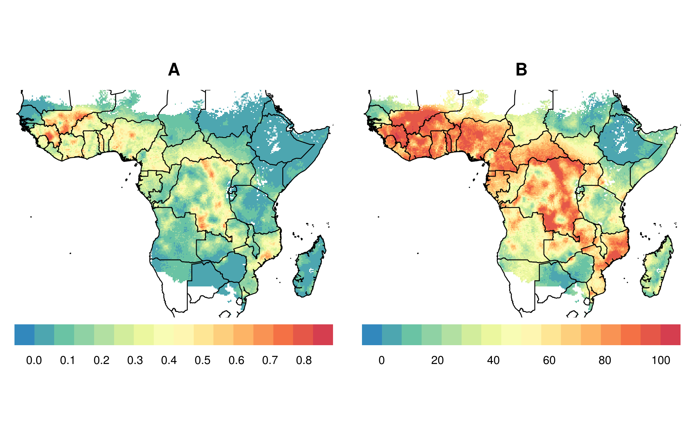
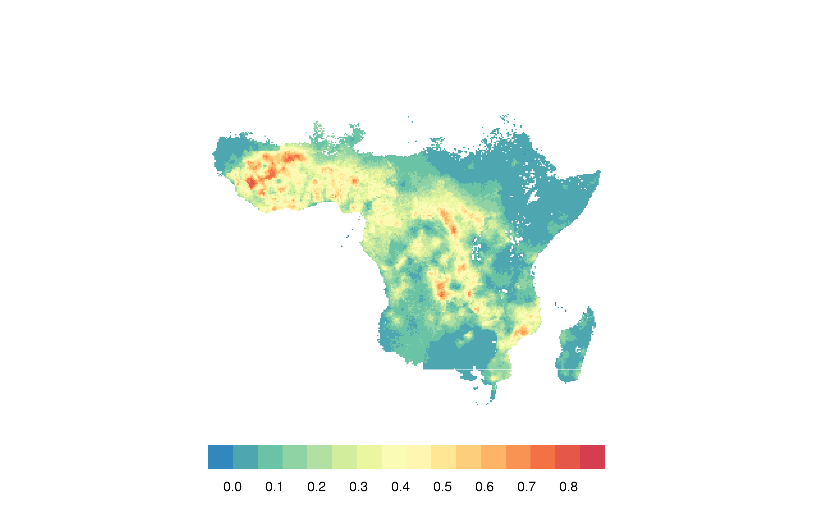
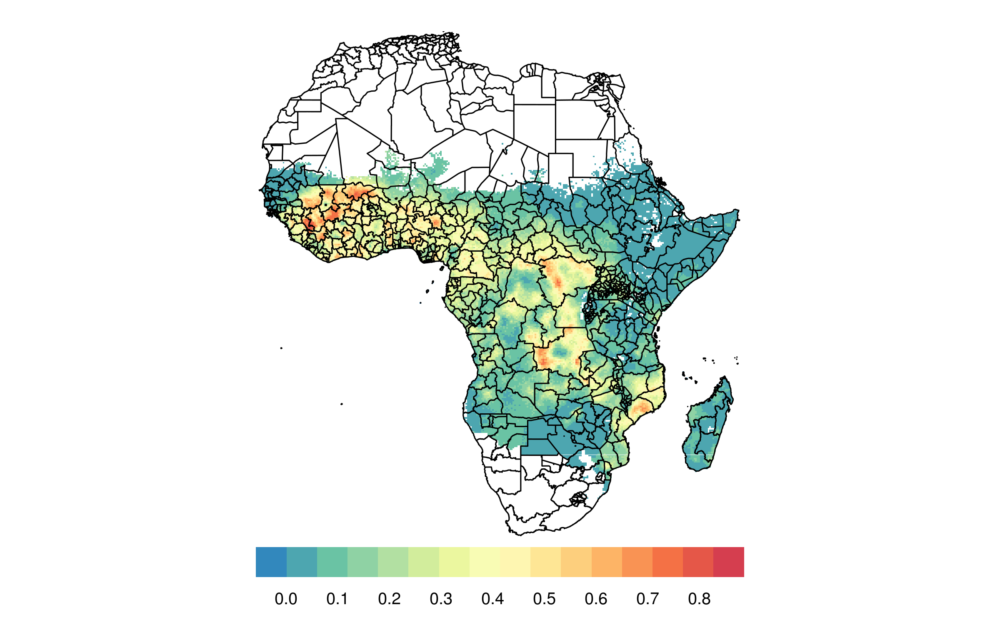
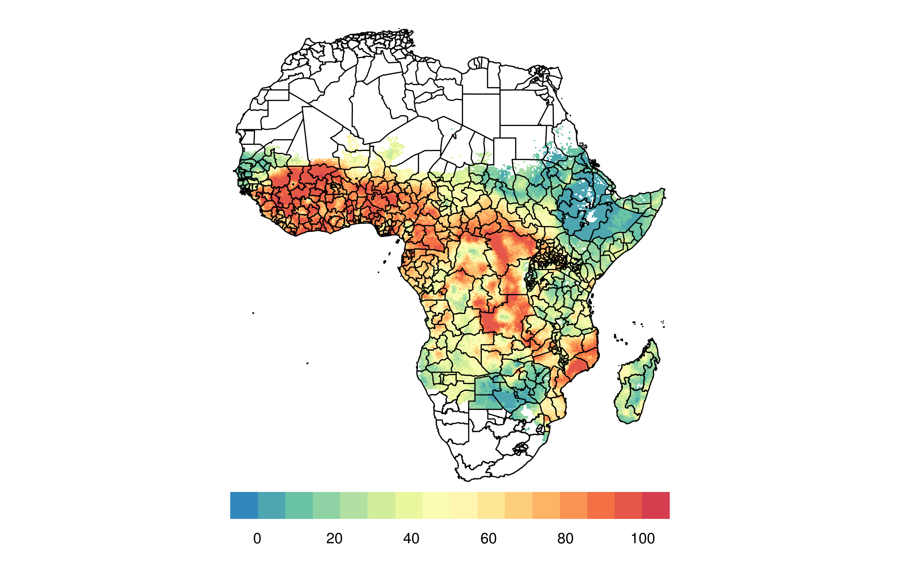

<!-- README.md is generated from README.Rmd. Please edit that file -->
cowsquito: Identifying geographical areas of greatest potential impact for livestock ivermectin implants
========================================================================================================

Methods
=======

-   We use raw raster data on where cattle are from the International Livestock Research Institute (ILRI) and the Food and Agriculture Organization of the United Nations (FAO) and the Université Libre de Bruxelles (ULB-LUBIES).
-   We use raw raster data on the Plasmodium falciparum parasite rate in 2-10 year olds in Africa in 2015, made available through the Malaria Atlas Project.
-   We use R to process the data, standardize their geographic attributes (extents, projections) and quality attributes (granularity, etc.).
-   We use simple percentilization to scale prevalence (0-1) and cattle per square kilometer (0-Inf) into a 0-100 metric.
-   We combine our two metrics by simple product So, in the combined score, 0 means no Pf or cattle, and 100 means the maximum amount of Pf and cattle. 0 can also much of one metric, but not of the other (for example, a very malarious region with no cattle gets a 0). Anything between the two represents some combination. This method assumes an equilinear value of both percentilized Pf and cattle (ie, a place with 60th percentile cattle density and 40th percentile Pf is equally as promising as a place with 40th percentile cattle density and 60th percentile Pf).
-   Full code in this repo (`code.R`).

Results
=======

Malaria prevalence on the Plasmodium falciparum parasite rate in 2-10 year-olds.
--------------------------------------------------------------------------------

The below shows the raw data on the Plasmodium falciparum parasite rate in 2-10 year-olds.

The below is identical to the above, but with country borders.

The below shows our (scaled) data on the Plasmodium falciparum parasite rate in 2-10 year-olds.

The below is identical to the above, but with country borders.

Cattle density
--------------

The below is identical to the above, but with country borders.

The below shows our (scaled) data on cattle density rate.

The below is identical to the above, but with country borders.

Combined score
--------------

### Multidimensional score

We can visualize both the quantity of malaria and cattle through a 2-dimensional color-scale. In the below chart, we use a 10,000 value color palette, mixing green (neither cattle nor malaria) with blue (lots of cattle, little malaria) with orange (lots of malaria, little cattle) with purple (lots of both). Below the map is key for interpretation.

The below is identical to the above, but with country borders.

### Single score

The below shows our combined score, using the product of the cattle and malaria metrics. Unlike the above multi-dimensional score, this visual does not contain as much information (ie, with a value of "40", it's not clear whether this is due to a cattle percentile of 40 and a malaria percentile of 1, or a cattle percentile of 5 and a malaria percentile of 8). That said, a one-dimensional color legend is much easier to interpret visually.

The below is identical to the above, but with country borders.

The below is identical to the above, but showing a point for each "grid" of the raster surface, and removing the geogrpahic coordination (ie, scatterplot).

### Country aggregation

We aggregate at the polygonal national level so as to rank countries by suitability for intervention. The below maps show the mean, median, maximum, and % of area greater than continental median "single score" (product of Pf and cattle percentile) for each country in Africa.

Conclusion
==========

West Africa appears to be the region with the most promise for ivermectin-infused cows. Yummy.

Data sources
============

### Where are the cows?

<https://livestock.geo-wiki.org/Application/index.php>

### Where are the mosquitoes?

(malaria, actually)

<https://map.ox.ac.uk/explorer/#/explorer>

Contact
=======

[Databrew](http://www.databrew.cc), empowering researchers in academia and industry to explore, understand, and communicate their data through consulting and teaching. <a href="mailto:info@databrew.cc?Subject=Hello" target="_top">info@databrew.cc</a>.

